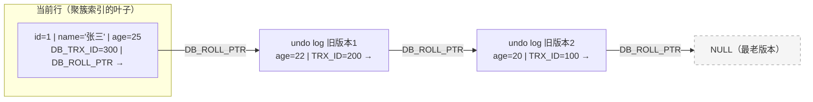
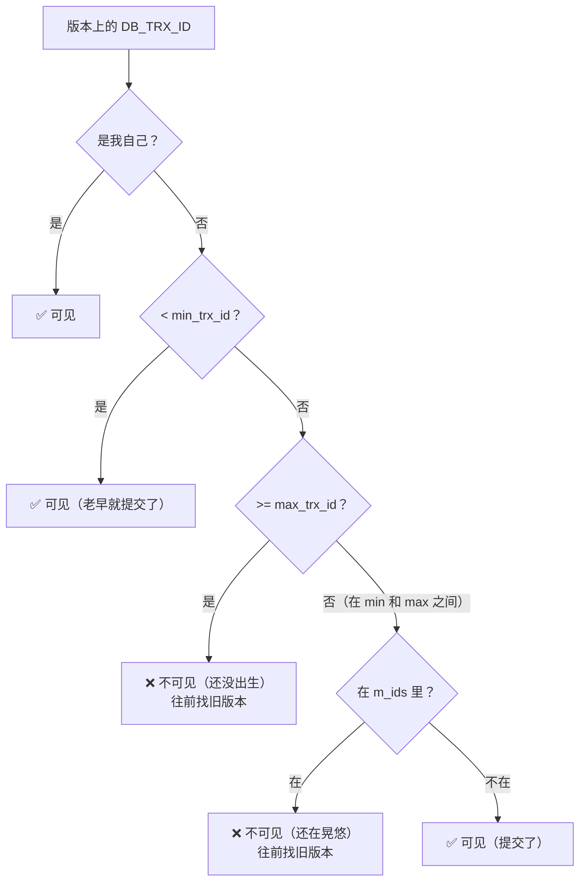
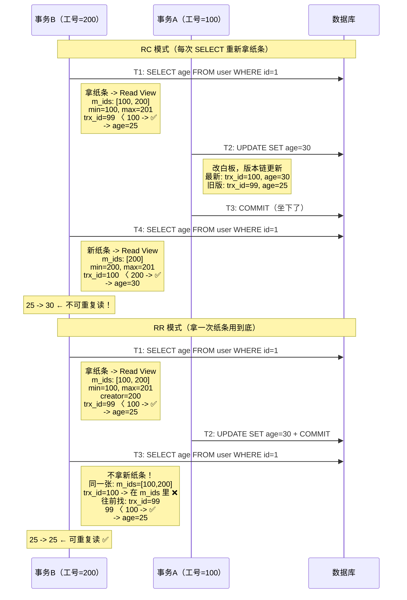

---

title: "MVCC原理ReadView与UndoLog"

created: "2025-07-12"

tags:

  - 八股文

  - mysql

---


# MVCC原理ReadView与UndoLog

## 五、MVCC 原理（最难也最重要的一节）


> MVCC = Multi-Version Concurrency Control（多版本并发控制）

>

> **一句话定义**：每一行数据维护多个历史版本。事务根据自己的"出生时间"，看对应版本的数据，从而实现"不加锁也能读"。


### 5.1 核心问题：MVCC 要解决什么？


```text

传统方案：读 + 锁

  事务A 在读某行 → 加读锁 → 事务B 要写同一行 → 等 A 释放锁

  读会阻塞写，写也会阻塞读。并发一高，全在排队。


MVCC 方案：读不加锁

  事务A 在读某行 → 直接读历史版本，不加锁

  事务B 在写同一行 → 生成新版本，旧版本保留给 A 继续用

  读不阻塞写，写不阻塞读。并发能力大幅提升。

```


**通俗比喻 — 图书馆借书**：


> - **锁方案**（旧式）：你借《MySQL实战》，管理员把书锁在桌上，另一个人也想看 — 等你读完才给他，等着的人干瞪眼。

> - **MVCC 方案**：管理员复印一份给另一个人（生成新版本），你继续看原版，他看复印版，两人互不影响。


---


### 5.2 MVCC 的三大组件


MVCC 由三样东西配合完成：**隐藏列 + undo log 版本链 + Read View**


每一行数据（InnoDB 表）都有三个你建表时看不到的隐藏列：


| 隐藏列名 | 存了什么 |
| :--- | :--- |
| DB_TRX_ID | 最后一次修改这一行的**事务ID**（6字节） |
| DB_ROLL_PTR | 指向 undo log 的指针，拿到这一行的**旧版本**（7字节） |
| DB_ROW_ID | 隐藏主键（当你没指定主键时用）（6字节） |


---


### 5.3 Undo Log 版本链 — 一行数据的"前世今生"


假设事务 ID=100 插入一行，后来被改了几次：





这是 undo log 版本链 — 每一行数据都牵着一条"历史版本链条"

从最新版本开始，顺着 DB_ROLL_PTR 指针，可以一直追溯到这行被插入时的初始版本


---


### 5.4 先忘掉 MySQL，看一个生活场景


你在一家公司上班，每个人有一个**工号**（数字，按入职顺序递增：100, 101, 102...）。


公司的公共白板上写着最新的数据，旁边贴着一张便签写着"最后修改人：工号 XXX"。有时候工号 200 把白板内容改了，但人还没回到座位上（**事务开始但没提交**）；过一会他坐下了才算正式生效（**提交**）；也可能他反悔了，把内容擦回去（**回滚**）。


现在工号 **300 的你**走进会议室，要读白板上的数据。前台小姐姐递给你一张纸条，上面写着：


> **"你进会议室时，还在外面晃悠没坐下来的人：200, 250, 280"**

>

> 意思就是：这三个人改的版本你还不能信——他们可能随时反悔（回滚）。


这个纸条就是 **Read View**。


---


### 5.5 把生活场景翻译成 MySQL


```text

你的纸条（Read View）上写的东西，翻译成 MySQL 里的四个字段：


纸条上写的                                    MySQL 里的名字

────────────────────────────────────────────────────────────────

"还在晃悠的人：200, 250, 280"               → m_ids = [200, 250, 280]   ← 活跃事务列表

"这帮人里最小的工号是 200"                    → min_trx_id = 200

"下一个新员工的工号是 301"                    → max_trx_id = 301          ← 系统里最大ID + 1

"你自己的工号是 300"                         → creator_trx_id = 300

```


现在你走到白板前，白板上有一行数据，旁边便签写着"最后修改人：工号 **XXX**"。你能不能用这个版本，取决于这个 XXX（即 `DB_TRX_ID`）落在哪个区间。**关键的问题就是这一句话：**


> **"在我进会议室的这一刻，改这个版本的人，坐下来了吗（提交了）？"**


---


### 5.6 判断流程 — "这个人我能不能信？"


把版本上的 `DB_TRX_ID` 和纸条上的信息对照，按顺序判断：


```text

拿到一个版本的 DB_TRX_ID（比如 = 250）：


第①问：这是我自己的工号吗？(trx_id == 300？)

  → 是我自己 → 自己写的当然信 ✅ 不用继续判断


第②问：这人工号比我坐下之前最老的还小？(trx_id < 200？)

  比如 trx_id = 150：

  → 150 比 200 还小，说明这人老早就坐下了 ✅

  → 而且 150 不可能在"晃悠名单"里（名单最小是 200）


第③问：这人是我坐下之后才入职的？(trx_id >= 301？)

  比如 trx_id = 310：

  → 310 >= 301，这人我进会议室时还没出生 → 无视 ❌

  → 顺着 undo log 往前找更旧的版本


第④问：要是在 200~300 之间呢？(min_trx_id <= trx_id < max_trx_id)

  比如 trx_id = 250：

  → 看纸条！250 在"晃悠名单"(m_ids) 里吗？

     在  → 我进来时他还没坐下，不能信 ❌

     不在 → 我进来时他已经坐下了（提交了），可以信 ✅


  再比如 trx_id = 220（不在 m_ids 里）：

  → 虽然他工号在 200~300 范围内，但纸条上没他名字

  → 说明我进来前他就已经提交了 → 可以信 ✅

```


**一张图串起来：**





> **一句话记住 Read View**：它就是你进会议室时前台的**签到状态快照**——标记了谁已经坐下（已提交）、谁还在晃悠（未提交）。你看任何数据时都先查：改这行的人，在我拍照那一刻，坐下了没有？


---


### 5.7 RC 和 RR 的区别 — 就一个差异：多久拍一次照


| | READ COMMITTED | REPEATABLE READ |
| :--- | :--- | :--- |
| **多久拍一次照** | **每次 SELECT 都重新去前台拿一张新纸条** | **事务开始时拿一次纸条，整个事务就用这一张** |
| **意味着什么** | 每次 SELECT 能看到最新的已提交数据 | 整件事务期间看到的世界完全一样 |
| **导致的结果** | 不可重复读 | 可重复读 |


**用具体数字走一遍，体会 RC 和 RR 的差别：**





> **RC vs RR 一句话**：RC 是"实时刷新世界观"，每次 SELECT 都重新看谁提交了；RR 是"世界观定格在事务开始时"，外面世界怎么变我都不管。RC 更开放（并发好），RR 更固执（一致性好）。


---


### 5.8 快照读 vs 当前读


| | 快照读（Snapshot Read） | 当前读（Current Read） |
| :--- | :--- | :--- |
| **走不走 MVCC** | ✅ 走，读历史版本快照 | ❌ 不走，读最新版本 |
| **加不加锁** | 不加锁 | 加锁（共享锁或排他锁） |
| **SQL 举例** | 普通 SELECT | `SELECT ... FOR UPDATE`、`UPDATE`、`DELETE`、`INSERT` |
| **读到的版本** | Read View 决定的旧版本 | 最新的已提交版本 |


```sql

-- 快照读（走 MVCC，不加锁）

SELECT * FROM user WHERE id = 1;


-- 当前读（加排他锁，锁住这行，读到最新版本）

SELECT * FROM user WHERE id = 1 FOR UPDATE;


-- 当前读（UPDATE 本身就加锁读最新 + 修改）

UPDATE user SET age = 30 WHERE id = 1;

```


---


### 5.9 MVCC 一句话总结


```text

每一行数据 = 当前版本 + 一串 undo log 历史版本（链表）

Read View  = 事务的"滤镜"，决定你能看到这些版本里的哪些


RR 模式：滤镜在事务开始时定好，后面不变（可重复读）

RC 模式：每次 SELECT 换一个新的滤镜（只防脏读）


滤镜规则：

  你自己的修改 → 直接看到

  比你老的已提交事务 → 能看到

  比你新的或还没提交的 → 看不到，往前找旧版本

```


---


## 速记卡（面试闪卡）


**Q1：一句话讲清「MVCC原理ReadView与UndoLog」到底是什么？**

A：MVCC 给每行数据留多版本，事务按自己的 Read View 看对应版本，实现不加锁也能读。


**Q2：核心问题：MVCC 解决什么 —— 怎么理解？**

A：传统"读+锁"方案读会阻塞写、写阻塞读，并发一高全排队。MVCC 让读不加锁：事务 A 读历史版本、事务 B 写生成新版本、旧版本留给 A 继续用，读不阻塞写、写不阻塞读。类比图书馆：旧式把书锁桌上等人读完，MVCC 复印一份给另一人各看各的。


**Q3：三大组件与 undo log 版本链 —— 怎么理解？**

A：MVCC＝隐藏列＋undo log 版本链＋Read View。每行有 DB_TRX_ID（最后修改事务 ID）、DB_ROLL_PTR（指旧版本）、DB_ROW_ID（隐藏主键）。顺着 ROLL_PTR 像链表一样从最新版本追溯到插入时的初始版本，这就是"前世今生"版本链。


**Q4：Read View 是签到状态快照 —— 怎么理解？**

A：Read View 是你进会议室时前台的签到快照：m_ids（活跃事务列表）、min_trx_id、max_trx_id、creator_trx_id。判断"改这版本的人在我拍照那一刻坐下了没（提交了）"：自己的→信；比 min 老→信；≥max 还没出生→不信往前找；在 min~max 间看在不在 m_ids（晃悠名单）里。


**Q5：RC vs RR 与快照读/当前读 —— 怎么理解？**

A：RC 每次 SELECT 重新拍照→能看到最新已提交（不可重复读）；RR 事务开始拍一次用到底（可重复读）。快照读（普通 SELECT）走 MVCC 读旧版不加锁；当前读（SELECT...FOR UPDATE/UPDATE/DELETE）不走 MVCC、加锁读最新。RC 更开放、RR 更固执。


**Q6：核心速记主线有哪些？**

- MVCC 目标：不加锁也能读，读不阻塞写、写不阻塞读

- 三件套：隐藏列（DB_TRX_ID/ROLL_PTR）＋ undo log 版本链＋ Read View

- Read View＝事务的"滤镜"，按 m_ids/min/max/creator 决定可见版本

- RC 每次照相（不可重复读） vs RR 定格一次（可重复读）

- 快照读走 MVCC 不加锁，当前读加锁读最新


**口诀**

A：MVCC 留多版，读时不加锁

历史版本链，旧版往前躲

Read View 当滤镜，未交不可落

RC 频刷新，RR 定格坐


## 相关链接


- 📋 目录：[[00-MySQL]]

- 📚 学习清单：[[八股文学习路线图]]

- 🔗 [[语言与框架/MySQL/八股/20-事务隔离级别与MVCC|事务隔离级别与MVCC]] — MVCC在不同隔离级别下的行为差异

- 🔗 [[语言与框架/MySQL/八股/23-redo_log与undo_log与binlog|redo_log与undo_log与binlog]] — UndoLog是MVCC的底层支撑

- 🔗 [[计算机基础/操作系统/03-线程同步锁机制|线程同步锁机制]] — 对比OS级和数据库级的并发控制机制


