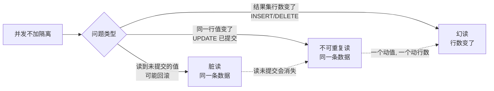

---

title: "并发事务问题脏读不可重复读幻读"

created: "2025-07-12"

tags:

  - 八股文

  - mysql

---


# 并发事务问题脏读不可重复读幻读

## 三、并发时会出现什么问题？（四个层次）


> 如果完全不隔离，多个事务同时跑会出现三种问题。理解它们，才能理解隔离级别。


### 3.1 脏读 Dirty Read


> **读到了另一个事务还没提交的修改。** 那个事务如果回滚了，你读到的数据就是"脏的"（不存在的）。


```text

时间线：

  T1 事务A：UPDATE user SET age = 999 WHERE id = 1;   -- 还没提交

  T2 事务B：SELECT age FROM user WHERE id = 1;        -- 读到 age = 999

  T3 事务A：ROLLBACK;                                  -- A 反悔了


事务B 读到了 999，但 A 撤销了。B 基于不存在的数据做业务 → 灾难。

```


**通俗比喻**：朋友写到一半还没发表的朋友圈，被你看到了。后来他删了重写，但你已经被误导了。


---


### 3.2 不可重复读 Non-Repeatable Read


> **同一个事务内，两次读同一条数据，结果不一样。** 因为中间有另一个事务**修改并提交**了。


```text

时间线：

  T1 事务B：SELECT age FROM user WHERE id = 1;   → 读到 age = 25

  T2 事务A：UPDATE user SET age = 30 WHERE id = 1;

  T3 事务A：COMMIT;

  T4 事务B：SELECT age FROM user WHERE id = 1;   → 读到 age = 30


事务B 两次读到的值不一样 —— 25 vs 30

```


**通俗比喻**：你上午看天气预报说30度，下午再看变成35度 — 中间气象台更新了数据。


**脏读 vs 不可重复读的区别**：

- 脏读读到的是**未提交**的（随时可能回滚消失）

- 不可重复读读到的是**已提交**的（是真实存在的数据，只是不是你第一次的值）


---


### 3.3 幻读 Phantom Read


> **同一个事务内，两次查同样的条件，结果的行数不一样。** 因为中间有另一个事务**插入/删除**了行。


```text

时间线：

  T1 事务B：SELECT * FROM user WHERE age > 20;    → 返回 5 条

  T2 事务A：INSERT INTO user VALUES(6, '新用户', 25);

  T3 事务A：COMMIT;

  T4 事务B：SELECT * FROM user WHERE age > 20;    → 返回 6 条


数据多了一行，就像出现了"幻觉"——幻读

```


**通俗比喻**：你数抽屉里有 5 个苹果，去拿袋子回来装，发现变成 6 个了 — 中间有人又放了一个。


**不可重复读 vs 幻读的区别**：

- 不可重复读：同一行数据的**内容变了**（UPDATE）

- 幻读：数据的**行数变了**（INSERT / DELETE）


---


### 3.4 一张表区分三种问题


| 问题        | 发生了什么        | 谁导致的                    | 影响的是   |

| :-------- | :----------- | :---------------------- | :----- |

| **脏读**    | 读到了未提交的修改    | 其他事务回滚了                 | 同一条数据  |

| **不可重复读** | 两次读同一条，值不同   | 其他事务 UPDATE 并提交了        | 同一条数据  |

| **幻读**    | 两次读同一条件，行数不同 | 其他事务 INSERT/DELETE 并提交了 | 结果集的行数 |


---


## 四、一图流（Mermaid）





## 速记卡（面试闪卡）


**Q1：一句话讲清「并发事务问题脏读不可重复读幻读」到底是什么？**

A：并发事务三大"读歪"问题：脏读读未提交、不可重复读值变、幻读行数变——皆因隔离不够。


**Q2：一、脏读 Dirty Read —— 怎么理解？ —— 怎么理解？**

A：像读到朋友写到一半又删的朋友圈：事务 B 读了事务 A 还没提交的 age=999，结果 A 回滚了，B 基于不存在的数据做业务就翻车。本质是"读到了可能消失的未提交值"。英文：dirty read / uncommitted。


**Q3：二、不可重复读 Non-Repeatable Read —— 怎么理解？ —— 怎么理解？**

A：像上午看天气预报 30 度、下午变 35 度：同一事务内两次读同一行，中间别的事务 UPDATE 并提交，值就变了。和脏读区别：它读到的是"已提交的真实数据"，只是跟你第一次的不一样。英文：non-repeatable read。


**Q4：三、幻读 Phantom Read —— 怎么理解？ —— 怎么理解？**

A：像数抽屉 5 个苹果、回头变 6 个：同一事务内两次按同条件查，中间别的事务 INSERT/DELETE 并提交，结果集行数变了。和不可重复读区别：一个动"值"（UPDATE），一个动"行数"。英文：phantom read。


**Q5：四、一张表区分三者 —— 怎么理解？ —— 怎么理解？**

A：像三级台阶：脏读=读到未提交、可能回滚消失（同一条数据）；不可重复读=同一条数据两次值不同（UPDATE 已提交）；幻读=同一条件两次行数不同（INSERT/DELETE 已提交）。隔离级别越高，踩中的越少。英文：isolation level。


**Q6：核心速记主线有哪些？**

- 脏读：读到别的事务未提交修改，它一回滚你就读了假数据

- 不可重复读：同一条数据两次读值不同，因别人 UPDATE 已提交

- 幻读：同一查询条件两次行数不同，因别人 INSERT/DELETE 已提交

- 区别：脏读读未提交；不可重复读动值；幻读动行数

- 根因：并发不加隔离；靠隔离级别（RR 防幻读、串行化最严）解决


**口诀**

A：并发三读易生歧，脏读未交会消失；

不可重复值两异，UPDATE 提交惹争议；

幻读行数凭空变，INSERT 删减添迷离；

隔离级别逐级高，读稳心安少猜疑。


## 相关链接


- 📋 目录：[[00-MySQL]]

- 📚 学习清单：[[八股文学习路线图]]


