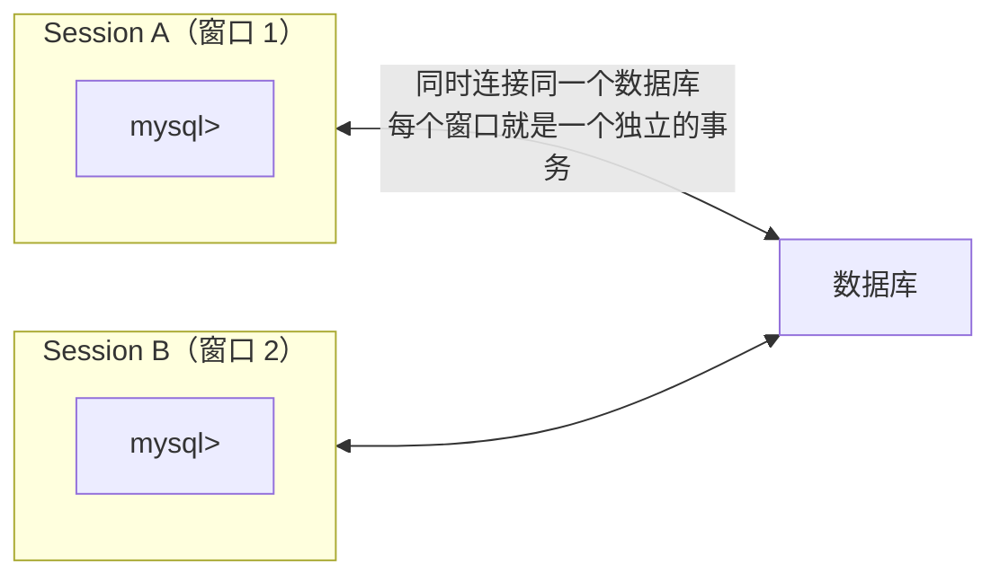

---

title: "脏读复现与RC解决"

created: "2025-07-12"

tags:

  - 八股文

  - mysql

---

# 脏读复现与RC解决

## 实验前准备：环境 + 测试表
### 准备 1：打开两个 MySQL 会话



用命令行或 DBeaver/DataGrip 同时打开两个连接。

### 准备 2：建测试表

```sql

-- 在任意一个 Session 里执行

CREATE DATABASE IF NOT EXISTS isolation_test;

USE isolation_test;

-- 建一张简单的用户表

CREATE TABLE users (

    id INT PRIMARY KEY,

    name VARCHAR(20),

    age INT,

    city VARCHAR(20)

) ENGINE=InnoDB;

-- 插入 3 条测试数据

INSERT INTO users VALUES

    (1, '张三', 25, '北京'),

    (2, '李四', 30, '上海'),

    (3, '王五', 28, '广州');

-- 看一眼初始数据

SELECT * FROM users;

-- +----+------+-----+------+

-- | id | name | age | city |

-- +----+------+-----+------+

-- |  1 | 张三 |  25 | 北京 |

-- |  2 | 李四 |  30 | 上海 |

-- |  3 | 王五 |  28 | 广州 |

-- +----+------+-----+------+

```

### 准备 3：实验模板——每个实验都这样操作

```text

每个实验的标准操作流程：

① 两个 Session 都设置隔离级别（SET SESSION TRANSACTION ISOLATION LEVEL xxx）

② 两个 Session 都开启事务（BEGIN; 或 START TRANSACTION;）

③ Session A 执行操作 1 → Session B 执行操作 → Session A 执行操作 2

④ 观察 Session A 两次读到的结果是否一致

⑤ 两个 Session 都 ROLLBACK（恢复现场，方便下一个实验）

```

> ⚠️ **关键**：每个实验开始前，**两个 Session 都要重新设置隔离级别并开启事务**。MySQL 的隔离级别是会话级别的——上个实验的设置不会自动恢复。

---

## 速记卡（面试闪卡）

**Q1：一句话讲清「脏读复现与RC解决」到底是什么？**

A：复现 MySQL 脏读并用 RC 隔离级别修复。

**Q2：实验准备：开两个会话建测试表 —— 怎么理解？**

A：像做化学实验先摆两套烧杯：用命令行/DBeaver 开两个 MySQL 会话（Session），建 isolation_test 库和 users 表插 3 条数据。本质是 Session（会话）各自是一个独立事务，实验就在两窗口之间来回操作。

**Q3：实验模板：设隔离级→开事务→观察 —— 怎么理解？**

A：像菜谱步骤：①两窗口设隔离级别（SET SESSION TRANSACTION ISOLATION LEVEL）②都 BEGIN 开事务 ③A 操作→B 操作→A 再操作 ④看 A 两次读到是否一致 ⑤都 ROLLBACK 复原。关键是隔离级别是会话级，每轮都得重设。

**Q4：脏读：读到别人没提交的半成品 —— 怎么理解？**

A：像同事在共享文档写了「工资涨 1 万」还没点保存（未提交），你刷新就看到了；他一撤回（ROLLBACK），你看到的成了幻影。本质是 Dirty Read（脏读），读到了别的事务未提交的修改。复现就是让 A 改了不提交、B 却读到了。

**Q5：RC 解决：提交前谁都读不到 —— 怎么理解？**

A：像保险箱：Read Committed（读已提交）规定只能看别人「已保存」的版本，没提交的半成品对你不可见。把隔离级别设成 RC，脏读立即消失；要想防「不可重复读」还得再升到 RR。一句话：提交前闭嘴，提交后才可见。

**Q6：核心速记主线有哪些？**

- 脏读=读别人未提交数据

- RC 隔离级屏蔽脏读

- 实验开两会话测一致

- 隔离级是会话级需重设

**口诀**

A：脏读像偷看未存的稿，RC 上锁看不到

两窗实验测一致，隔离级别会话调

提交之前闭紧嘴，提交以后才瞧好

想防不可重复读，再升 RR 才牢靠

## 相关链接

- 📋 目录：[[00-MySQL]]

- 📚 学习清单：[[八股文学习路线图]]

