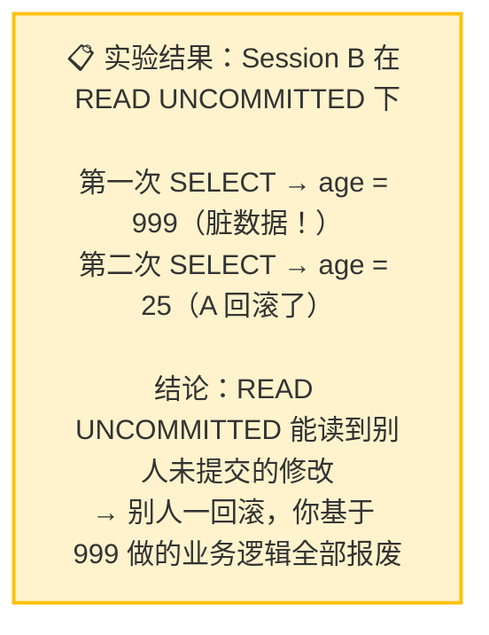
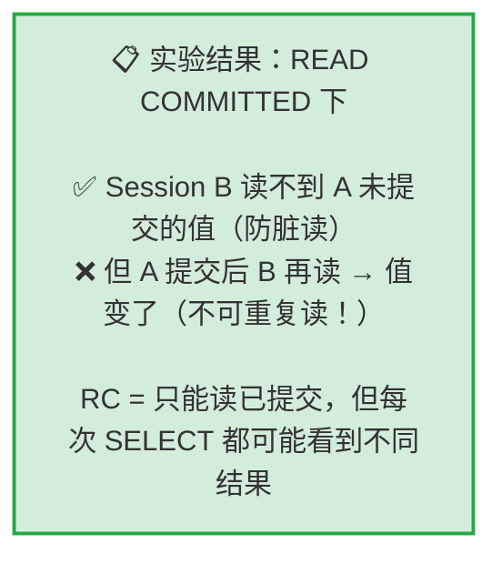

---

title: "不可重复读复现与RR解决"

created: "2025-07-12"

tags:

  - 八股文

  - mysql

---


# 不可重复读复现与RR解决

## 实验一：脏读复现 → RC 解决


> **实验目的**：亲眼看到一个事务读到另一个事务**还没提交**的修改。


### 1.1 脏读复现（READ UNCOMMITTED）


```text

时间轴：

  T1  Session A: BEGIN; UPDATE... SET age=999（未提交）

  T2  Session B: BEGIN; SELECT... → 读到 age=999 ← 这就是脏读！

  T3  Session A: ROLLBACK（不承认！age 变回 25）

  T4  Session B: SELECT... → 看到 age=25

  结果：Session B 中间读到了一个"不存在"的数据

```


```sql

-- ========== 两个 Session 都执行 ==========

SET SESSION TRANSACTION ISOLATION LEVEL READ UNCOMMITTED;


-- ========== Session A ==========

BEGIN;

-- 把张三年龄改成 999，但不提交

UPDATE users SET age = 999 WHERE id = 1;

-- Query OK, 1 row affected


-- 先不 COMMIT，切换到 Session B


-- ========== Session B ==========

BEGIN;

-- 查询张三的年龄

SELECT id, name, age FROM users WHERE id = 1;

-- +----+------+-----+

-- | id | name | age |

-- +----+------+-----+

-- |  1 | 张三 | 999 |   ← 读到了！但 A 还没提交！

-- +----+------+-----+

-- 这就是脏读——读到了一个可能被撤销的修改


-- 现在切回 Session A


-- ========== Session A ==========

ROLLBACK;  -- 反悔了！不改了！

-- 切回 Session B


-- ========== Session B ==========

SELECT id, name, age FROM users WHERE id = 1;

-- +----+------+-----+

-- | id | name | age |

-- +----+------+-----+

-- |  1 | 张三 |  25 |   ← 又变回 25 了！

-- +----+------+-----+

-- Session B 第一次读到的 999 是"假数据"——A 根本没提交


ROLLBACK;

```





### 1.2 RC 解决脏读


```sql

-- ========== 两个 Session 都执行 ==========

SET SESSION TRANSACTION ISOLATION LEVEL READ COMMITTED;


-- ========== Session A ==========

BEGIN;

UPDATE users SET age = 888 WHERE id = 1;

-- 不提交


-- ========== Session B ==========

BEGIN;

SELECT id, name, age FROM users WHERE id = 1;

-- +----+------+-----+

-- | id | name | age |

-- +----+------+-----+

-- |  1 | 张三 |  25 |   ← 还是 25！读不到 888！

-- +----+------+-----+


-- 切回 A 提交


-- ========== Session A ==========

COMMIT;  -- 确定修改


-- ========== Session B ==========

SELECT id, name, age FROM users WHERE id = 1;

-- +----+------+-----+

-- | id | name | age |

-- +----+------+-----+

-- |  1 | 张三 | 888 |   ← A 提交后，B 才能看到

-- +----+------+-----+

-- 但注意：B 同一事务内两次读到了不同的值（25 → 888）

-- 这就是"不可重复读"——RC 防住了脏读，但引入了不可重复读


ROLLBACK;

-- Session A 也 ROLLBACK 恢复数据

ROLLBACK;

```





---


## 速记卡（面试闪卡）


**Q1：一句话讲清「不可重复读复现与RR解决」到底是什么？**

A：本笔记通过实验复现事务隔离问题：脏读由 RC 解决，不可重复读由 RR（可重复读）解决。


**Q2：脏读复现：READ UNCOMMITTED 读到未提交 —— 怎么理解？**

A：像看到别人写到一半的草稿：A 改了 age=999 没提交，B 在 RU 级别就读到了，A 一回滚 B 全乱——这就是脏读(Dirty Read)。


**Q3：RC 如何防住脏读 —— 怎么理解？**

A：像只认盖章的正式文件：READ COMMITTED 只让 B 读到 A 已提交的值，没提交的 999 看不见，脏读被挡住(Read Committed)。


**Q4：RC 引入的不可重复读 —— 怎么理解？**

A：像同一次翻账本前后不一：B 同一事务里先读 25、A 提交 888 后 B 再读变 888——RC 防住脏读却放进了不可重复读(Non-repeatable Read)。


**Q5：RR（可重复读）如何解决不可重复读 —— 怎么理解？**

A：像给账本拍快照：REPEATABLE READ 让 B 整个事务看到同一份数据，A 提交的新值不影响 B 的两次读取，前后一致(Repeatable Read)。


**Q6：核心速记主线有哪些？**

- 脏读：读到别人未提交的数据，RU 级别才出现

- RC：只读了已提交的，防住脏读

- 不可重复读：同事务两次读同行结果不同，RC 仍有

- RR：事务内数据快照一致，解决不可重复读


**口诀**

A：脏读读到未提交，RU 级别才现身

RC 只认已提交，脏读从此被关门

可重复读 RC 留，同事务里两结果

RR 拍快照，前后一致不乱走


## 相关链接


- 📋 目录：[[00-MySQL]]

- 📚 学习清单：[[八股文学习路线图]]


