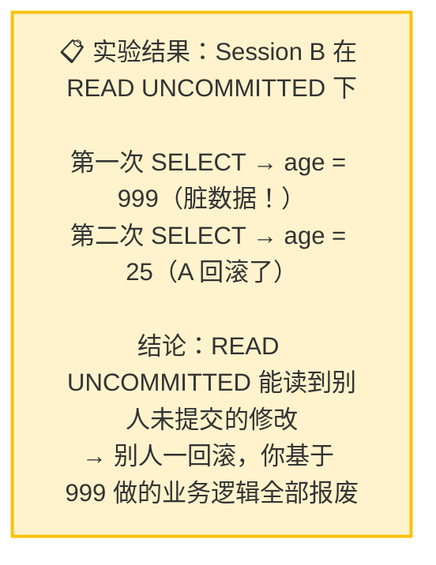
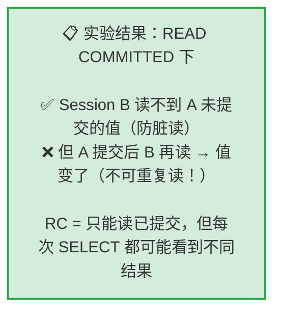

# 不可重复读复现与RR解决
## 实验一：脏读复现 → RC 解决

> **实验目的**：亲眼看到一个事务读到另一个事务**还没提交**的修改。

### 1.1 脏读复现（READ UNCOMMITTED）

```text
时间轴：
  T1  Session A: BEGIN; UPDATE... SET age=999（未提交）
  T2  Session B: BEGIN; SELECT... → 读到 age=999 ← 这就是脏读！
  T3  Session A: ROLLBACK（不承认！age 变回 25）
  T4  Session B: SELECT... → 看到 age=25
  结果：Session B 中间读到了一个"不存在"的数据
```

```sql
-- ========== 两个 Session 都执行 ==========
SET SESSION TRANSACTION ISOLATION LEVEL READ UNCOMMITTED;

-- ========== Session A ==========
BEGIN;
-- 把张三年龄改成 999，但不提交
UPDATE users SET age = 999 WHERE id = 1;
-- Query OK, 1 row affected

-- 先不 COMMIT，切换到 Session B

-- ========== Session B ==========
BEGIN;
-- 查询张三的年龄
SELECT id, name, age FROM users WHERE id = 1;
-- +----+------+-----+
-- | id | name | age |
-- +----+------+-----+
-- |  1 | 张三 | 999 |   ← 读到了！但 A 还没提交！
-- +----+------+-----+
-- 这就是脏读——读到了一个可能被撤销的修改

-- 现在切回 Session A

-- ========== Session A ==========
ROLLBACK;  -- 反悔了！不改了！
-- 切回 Session B

-- ========== Session B ==========
SELECT id, name, age FROM users WHERE id = 1;
-- +----+------+-----+
-- | id | name | age |
-- +----+------+-----+
-- |  1 | 张三 |  25 |   ← 又变回 25 了！
-- +----+------+-----+
-- Session B 第一次读到的 999 是"假数据"——A 根本没提交

ROLLBACK;
```



### 1.2 RC 解决脏读

```sql
-- ========== 两个 Session 都执行 ==========
SET SESSION TRANSACTION ISOLATION LEVEL READ COMMITTED;

-- ========== Session A ==========
BEGIN;
UPDATE users SET age = 888 WHERE id = 1;
-- 不提交

-- ========== Session B ==========
BEGIN;
SELECT id, name, age FROM users WHERE id = 1;
-- +----+------+-----+
-- | id | name | age |
-- +----+------+-----+
-- |  1 | 张三 |  25 |   ← 还是 25！读不到 888！
-- +----+------+-----+

-- 切回 A 提交

-- ========== Session A ==========
COMMIT;  -- 确定修改

-- ========== Session B ==========
SELECT id, name, age FROM users WHERE id = 1;
-- +----+------+-----+
-- | id | name | age |
-- +----+------+-----+
-- |  1 | 张三 | 888 |   ← A 提交后，B 才能看到
-- +----+------+-----+
-- 但注意：B 同一事务内两次读到了不同的值（25 → 888）
-- 这就是"不可重复读"——RC 防住了脏读，但引入了不可重复读

ROLLBACK;
-- Session A 也 ROLLBACK 恢复数据
ROLLBACK;
```



---


## 速记卡（面试闪卡）

**Q1：一句话讲清「不可重复读复现与RR解决」到底是什么？**
A：**实验目的**：亲眼看到一个事务读到另一个事务**还没提交**的修改。
---

**Q2：实验一：脏读复现 → RC 解决 —— 怎么理解？**
A：**实验目的**：亲眼看到一个事务读到另一个事务**还没提交**的修改。
---

**Q3：核心速记主线有哪些？**
A：抓住这几根：实验一：脏读复现 → RC 解决。


## 相关链接

- 📋 目录：[[00-MySQL]]
- 📚 学习清单：[[八股文学习清单]]

