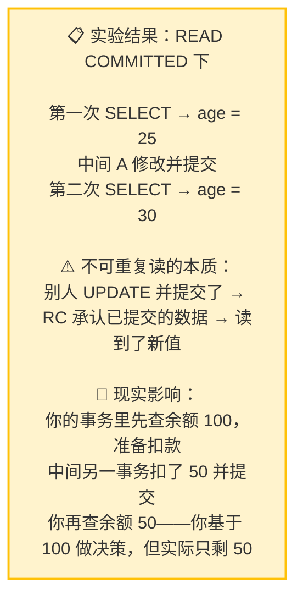
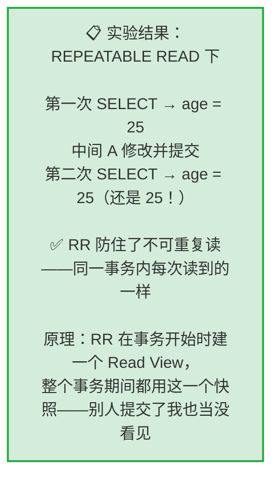

# 幻读快照读与当前读
## 实验二：不可重复读复现 → RR 解决

> **实验目的**：亲眼看到同一事务内两次读同一条数据——值不同。

### 2.1 不可重复读复现（READ COMMITTED）

```sql
-- ========== 两个 Session 都执行 ==========
SET SESSION TRANSACTION ISOLATION LEVEL READ COMMITTED;

-- ========== Session B ==========
BEGIN;
SELECT id, name, age FROM users WHERE id = 1;
-- +----+------+-----+
-- | id | name | age |
-- +----+------+-----+
-- |  1 | 张三 |  25 |   ← 第一次读：25
-- +----+------+-----+

-- ========== Session A ==========
BEGIN;
UPDATE users SET age = 30 WHERE id = 1;  -- 把张三年龄改成 30
COMMIT;  -- 提交！
-- 切回 B

-- ========== Session B ==========
SELECT id, name, age FROM users WHERE id = 1;
-- +----+------+-----+
-- | id | name | age |
-- +----+------+-----+
-- |  1 | 张三 |  30 |   ← 第二次读：30！
-- +----+------+-----+
-- 同一个事务内，两次读同一条数据——值不一样！
-- 这就是不可重复读

ROLLBACK;

-- 恢复数据
-- Session A:
UPDATE users SET age = 25 WHERE id = 1;
COMMIT;
```



### 2.2 RR 解决不可重复读

```sql
-- ========== 两个 Session 都执行 ==========
SET SESSION TRANSACTION ISOLATION LEVEL REPEATABLE READ;

-- ========== Session B ==========
BEGIN;
SELECT id, name, age FROM users WHERE id = 1;
-- +----+------+-----+
-- | id | name | age |
-- +----+------+-----+
-- |  1 | 张三 |  25 |   ← 第一次读：25。RR 在这时建立了 Read View
-- +----+------+-----+

-- ========== Session A ==========
BEGIN;
UPDATE users SET age = 40 WHERE id = 1;
COMMIT;  -- 提交！换成 RC 的话 B 马上就能看到变化

-- ========== Session B ==========
SELECT id, name, age FROM users WHERE id = 1;
-- +----+------+-----+
-- | id | name | age |
-- +----+------+-----+
-- |  1 | 张三 |  25 |   ← 还是 25！Read View 锁定了事务开始时的数据
-- +----+------+-----+

-- A 把 age 改成 40 并提交了——但 B 就是看不到
-- 因为 RR 在整个事务期间使用同一个 Read View

ROLLBACK;

-- Session A: 恢复数据
UPDATE users SET age = 25 WHERE id = 1;
COMMIT;
```



---

## 速记卡（面试闪卡）

**Q1：一句话讲清「幻读快照读与当前读」到底是什么？**
A：**实验目的**：亲眼看到同一事务内两次读同一条数据——值不同。
---

**Q2：实验二：不可重复读复现 → RR 解决 —— 怎么理解？**
A：**实验目的**：亲眼看到同一事务内两次读同一条数据——值不同。
---

**Q3：核心速记主线有哪些？**
A：抓住这几根：实验二：不可重复读复现 → RR 解决。


## 相关链接

- 📋 目录：[[00-MySQL]]
- 📚 学习清单：[[八股文学习清单]]

