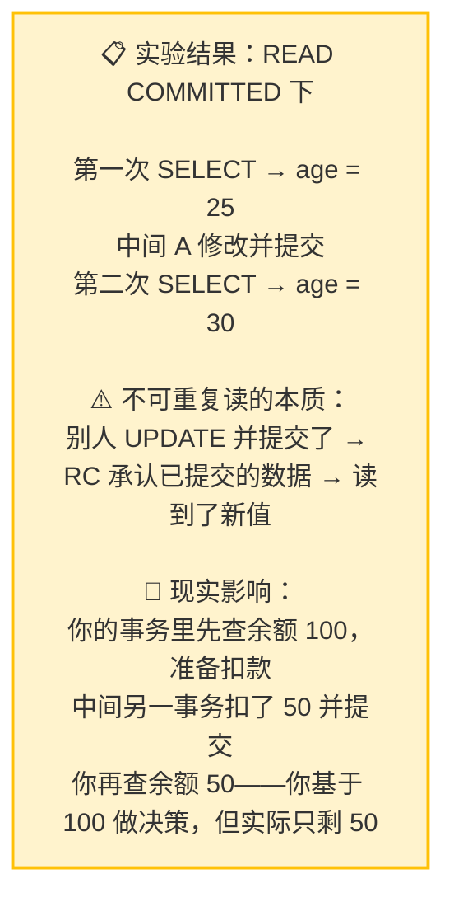
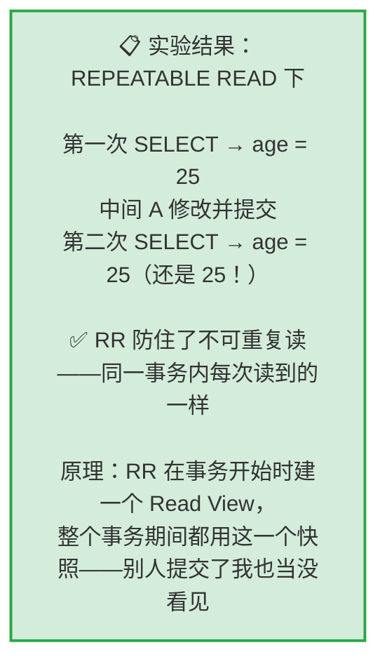

---

title: "幻读快照读与当前读"

created: "2025-07-12"

tags:

  - 八股文

  - mysql

---


# 幻读快照读与当前读

## 实验二：不可重复读复现 → RR 解决


> **实验目的**：亲眼看到同一事务内两次读同一条数据——值不同。


### 2.1 不可重复读复现（READ COMMITTED）


```sql

-- ========== 两个 Session 都执行 ==========

SET SESSION TRANSACTION ISOLATION LEVEL READ COMMITTED;


-- ========== Session B ==========

BEGIN;

SELECT id, name, age FROM users WHERE id = 1;

-- +----+------+-----+

-- | id | name | age |

-- +----+------+-----+

-- |  1 | 张三 |  25 |   ← 第一次读：25

-- +----+------+-----+


-- ========== Session A ==========

BEGIN;

UPDATE users SET age = 30 WHERE id = 1;  -- 把张三年龄改成 30

COMMIT;  -- 提交！

-- 切回 B


-- ========== Session B ==========

SELECT id, name, age FROM users WHERE id = 1;

-- +----+------+-----+

-- | id | name | age |

-- +----+------+-----+

-- |  1 | 张三 |  30 |   ← 第二次读：30！

-- +----+------+-----+

-- 同一个事务内，两次读同一条数据——值不一样！

-- 这就是不可重复读


ROLLBACK;


-- 恢复数据

-- Session A:

UPDATE users SET age = 25 WHERE id = 1;

COMMIT;

```





### 2.2 RR 解决不可重复读


```sql

-- ========== 两个 Session 都执行 ==========

SET SESSION TRANSACTION ISOLATION LEVEL REPEATABLE READ;


-- ========== Session B ==========

BEGIN;

SELECT id, name, age FROM users WHERE id = 1;

-- +----+------+-----+

-- | id | name | age |

-- +----+------+-----+

-- |  1 | 张三 |  25 |   ← 第一次读：25。RR 在这时建立了 Read View

-- +----+------+-----+


-- ========== Session A ==========

BEGIN;

UPDATE users SET age = 40 WHERE id = 1;

COMMIT;  -- 提交！换成 RC 的话 B 马上就能看到变化


-- ========== Session B ==========

SELECT id, name, age FROM users WHERE id = 1;

-- +----+------+-----+

-- | id | name | age |

-- +----+------+-----+

-- |  1 | 张三 |  25 |   ← 还是 25！Read View 锁定了事务开始时的数据

-- +----+------+-----+


-- A 把 age 改成 40 并提交了——但 B 就是看不到

-- 因为 RR 在整个事务期间使用同一个 Read View


ROLLBACK;


-- Session A: 恢复数据

UPDATE users SET age = 25 WHERE id = 1;

COMMIT;

```





---


## 速记卡（面试闪卡）


**Q1：一句话讲清「幻读快照读与当前读」到底是什么？**

A：不可重复读指同一事务内两次读同一行结果不同，MySQL 的 RR 隔离级别靠 Read View 快照解决。


**Q2：2.1 不可重复读复现（READ COMMITTED） —— 怎么理解？**

A：READ COMMITTED 下复现：事务 B 先查 age=25，事务 A 把 age 改成 30 并提交，B 再查变成 30——同一事务内两次读同一条不一样，这就是不可重复读。本质是别人 UPDATE 并提交后，RC 承认已提交数据，读到了新值（你余额 100 准备扣款，中间被改成 50，决策基于错的旧值）。


**Q3：2.2 RR 解决不可重复读 —— 怎么理解？**

A：REPEATABLE READ 在事务开始时建一个 Read View（一致性快照，英文 Consistent Snapshot），整个事务期间用同一个。A 把 age 改成 40 并提交，B 再查还是 25——Read View 锁定了事务开始时的数据，别人提交了也当没看见。所以 RR 防住了不可重复读。


**Q4：快照读与当前读的区别 —— 怎么理解？**

A：快照读（普通 SELECT）读 Read View 里的旧值，不加锁；当前读（SELECT ... FOR UPDATE、UPDATE、DELETE）读最新已提交并加锁，防幻读。RR 靠 MVCC（多版本并发控制，英文 Multi-Version Concurrency Control）快照实现可重复读，靠当前读加间隙锁防幻读。


**Q5：RR 与 RC 的实战取舍 —— 怎么理解？**

A：RC 并发高但会出现不可重复读/幻读；RR 是 MySQL 默认、靠 Read View 保一致，适合读多写少或要求强一致。注意 RR 下普通 SELECT 是快照读，要拿实时数据得用当前读（FOR UPDATE）。隔离级别越高一致性越强、并发开销越大，按业务容忍度选择。


**Q6：核心速记主线有哪些？**

- 不可重复读：同事务两次读同一行值不同（RC 下复现）

- RR 靠事务开始时的 Read View 快照，全程同一视图

- 快照读（普通 SELECT）读旧值不加锁；当前读读最新并加锁

- RR 是 MySQL 默认，MVCC 保一致、间隙锁防幻读


**口诀**

A：不可重复读，RC 下现原形；

RR 建快照，Read View 锁全程；

快照读旧值不锁，当前读取新并加锁；

MySQL 默认 RR，MVCC 保一致。


## 相关链接


- 📋 目录：[[00-MySQL]]

- 📚 学习清单：[[八股文学习路线图]]


