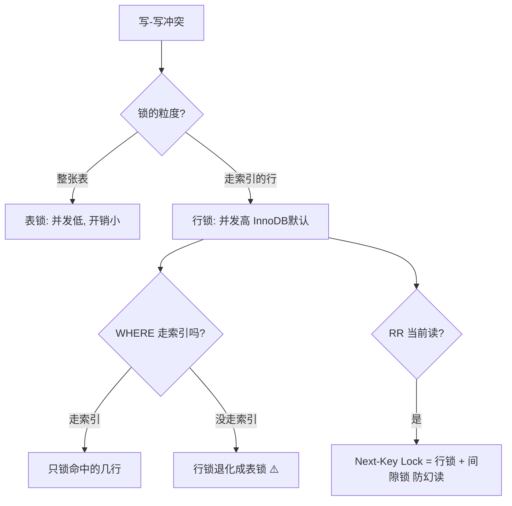

# 锁机制行锁表锁间隙锁
## 六、锁（Lock）— MVCC 不覆盖的最后一道防线

> MVCC 解决了"读-写"冲突（读不加锁），但"写-写"冲突仍然要加锁。

### 6.1 行锁的两种模式

| 锁类型 | 符号 | 含义 | 什么时候加 |
| :--- | :--- | :--- | :--- |
| **共享锁**（S锁 / 读锁） | S | 你可以读，别人也能读，但不能改 | `SELECT ... LOCK IN SHARE MODE` |
| **排他锁**（X锁 / 写锁） | X | 只有你能读写，别人读和写都不行 | `UPDATE`, `DELETE`, `INSERT`, `SELECT ... FOR UPDATE` |

```text
兼容矩阵：
    | S | X |
  S | ✅| ❌|    ← S 和 S 可以共存（多个人同时读，互不干扰）
  X | ❌| ❌|    ← X 和谁都不能共存
```

### 6.2 间隙锁（Gap Lock）— RR 防幻读的补充手段

```text
表中 id：1, 5, 10

SELECT * FROM user WHERE id > 5 FOR UPDATE;

这个语句不止锁 id=5 和 id=10 两行，还会锁 (5, 10) 和 (10, +∞) 之间的**间隙**
防止其他事务在这个范围内插入新行（幻读）
```

RR 用 MVCC 防快照读幻读，用间隙锁防当前读幻读。两者配合，RR 才能"几乎"防住幻读。

### 6.3 表锁 vs 行锁

| | 表锁 | 行锁 |
| :--- | :--- | :--- |
| 粒度 | 锁整张表 | 只锁某几行 |
| 并发度 | 低（其他事务全等着） | 高（不冲突的行可以并行改） |
| 开销 | 小（管一张表就行） | 大（每行都要维护锁信息） |
| **InnoDB 默认** | — | ✅ 行锁（**通过索引找到的行**） |

> ❗ **关键易错点**：InnoDB 行锁是**锁索引**。如果 WHERE 条件没走索引，行锁退化成表锁！

```sql
-- 假设 name 列没建索引
UPDATE user SET age = 30 WHERE name = '张三';
-- 虽然是行锁引擎，但因为 name 没索引，MySQL 不知道张三在哪一行
-- 只能扫全表 → 每一行都加锁 → 等于锁表
-- 其他事务改任何行都要等（灾难）
```

---


## 一图流（Mermaid）



## 速记卡（面试闪卡）

**Q1：InnoDB 行锁锁的是什么？**
A：锁的是索引。WHERE 没走索引时，行锁退化成表锁，全表被锁。

**Q2：S 锁和 X 锁的区别？**
A：S 共享锁（读锁）允许多个事务同时读，互不干扰；X 排他锁（写锁）独占，别人读写都不行。S 和 S 兼容，X 和谁都不兼容。

**Q3：间隙锁（Gap Lock）干嘛用？**
A：RR 隔离级别下，当前读不仅锁已有行，还锁索引之间的间隙，防止别的事务 INSERT 产生幻读。Next-Key Lock = 行锁 + 间隙锁。

**Q4：MVCC 和锁怎么分工？**
A：MVCC 解决读-写冲突（快照读，读不加锁）；锁解决写-写冲突。两者配合处理并发。

> 🔑 口诀：行锁锁索引，没索引变表锁；S 读共享、X 写独占；间隙锁+行锁 = Next-Key Lock 防幻读。

---

## 相关链接

- 📋 目录：[[00-MySQL]]
- 📚 学习清单：[[八股文学习清单]]
- 🔗 [[计算机基础/操作系统/03-线程同步锁机制|线程同步锁机制]] — 操作系统和数据库的锁机制对比
- 🔗 [[语言与框架/MySQL/八股/20-事务隔离级别与MVCC|事务隔离级别与MVCC]] — 锁和MVCC配合解决并发问题

