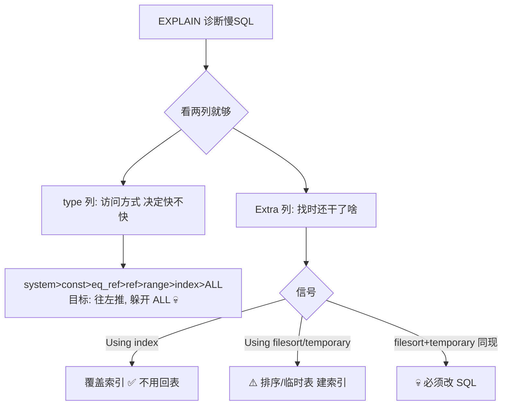

---

title: "EXPLAIN解读"

created: "2025-07-12"

tags:

  - 八股文

  - mysql

---


# EXPLAIN解读

## 第三章：EXPLAIN——SQL 体检报告逐列读


> EXPLAIN 是慢查询优化最重要的工具。你在 SQL 前面加 `EXPLAIN`，MySQL 不会真正执行这条 SQL，而是告诉你它"打算怎么执行"——走不走索引、扫多少行、用什么方式访问表。


### 3.0 先说清楚：EXPLAIN 返回什么？


```sql

EXPLAIN SELECT * FROM users WHERE name = '张三';

```


```text

输出大概长这样（不同 MySQL 版本列数略有差异）：


+----+-------------+-------+------+---------------+------+---------+------+------+-------------+

| id | select_type | table | type | possible_keys | key  | key_len | ref  | rows | Extra       |

+----+-------------+-------+------+---------------+------+---------+------+------+-------------+

|  1 | SIMPLE      | users | ALL  | NULL          | NULL | NULL    | NULL | 5000 | Using where |

+----+-------------+-------+------+---------------+------+---------+------+------+-------------+


下面逐列拆解。不用死记每一列的每个可能值——记住"type 列 + Extra 列"就覆盖了 80% 的问题。

```


### 3.1 id — 执行顺序


```text

id 是 SELECT 的序号。简单查询就一个 1，不用管。


多个表 JOIN 时，id 相同的从上往下执行；id 不同的越大越先执行。


你只要记住：出现子查询时，id 越大的越先跑。不涉及也没关系，不重要。

```


### 3.2 select_type — 查询类型


```text

常见值（碰到哪个认识就行）：


  SIMPLE       → 普通查询，没有子查询、没有 UNION

  PRIMARY      → 最外层的 SELECT（有子查询时才有）

  SUBQUERY     → 子查询里的 SELECT

  DERIVED      → FROM 子句里的子查询（MySQL 叫"派生表"）

  UNION        → UNION 后面的 SELECT


不用全背，认识 SIMPLE 和 SUBQUERY 就够了。

```


### 3.3 table — 查哪张表


```text

就是表名。没东西可说。

```


### 3.4 🔴 type — 访问方式（最重要的一列！它决定你的 SQL 快不快）


```text

type 的值从最好到最差排列。优化 SQL 的目标就是把 type 往左边推。


  system > const > eq_ref > ref > range > index > ALL

  ═══════════════════════        ══════════════════════

  快到起飞 ✅                     能过                    💀 全表扫描，死刑


逐一看：


──────────────────────────────────────────────────────────────

system（最佳——几乎看不见）

──────────────────────────────────────────────────────────────

  表里只有一行数据（系统表、配置表），查它 = 直接拿。

  你在真实项目中看不到这个值——100 万行的表不可能走 system。


──────────────────────────────────────────────────────────────

const（顶级快——通过主键或唯一索引查一行）

──────────────────────────────────────────────────────────────

  条件里有主键 = 或唯一索引 = → MySQL 知道最多返回一行 → 当常量处理。


  EXPLAIN SELECT * FROM users WHERE id = 5;

  → type: const ← "我直接用主键定位，不用扫"


  类似你去图书馆，知道书在"3楼A区5排3座" → 直接走 → 不等不找。


──────────────────────────────────────────────────────────────

eq_ref（JOIN 时通过主键关联——也是顶级的）

──────────────────────────────────────────────────────────────

  两表 JOIN，驱动表的每一行，在被驱动表里通过主键或唯一索引找到唯一匹配行。


  EXPLAIN SELECT * FROM orders o JOIN users u ON o.user_id = u.id;

  → users 表走 eq_ref（用主键 id 匹配）


──────────────────────────────────────────────────────────────

ref（好——普通索引等值查找）

──────────────────────────────────────────────────────────────

  用非唯一索引查数据，可能返回多行。这是你日常开发最常见的"正常快"。


  EXPLAIN SELECT * FROM users WHERE name = '张三';

  → 如果 name 列有普通索引 → type: ref ✅


  ref 和 const 的区别：

    const = 唯一索引找一行，最多 1 行（主键 = 或 unique 索引 =）

    ref   = 非唯一普通索引，可能返回 N 行（如 name = '张三' 可能有 3 个人叫张三）


──────────────────────────────────────────────────────────────

range（还行——索引范围扫描）

──────────────────────────────────────────────────────────────

  WHERE 里用了 >、<、>=、<=、BETWEEN、IN、LIKE '张%' 等范围条件。

  走索引找范围的起止位置，中间全取——不会扫整个索引。


  EXPLAIN SELECT * FROM orders WHERE created_at >= '2026-01-01';

  → type: range ✅


  EXPLAIN SELECT * FROM users WHERE age BETWEEN 20 AND 30;

  → type: range ✅


  EXPLAIN SELECT * FROM users WHERE id IN (1, 2, 3);

  → type: range ✅


  ⚠️ IN 是 range！即使只有 3 个值也是 range——多个等值 = 范围。


──────────────────────────────────────────────────────────────

index（⚠️ 假索引——扫了整个索引树，没扫表但也不是好事）

──────────────────────────────────────────────────────────────

  看起来走了索引？不——它遍历了整个索引树。


  和 ALL（全表扫描）的区别：

    ALL  → 扫完整张表的数据页

    index → 扫完整棵索引树

    索引树比数据表小（只有索引列），所以 index 比 ALL 快一点——但仍然是"全扫"。


  什么时候出现？

    ① 查询的列全在索引里（满足覆盖索引），但没有 WHERE 条件 → 只能扫整个索引

    ② 需要排序，ORDER BY 的列有索引 → 直接读索引就不用再排序了


  EXPLAIN SELECT name FROM users ORDER BY name;

  → 如果 name 有索引，type 可能是 index

  → 虽然没有 WHERE 条件要扫整个索引，但至少只扫了 name 列而不是整行数据


  ⚠️ 如果你看到 type=index 但 rows 有几百万 → 还是慢！别被"用了索引"骗了。


──────────────────────────────────────────────────────────────

ALL（💀 全表扫描——SQL 届的死刑判决书）

──────────────────────────────────────────────────────────────

  MySQL 一行一行从头翻到尾——1000 万行就翻 1000 万次。


  常见原因：

    ① WHERE 条件列没建索引

    ② 索引失效了（后面详解）

    ③ LIKE '%张三' ← 前置模糊，索引用不了


  EXPLAIN SELECT * FROM users WHERE nickname = '小明';

  → nickname 没索引 → type: ALL 💀

  → rows: 5000000 ← 500 万行！全翻一遍！


一张图记一辈子：


  动手画这个——


  system  → 几乎不存在

  const   → 主键/唯一索引查一行（秒杀）

  eq_ref  → JOIN 时主键关联（秒杀）

  ref     → 普通索引等值查（快，日常常态）

  range   → 索引范围扫描（还行，IN / BETWEEN / > / <）

  index   → 扫了整个索引树（⚠️ 假积极——实际在偷懒）

  ALL     → 全表扫描（💀 死刑，必须优化）

```


### 3.5 possible_keys 和 key — "可以选"和"选了谁"


```text

possible_keys → MySQL 认为"理论上能用的索引有哪些"

key           → MySQL 最终决定用哪个


两者可能不一样！比如：


  EXPLAIN SELECT * FROM users WHERE name = '张三' AND age = 22;

  → possible_keys: idx_name, idx_age, idx_name_age

  → key: idx_name_age  ← 三个里选了最优的联合索引


key 为 NULL → 💀 一个索引都没用上 → 回去看你的 WHERE 条件列有没有索引 / 索引有没有失效

```


### 3.6 key_len — 索引用了多长


```text

key_len 告诉你"这个复合索引用了前几列"。


假设有一个复合索引 idx_name_age(name, age)——两列联合索引，name 在前 age 在后。


  EXPLAIN SELECT * FROM users WHERE name = '张三';

  → key_len: 某个值 ← 只用了 name 这一列，age 没用到


  EXPLAIN SELECT * FROM users WHERE name = '张三' AND age = 22;

  → key_len: 更大的值 ← name 和 age 两列全用上了


实用结论：key_len 越大 = 复合索引用到的列越多 = 过滤越精准 = 越快。

具体字节数通常不需要手算，知道大→好就行。

```


### 3.7 ref — 索引用谁和谁比


```text

ref 列告诉你：索引列和"什么东西"做的等值匹配。


常见值：

  const   → 和常量比：WHERE name = '张三' → ref: const

  func    → 和函数结果比：WHERE name = LOWER('张三') → ref: func

  列名     → JOIN 时和另一个表的列比：ref: shop_db.users.id


这一列基本用不到，知道就行。

```


### 3.8 🔴 rows — 预估扫描行数


```text

MySQL 说"我觉得我要扫这么多行才能拿到结果"。


这个数字越小越好！它是估算值，不准但够用。


  1000 万行的表，rows = 3    → 走主键，只扫 3 行 ✅

  1000 万行的表，rows = 500 万 → 全表扫描 💀


rows 远大于最终返回行数 → 索引有问题。

rows 接近最终返回行数 → 索引用得不错。

```


### 3.9 filtered — 扫描后还剩多少


```text

MySQL 5.7+ 才有。rows × filtered% = 最终剩余行数。


  rows=1000, filtered=10.00 → 扫 1000 行，条件过滤后剩 100 行

  rows=1000, filtered=100.00 → 扫 1000 行，全符合条件，无需再过滤


filtered 越低 = 索引过滤性越差 = 扫了很多用不上的行。

```


### 3.10 🔴 Extra — 附加信息（第二重要的列！）


```text

type 告诉你"怎么找"，Extra 告诉你"找的时候还干了什么"。


═══════════════════════════════════════════════════════════════

✅ 好消息（见到就放心）：

═══════════════════════════════════════════════════════════════


  Using index（覆盖索引）：

    → 所有需要的列全在索引里 → 不用回表 → 超级快！


    假设索引 idx(name, age) 建在 users 表。

    SELECT name, age FROM users WHERE name = '张三';

    → 查 name 和 age，这两列全在索引里 → 只读索引树就够了，不回表

    → Extra: Using index ✅


  Using where：

    → 正常——用 WHERE 条件过滤。只要不是 Using where + Using filesort 就没事。


  Using index condition：

    → ICP（索引条件下推）——MySQL 5.6+ 优化，利用索引先过滤再回表。

    → 好事，不用管。


═══════════════════════════════════════════════════════════════

⚠️ 警告信号（见到得想想能不能优化）：

═══════════════════════════════════════════════════════════════


  Using filesort：

    → 文件排序——ORDER BY 的列没走索引，MySQL 额外开了一块空间排序。

    → 数据少没事，数据多了（几十万行）→ 慢 + 吃内存。


    SELECT * FROM users ORDER BY created_at;

    → created_at 没索引 → 全扫出来 → 额外排序 → Extra: Using filesort


    解法：在 ORDER BY 的列上建索引。


  Using temporary：

    → 用了临时表——GROUP BY / DISTINCT / UNION 时，MySQL 在内存/磁盘建了张临时表。

    → 比 filesort 更严重——临时表可能被刷到磁盘，非常慢！


    SELECT category, COUNT(*) FROM products GROUP BY category;

    → category 没索引 → MySQL 建临时表 → 把数据扔进去 → 分组计数

    → Extra: Using temporary; Using filesort


    解法：GROUP BY 的列建索引。


═══════════════════════════════════════════════════════════════

💀 死刑信号：

═══════════════════════════════════════════════════════════════


  Using filesort + Using temporary 同时出现：

    → 这条 SQL 没救了，必须改索引或改写 SQL。

    出现这种情况说明 MySQL 要额外操作两次——先建临时表，再排序。

```


## 一图流（Mermaid）





## 速记卡（面试闪卡）


**Q1：一句话讲清「EXPLAIN解读」到底是什么？**

A：EXPLAIN 是 MySQL 的 SQL 体检报告：在 SQL 前加它，不真正执行，只告诉你打算怎么查——走没走索引、扫多少行。


**Q2：type 列怎么排 —— 怎么理解？**

A：像看病轻重：system > const > eq_ref > ref > range > index > ALL。const 是主键查一行（秒杀），ref 是普通索引等值（日常快），range 是范围（IN/BETWEEN），index 是扫整棵索引树（假积极），ALL 是全表扫描（死刑）。目标把 type 往左推、躲开 ALL。


**Q3：Extra 列看什么信号 —— 怎么理解？**

A：像医生的附注：Using index（覆盖索引，好事，不用回表）；Using filesort / Using temporary（排序/临时表，说明 ORDER BY、GROUP BY 没走索引，得建索引）；filesort + temporary 同时出现=这条 SQL 没救了，必须改。


**Q4：key 为 NULL 说明啥 —— 怎么理解？**

A：像没带钥匙：possible_keys 是"理论能用的索引"，key 是"最终选的"。key 为 NULL 说明一个索引都没用上——回去看 WHERE 条件列有没有建索引，或者索引是不是失效了（如 LIKE '%张三' 前置模糊）。


**Q5：rows 和 filtered 怎么看 —— 怎么理解？**

A：像预估工作量：rows 是 MySQL 估的扫描行数，越小越好（1000 万表 rows=3 走主键，rows=500 万就是全表扫）。filtered 是扫完还剩下的百分比，越低说明索引过滤性越差、扫了很多用不上的行。


**Q6：核心速记主线有哪些？**

- type 列：访问方式定快慢，目标往左推躲开 ALL（全表扫描）

- Extra 列：Using index 最香，filesort+temporary 同现必改

- key 为 NULL：没用上索引，查 WHERE 列或索引失效

- rows/filtered：扫描行数越小越好，filtered 低=过滤差


**口诀**

A：EXPLAIN 看 type，Extra 也别漏；

type 往左推，躲开 ALL 这死囚。

覆盖索引香，回表不用愁；

filesort 加临时，必改莫停留。


## 相关链接


- 📋 目录：[[00-MySQL]]

- 📚 学习清单：[[八股文学习路线图]]


