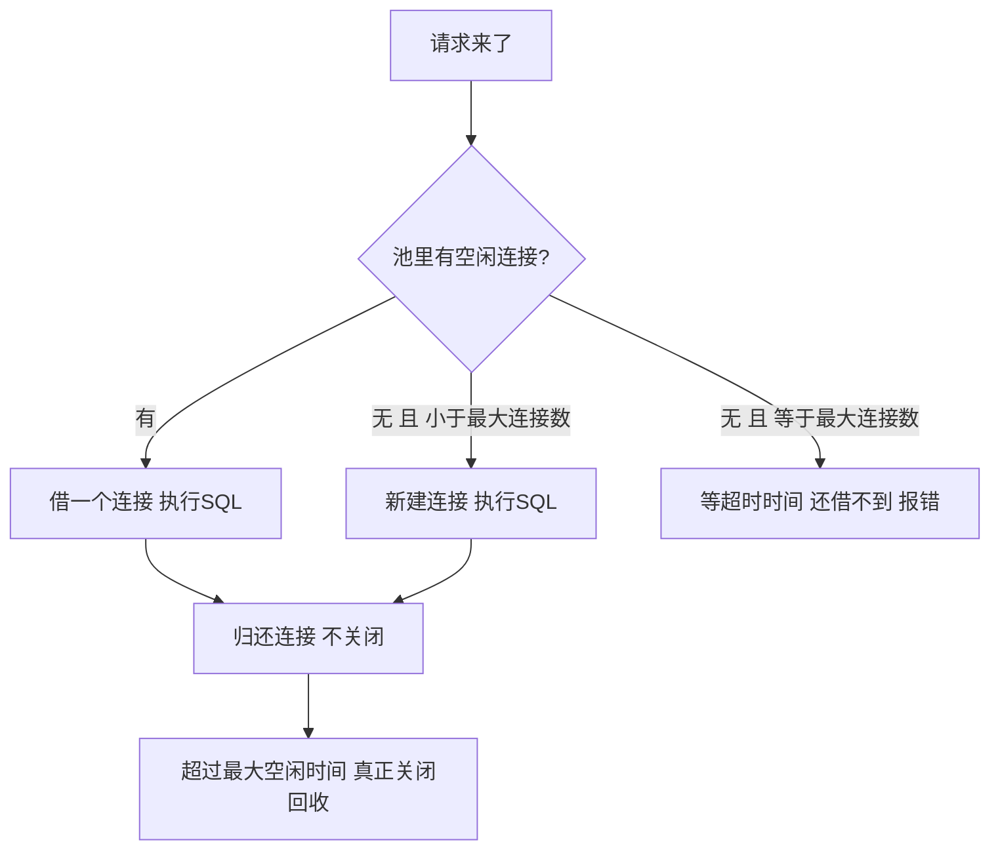

---

title: "连接池原理"

created: "2025-07-12"

tags:

  - 八股文

  - mysql

---

# 连接池原理

## 第一章：连接池——为什么你不能每次都新建连接
### 1.1 先看"没有连接池"的惨状

```text

假设你的 FastAPI 接口每秒处理 100 个请求。

没有连接池（每个请求自己建连接）：

  请求1 来了 → TCP 握手 + 验证 + 分配资源 → 执行 SQL → 关连接（TCP 四次挥手）

  请求2 来了 → TCP 握手 + 验证 + 分配资源 → 执行 SQL → 关连接（TCP 四次挥手）

  ...

  请求100 来了 → 又是全套流程

  100 个请求 × 每次连接开销 ~1ms = 100ms 纯浪费在"连上再断开"

  而且 TCP 握手之后还有一个副作用——大量的 TIME_WAIT 状态连接残留，

  端口不够用了直接报错。

有连接池（预先建 20 个连接放着）：

  程序启动 → 一次性建 20 个连接（20 次握手，就这一次）

  请求1 来了 → 从池子里拿一个连接 → 执行 SQL → 还回去

  请求2 来了 → 从池子里拿一个连接 → 执行 SQL → 还回去

  ...

  请求100 来了 → 池子里借一个，用完还

  100 个请求，握手 0 次！连接复用！

```

### 1.2 连接池怎么工作的——类比共享充电宝

```text

火车站有一排充电宝柜机（连接池），里面永远备着 20 个满电充电宝（20 条连接）。

你（用户请求）到火车站：

  ① 扫一个充电宝（从池子里拿一个连接）

  ② 用充电宝给手机充电（用连接执行 SQL）

  ③ 还回去（连接归还池子，不关！）

你没还之前，这个充电宝别人扫不了——它是你的。

还了之后，下一个人立刻可以扫。

关键：

  - 池子里一直有 20 个"热"连接——TCP 已经握手完毕、已经验证过身份、已经分配好内存

  - 借的人拿到的永远是"现成的"——不用等握手，不用验证

  - 还了之后连接不断开——回到池子继续待命

简单说：连接池 = 数据库连接的"共享充电宝柜"。

        不是用完就扔（关连接），而是用完就还（放回池子）。

```

### 1.3 连接池核心参数——这些值怎么定

```text

每个连接池框架的配置名可能不同，但核心逻辑就四个参数。

① 最小连接数（初始化时建几个）

    程序刚启动时，池子里预先创建多少个连接。

    建议：5-10 个就够了。

    为什么不是越多越好？→ 每个连接在 MySQL 那边占用内存（约 2-4MB），

    你开 1000 个连接但只用 10 个 → 990 个纯浪费 MySQL 内存。

② 最大连接数（最多能借出去几个）

    池子里最多同时有多少个连接在外面。

    建议：根据 MySQL max_connections 反推。

    MySQL 默认 max_connections = 151。

    你的程序在服务器 A，其他服务也可能连同一个 MySQL。

    假设只有你的程序连这个 MySQL → 最大连接数设为 100-120（留余量给管理员连接）。

    如果有 3 个服务共用 MySQL → 每个服务 30-40。

***关键公式——不是拍脑袋定的：***

  你的连接池最大连接数 = (MySQL max_connections - 预留管理连接数) / 服务数量

  例：MySQL 最大 151，预留 11 个管理连接 → 剩 140。

      3 个服务共用 → 每个服务 ~45。

      你取 40 比较稳。

③ 最大空闲时间（连接闲着多久就回收）

    一个连接被还回池子后，闲置超过这个时间，池子把它真正关掉。

    建议：300-600 秒（5-10 分钟）。

    设太短→连接反复建、反复关，失去池化的意义。

    设太长→池子里一堆没人用的连接在吃 MySQL 内存。

    MySQL 自己也有 wait_timeout（默认 8 小时），

    你的空闲时间必须小于 MySQL 的 wait_timeout，

    否则 MySQL 那边已经把连接杀了，你的池子还不知道。

④ 连接超时时间（借连接最多等多久）

    池子里所有连接都在外面忙，新请求来了借不到 → 等多久报错？

    建议：3-10 秒。

    不要设太长——用户等不了 30 秒才告诉你"数据库忙"。

    也不要设太短——偶尔峰值 1 秒等一下就过去了，刚等就失败用户体验差。

直观理解这四个参数的关系：

  程序启动 → 建 10 个连接（最小连接数）

  请求高峰期 → 借出连接越来越多，超过 10 个 → 池子动态新建，最多建到 40 个（最大连接数）

  请求低谷期 → 连接还回来 → 空闲超过 600 秒 → 关掉（最大空闲时间），回到 10 个

  借不到时  → 等 5 秒（连接超时时间）→ 还借不到 → 报错

```

### 1.4 一个真实翻车场景——可以主动讲

```text

场景：你的项目部署后，运行一段时间突然报错 "Too many connections"。

排查思路（爱听这个）：

  ① 登录 MySQL 执行 SHOW PROCESSLIST → 看到几百条 Sleep 状态的连接

  ② 为什么是 Sleep？→ 程序用完连接没关！（或者关了但 MySQL 那边还没回收）

  ③ 检查连接池配置 → 最大连接数设了 200，MySQL max_connections 才 151

     → 池子能开 200 个连接，MySQL 最多允许 151 个 → 第 152 个请求炸了

  ④ 检查代码 → 发现有一个接口执行了很长时间的查询，连接没释放，

     其他请求堆积 → 池子不断创建新连接 → 打满 MySQL 上限

修复：

  - 把连接池最大连接数降到 100

  - 给长时间查询加索引（为什么慢后面讲）

  - 确认连接用完正常归还（with 语句 / try-finally）

最佳实践口诀：池子大小别拍脑袋，跟着 MySQL 上限走。借了一定要还，还了再借不难。

```

---

## 一图流（Mermaid）



## 速记卡（面试闪卡）

**Q1：一句话讲清「连接池原理」到底是什么？**

A：连接池是预先建好一批"热"数据库连接反复借还的组件，避免每次请求都 TCP 握手+验证的浪费，像共享充电宝柜。

**Q2：为什么需要连接池（why pool） —— 怎么理解？**

A：类比：没池子时每个请求自己建连接：TCP 握手+验证+分配约1ms，高并发纯浪费，还留一堆 TIME_WAIT 占满端口。连接池（connection pool）启动时一次性建好，之后握手0次、连接复用，像共享充电宝随借随还。（Reuse）

**Q3：四个核心参数（4 knobs） —— 怎么理解？**

A：类比：池子四个旋钮：最小连接数（启动预建5-10）、最大连接数（按 MySQL max_connections 反推留余量）、最大空闲时间（5-10分钟，须小于 MySQL wait_timeout）、连接超时（借不到等3-10秒）。别拍脑袋，跟着数据库上限走。（Tune）

**Q4：最大连接数怎么定（formula） —— 怎么理解？**

A：类比：公式像分披萨：(MySQL max_connections − 预留管理连接) ÷ 服务数量。例：151−11=140，3个服务各~45，取40最稳。每个连接吃 MySQL 约2-4MB 内存，开太多纯浪费。（Divide the pie）

**Q5：Too many connections 排查（troubleshoot） —— 怎么理解？**

A：类比：报错像充电宝被借光：SHOW PROCESSLIST 看大量 Sleep 连接→没归还或池子超过 MySQL 上限；把最大连接数降到100内、给慢查询加索引、用 with/try-finally 确保归还。借了一定要还。（Find leaks）

**Q6：核心速记主线有哪些？**

- 连接池复用预建的热连接，避免每次 TCP 握手+验证的 1ms 浪费与 TIME_WAIT 爆端口

- 四大参数：最小/最大连接数、最大空闲时间、连接超时

- 最大连接数公式 = (max_connections − 预留) ÷ 服务数

- 空闲时间须 < MySQL wait_timeout，否则连接被对侧悄悄杀掉

- 翻车排查：ProcessList 看 Sleep、降 max、加索引、确保归还

**口诀**

A：连接池像充电宝，借了用完就还；

四个旋钮别拍脑，跟着上限走；

最大连接分披萨，预留管理除以服；

空闲小于 wait_timeout，借不到等几秒。

## 相关链接

- 📋 目录：[[00-MySQL]]

- 📚 学习清单：[[八股文学习路线图]]

- 🔗 [[语言与框架/Redis/八股/16-RedisPipeline批量操作|Redis Pipeline批量操作]] — 连接复用的两种思路：连接池 vs Pipeline

- 🔗 [[计算机基础/分布式-系统设计/08-限流与熔断降级|限流与熔断降级]] — 连接池是资源管理，限流是流量管控

