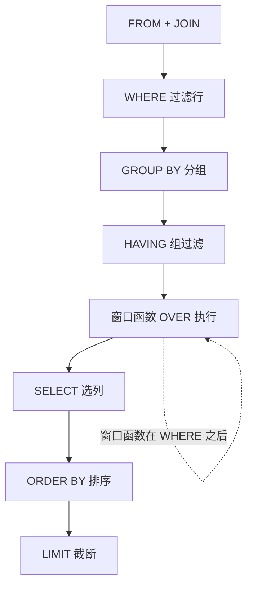

---

title: "SQL手写实战 · 窗口函数与复杂查询"

created: "2026-07-12"

tags:

  - mysql

---

# SQL手写实战 · 窗口函数与复杂查询

---

## 一、复杂JOIN陷阱
### 1.1 LEFT JOIN + WHERE 退化（最高频陷阱）

- **问题**：WHERE里过滤右表字段，会导致LEFT JOIN退化为INNER JOIN

- **原因**：WHERE过滤的是JOIN之后的结果集，右表为NULL的行会被WHERE过滤掉

```sql

-- 错误写法：LEFT JOIN + WHERE 过滤右表 → 退化

SELECT c.name, o.order_id

FROM customers c

LEFT JOIN orders o ON c.user_id = o.user_id

WHERE o.amount > 100;  -- NULL > 100 = UNKNOWN → 被过滤！

-- 正确写法1：过滤条件写进ON子句

SELECT c.name, o.order_id

FROM customers c

LEFT JOIN orders o ON c.user_id = o.user_id

                    AND o.amount > 100;  -- JOIN时就判断，右表不满足但左表保留

-- 正确写法2：子查询先过滤右表

SELECT c.name, o.order_id

FROM customers c

LEFT JOIN (SELECT * FROM orders WHERE amount > 100) o

    ON c.user_id = o.user_id;

```

### 1.2 驱动表选择：小表驱动大表

- MySQL Nested-Loop Join：外层循环（驱动表）每行 → 去内层循环（被驱动表）找匹配

- 驱动表行数越少 → 内层循环总次数越少

- JOIN字段必须有索引

### 1.3 复杂多表JOIN实战

```sql

-- 四表联查：张三老师教过的课程中每个学生的成绩

SELECT st.sname, c.cname, sc.score, t.tname

FROM teacher t

JOIN course c ON t.tid = c.tid

JOIN sc ON c.cid = sc.cid

JOIN student st ON sc.sid = st.sid

WHERE t.tname = '张三'

ORDER BY sc.score DESC;

```

---

## 二、三种子查询性能差异
### 2.1 标量子查询（SELECT里写子查询）

- 外层每行执行一次子查询，10万行 = 10万次

- EXPLAIN中出现`DEPENDENT SUBQUERY`

- **优化方案：改JOIN**

```sql

-- ❌ 慢：外层每行执行一次

SELECT o.order_id,

       (SELECT name FROM customers WHERE id = o.customer_id) AS cust_name

FROM orders o;

-- ✅ 快：一次JOIN搞定

SELECT o.order_id, c.name AS cust_name

FROM orders o LEFT JOIN customers c ON o.customer_id = c.id;

```

### 2.2 派生表子查询（FROM里写子查询）

- 只执行一次，结果当临时表用，性能好

```sql

SELECT dept_id, avg_salary

FROM (

    SELECT dept_id, AVG(salary) AS avg_salary

    FROM employees GROUP BY dept_id  -- 只执行1次

) AS dept_avg

WHERE avg_salary > 10000;

```

### 2.3 相关子查询（WHERE里引用外层字段）

- 和标量子查询一样，外层每行触发一次

- 优化方案：先用派生表算好，再JOIN

```sql

-- ❌ 慢：外层每行执行一次

SELECT name, salary FROM employees e1

WHERE salary > (SELECT AVG(salary) FROM employees e2 WHERE e2.dept_id = e1.dept_id);

-- ✅ 快：先算再JOIN

SELECT e.name, e.salary FROM employees e

JOIN (SELECT dept_id, AVG(salary) AS avg_sal FROM employees GROUP BY dept_id) d

  ON e.dept_id = d.dept_id

WHERE e.salary > d.avg_sal;

```

### 执行次数对比

| 子查询类型 | 执行次数 |
| :--- | :--- |
| 标量子查询（SELECT里） | 外层N行 → 执行N次 |
| 派生表（FROM里） | 执行1次 |
| 相关子查询（WHERE引外层） | 外层N行 → 执行N次 |
| 非相关子查询（WHERE不引外层） | 执行1次 |

---

## 三、NOT IN + NULL 全军覆没

> 最高频SQL陷阱，没有之一。

### 问题原理

```sql

SELECT * FROM customers WHERE id NOT IN (1, 2, NULL);

-- 展开：id != 1 AND id != 2 AND id != NULL

-- → TRUE AND TRUE AND UNKNOWN

-- → UNKNOWN → WHERE过滤掉 → 返回0行！

```

- `!= NULL` 结果永远是UNKNOWN

- UNKNOWN在WHERE中被当作FALSE

- 子查询只要有一个NULL，NOT IN就返回空结果集

- 这是SQL标准行为，不是MySQL的bug

### 解决方案

```sql

-- ✅ 方法1：NOT EXISTS（推荐，NULL安全）

SELECT * FROM customers c

WHERE NOT EXISTS (SELECT 1 FROM orders o WHERE o.user_id = c.id);

-- ✅ 方法2：LEFT JOIN + IS NULL

SELECT c.* FROM customers c

LEFT JOIN orders o ON c.id = o.user_id

WHERE o.user_id IS NULL;

-- ✅ 方法3：NOT IN + 子查询排除NULL

SELECT * FROM customers

WHERE id NOT IN (SELECT user_id FROM orders WHERE user_id IS NOT NULL);

```

**口诀：NOT IN遇NULL，全军覆没。生产永远用NOT EXISTS。**

---

## 四、窗口函数
### 4.1 一句话理解

> 窗口函数 = 不减少行数的"分组计算"。GROUP BY把10行压成1行；窗口函数10行进10行出，结果作为新列附加。

```sql

FUNCTION_NAME() OVER (

    PARTITION BY col1, col2   -- 分组（类比GROUP BY，但行不合并）

    ORDER BY col3             -- 组内排序

    ROWS/RANGE BETWEEN ...    -- 窗口范围

)

```

### 4.2 排名三剑客

```sql

SELECT name, score,

    ROW_NUMBER() OVER (ORDER BY score DESC) AS rn,      -- 唯一序号(1,2,3,4)

    RANK()       OVER (ORDER BY score DESC) AS rk,      -- 并列跳号(1,1,3,4)

    DENSE_RANK() OVER (ORDER BY score DESC) AS dr       -- 并列不跳(1,1,2,3)

FROM students;

```

| 函数 | 特点 | 适用场景 |
| :--- | :--- | :--- |
| ROW_NUMBER | 唯一编号，无并列 | "每组严格取1条" |
| RANK | 并列跳号(1,1,3) | 比赛排名 |
| DENSE_RANK | 并列不跳(1,1,2) | "前N名有几个人" |

### 4.3 LAG/LEAD — 行间偏移

- `LAG(col, N)`：往前看N行（看历史）

- `LEAD(col, N)`：往后看N行（看未来）

```sql

-- 环比增长率

SELECT sale_date, revenue,

    LAG(revenue, 1) OVER (ORDER BY sale_date) AS yesterday,

    ROUND((revenue - LAG(revenue,1) OVER (ORDER BY sale_date))

          / LAG(revenue,1) OVER (ORDER BY sale_date) * 100, 2) AS growth_pct

FROM daily_sales;

```

- 第一行LAG返回NULL（没有昨天），这是正确的

- PARTITION BY让每个分组独立偏移，不加则全局串

### 4.4 聚合窗口

```sql

-- 累计求和（ORDER BY使它变成累计）

SUM(amount) OVER (ORDER BY order_date) AS running_total

-- 分组累计

SUM(amount) OVER (PARTITION BY user_id ORDER BY order_date) AS user_total

-- 7日移动平均

AVG(revenue) OVER (ORDER BY sale_date ROWS BETWEEN 6 PRECEDING AND CURRENT ROW) AS ma_7d

-- 占比计算

ROUND(score * 100.0 / SUM(score) OVER (PARTITION BY subject), 2) AS pct

```

### 4.5 重要规则

- 窗口函数在WHERE之后执行

- 不能放在WHERE里，必须套子查询在外层WHERE过滤

```sql

-- ❌ 错误

SELECT *, ROW_NUMBER() OVER (...) AS rn FROM t WHERE rn <= 3;

-- ✅ 正确

SELECT * FROM (

    SELECT *, ROW_NUMBER() OVER (...) AS rn FROM t

) WHERE rn <= 3;

```

---

## 五、实战套路
### 5.1 Top N Per Group（每组前N名）

```sql

SELECT dept_id, name, salary

FROM (

    SELECT *, ROW_NUMBER() OVER (

        PARTITION BY dept_id ORDER BY salary DESC

    ) AS rn

    FROM employees

) t

WHERE rn <= 2;

```

### 5.2 连续登录（核心公式）

```text

连续日期 - 它在组内的序号 = 同一个常数

```

```sql

-- 步骤：去重 → 编号 → DATE_SUB → HAVING COUNT

WITH dedup AS (

    SELECT DISTINCT user_id, login_date FROM login_log

),

numbered AS (

    SELECT *, ROW_NUMBER() OVER (PARTITION BY user_id ORDER BY login_date) AS rn

    FROM dedup

),

grouped AS (

    SELECT *, DATE_SUB(login_date, INTERVAL rn DAY) AS grp FROM numbered

)

SELECT user_id, MIN(login_date) AS start_date, COUNT(*) AS days

FROM grouped

GROUP BY user_id, grp

HAVING COUNT(*) >= 3;

```

### 5.3 留存率

```sql

-- 核心：MIN找首登 + DATEDIFF算间隔 + 条件COUNT

WITH first_login AS (

    SELECT user_id, MIN(login_date) AS first_date

    FROM login_log GROUP BY user_id

)

SELECT first_date,

    COUNT(DISTINCT f.user_id) AS new_users,

    COUNT(DISTINCT CASE WHEN DATEDIFF(a.login_date, f.first_date)=1 THEN a.user_id END) AS retention,

    ROUND(COUNT(DISTINCT CASE WHEN DATEDIFF(a.login_date, f.first_date)=1 THEN a.user_id END) * 100.0

          / COUNT(DISTINCT f.user_id), 2) AS retention_rate

FROM first_login f

LEFT JOIN (SELECT DISTINCT user_id, login_date FROM login_log) a

    ON f.user_id = a.user_id AND a.login_date > f.first_date

GROUP BY f.first_date;

```

### 5.4 行转列

```sql

SELECT sid,

    MAX(CASE WHEN subject = '语文' THEN score END) AS 语文,

    MAX(CASE WHEN subject = '数学' THEN score END) AS 数学,

    MAX(CASE WHEN subject = '英语' THEN score END) AS 英语

FROM exam_scores

GROUP BY sid;

```

- MAX/MIN穿透NULL，取出每组唯一的非NULL值

---

## 六、踩坑记录

| 坑 | 正确认知 |
| :--- | :--- |
| LEFT JOIN + WHERE过滤右表 | LEFT JOIN退化为INNER JOIN，过滤条件必须写ON里 |
| NOT IN子查询有NULL | 整条SQL返回0行，用NOT EXISTS替代 |
| 窗口函数放WHERE里 | 语法报错，必须套子查询在外层WHERE过滤 |
| 标量子查询 | DEPENDENT SUBQUERY，外层每行执行一次，改JOIN |
| SUM OVER加ORDER BY | 变成累计求和（每行不同），不加ORDER BY是分区总和（每行一样） |

---

## 七、速答

| 问题 | 一句话答案 |
| :--- | :--- |
| LEFT JOIN后WHERE过滤右表会怎样？ | LEFT JOIN退化为INNER JOIN，NULL行被WHERE杀掉 |
| NOT IN遇NULL会怎样？ | 返回0行！用NOT EXISTS替代 |
| 标量子查询为什么不推荐？ | 外层每行执行一次子查询，改JOIN |
| 窗口函数和GROUP BY区别？ | GROUP BY合并行（减少行数），窗口函数附加列（不减少行数） |
| ROW_NUMBER vs RANK vs DENSE_RANK？ | 唯一编号 / 并列跳号 / 并列不跳 |
| 连续登录怎么算？ | 日期 - ROW_NUMBER = 同一个常数 |
| 窗口函数能放WHERE里吗？ | 不能，套子查询在外层WHERE |
| 行转列怎么实现？ | MAX(CASE WHEN key='X' THEN value END) + GROUP BY |

---

## 八、一图流（Mermaid）



## 速记卡（面试闪卡）

**Q1：一句话讲清「SQL手写实战 · 窗口函数与复杂查询」到底是什么？**

A：窗口函数是不减少行数的"分组计算"——GROUP BY 把多行压成一行，窗口函数 10 进 10 出，结果当新列附加。

**Q2：一、复杂 JOIN 陷阱 —— 怎么理解？ —— 怎么理解？**

A：LEFT JOIN 后若在 WHERE 里过滤右表字段，右表为 NULL 的行被 WHERE 杀掉，LEFT JOIN 退化成 INNER JOIN。好比邀请所有人聚餐，却只留"带了礼物"的——没带的一律赶走。过滤条件要写进 ON 子句。

**Q3：二、NOT IN 遇 NULL 全军覆没 —— 怎么理解？ —— 怎么理解？**

A：NOT IN 里只要有一个 NULL，展开后 `id != NULL` 得 UNKNOWN，WHERE 当 FALSE，整条 SQL 返回 0 行。这跟"找不在名单里的人，名单里有个'无名氏'就全员失踪"一样。生产永远用 NULL 安全的 NOT EXISTS。

**Q4：三、窗口函数与排名三剑客 —— 怎么理解？ —— 怎么理解？**

A：窗口函数 = 不减少行数的分组计算，语法 `函数() OVER (PARTITION BY ... ORDER BY ...)`。ROW_NUMBER 唯一序号无并列；RANK 并列跳号(1,1,3)；DENSE_RANK 并列不跳(1,1,2)。就像班级排名：有人并列时，是"空出名次"还是"紧挨着"。

**Q5：四、实战套路与踩坑 —— 怎么理解？ —— 怎么理解？**

A：Top N Per Group 用 ROW_NUMBER 套子查询在外层 WHERE 过滤（窗口函数不能在 WHERE 里）；连续登录靠"日期 − 组内序号 = 常数"；行转列用 MAX(CASE WHEN ...)。窗口函数在 WHERE 之后执行，必须包一层子查询。

**Q6：核心速记主线有哪些？**

- LEFT JOIN 过滤右表写 ON，别写 WHERE（否则退化 INNER）

- NOT IN 遇 NULL 返回 0 行，用 NOT EXISTS

- 窗口函数不减量，ROW_NUMBER/RANK/DENSE_RANK 记跳号

- 连续登录：日期−序号=常数；窗口函数不能放 WHERE

**口诀**

A：LEFT JOIN 过滤写 ON，

NOT IN 遇空全落空；

窗口函数不减量，

排名三剑各不同。

## 相关链接

- 📋 目录：[[00-MySQL]]

- 📚 学习清单：[[八股文学习路线图]]

