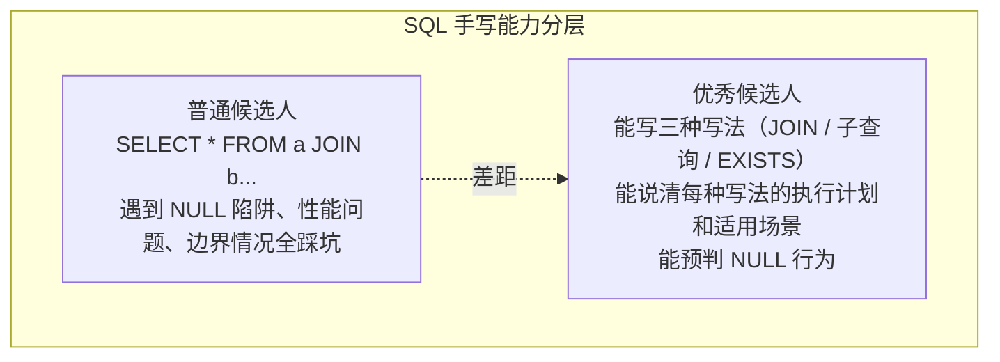

# JOIN进阶多表连接
## 开篇：为什么 SQL 手写是"区分度最高"的题？

三道题决定你能不能过 SQL 面：
  ① 写对 JOIN（LEFT JOIN + WHERE 退化陷阱）
  ② 写对子查询（NOT IN + NULL 全军覆没）
  ③ 写对窗口函数（连续登录 / Top N / 环比增长率）

> 🔴 **必背**：SQL 手写的本质不是你"会不会写 SQL"，而是"知不知道每种写法在什么场景下会出 bug"。写出正确结果只是及格，能预判边界情况才是优秀。

---

## 速记卡（面试闪卡）

**Q1：一句话讲清「JOIN进阶多表连接」到底是什么？**
A：三道题决定你能不能过 SQL 面：
  ① 写对 JOIN（LEFT JOIN + WHERE 退化陷阱）
  ② 写对子查询（NOT IN + NULL 全军覆没）
  ③ 写对窗口函数（连续登录 / Top N / 环比增长率）
🔴 **必背**：SQL 手写的本质不是你"会不会写 SQL"，而是"知不知道每种写法在什么场景下会出 bug"。写出正确结果只是及格，能预判边界情况才是优秀。

**Q2：开篇：为什么 SQL 手写是"区分度最高"的题？ —— 怎么理解？**
A：三道题决定你能不能过 SQL 面：
  ① 写对 JOIN（LEFT JOIN + WHERE 退化陷阱）
  ② 写对子查询（NOT IN + NULL 全军覆没）
  ③ 写对窗口函数（连续登录 / Top N / 环比增长率）
🔴 **必背**：SQL 手写的本质不是你"会不会写 SQL"，而是"知不知道每种写法在什么场景下会出 bug"。写出正确结果只是及格，能预判边界情况才是优秀。
---

**Q3：核心速记主线有哪些？**
A：抓住这几根：开篇：为什么 SQL 手写是"区分度最高"的题？。

## 相关链接

- 📋 目录：[[00-MySQL]]
- 📚 学习清单：[[八股文学习清单]]

