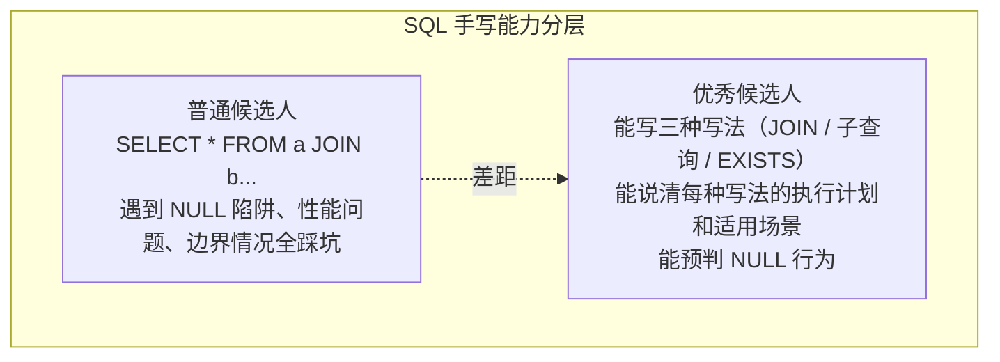

---

title: "JOIN进阶多表连接"

created: "2025-07-12"

tags:

  - 八股文

  - mysql

---

# JOIN进阶多表连接

## 开篇：为什么 SQL 手写是"区分度最高"的题？

三道题决定你能不能过 SQL 面：

  ① 写对 JOIN（LEFT JOIN + WHERE 退化陷阱）

  ② 写对子查询（NOT IN + NULL 全军覆没）

  ③ 写对窗口函数（连续登录 / Top N / 环比增长率）

> 🔴 **必背**：SQL 手写的本质不是你"会不会写 SQL"，而是"知不知道每种写法在什么场景下会出 bug"。写出正确结果只是及格，能预判边界情况才是优秀。

---

## 速记卡（面试闪卡）

**Q1：一句话讲清「JOIN进阶多表连接」到底是什么？**

A：JOIN 进阶考的是预判 SQL 每种写法的边界陷阱，而非会不会写——LEFT JOIN、子查询、窗口函数三关。

**Q2：一、LEFT JOIN 的 WHERE 退化陷阱 —— 怎么理解？**

A：LEFT JOIN 想保留左表全部行，但若在 WHERE 里对右表字段加条件（如 WHERE b.col IS NOT NULL），NULL 行被过滤掉，LEFT JOIN 悄悄退化成 INNER JOIN。过滤右表的条件要写在 ON 里，别写在 WHERE 里。

**Q3：二、子查询 NOT IN 遇 NULL 全军覆没 —— 怎么理解？**

A：NOT IN (子查询) 一旦子查询返回 NULL，整条比较变成 UNKNOWN，结果行全消失。改用 NOT EXISTS 或更早过滤掉 NULL——EXISTS 碰到 NULL 不会翻车，因为它只看"有没有行"不看具体值。

**Q4：三、窗口函数：连续登录/TopN/环比 —— 怎么理解？**

A：窗口函数（ROW_NUMBER/RANK/LAG）不折叠行就能算排名、相邻行差（环比）、连续登录天数。比 GROUP BY 强在"保留明细还能算聚合"，是区分普通候选和优秀候选的关键一题。

**Q5：四、SQL 手写的本质 —— 怎么理解？**

A：写出正确结果只是及格，能预判每种写法在什么场景出 bug 才是优秀。三道题决定能不能过 SQL 面：写对 JOIN（LEFT JOIN 退化）、写对子查询（NOT IN+NULL）、写对窗口函数（连续登录/TopN/环比）。

**Q6：核心速记主线有哪些？**

- LEFT JOIN 的右表过滤要放 ON，否则退化成 INNER

- NOT IN 遇 NULL 全军覆没，改用 NOT EXISTS

- 窗口函数保留明细算排名/环比/连续登录

- SQL 手写比的是预判边界，不是会不会写

- 三种写法：JOIN / 子查询 / 窗口函数

**口诀**

A：LEFT JOIN 过滤别放 WHERE，

NOT IN 遇空全抓瞎；

窗口函数留明细算排名，

写对边界才算行家。

## 相关链接

- 📋 目录：[[00-MySQL]]

- 📚 学习清单：[[八股文学习路线图]]

