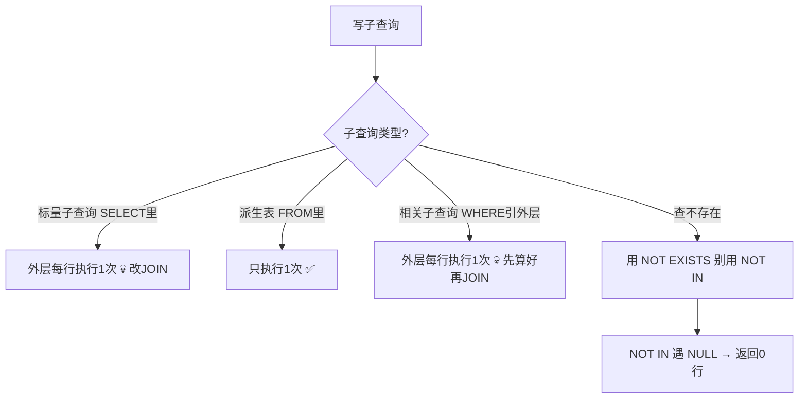

---

title: "窗口函数区分度核心"

created: "2025-07-12"

tags:

  - 八股文

  - mysql

---

# 窗口函数区分度核心

## 第二章：子查询 — 三种类型 + 两个经典陷阱
### 2.1 子查询的三种类型

```sql

-- ============================================================

-- ① 标量子查询 — SELECT 里写子查询，返回单值

-- ⚠️ 外层每行执行一次！慎用！

-- ============================================================

-- ❌ 危险写法（orders 10万行 → 子查询执行10万次）

SELECT o.order_id,                                          -- 订单ID

       (SELECT name FROM customers WHERE id = o.customer_id) AS cust_name  -- 子查询在外层每行执行一次！

FROM orders o;                                              -- 外层表有10万行

-- ✅ 优化写法（一次 JOIN 搞定）

SELECT o.order_id, c.name AS cust_name                      -- 需要的列

FROM orders o                                               -- 左表

LEFT JOIN customers c ON o.customer_id = c.id;              -- 一次 JOIN，走索引，0.1秒

-- ============================================================

-- ② 派生表子查询 — FROM 里写子查询，作为一个临时表

-- ✅ 只执行一次，性能好

-- ============================================================

SELECT dept_id, avg_salary                                   -- 外层从子查询结果里取

FROM (

    SELECT dept_id, AVG(salary) AS avg_salary               -- 内层：分组算平均工资（只执行1次）

    FROM employees

    GROUP BY dept_id                                        -- 按部门分组

) AS dept_avg                                               -- ← MySQL 要求派生表必须有别名！

WHERE avg_salary > 10000;                                   -- 外层过滤：只要平均工资>1万的

-- ============================================================

-- ③ 相关子查询 — WHERE 里子查询引用了外层字段

-- ⚠️ 和标量子查询一样——外层每行触发一次内查询

-- ============================================================

-- 查询"工资高于本部门平均工资的员工"

SELECT name, salary, dept_id                                 -- 员工信息

FROM employees e1                                            -- 外层表：每个员工

WHERE salary > (                                             -- 当前员工的工资 >

    SELECT AVG(salary) FROM employees e2                     -- 内层算平均工资

    WHERE e2.dept_id = e1.dept_id                           -- ← 引用了外层的 dept_id（每行不同！）

);                                                           -- 外层10个员工 → 内层执行10次

-- ✅ 优化写法：先用派生表算好各部门平均，再 JOIN

SELECT e.name, e.salary, e.dept_id                           -- 员工信息

FROM employees e                                             -- 左表

JOIN (                                                       -- 子查询算好各部门平均工资（只执行1次）

    SELECT dept_id, AVG(salary) AS avg_sal                  -- 各部门 + 平均工资

    FROM employees GROUP BY dept_id                         -- 按部门分组

) d ON e.dept_id = d.dept_id                                -- 连接：配对本部门平均工资

WHERE e.salary > d.avg_sal;                                 -- 过滤：工资高于平均的

```

```text

三种子查询的执行次数：

标量子查询（SELECT 里）:         外层 N 行 → 子查询执行 N 次 💀

派生表（FROM 里）:               子查询执行 1 次 → 结果当临时表用 ✅

相关子查询（WHERE 里引外层）:     外层 N 行 → 子查询执行 N 次 💀

非相关子查询（WHERE 里不引外层）: 子查询执行 1 次 → 缓存结果 ✅

```

### 2.2 🔴 NOT IN + NULL —— 经典钓鱼题

**这道题是 SQL 的最高频陷阱，没有之一。就等着你踩。**

```sql

-- 场景：查询"没有下过单的客户"

-- customers: id=1(张三),2(李四),3(王五)

-- orders: user_id=1, user_id=2, NULL  ← 注意：有一行 NULL！

-- ❌ 错误写法1 — NOT IN（有 NULL 时返回 0 行！）

SELECT * FROM customers                                    -- 客户表

WHERE id NOT IN (                                          -- 不在"下过单的用户ID"列表里

    SELECT user_id FROM orders                             -- 子查询结果: (1, 2, NULL)

);                                                         -- ⚠️ 有NULL → 整条SQL返回0行！

-- 结果：0 行！！！（张三和李四也被过滤了）

-- 原因分析：

-- id=3 NOT IN (1, 2, NULL)

-- → 3 != 1 AND 3 != 2 AND 3 != NULL

-- → TRUE AND TRUE AND UNKNOWN

-- → UNKNOWN → 被 WHERE 过滤掉（WHERE 只要 FALSE 和 UNKNOWN 都过滤）

-- 所有行都被过滤！返回 0 行！

-- ✅ 正确写法1 — NOT EXISTS（推荐，语义清晰不受 NULL 影响）

SELECT * FROM customers c                                  -- 外层：遍历每个客户

WHERE NOT EXISTS (                                         -- "不存在"匹配行

    SELECT 1 FROM orders o                                 -- SELECT 1 只是占位，EXISTS 不关心返回值

    WHERE o.user_id = c.id                                -- 关键：这里引用了外层 c.id（相关子查询）

);                                                         -- 找到一条就停，不受 NULL 影响

-- 结果：王五 ✅

-- ✅ 正确写法2 — LEFT JOIN + IS NULL

SELECT c.* FROM customers c                                -- 客户全部列

LEFT JOIN orders o ON c.id = o.user_id                     -- 左连接：保留没订单的客户

WHERE o.user_id IS NULL;                                   -- 右表字段为NULL = 没匹配到 = 没下过单

-- 结果：王五 ✅

-- ✅ 正确写法3 — NOT IN 但子查询里过滤 NULL（不推荐，容易忘）

SELECT * FROM customers

WHERE id NOT IN (

    SELECT user_id FROM orders WHERE user_id IS NOT NULL  -- 手动排除 NULL

);

```

```text

NOT IN 的 NULL 陷阱原理：

  SELECT * FROM customers WHERE id NOT IN (1, 2, NULL)

  展开为：

  id != 1    → 对 id=3 来说 = TRUE   → 通过

  AND id != 2  → 对 id=3 来说 = TRUE   → 通过

  AND id != NULL → 对 id=3 来说 = UNKNOWN → ❌ 整行被过滤

  TRUE AND TRUE AND UNKNOWN = UNKNOWN

  WHERE 子句里 UNKNOWN 被视为 FALSE → 行不返回

  结果：整条 SQL 返回 0 行！！！

```

> 🔴 **必背口诀**：**NOT IN 遇 NULL，全军覆没。生产写 SQL 永远用 NOT EXISTS。**

>

> **一句话讲清**："NOT IN 的问题是三值逻辑——NULL 参与比较运算的结果是 UNKNOWN，UNKNOWN 在 WHERE 中被当作 FALSE 处理。所以子查询只要有一个 NULL，NOT IN 就返回空结果集。这是 SQL 标准的行为，不是 MySQL 的 bug。解决方案是用 NOT EXISTS 或 LEFT JOIN...IS NULL，两者都不受 NULL 影响。"

### 2.3 IN vs EXISTS — 怎么选？

| 维度 | IN | EXISTS |
| ------ | :---: | :---: |
| NULL 安全 | ❌ 子查询有 NULL 时行为诡异 | ✅ 不受 NULL 影响 |
| 子查询返回大结果集 | 内存占用高（结果集要缓存） | ✅ 只判断存在性，找到即停 |
| 外层大、子查询小 | ✅ 子查询结果集小，IN 快 | 也行 |
| 外层小、子查询大 | 慢（大结果集缓存） | ✅ EXISTS 找到一条就停 |
| MySQL 5.6+ Semi-Join | ✅ 优化器自动把 IN 转成 Semi-Join | — |

```sql

-- IN 适用场景：子查询结果集小且确定无 NULL

SELECT * FROM orders WHERE user_id IN (1, 2, 3);   -- 常量列表，等价于 user_id=1 OR user_id=2 OR user_id=3

-- EXISTS 适用场景：子查询大或可能含 NULL

SELECT * FROM customers c                           -- 外层：遍历客户

WHERE EXISTS (                                      -- "存在"匹配行

    SELECT 1 FROM orders o                          -- SELECT 1 = 占位符，只要有一条就返回 TRUE

    WHERE o.user_id = c.id AND o.amount > 1000     -- 找金额>1000的订单

);                                                  -- 找到第一条就停止扫描 → 比 IN 快

```

---

## 一图流（Mermaid）



## 速记卡（面试闪卡）

**Q1：一句话讲清「窗口函数区分度核心」到底是什么？**

A：SQL 子查询分三种：标量与相关子查询每行触发一次要改 JOIN，派生表只跑一次；NOT IN 遇 NULL 会翻车。

**Q2：2.1 子查询三种类型与执行次数 —— 怎么理解？**

A：标量子查询（SELECT 里）外层 N 行执行 N 次、相关子查询（WHERE 引外层）同理——都是 DEPENDENT SUBQUERY 性能炸弹；派生表（FROM 里）和非相关子查询只执行 1 次当临时表。原则：能改 JOIN 就改 JOIN，10 万行别让子查询跑 10 万次。

**Q3：2.2 NOT IN 遇 NULL 全军覆没 —— 怎么理解？**

A：NOT IN 遇 NULL 返回 0 行：三值逻辑下 NULL 比较得 UNKNOWN，WHERE 把 UNKNOWN 当 FALSE，于是 TRUE AND TRUE AND UNKNOWN＝UNKNOWN→整行被过滤。这是 SQL 标准行为不是 bug。解法：NOT EXISTS 或 LEFT JOIN...IS NULL，都不受 NULL 影响。

**Q4：2.3 IN vs EXISTS 怎么选 —— 怎么理解？**

A：子查询小且确定无 NULL→IN 快（结果集缓存）；子查询大或可能含 NULL→EXISTS（找到即停、NULL 安全）。MySQL 5.6+ 优化器会把 IN 自动转 Semi-Join。查"没下过单的客户"用 NOT EXISTS 或 LEFT JOIN IS NULL，别用 NOT IN。

**Q5：实战：怎么查"没下过单的客户" —— 怎么理解？**

A：NOT EXISTS：外层遍历客户，内层 SELECT 1 引用 c.id 找匹配，找到一条就停，不受 NULL 影响，结果王五。LEFT JOIN orders ON c.id=o.user_id WHERE o.user_id IS NULL：右表为 NULL＝没匹配到＝没下过单。两种都返回王五，NOT IN 却返回 0 行。

**Q6：核心速记主线有哪些？**

- 三类型：标量（SELECT）/相关（WHERE 引外层）每行跑一次，派生表（FROM）只一次

- NOT IN 遇 NULL→三值逻辑 UNKNOWN 当 FALSE→返回 0 行

- 解法：NOT EXISTS 或 LEFT JOIN ... IS NULL

- IN 小快；EXISTS 大稳且 NULL 安全

- MySQL 5.6+ 把 IN 自动转 Semi-Join

**口诀**

A：子查询三种类，标量相关每行费

派生表只跑一遭，JOIN 改写最实惠

NOT IN 遇 NULL，全军覆没罪

NOT EXISTS 兜底，LEFT JOIN 也对

## 相关链接

- 📋 目录：[[00-MySQL]]

- 📚 学习清单：[[八股文学习路线图]]

