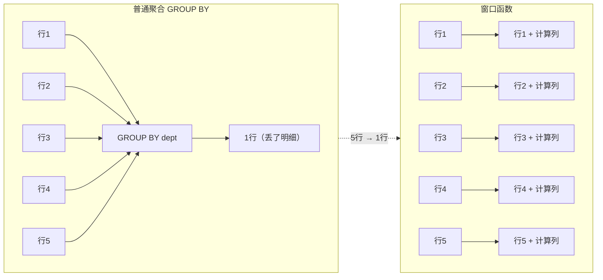
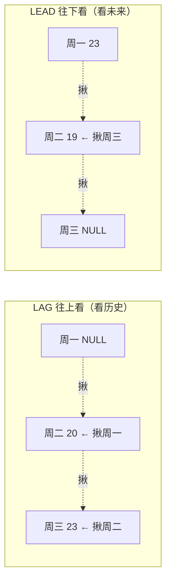

---

title: "手写题分级"

created: "2025-07-12"

tags:

  - 八股文

  - mysql

---

# 手写题分级

## 第三章：窗口函数 — 区分度的核心
### 3.1 一句话理解窗口函数

> **窗口函数 = 不减少行数的"分组计算"。普通聚合 GROUP BY 把 10 行压成 1 行；窗口函数 10 行进来 10 行出去，计算结果作为新列附加。**



**窗口函数语法结构：**

```sql

FUNCTION_NAME() OVER (

    PARTITION BY col1, col2    -- 分组（类比 GROUP BY，但行不合并）

    ORDER BY col3              -- 组内排序

    ROWS/RANGE BETWEEN ...     -- 窗口范围（滑动窗口）

)

```

### 3.2 排名三剑客 — ROW_NUMBER / RANK / DENSE_RANK

```sql

-- 数据：张三(90分), 李四(90分), 王五(80分), 赵六(70分)

SELECT name, score,

    ROW_NUMBER() OVER (ORDER BY score DESC) AS rn,      -- 唯一序号，不处理并列（1,2,3,4）

    RANK()       OVER (ORDER BY score DESC) AS rk,      -- 处理并列，跳号（1,1,3,4）

    DENSE_RANK() OVER (ORDER BY score DESC) AS dr       -- 处理并列，不跳号（1,1,2,3）

FROM students;                                          -- OVER() 里不用 PARTITION BY，全局排名

-- 结果：

-- name  | score | rn | rk | dr

-- 张三  |  90   | 1  | 1  | 1    ← ROW_NUMBER: 唯一序号

-- 李四  |  90   | 2  | 1  | 1    ← RANK: 并列都第1，下个第3

-- 王五  |  80   | 3  | 3  | 2    ← DENSE_RANK: 并列都第1，下个第2

-- 赵六  |  70   | 4  | 4  | 3

-- 场景选型：

-- ROW_NUMBER: "每个部门薪资最高的那个人"（只要一条，并列随机取）

-- RANK:       "成绩排名，并列第一意味着没有第二"

-- DENSE_RANK: "前 3 名有几个人"（不计并列跳过的人数）

```

> **一句话讲清**："ROW_NUMBER 给每行唯一编号，即使排序字段相同；RANK 处理并列但会跳过名次（1,1,3）；DENSE_RANK 处理并列不跳名次（1,1,2）。选哪个取决于业务语义——严格每人一个名次用 ROW_NUMBER，比赛排名用 RANK，统计前 N 名有多少人用 DENSE_RANK。"

### 3.3 🔴 LAG / LEAD — 行间偏移
#### 3.3.0 先忘掉语法——用眼睛看它在干什么

**LAG 和 LEAD 就做一件事：在排好序的列表里，偷看相邻行的值。**

```text

你排在队伍里买奶茶：

  队伍:  [小明] → [你] → [小红] → [小刚]

  LAG(名字, 1)：你往前看 1 个人 → "小明"    （lag = "落后"，往前看）

  LEAD(名字, 1)：你往后看 1 个人 → "小红"   （lead = "领先"，往后看）

  站在你当前位置，你能同时看到前面的人和后面的人是谁。

  SQL 的 LAG/LEAD 就是给了每行这个"前后张望"的能力。

```

> **类比**：`LAG` = 倒车镜（看后面/之前），`LEAD` = 前挡风玻璃（看前面/之后）。懂了名字就不乱了——**LAG 是"滞后"所以看过去，LEAD 是"领先"所以看未来。**

---

#### 3.3.1 最简例子——3 行数据跑一遍

**假设你有一张温度记录表，想算"今天比昨天升了几度"：**

```sql

-- 原始数据（只有 3 行，你先用眼睛看）：

-- day       | temp

-- 周一      | 20

-- 周二      | 23

-- 周三      | 19

-- 加一列 LAG：把"昨天的温度"拽到今天的行旁边

SELECT

    day,                                                -- 日期

    temp,                                               -- 当日温度

    LAG(temp, 1) OVER (ORDER BY day) AS yesterday_temp  -- 揪出上一行的 temp（昨天温度）

FROM weather;                                           -- 温度表

```

**这条 SQL 跑完，MySQL 内部做了什么？**

```text

Step 1: 按 ORDER BY day 排序 →  周一, 周二, 周三

Step 2: 从第一行开始，每行"往上看一行"取 temp：

  第 1 行（周一）：往上看 → 没东西 → LAG 返回 NULL

  第 2 行（周二）：往上看 → 周一那行的 temp=20 → LAG 返回 20

  第 3 行（周三）：往上看 → 周二那行的 temp=23 → LAG 返回 23

最终结果：

┌────────┬──────┬────────────────┐

│  day   │ temp │ yesterday_temp │

├────────┼──────┼────────────────┤

│  周一  │  20  │      NULL      │  ← 第一行前面没数据

│  周二  │  23  │       20       │  ← 揪出了周一的值！

│  周三  │  19  │       23       │  ← 揪出了周二的值！

└────────┴──────┴────────────────┘

```

**看到了吗？LAG 做的事情就是把上一行的某个值"拽"到当前行旁边。** 一旦拽过来了，你就可以在同一行里做加减乘除：

```sql

-- 算温差：今天 - 昨天

SELECT

    day,                                                     -- 日期

    temp,                                                    -- 今天温度

    LAG(temp, 1) OVER (ORDER BY day) AS yesterday,           -- 揪出昨天的温度

    temp - LAG(temp, 1) OVER (ORDER BY day) AS diff          -- 今天 - 昨天 = 温差

FROM weather;                                                -- 温度表

-- 结果：

-- day  | temp | yesterday | diff

-- 周一 |  20  |    NULL   | NULL   ← 没昨天，没法算温差

-- 周二 |  23  |    20     |  +3    ← 升温 3 度

-- 周三 |  19  |    23     |  -4    ← 降温 4 度

```

---

#### 3.3.2 LAG 三个参数——第二个和第三个是干什么的

```sql

LAG(字段, 偏移量, 默认值) OVER (ORDER BY 排序列)

--      ↑      ↑        ↑

--   看哪一列  往前几行  第一行没数据时填啥

```

```sql

-- 完整参数演示

SELECT

    day, temp,                                                  -- 日期 + 温度

    LAG(temp, 1, 0) OVER (ORDER BY day) AS yesterday,          -- 参数(字段, 往前1行, 没数据填0)

    LAG(temp, 2, 0) OVER (ORDER BY day) AS two_days_ago        -- 参数(字段, 往前2行, 没数据填0)

FROM weather;

-- 结果：

-- day  | temp | yesterday | two_days_ago

-- 周一 |  20  |     0     |      0         ← 往前1行和2行都没数据，填默认值0

-- 周二 |  23  |    20     |      0         ← 往前1行有(周一)，往前2行没有

-- 周三 |  19  |    23     |     20         ← 往前1行=周二，往前2行=周一

```

> **默认值参数的意义**：不加默认值时第一行 LAG 返回 NULL，NULL 参与任何运算都得 NULL。你想算 `temp - LAG(temp,1)` 时第一行的结果也是 NULL——这通常是合理的（没有昨天怎么算温差）。但如果要算累计或做除法，NULL 会传染，这时用 `LAG(temp, 1, 0)` 把 NULL 替换成 0。

---

#### 3.3.3 LEAD —— 就是反过来往前看

```sql

-- 同样的数据，LEAD 是"往下看下一行"

SELECT

    day, temp,                                                 -- 日期 + 温度

    LEAD(temp, 1) OVER (ORDER BY day) AS tomorrow_temp         -- 往下1行揪值（明天的温度）

FROM weather;

-- 结果：

-- day  | temp | tomorrow_temp

-- 周一 |  20  |      23        ← 往下看 → 周二的 temp

-- 周二 |  23  |      19        ← 往下看 → 周三的 temp

-- 周三 |  19  |     NULL       ← 最后一行，往下没数据了

```



记忆技巧：LAG = Lag behind（落后、之前）→ 看过去

         LEAD = Lead ahead（领先、之后）→ 看未来

---

#### 3.3.4 唯一高频场景：环比增长率

**环比的本质就是"和上一行比"。LAG 把上一行的值拽过来，做一次除法就完事了。**

```sql

-- 每日销售额环比增长率

SELECT

    sale_date,                                                         -- 日期

    revenue,                                                           -- 当日销售额

    LAG(revenue, 1) OVER (ORDER BY sale_date) AS yesterday_revenue,    -- 揪出昨天的销售额

    -- 增长率 = (今天 - 昨天) / 昨天 × 100

    ROUND(                                                             -- 四舍五入

        (revenue - LAG(revenue, 1) OVER (ORDER BY sale_date))          -- 今天减昨天

        / LAG(revenue, 1) OVER (ORDER BY sale_date) * 100,            -- 除以昨天 × 100 = 百分比

        2                                                              -- 保留2位小数

    ) AS growth_pct

FROM daily_sales

ORDER BY sale_date;                                                    -- 按日期排，保证 LAG 揪的行顺序正确

-- 结果：

-- sale_date  | revenue | yesterday_revenue | growth_pct

-- 2024-01-01 |  10000  |       NULL        |   NULL      ← 第一天没有"昨天"

-- 2024-01-02 |  12000  |      10000        |   20.00     ← 涨了 20%

-- 2024-01-03 |  10800  |      12000        |  -10.00     ← 跌了 10%

```

**拆解：这行 SQL 到底执行了几步？**

```text

① OVER (ORDER BY sale_date) → MySQL 先把所有行按日期从小到大排好

② LAG(revenue, 1)            → 每行去"揪"上一行的 revenue 值

③ (今天 - 昨天) / 昨天 × 100  → 揪过来后做算术，和普通列运算一模一样

```

> ⚠️ **第一个 LAG 是 NULL**：没有昨天的数据，增长率无意义。实践中主动说「第一行算不出环比，返回 NULL 是对的」，会觉得你有边界意识。

---

#### 3.3.5 PARTITION BY 在 LAG 里的作用 —— 分区独立"揪"

**不加 PARTITION BY：整个表当成一个队伍排队。加了 PARTITION BY：每个分区各自排自己的队。**

```sql

-- 不加分区：user_id=1 的上一行可能是 user_id=2，串了！

LAG(temp, 1) OVER (ORDER BY day)  -- ❌ 不同用户的数据混在一起

-- 加了分区：每个 user_id 独立编号，LAG 只看自己分区内的上一行

LAG(temp, 1) OVER (PARTITION BY user_id ORDER BY day)  -- ✅

```

**用具体数据感受区别：**

```text

原始数据：

  user_id=1, day=周一, action=登录

  user_id=1, day=周三, action=下单       ← 注意跳过了周二！

  user_id=2, day=周一, action=登录

  user_id=2, day=周二, action=退出

不加 PARTITION BY（全局按 day 排）:

  ┌─────────┬──────┬────────┬──────────────────┐

  │ user_id │ day  │ action │ LAG(action)      │

  ├─────────┼──────┼────────┼──────────────────┤

  │    1    │ 周一 │  登录  │ NULL             │

  │    2    │ 周一 │  登录  │ 登录 ← 揪的是用户1的│  ← 串了！

  │    2    │ 周二 │  退出  │ 登录 ← 揪的是用户2的│

  │    1    │ 周三 │  下单  │ 退出 ← 揪的是用户2的│  ← 串了！

  └─────────┴──────┴────────┴──────────────────┘

加 PARTITION BY user_id（每个用户自己排队）:

  ┌─────────┬──────┬────────┬──────────────────┐

  │ user_id │ day  │ action │ LAG(action)      │

  ├─────────┼──────┼────────┼──────────────────┤

  │    1    │ 周一 │  登录  │ NULL  ← 用户1的第一天│

  │    1    │ 周三 │  下单  │ 登录  ← 揪用户1的上一行│ ← 对了！

  │    2    │ 周一 │  登录  │ NULL  ← 用户2的第一天│

  │    2    │ 周二 │  退出  │ 登录  ← 揪用户2的上一行│ ← 对了！

  └─────────┴──────┴────────┴──────────────────┘

```

> 🔴 **必背**：LAG/LEAD 里的 `PARTITION BY` 决定"在谁的范围内揪"。不加 = 全局揪（不同用户串了），加了 = 各管各的。**绝大多数业务场景都要加 PARTITION BY**——每个用户独立、每个部门独立、每个商品独立。

---

#### 3.3.6 实战：用户行为路径（LEAD 最经典用途）

**题："统计有多少用户执行了 浏览 → 加购 这个连续行为"**

核心思路：用 LEAD 把每行的"下一步操作"揪到当前行旁边 → 然后过滤"当前是浏览 + 下一步是加购"的行。

```sql

-- Step 1：给每行贴上"下一步做了什么"

WITH with_next AS (                                    -- CTE：给子查询起名为 with_next

    SELECT

        user_id,                                       -- 用户ID

        action,                                        -- 当前操作

        action_time,                                   -- 操作时间

        LEAD(action, 1) OVER (                         -- 往下看1行，揪"下一步操作"

            PARTITION BY user_id                       -- 每个用户独立排队

            ORDER BY action_time                      -- 按时间排序

        ) AS next_action                              -- 命名为 next_action

    FROM user_events                                   -- 用户行为日志表

)

-- Step 2：过滤"浏览→加购"的行

SELECT COUNT(DISTINCT user_id) AS convert_users        -- 去重计数用户数

FROM with_next                                         -- 直接用上一步的结果

WHERE action = 'view' AND next_action = 'cart';        -- 当前是浏览 + 下一步是加购

-- 如果原始数据是：

-- user_id=1, 10:00 view  → next_action='cart'  ✅ 命中

-- user_id=1, 10:05 cart  → next_action='pay'

-- user_id=1, 10:10 pay   → next_action=NULL

-- user_id=2, 10:00 view  → next_action='view'  ❌ 没命中（又浏览了一次）

--

-- 结果：convert_users = 1（只有用户1执行了浏览→加购）

```

**为什么用 LEAD 不用 LAG？** 你要问"做了 A 之后紧接着做了什么"，自然是往后看——LEAD。

---

#### 3.3.7 LAG/LEAD 一句话总结

```text

你要比较"这一行"和"上一行/下一行"的值 → LAG/LEAD。

不用 JOIN，不用子查询，一行函数搞定。

LAG(col, N)  → 往上 N 行揪值（看历史，算环比/对比昨天）

LEAD(col, N) → 往下 N 行揪值（看未来，算行为路径/预测下一步）

第一行 LAG = NULL（没历史），最后一行 LEAD = NULL（没未来）。

加 PARTITION BY 让每个分组独立揪，不加就全局串。

```

### 3.4 聚合窗口 — SUM/AVG/COUNT OVER

```sql

-- ============================================================

-- ① 累计求和（Running Total）—— 每一行是"从第一行加到当前行"

-- ============================================================

SELECT order_date, amount,

    SUM(amount) OVER (ORDER BY order_date) AS running_total    -- ORDER BY = 累计模式：第一行逐行累加到当前行

FROM orders;

-- order_date | amount | running_total

-- 2024-01-01 |  100   |     100         ← 就这一行：100

-- 2024-01-02 |  200   |     300         ← 100 + 200

-- 2024-01-03 |  150   |     450         ← 100 + 200 + 150

-- 关键：ORDER BY 在聚合窗口里 = "从分区第一行累加到当前行"

-- 不加 ORDER BY = 整个分区的总和（每行都一样）

-- ============================================================

-- ② 分组累计（每个用户自己的累计）

-- ============================================================

SELECT user_id, order_date, amount,

    SUM(amount) OVER (

        PARTITION BY user_id                 -- 每个用户独立累计

        ORDER BY order_date                  -- 按日期从小到大累加

    ) AS user_running_total                  -- 用户自己的消费累计

FROM orders;

-- ============================================================

-- ③ 移动平均（最近 7 天）—— 每行取"当前行 + 前 6 行"算平均

-- ============================================================

SELECT sale_date, revenue,

    AVG(revenue) OVER (

        ORDER BY sale_date                   -- 按日期排好

        ROWS BETWEEN 6 PRECEDING             -- 往前框 6 行

             AND CURRENT ROW                 -- 到当前行为止（共 7 行）

    ) AS ma_7d                               -- 7 日移动平均

FROM daily_sales;

-- 注意：前 6 天框不满（前面没那么多行），有几行算几行的平均

-- ============================================================

-- ④ 占比计算（每科成绩占该科总分的百分比）

-- ============================================================

SELECT student, subject, score,

    ROUND(

        score * 100.0                         -- 该生成绩 × 100（为算百分比）

        / SUM(score) OVER (PARTITION BY subject), -- 除以该科总分（不加 ORDER BY，每人看到的总分一样）

        2                                     -- 保留 2 位小数

    ) AS pct

FROM exam_scores;

```

### 3.5 ⚠️ 窗口函数的执行顺序——不能放 WHERE 里

```sql

-- SQL 执行顺序：

-- FROM → WHERE → GROUP BY → HAVING → SELECT → 窗口函数 → ORDER BY → LIMIT

--                                             ↑ 窗口函数在这里计算

-- ❌ 错误：窗口函数不能出现在 WHERE 中

SELECT *

FROM (

    SELECT *,                                                   -- 内层：计算 rn

           ROW_NUMBER() OVER (PARTITION BY dept ORDER BY salary DESC) AS rn

    FROM employees

)

WHERE rn <= 3;    -- ← 错了！窗口函数在 WHERE 之后才算，这里 rn 还不存在

-- ✅ 正确：套一层子查询，在外层 WHERE 过滤

SELECT *                                                        -- 外层：只取最终列

FROM (

    SELECT *,                                                   -- 内层：先算好 rn

           ROW_NUMBER() OVER (PARTITION BY dept ORDER BY salary DESC) AS rn

    FROM employees                                              -- 原始数据

) t                                                             -- 子查询必须起别名

WHERE t.rn <= 3;                                                -- 外层：rn 已经算好，可以过滤了

```

> 🔴 **必背口诀**：**窗口函数在 WHERE 之后执行——想用窗口函数结果做过滤，必须子查询套一层。**

---

## 速记卡（面试闪卡）

**Q1：一句话讲清「手写题分级」到底是什么？**

A：手写题核心是窗口函数——不减少行数的分组计算，结果作为新列附加。

**Q2：一、窗口函数本质：不减少行数 —— 怎么理解？**

A：普通 GROUP BY 把 10 行压成 1 行（丢了明细）；窗口函数 10 行进 10 行出，计算列附加在每行旁。比喻：GROUP BY 像把一摞试卷合并成一张总分表；窗口函数像在每张试卷旁手写它的排名。英文：window function（窗口函数）、OVER()。

**Q3：二、排名三剑客 ROW_NUMBER/RANK/DENSE_RANK —— 怎么理解？**

A：ROW_NUMBER 给每行唯一序号（并列随机取）；RANK 并列都第1、下个跳号（1,1,3）；DENSE_RANK 并列不跳号（1,1,2）。比喻：赛跑发奖牌——ROW_NUMBER 每人一个号，RANK 并列第一后直接第三，DENSE_RANK 并列第一后第二。英文：ROW_NUMBER、RANK、DENSE_RANK。

**Q4：三、LAG/LEAD 偷看相邻行 —— 怎么理解？**

A：LAG 往上看历史（算环比/昨天），LEAD 往下看未来（算行为路径）。记忆：LAG=lag behind 滞后看过去，LEAD=lead ahead 领先看未来。第一行 LAG 为 NULL，最后一行 LEAD 为 NULL，加 PARTITION BY 让每个分组独立揪。英文：LAG、LEAD、PARTITION BY（分区）。

**Q5：四、窗口函数执行顺序：WHERE 之后 —— 怎么理解？**

A：SQL 执行顺序 FROM→WHERE→GROUP BY→HAVING→SELECT→窗口函数→ORDER BY。窗口函数在 WHERE 之后才算，所以"用窗口函数结果过滤"必须套一层子查询。比喻：WHERE 先筛人，窗口函数再给剩下的人发奖状，不能拿奖状去筛人。英文：execution order（执行顺序）、subquery（子查询）。

**Q6：核心速记主线有哪些？**

- 窗口函数不减少行数，结果作新列（vs GROUP BY）

- 排名三剑客：ROW_NUMBER / RANK / DENSE_RANK

- LAG/LEAD 行间偏移，加 PARTITION BY 分组独立

- 窗口函数在 WHERE 之后执行，过滤需套子查询

**口诀**

A：窗口函数不瘦身，逐行加列它最俏；

排名三剑客分道，ROW_NUMBER RANK DENSE_RANK 各跑。

LAG 看前 LEAD 看后，PARTITION 分组各自抱；

WHERE 之后才生效，过滤得套子查询罩。

## 相关链接

- 📋 目录：[[00-MySQL]]

- 📚 学习清单：[[八股文学习路线图]]

