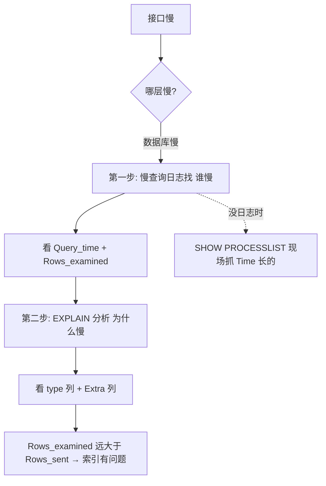

---

title: "慢查询优化"

created: "2025-07-12"

tags:

  - 八股文

  - mysql

---

# 慢查询优化

## 第二章：慢查询——怎么找出拖后腿的 SQL


> 你说"我的接口很慢"。可能的原因：网络慢、Python 代码慢、数据库慢。

> 本章只讲怎么定位"数据库慢"——以及定位后怎么读体检报告。


### 2.1 先开慢查询日志


```sql

-- 查看慢查询日志是否开启（MySQL 默认关着的！）

SHOW VARIABLES LIKE 'slow_query_log%';


-- 开启慢查询日志（临时生效，重启 MySQL 失效）

SET GLOBAL slow_query_log = ON;


-- 设慢查询阈值——超过 1 秒的 SQL 都记下来

SET GLOBAL long_query_time = 1;


-- 查看慢查询日志文件位置

SHOW VARIABLES LIKE 'slow_query_log_file';

```


```text

永久生效要改 MySQL 配置文件（my.cnf / my.ini）：


  [mysqld]

  slow_query_log = 1

  long_query_time = 1

  slow_query_log_file = /var/log/mysql/slow.log

  log_queries_not_using_indexes = 1    ← 没走索引的 SQL 也记下来（哪怕很快）

```


> ⚠️ `long_query_time` 设多少？建议项目初期设 1 秒，上线跑几天改 0.5 秒，稳定后改 0.1 秒——越到后面越严格。被问"你们慢查询阈值是多少"，答"根据业务阶段调整"比答死一个数加分。


### 2.2 慢查询日志长什么样


```text

# Query_time: 12.345678  Lock_time: 0.000123  Rows_sent: 10  Rows_examined: 500000


SELECT * FROM orders WHERE user_id = 42 ORDER BY created_at DESC;


逐行翻译：

  Time            → 这条 SQL 什么时候执行的

  User@Host       → 谁、从哪台机器发的

  Query_time      → 🔴 执行花了 12.3 秒（这是你看慢查询日志最关心的）

  Lock_time       → 等锁等了多久（0.0001 秒，几乎没等——说明慢不是锁的事）

  Rows_sent       → 最终返回了 10 行

  Rows_examined   → 🔴 为了找到这 10 行，扫描了 50 万行！

                     这就是慢的根源——扫了 50 万行才吐出 10 行。

                     说明索引有问题。

```


> 🔴 **一句话讲清**："定位慢查询两层——第一层用慢查询日志找'谁慢'，第二层用 EXPLAIN 分析'为什么慢'。慢查询日志看 Query_time 和 Rows_examined，Rows_examined 远大于 Rows_sent 就是索引有问题。EXPLAIN 看 type 列和 Extra 列。"


### 2.3 没有慢查询日志时怎么现场抓慢 SQL


```sql

-- 实时看当前正在跑的所有查询（谁在跑、跑了多久、状态是什么）

SHOW FULL PROCESSLIST;


-- 输出例：

-- | Id | User | Host            | db   | Command | Time | State        | Info                    |

-- | 15 | root | localhost:54321 | shop | Query   | 23   | Sending data | SELECT * FROM orders... |


-- Time = 23 秒 → 这条 SQL 已经跑了 23 秒，还没跑完

-- State = Sending data → 正在扫表、传数据

-- 它就是当前的"慢查询嫌疑人"

```


```text

SHOW PROCESSLIST 状态列速查：


  状态             什么意思                                   该紧张吗？

  ─────────────────────────────────────────────────────────────────

  Sending data     正在读数据/发数据——最常见                   看 Time 多久

  Sorting result   正在排序——ORDER BY 没走索引                  该！

  Creating tmp table  正在建临时表——GROUP BY 没走索引            该！

  Locked           在等锁释放——别人占着数据不放手                 该！

  Sleep            连接闲着，啥也没干                          不该，但太多说明没关连接

  Statistics       正在决定用哪个索引                          不该，偶尔出现正常

```


---


## 一图流（Mermaid）





## 速记卡（面试闪卡）


**Q1：一句话讲清「慢查询优化」到底是什么？**

A：慢查询优化两步走：先用慢查询日志找出"谁慢"，再用 EXPLAIN 分析"为什么慢"。


**Q2：一、开慢查询日志找"谁慢" —— 怎么理解？ —— 怎么理解？**

A：像给数据库装体检仪：slow_query_log 打开、long_query_time 设阈值（初期 1s、上线 0.5s、稳定 0.1s），超过就记下来；log_queries_not_using_indexes 还能把没走索引的慢 SQL 也抓出来。英文：slow query log / long_query_time。


**Q3：二、读日志看两个关键指标 —— 怎么理解？ —— 怎么理解？**

A：像看化验单盯两项：Query_time 是执行花了多久（最关心的）；Rows_examined 是为找结果扫了多少行。若 Rows_examined 远大于 Rows_sent（扫 50 万才吐 10 行），根因就是索引有问题。英文：Rows_examined / Rows_sent。


**Q4：三、没日志怎么现场抓 —— 怎么理解？ —— 怎么理解？**

A：像急诊先量生命体征：SHOW FULL PROCESSLIST 看当前在跑的查询，Time 长的、State 是 Sending data / Sorting result / Creating tmp table / Locked 的就是"慢查询嫌疑人"。英文：processlist / Sending data。


**Q5：四、EXPLAIN 分析"为什么慢" —— 怎么理解？ —— 怎么理解？**

A：像给 SQL 拍 X 光：EXPLAIN 看 type 列（从 ALL 全表扫到 const 最佳，越左越慢）和 Extra 列（Using filesort / Using temporary 都是告警）。结合慢日志定位后，针对性建索引或改写 SQL。英文：EXPLAIN / type / Extra。


**Q6：核心速记主线有哪些？**

- 两步走：慢查询日志找"谁慢"，EXPLAIN 分析"为什么慢"

- 开日志：slow_query_log + long_query_time 阈值随业务收紧

- 看指标：Query_time 耗时、Rows_examined≫Rows_sent 即索引问题

- 现场抓：SHOW PROCESSLIST 盯 Time 长、State 异常的查询

- 深分析：EXPLAIN 看 type 列与 Extra 列，定位全扫/临时表


**口诀**

A：慢查询分两步走，日志先抓谁在兜；

Query_time 看耗时，扫行远超发送愁；

无日志用 PROCESSLIST，长时异常是根由；

EXPLAIN 拍 X 光，type Extra 指因由。


## 相关链接


- 📋 目录：[[00-MySQL]]

- 📚 学习清单：[[八股文学习路线图]]

- 🔗 [[语言与框架/MySQL/八股/04-索引失效5大场景|索引失效5大场景]] — 慢查询的首要原因就是索引失效

- 🔗 [[语言与框架/MySQL/八股/26-EXPLAIN解读|EXPLAIN解读]] — 用EXPLAIN诊断慢查询

- 🔗 [[计算机基础/操作系统/13-IO模型四种|IO模型]] — 慢查询的本质是过多的磁盘IO


