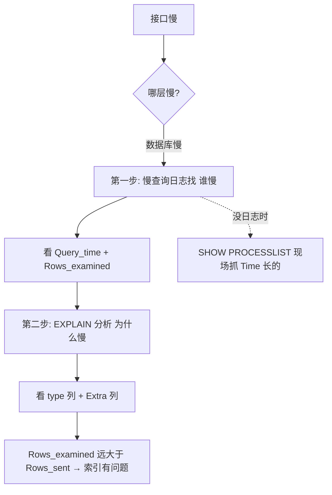

## 第二章：慢查询——怎么找出拖后腿的 SQL

> 你说"我的接口很慢"。可能的原因：网络慢、Python 代码慢、数据库慢。
> 本章只讲怎么定位"数据库慢"——以及定位后怎么读体检报告。

### 2.1 先开慢查询日志

```sql
-- 查看慢查询日志是否开启（MySQL 默认关着的！）
SHOW VARIABLES LIKE 'slow_query_log%';

-- 开启慢查询日志（临时生效，重启 MySQL 失效）
SET GLOBAL slow_query_log = ON;

-- 设慢查询阈值——超过 1 秒的 SQL 都记下来
SET GLOBAL long_query_time = 1;

-- 查看慢查询日志文件位置
SHOW VARIABLES LIKE 'slow_query_log_file';
```

```text
永久生效要改 MySQL 配置文件（my.cnf / my.ini）：

  [mysqld]
  slow_query_log = 1
  long_query_time = 1
  slow_query_log_file = /var/log/mysql/slow.log
  log_queries_not_using_indexes = 1    ← 没走索引的 SQL 也记下来（哪怕很快）
```

> ⚠️ `long_query_time` 设多少？建议项目初期设 1 秒，上线跑几天改 0.5 秒，稳定后改 0.1 秒——越到后面越严格。被问"你们慢查询阈值是多少"，答"根据业务阶段调整"比答死一个数加分。

### 2.2 慢查询日志长什么样

```text
# Time: 2026-07-02 14:23:18
# User@Host: root[root] @ [192.168.1.100]
# Query_time: 12.345678  Lock_time: 0.000123  Rows_sent: 10  Rows_examined: 500000

SELECT * FROM orders WHERE user_id = 42 ORDER BY created_at DESC;

逐行翻译：
  Time            → 这条 SQL 什么时候执行的
  User@Host       → 谁、从哪台机器发的
  Query_time      → 🔴 执行花了 12.3 秒（这是你看慢查询日志最关心的）
  Lock_time       → 等锁等了多久（0.0001 秒，几乎没等——说明慢不是锁的事）
  Rows_sent       → 最终返回了 10 行
  Rows_examined   → 🔴 为了找到这 10 行，扫描了 50 万行！
                     这就是慢的根源——扫了 50 万行才吐出 10 行。
                     说明索引有问题。
```

> 🔴 **一句话讲清**："定位慢查询两层——第一层用慢查询日志找'谁慢'，第二层用 EXPLAIN 分析'为什么慢'。慢查询日志看 Query_time 和 Rows_examined，Rows_examined 远大于 Rows_sent 就是索引有问题。EXPLAIN 看 type 列和 Extra 列。"

### 2.3 没有慢查询日志时怎么现场抓慢 SQL

```sql
-- 实时看当前正在跑的所有查询（谁在跑、跑了多久、状态是什么）
SHOW FULL PROCESSLIST;

-- 输出例：
-- | Id | User | Host            | db   | Command | Time | State        | Info                    |
-- | 15 | root | localhost:54321 | shop | Query   | 23   | Sending data | SELECT * FROM orders... |

-- Time = 23 秒 → 这条 SQL 已经跑了 23 秒，还没跑完
-- State = Sending data → 正在扫表、传数据
-- 它就是当前的"慢查询嫌疑人"
```

```text
SHOW PROCESSLIST 状态列速查：

  状态             什么意思                                   该紧张吗？
  ─────────────────────────────────────────────────────────────────
  Sending data     正在读数据/发数据——最常见                   看 Time 多久
  Sorting result   正在排序——ORDER BY 没走索引                  该！
  Creating tmp table  正在建临时表——GROUP BY 没走索引            该！
  Locked           在等锁释放——别人占着数据不放手                 该！
  Sleep            连接闲着，啥也没干                          不该，但太多说明没关连接
  Statistics       正在决定用哪个索引                          不该，偶尔出现正常
```

---


## 一图流（Mermaid）



## 速记卡（面试闪卡）

**Q1：怎么定位慢查询？**
A：两层——第一层用慢查询日志找"谁慢"（看 Query_time 和 Rows_examined）；第二层用 EXPLAIN 分析"为什么慢"（看 type + Extra）。Rows_examined 远大于 Rows_sent 说明索引有问题。

**Q2：慢查询阈值设多少？**
A：按业务阶段调：初期 1 秒，上线几天改 0.5 秒，稳定后改 0.1 秒。答"根据业务阶段调整"比答死数加分。

**Q3：没有慢查询日志怎么现场抓？**
A：SHOW FULL PROCESSLIST 看当前正在跑的查询，Time 长、State 是 Sending data / Sorting result / Creating tmp table / Locked 的是嫌疑人。

**Q4：慢查询日志看哪两个指标？**
A：Query_time（执行耗时）和 Rows_examined（扫描行数）。Rows_examined 远大于 Rows_sent 是慢的根源。

> 🔑 口诀：慢查询定位两步走——日志找谁慢，EXPLAIN 查为啥慢；Rows_examined 远大于 Rows_sent = 索引有问题。

---

## 相关链接

- 📋 目录：[[00-MySQL]]
- 📚 学习清单：[[八股文学习清单]]
- 🔗 [[语言与框架/MySQL/八股/04-索引失效5大场景|索引失效5大场景]] — 慢查询的首要原因就是索引失效
- 🔗 [[语言与框架/MySQL/八股/26-EXPLAIN解读|EXPLAIN解读]] — 用EXPLAIN诊断慢查询
- 🔗 [[计算机基础/操作系统/13-IO模型四种|IO模型]] — 慢查询的本质是过多的磁盘IO

