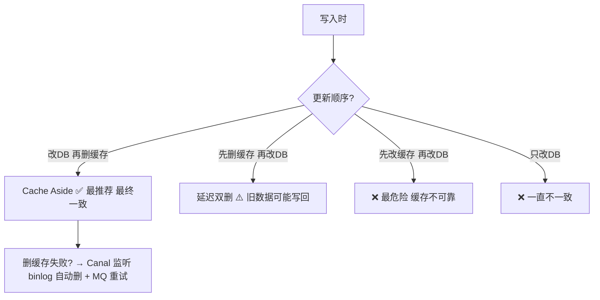

---

title: "缓存与数据库双写一致性"

created: "2025-07-12"

tags:

  - 八股文

  - mysql

---

# 缓存与数据库双写一致性

## 一句话总结

> **缓存和数据库里存的是同一份数据，写入时不能只改一个——改数据库不删缓存，下次读到旧数据；改缓存不改数据库，崩了数据丢。双写一致性问题就是：怎么保证两个地方的数据不打架？**

---

## 🌰 先理解为什么会有这个问题

你开了一家奶茶店。

> **数据库** = 柜台里的账本（最终的数据权威，不会丢）

> **缓存** = 墙上贴的"热销榜单"小黑板（读得快，但擦了就没了）

```text

用户："来一杯杨枝甘露！"

流程 1：先看小黑板（缓存）有没有价格？

  有 → 直接按小黑板的价格收款 → 快

  没有 → 翻账本（数据库）查价格 → 写到小黑板上 → 下次不用翻账本

流程 2：老板觉得太便宜了，涨价！

  问题来了——

  方案 A：只改账本 ✅ 下次查账本是对的

         但小黑板上还是旧价格 ❌ 用户看到旧价格吵起来了

  方案 B：只改小黑板 ✅ 用户看到新价格

         但账本没改 ❌ 晚上对账发现钱不对

  方案 C：账本和小黑板一起改

         但"先改哪个？"、"改到一半有人来问怎么办？"

```

**这就是"双写一致性"——一份数据在两个地方都有副本，怎么保证它们永远一样？**

---

## 几个名词先解释清楚

| 名词 | 大白话 | 为什么重要 |
| ------ | -------- | ----------- |
| **缓存** | 临时存数据的地方，读得快，但不可靠 | 内存里的，一重启就没了 |
| **数据库** | 永久存数据的地方，读得慢，但可靠 | 磁盘上的，重启也在 |
| **一致性** | 两个地方的数据对得上 | 用户看到的价格 = 实际的价格 |
| **最终一致性** | 过一会儿就一样了，但不是立刻 | 你改了账本，小黑板过 3 秒才更新 |
| **强一致性** | 改完立刻哪都一样 | 你改账本的同时小黑板也改了，改完那一刻谁查都是新价 |
| **过期** | 缓存里的数据太旧了，不该用了 | 小黑板写的是昨天的价格 |

---

## 四种更新策略（从最推荐到最不推荐）

---

### ✅ 策略 1：Cache Aside（旁路缓存）—— 最推荐

**这是最常用的方案，也是参考答案。**

#### 读的流程

```text

用户要看某个数据

  1. 先查缓存

  2. 缓存有（命中） → 直接返回 ← 快

  3. 缓存没有（未命中） → 去数据库查 → 把查到的结果写进缓存 → 返回

```

**就像：先看小黑板，有就直接用。没有就去翻账本，把结果抄到小黑板上，下次不用翻账本。**

#### 写的流程

```text

用户要改数据

第一步：更新数据库（把账本改了）

第二步：删除缓存（把小黑板上对应的那条擦掉）

下次有人读的时候：

  缓存没有 → 去数据库查最新的 → 写回缓存

  自然就拿到新数据了

```

**为什么是"删缓存"而不是"更新缓存"？**

> 这是 Cache Aside 最关键的设计。

假设你改了数据库，然后把缓存也更新了。但就在你更新缓存的这一瞬间，另一个请求也来读——它读到了你写到一半的缓存（可能只更新了一半字段）→ **脏数据**。

**删缓存就不会有这个问题。下次读的时候自然去数据库拿最新的，简单可靠。**

#### 直观感受

```redis

-- 用户改了价格：杨枝甘露 18 元 → 20 元

-- 第一步：改数据库

UPDATE drinks SET price = 20 WHERE name = '杨枝甘露';

-- 第二步：删缓存（不是更新缓存！）

DEL cache:drink:杨枝甘露

-- 接下来第一个用户来查：

-- 缓存没有 → 去数据库查到 20 元 → 写回缓存

-- 以后所有人都看到 20 元

```

**Cache Aside 保证的是"最终一致性"——改完数据库之后，下一次读的时候缓存自然就是新的了，不会一直错下去。**

---

### ⚠️ 策略 2：先删缓存，再更新数据库（有坑）

```text

第一步：删缓存（小黑板上的价格擦了）

第二步：更新数据库（账本改了）

看起来好像也行？但有个时间差漏洞：

时间线：

  1. A 删了缓存（黑板空了）

  2. 在 A 改数据库之前，B 来读了

  3. B 发现缓存没有 → 去数据库读（读到了旧价格 18 元）

  4. B 把旧价格写回缓存（小黑板上又写上了 18 元 ❌）

  5. A 才改数据库（20 元，但晚了，缓存里已经是旧的 18 元）

```

**这就是"老数据被写回缓存"的问题。比不改还糟糕。**

**怎么救？** 延迟双删：

```text

1. 删缓存

2. 更新数据库

3. 等一小会儿（比如 500ms）

4. 再删一次缓存

第 4 步把第 3 步可能写回去的旧数据又清掉了。

但"等多久"不好定，而且多了一次删除操作。

```

**知道这个方案有坑就行。实际不用它。**

---

### ❌ 策略 3：先更新缓存，再更新数据库（最危险）

```text

第一步：更新缓存

第二步：更新数据库

如果第一步成功、第二步失败：

  缓存是新价格 20 元，数据库还是 18 元

  → 缓存和数据库对不上了

  → 如果这时候缓存崩了重启：20 元丢了，再去数据库读变成 18 元

  → 用户花了 20 元买的东西，你账上只收到 18 元

如果第一步成功，还没做第二步的时候，另一个请求来了：

  读缓存 → 看到 20 元（新价格）

  但实际上数据库还没改 → 不一致

```

**绝对不用这个方案。因为缓存不可靠（可能随时丢），不能拿缓存当数据源。**

---

### 🚫 策略 4：只改数据库，不碰缓存（最原始）

```text

用户改了价格 → 只改数据库

缓存里还是旧价格

另一个用户来查 → 缓存有 → 直接返回旧价格

                        → 要等到缓存过期（比如 1 小时后）才能看到新价格

```

**问题：缓存不失效，用户可能一直看到旧数据。这叫"缓存与数据库不一致"的标准反面教材。**

---

## 策略对比总结

| 策略 | 一致性 | 实现难度 | 推荐度 |
| ------ | -------- | --------- | -------- |
| **Cache Aside（改DB→删缓存）** | 最终一致 ✅ | 🟢 低 | **🏆 最推荐** |
| 先删缓存→改DB（延迟双删） | 最终还是可能不一致 ❌ | 🟡 中 | ❌ 不推荐 |
| 先改缓存→改DB | 不一致风险大 ❌ | 🟡 中 | ❌ 不推荐 |
| 只改DB不改缓存 | 一直不一致 ❌ | 🟢 低 | ❌ 不推荐 |

---

## 剩下的隐患：删缓存失败怎么办？

Cache Aside 看起来完美，但有一个现实问题：

```text

改数据库 ✅ 成功

删缓存 ──→ ❌ 网络波动，Redis 没删掉

          └─ 缓存里还是旧数据

```

**删缓存这个操作可能失败。失败了怎么办？**

### 解决方案：订阅数据库的变更日志

```text

不用代码里主动删缓存，而是：

1. 更新数据库 → MySQL 写 binlog

2. 有一个"伪装成从库"的程序（比如 Canal）监听 binlog

3. 从 binlog 里解析出"哪条数据变了"

4. 自动去删对应的缓存

5. 如果删失败了 → 放消息队列重试，直到成功

```

**这样做的好处：**

- 不用在业务代码里到处写"删缓存"的代码

- 删缓存不会因为业务代码的异常而漏掉

- 删失败了可以重试

**代价：** 多了一套 Canal + MQ 的基础设施。小项目不需要，项目大了值得上。

---

## 那到底怎么做？
### 小项目（大部分情况）

```text

Cache Aside 就够了：

  写：更新 MySQL → 删 Redis

  读：查 Redis → 没有 → 查 MySQL → 写回 Redis → 返回

```

### 大项目（需要万无一失）

```text

升级成"监听 binlog"方案：

  应用只管写 MySQL

  Canal 监听 binlog 自动删缓存

  删失败了 MQ 重试

```

---

## 记忆口诀

> **Cache Aside 是标准：改完数据库删缓存，下次读的时候自然拿新的。**

> **删缓存不是更新缓存——更新缓存可能写到一半被人读到脏数据。**

> **删缓存可能失败——小项目不管它（过期时间兜底），大项目上 Canal 监听 binlog。**

> **先删缓存再改库有坑——旧数据可能被写回去，别用这个。**

## 一图流（Mermaid）



## 速记卡（面试闪卡）

**Q1：一句话讲清「缓存与数据库双写一致性」到底是什么？**

A：缓存与数据库两边同时写如何保持一致。

**Q2：为什么有这问题：账本与小黑板 —— 怎么理解？**

A：像奶茶店：数据库是柜台账本（权威、慢但丢不了），缓存是墙上小黑板（快但擦了就没）。只改账本→小黑板旧价惹客吵；只改小黑板→晚上对账钱不对。两份副本怎么永远一样？本质是 Cache（缓存）与 Database（数据库）双写一致性。

**Q3：Cache Aside：改库后删缓存最推荐 —— 怎么理解？**

A：像改价后擦掉小黑板、下次自然翻账本抄新的：写时先更新 MySQL 再 DEL 缓存，读时查 Redis 没有才回源。本质是 Cache Aside（旁路缓存）模式，保证最终一致；千万别「更新缓存」，会读到写一半的脏数据。

**Q4：删缓存失败？Canal 监听 binlog —— 怎么理解？**

A：像擦黑板手抖没擦掉：改库成功但 Redis 没删，旧数据残留。大项目让 Canal 伪装成从库监听 Binlog（二进制日志），数据一变自动删缓存，失败就丢进 Message Queue（消息队列）重试，直到擦干净。

**Q5：强一致做不到？缓存本质会丢 —— 怎么理解？**

A：像让临时工当账房先生：Redis 在内存里、重启就丢，不能当数据源。双写一般是最终一致（Eventual Consistency）；要强一致得加分布式锁牺牲性能，通常不值。小项目 Cache Aside + 过期时间兜底就够。

**Q6：核心速记主线有哪些？**

- 最推荐 Cache Aside 改库删缓存

- 删缓存别更新缓存防脏读

- 删失败大项目上 Canal+MQ

- 双写一般只保最终一致

**口诀**

A：双写一致 Cache Aside，改库删缓存最帅

更新缓存会脏读，不如删了下次来

删失败上 Canal 听 binlog，MQ 重试不白赖

强一致太贵用不着，最终一致就够快

## 相关链接

- 📋 目录：[[00-MySQL]]

- 📚 学习清单：[[八股文学习路线图]]

- 🔗 [[语言与框架/Redis/八股/03-缓存穿透|Redis缓存三大问题]] — 缓存穿透/击穿/雪崩是双写一致性的常见并发症

- 🔗 [[计算机基础/分布式-系统设计/08-限流与熔断降级|限流与熔断降级]] — 高并发场景下缓存与数据库的协调策略

- 🔗 [[语言与框架/Redis/八股/10-RDB与AOF与混合持久化|Redis持久化]] — Redis故障恢复后数据一致性问题

