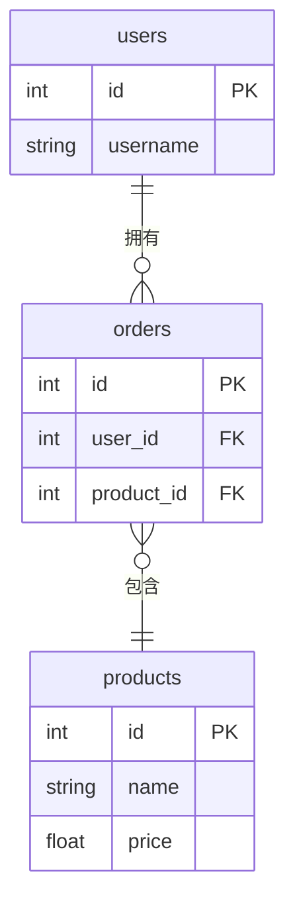
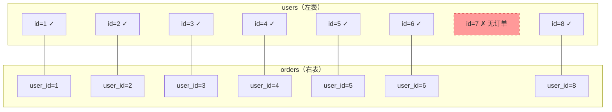
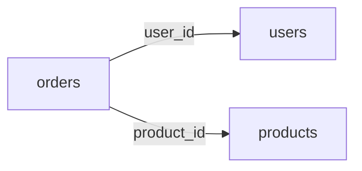
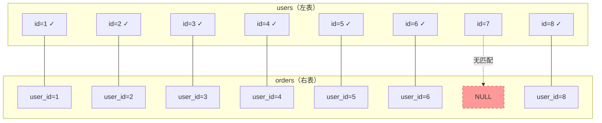
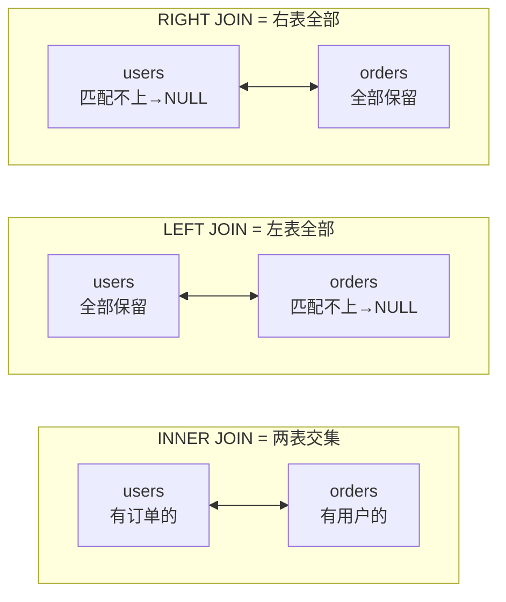

---

title: "子查询与多表连接JOIN"

created: "2025-07-12"

tags:

  - 技术学习

  - mysql

  - join

  - 子查询

---

# 子查询与多表连接JOIN

> 第三天我们学会了单表 CRUD，但现实中的数据从来不是孤立的——用户的订单散落在另一张表里，商品详情又在第三张表里。今天学的就是"把多张表连起来查"。

---

## 一、为什么需要多表查询？
### 1.1 把所有数据塞一张表会怎样？

假设你坚持用一张表存所有数据：

| id | username | email | order_1 | order_2 | order_3 |

|----|----------|-------|---------|---------|---------|

| 1 | zhangsan | zhang@qq.com | 键盘 | 鼠标 | 显示器 |

| 2 | lisi | li@qq.com | 鼠标垫 | NULL | NULL |

问题立刻暴露：

- **列会无限膨胀**——zhangsan 买了 50 件商品，难道建 50 列？

- **大量 NULL 浪费空间**——lisi 只买了 1 件，剩下 49 列全是 NULL

- **改一个用户名要改 N 行**——zhangsan 改名，所有订单行都要更新

- **数据不一致**——同一个人在不同行里可能被写成 "zhangsan" 和 "张 三"

**这就是"冗余"——同样的数据存了多份，改一处漏一处，数据就脏了。**

### 1.2 正确做法：拆表 + 关联



- **users** 只管用户信息

- **orders** 只管订单，用 `user_id` 指向用户

- **products** 只管商品信息

**改用户名只改 users 表一行，历史订单自动跟着变——因为它们存的是 id，不是名字。**

### 1.3 通俗类比：JOIN = 临时拼图

> 数据就像拆开的拼图碎片，分别装在 users、orders、products 三个盒子里。

> **JOIN 就是"把这三盒碎片按编号拼成一张完整的图"**——拼完给你看，看完拆掉，三盒碎片本身不变。

---

## 二、内连接（INNER JOIN）
### 2.1 为什么需要 JOIN？

需求："列出所有订单，显示用户名 + 商品 + 金额。"

订单表里有 `user_id`，用户表里有 `username`——你需要把两张表"拼"在一起。

**这就是 JOIN：通过关联字段把多张表的行连成一行。**

### 2.2 INNER JOIN = 取交集

```sql

SELECT 表1.列, 表2.列

FROM 表1

INNER JOIN 表2 ON 表1.关联字段 = 表2.关联字段;

```

**集合视角：**



**INNER JOIN 结果：只保留两表都有匹配的行，id=7 的 wujiu 被排除。**

### 2.3 第一个 JOIN 查询

```sql

SELECT

    orders.id,

    users.username,

    orders.product,

    orders.total

FROM orders

INNER JOIN users ON orders.user_id = users.id;

```

**输出：**

```text

+----+----------+--------------+---------+

| id | username | product      | total   |

+----+----------+--------------+---------+

|  1 | zhangsan | 机械键盘     |  299.00 |

|  2 | zhangsan | 鼠标         |  298.00 |

|  3 | zhangsan | 显示器       | 1999.00 |

|  4 | lisi     | 鼠标垫       |  145.00 |

|  5 | wangwu   | 机械键盘     |  259.00 |

|  6 | wangwu   | 数据线       |   59.70 |

|  7 | wangwu   | 显示器       | 2499.00 |

|  8 | zhaoliu  | 鼠标         |  149.00 |

|  9 | sunqi    | 机械键盘     |  598.00 |

| 10 | sunqi    | 鼠标垫       |  105.00 |

| 11 | sunqi    | 显示器       | 1999.00 |

| 12 | zhouba   | 数据线       |   19.90 |

| 13 | zhengshi | 机械键盘     |  299.00 |

+----+----------+--------------+---------+

```

> [!NOTE]

> **id=7 的 wujiu 没有出现在结果里——因为他没有订单。INNER JOIN 只要"两边都有的"。**

### 2.4 表别名——省事又清晰

```sql

SELECT

    o.id,

    u.username,

    o.product,

    o.total

FROM orders AS o

INNER JOIN users AS u ON o.user_id = u.id;

-- AS 可以省略：FROM orders o

```

### 2.5 多表 JOIN

```sql

-- 订单 + 用户名 + 商品详情（三表连接）

SELECT

    o.id,

    u.username,

    p.name      AS product_name,

    p.price     AS unit_price,

    o.quantity,

    o.total

FROM orders o

INNER JOIN users u    ON o.user_id = u.id

INNER JOIN products p ON o.product_id = p.id;

```

**多表 JOIN 就是一条链子：A JOIN B ON 条件1 JOIN C ON 条件2 ...**



> **INNER JOIN 只返回两表中 ON 条件匹配的行。匹配不上的行——两边都不要。**

---

## 三、左连接（LEFT JOIN）
### 3.1 为什么 INNER JOIN 不够？

需求："列出所有用户和他们的订单情况。没有订单的用户也要显示出来。"

如果用 INNER JOIN，wujiu（id=7，0 笔订单）就会消失。

**LEFT JOIN：保留左表的所有行，右表匹配不上的填 NULL。**

### 3.2 基本语法

```sql

SELECT

    u.id,

    u.username,

    o.id        AS order_id,

    o.product,

    o.total

FROM users u

LEFT JOIN orders o ON u.id = o.user_id

ORDER BY u.id, o.id;

```

**输出：**

```text

+----+----------+----------+--------------+---------+

| id | username | order_id | product      | total   |

+----+----------+----------+--------------+---------+

|  1 | zhangsan |        1 | 机械键盘     |  299.00 |

|  1 | zhangsan |        2 | 鼠标         |  298.00 |

|  1 | zhangsan |        3 | 显示器       | 1999.00 |

|  2 | lisi     |        4 | 鼠标垫       |  145.00 |

|  3 | wangwu   |        5 | 机械键盘     |  259.00 |

|  3 | wangwu   |        6 | 数据线       |   59.70 |

|  3 | wangwu   |        7 | 显示器       | 2499.00 |

|  4 | zhaoliu  |        8 | 鼠标         |  149.00 |

|  5 | sunqi    |        9 | 机械键盘     |  598.00 |

|  5 | sunqi    |       10 | 鼠标垫       |  105.00 |

|  5 | sunqi    |       11 | 显示器       | 1999.00 |

|  6 | zhouba   |       12 | 数据线       |   19.90 |

|  7 | wujiu    |     NULL | NULL         |    NULL |  ← 没有订单，但保留下来

|  8 | zhengshi |       13 | 机械键盘     |  299.00 |

+----+----------+----------+--------------+---------+

```

> **wujiu（id=7）没有订单，order_id、product、total 全是 NULL，但他没有被丢掉。**

### 3.3 集合视角



**LEFT JOIN 结果：左表全部保留，右表匹配不上的填 NULL。**

### 3.4 找出没有订单的用户

```sql

-- 注册了但从没下过单的用户

SELECT u.id, u.username, u.email

FROM users u

LEFT JOIN orders o ON u.id = o.user_id

WHERE o.id IS NULL;

```

**输出：**

```text

+----+----------+-----------------+

| id | username | email           |

+----+----------+-----------------+

|  7 | wujiu    | wujiu@qq.com    |

+----+----------+-----------------+

```

> [!TIP]

> **套路：LEFT JOIN + WHERE 右表主键 IS NULL → 找出左表有但右表没有的。** 这是最常用的分析模式之一。

### 3.5 LEFT JOIN 与 GROUP BY 配合

```sql

-- 每个用户的订单数和消费总额（包括没有订单的）

SELECT

    u.id,

    u.username,

    COUNT(o.id)   AS order_count,    -- COUNT 不统计 NULL

    COALESCE(SUM(o.total), 0) AS total_spent  -- SUM 遇到 NULL 返回 NULL，用 COALESCE 转 0

FROM users u

LEFT JOIN orders o ON u.id = o.user_id

GROUP BY u.id, u.username

ORDER BY total_spent DESC;

```

**输出：**

```text

+----+----------+-------------+-------------+

| id | username | order_count | total_spent |

+----+----------+-------------+-------------+

|  3 | wangwu   |           3 |     2817.70 |

|  5 | sunqi    |           3 |     2702.00 |

|  1 | zhangsan |           3 |     2596.00 |

|  8 | zhengshi |           1 |      299.00 |

|  4 | zhaoliu  |           1 |      149.00 |

|  2 | lisi     |           1 |      145.00 |

|  6 | zhouba   |           1 |       19.90 |

|  7 | wujiu    |           0 |        0.00 |  ← 0 笔订单，总消费 0

+----+----------+-------------+-------------+

```

> [!WARNING] COUNT(o.id) vs COUNT(*)

> LEFT JOIN 时，`COUNT(*)` 会把 NULL 行也算进去（wujiu 会是 1），必须用 `COUNT(o.id)`——右表主键为 NULL 的不计数。

---

## 四、右连接（RIGHT JOIN）
### 4.1 和 LEFT JOIN 一样，只是方向反了

```sql

-- 这两条查询结果完全相同

SELECT * FROM users u LEFT JOIN orders o ON u.id = o.user_id;

SELECT * FROM orders o RIGHT JOIN users u ON o.user_id = u.id;

```

> **RIGHT JOIN = 保留右表所有行，左表匹配不上的填 NULL。**

### 4.2 为什么 RIGHT JOIN 很少用？

1. **LEFT JOIN 就能覆盖所有场景**——把表顺序换一下就等价

2. **可读性差**——人们习惯"主表在左，附属表在右"

3. **多表 JOIN 时从左往右读很自然**：A LEFT JOIN B LEFT JOIN C

```sql

-- ❌ 可读性差

SELECT * FROM orders o

RIGHT JOIN users u ON o.user_id = u.id

RIGHT JOIN products p ON o.product_id = p.id;

-- ✅ 统一用 LEFT JOIN，从左往右读

SELECT * FROM users u

LEFT JOIN orders o   ON u.id = o.user_id

LEFT JOIN products p ON o.product_id = p.id;

```

> **结论：学会 RIGHT JOIN 的语法看懂别人代码即可，自己写统一用 LEFT JOIN。**

---

## 五、JOIN 对比总结
### 5.1 三种 JOIN 一图看懂



### 5.2 选型速查

| 需求 | 用什么 | 理由 |

|------|--------|------|

| 只要两边都有的数据 | **INNER JOIN** | 匹配不上的全扔掉 |

| 左表全部保留，右表有就带上 | **LEFT JOIN** | 左表是主表 |

| 右表全部保留，左表有就带上 | **RIGHT JOIN** | 等价于换顺序的 LEFT JOIN |

| 找出"有 A 没 B"的 | **LEFT JOIN + WHERE B.id IS NULL** | 保留 A，筛掉匹配上的 |

| 找出"AB 都有的" | **INNER JOIN** | 最简单 |

### 5.3 JOIN 常见错误

```sql

-- ❌ 错误 1：忘了 ON 条件

SELECT * FROM users INNER JOIN orders;

-- 不会报错，但会返回笛卡尔积（每行 user 配每行 order），数据爆炸

-- ❌ 错误 2：多表 JOIN 时 ON 条件写错表

SELECT * FROM users u

INNER JOIN orders o ON u.id = o.user_id

INNER JOIN products p ON u.id = p.id;  -- ← 应该是 o.product_id = p.id

-- ❌ 错误 3：LEFT JOIN 后用 WHERE 筛右表字段（把 NULL 也筛掉了）

SELECT u.*, o.total

FROM users u

LEFT JOIN orders o ON u.id = o.user_id

WHERE o.total > 100;  -- ← o.total 为 NULL 时条件不成立，LEFT JOIN 白写了

-- 应该把条件移到 ON 里：LEFT JOIN orders o ON u.id = o.user_id AND o.total > 100

```

---

## 六、子查询
### 6.1 什么是子查询？

**子查询就是 SELECT 里面套 SELECT。** 内层查询的结果作为外层查询的输入。

三种常见位置：

| 位置 | 形式 | 什么时候用 |

|------|------|-----------|

| WHERE 后面 | `WHERE 列 IN (SELECT ...)` | 用另一张表的数据做筛选条件 |

| FROM 后面 | `FROM (SELECT ...) AS 别名` | 把查询结果当临时表再查 |

| SELECT 后面 | `SELECT (SELECT ...) AS 别名` | 每行附带一个计算值 |

### 6.2 WHERE 子查询

```sql

-- 需求：查询"下过订单的用户"的信息

-- 不用子查询（两步）：

-- ① 先查出有订单的 user_id：SELECT DISTINCT user_id FROM orders;

-- ② 再人工把 id 填进去：SELECT * FROM users WHERE id IN (1,2,3,4,5,6,8);

-- 用子查询（一步）：

SELECT * FROM users

WHERE id IN (

    SELECT DISTINCT user_id FROM orders

);

```

**分步理解：**


```sql

-- 需求：查出"比平均消费金额高的订单"

SELECT * FROM orders

WHERE total > (

    SELECT AVG(total) FROM orders

);

-- 内层算出平均 ≈ 626.26，外层筛出比这个大的订单

```

### 6.3 FROM 子查询（派生表）

```sql

-- 需求：查出"消费总额超过 500 的用户"的用户名

SELECT u.username, stats.total_spent

FROM (

    SELECT user_id, SUM(total) AS total_spent

    FROM orders

    GROUP BY user_id

    HAVING SUM(total) > 500

) AS stats

INNER JOIN users u ON stats.user_id = u.id

ORDER BY stats.total_spent DESC;

```

**输出：**

```text

+----------+-------------+

| username | total_spent |

+----------+-------------+

| wangwu   |     2817.70 |

| sunqi    |     2702.00 |

| zhangsan |     2596.00 |

+----------+-------------+

```

> **FROM 子查询就是"先把中间结果算出来存成临时表，再对这个临时表继续查"。**

### 6.4 SELECT 子查询（标量子查询）

```sql

-- 需求：列出用户，同时显示"该用户的订单数"

SELECT

    id,

    username,

    (

        SELECT COUNT(*)

        FROM orders

        WHERE orders.user_id = users.id

    ) AS order_count

FROM users

ORDER BY order_count DESC;

```

**输出：**

```text

+----+----------+-------------+

| id | username | order_count |

+----+----------+-------------+

|  1 | zhangsan |           3 |

|  3 | wangwu   |           3 |

|  5 | sunqi    |           3 |

|  2 | lisi     |           1 |

|  4 | zhaoliu  |           1 |

|  6 | zhouba   |           1 |

|  8 | zhengshi |           1 |

|  7 | wujiu    |           0 |

+----+----------+-------------+

```

> [!CAUTION]

> **SELECT 子查询每返回一行，内层就执行一次。** 性能较差，数据量大时不推荐。用 LEFT JOIN + GROUP BY 通常更快。

### 6.5 子查询 vs JOIN —— 什么时候用哪个？

| 场景 | 推荐 | 原因 |

|------|------|------|

| 查询结果要显示多表的列 | **JOIN** | 子查询 FROM 里也可以，但 JOIN 更直观 |

| 只做筛选，不需要显示另一张表的列 | **子查询 WHERE IN** | `WHERE id IN (SELECT ...)` 最清晰 |

| 比较一个值和聚合结果 | **子查询** | `WHERE total > (SELECT AVG(...))` |

| 大表关联并返回大量行 | **JOIN** | 数据库对 JOIN 有索引优化，子查询可能更慢 |

| NOT IN / NOT EXISTS | **子查询** | `WHERE id NOT IN (SELECT ...)` 语义明确 |

### 6.6 EXISTS 子查询

```sql

-- 需求：查出"至少有一笔订单"的用户

SELECT * FROM users u

WHERE EXISTS (

    SELECT 1 FROM orders o WHERE o.user_id = u.id

);

-- EXISTS 只关心"有没有"，不关心具体是什么值

-- SELECT 1 就是"随便返回个常量"，比 SELECT * 快

```

**EXISTS vs IN：**

- `IN`：内层查询先执行，把结果集算出来，外层再对比

- `EXISTS`：外层每查出一行，就把值代入内层执行一次——内层找到匹配就立刻返回 TRUE，不会继续扫描

- **大表用 EXISTS 通常更快**（内层能提前终止）

---

## 速查表

| 操作 | 语法 | 一句话解释 |

|------|------|-----------|

| **内连接** | `A INNER JOIN B ON A.x = B.x` | 只保留两表都有匹配的行 |

| **左连接** | `A LEFT JOIN B ON A.x = B.x` | 左表全保留，右表配不上填 NULL |

| **右连接** | `A RIGHT JOIN B ON A.x = B.x` | 右表全保留（等价于换顺序的 LEFT JOIN） |

| **多表连接** | `A JOIN B ON ... JOIN C ON ...` | 链式拼接，一张接一张 |

| **WHERE 子查询** | `WHERE 列 IN (SELECT ...)` | 用另一张表的数据当筛选条件 |

| **FROM 子查询** | `FROM (SELECT ...) AS 别名` | 把查询结果当临时表继续查 |

| **SELECT 子查询** | `SELECT (SELECT ...) AS 别名` | 每行附带一个计算结果 |

| **EXISTS** | `WHERE EXISTS (SELECT 1 ...)` | 检查是否存在匹配行 |

| **COALESCE** | `COALESCE(列, 默认值)` | 如果列是 NULL，返回默认值 |

---

##

> ▶ 对应原理：[[31-JOIN进阶|31-JOIN进阶]]

## 速记卡（面试闪卡）

**Q1：一句话讲清「子查询与多表连接JOIN」到底是什么？**

A：JOIN 按关联字段把多张表的行拼成一行，避免把所有数据塞一张表造成的冗余与不一致。

**Q2：一、为什么需要多表查询？ —— 怎么理解？**

A：像拆拼图分盒装：把所有数据塞一张表会列膨胀、大量 NULL、改一处漏一处（冗余）；正确做法是拆成 users、orders、products，用 id 关联，改用户名只改一行。

**Q3：二、内连接（INNER JOIN） —— 怎么理解？**

A：像取两盒的交集：INNER JOIN（内连接）只保留两表 ON 条件都匹配的行，没匹配的（如没订单的用户）直接排除，是最常用的关联方式。

**Q4：三、左连接（LEFT JOIN） —— 怎么理解？**

A：像以左盒为主全保留：LEFT JOIN（左连接）保留左表所有行，右表配不上的填 NULL，可用来"找有 A 没 B"（LEFT JOIN 加 WHERE 右表主键 IS NULL）。

**Q5：四、右连接（RIGHT JOIN） —— 怎么理解？**

A：像左右调个头：RIGHT JOIN（右连接）保留右表所有行，等价于把表顺序换一下后的 LEFT JOIN，可读性差，实际写代码统一用 LEFT JOIN 即可。

**Q6：核心速记主线有哪些？**

- 拆表加关联避免冗余；JOIN 按关联字段（如 orders.user_id = users.id）把多行拼成一行

- INNER JOIN 取两表交集，LEFT JOIN 保左表全、右表配不上填 NULL

- RIGHT JOIN 等价于换顺序的 LEFT JOIN，实战统一用 LEFT JOIN 更易读

- 子查询 WHERE IN 与 EXISTS 适合筛选；关联查优先 JOIN；漏写 ON 会出笛卡尔积

**口诀**

A：数据别塞一张表，冗余改漏一团糟

拆表存 id，JOIN 按编号拼图瞧

INNER 取交集，LEFT 保左不丢人

没 ON 笛卡尔炸，关联字段要建索引

相关链接

- 目录：[[00-MySQL]]

- 上一篇：[[03-条件查询与排序分页]]

- 下一篇：[[05-聚合函数与分组GROUP_BY]]

---

→ [[技术学习路线图#五、MySQL 实战]]

## 相关链接

- [[笔记/语言与框架/MySQL/实战/03-条件查询与排序分页|条件查询与排序分页]]

- [[笔记/语言与框架/MySQL/实战/01-数据库基础与安装|数据库基础与安装]]

- [[笔记/语言与框架/MySQL/实战/05-聚合函数与分组GROUP_BY|聚合函数与分组GROUP BY]]

- [[笔记/语言与框架/MySQL/实战/02-CRUD操作与数据类型|CRUD操作与数据类型]]

- [[笔记/语言与框架/MySQL/实战/06-SQLAlchemy与ORM实战|SQLAlchemy与ORM实战]]

