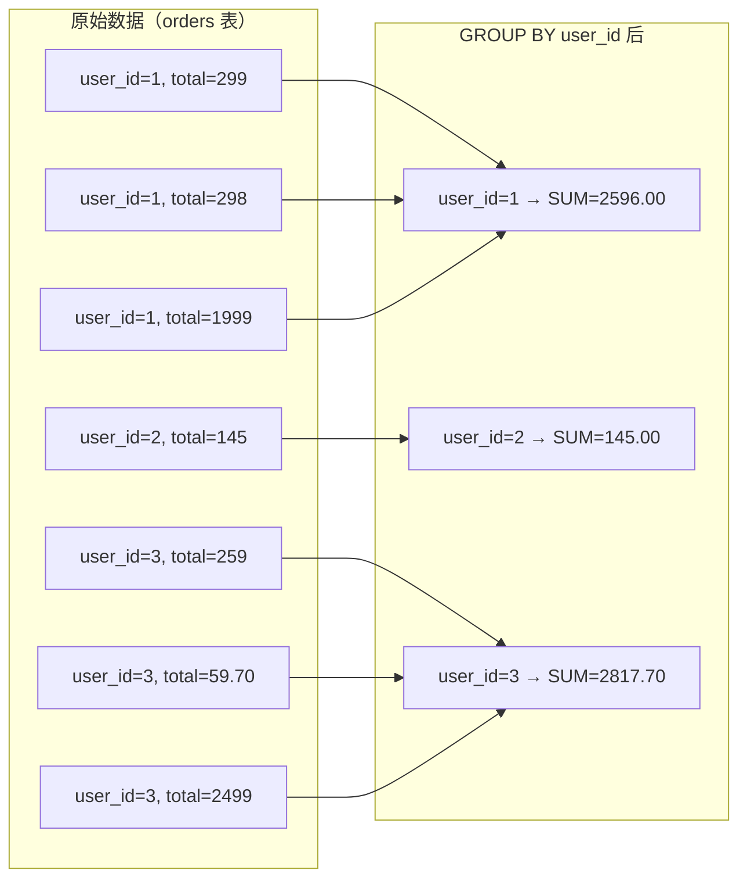

---

title: "聚合函数与分组GROUP BY"

created: "2025-07-12"

tags:

  - 技术学习

  - mysql

  - 聚合函数

  - 分组查询

---

# 聚合函数与分组GROUP BY

> 第三天我们学会了单表 CRUD，但现实中的需求往往不是"返回原始数据"，而是"算一下总数/平均值/最大值"。今天学的就是"怎么把数据分组后再算"。

---

## 一、分组聚合（GROUP BY）
### 1.1 为什么需要分组？

看这个需求："每个用户分别花了多少钱？"

你可以写：

```sql

-- 一个一个查，查 8 个用户就要写 8 条 SQL

SELECT SUM(total) FROM orders WHERE user_id = 1;

SELECT SUM(total) FROM orders WHERE user_id = 2;

-- ... 写到手断

```

**GROUP BY 就是"按某一列把数据分成几个组，然后对每组分别计算"。一句话搞定上面的事。**

### 1.2 基本语法

```sql

SELECT 分组列, 聚合函数(计算列)

FROM 表名

GROUP BY 分组列;

```

```sql

-- 每个用户的消费总额

SELECT user_id, SUM(total) AS total_spent

FROM orders

GROUP BY user_id;

```

**发生了什么？**



> **GROUP BY 把相同的 user_id 挤到一起，然后 SUM 对每组内的 total 求和。**

### 1.3 常用聚合函数

| 函数 | 作用 | 例子 |
|------|------|------|
| `COUNT(*)` | 统计行数 | 每个用户有多少笔订单 |
| `SUM(列)` | 求和 | 每个用户的总消费 |
| `AVG(列)` | 求平均值 | 每个用户的平均订单金额 |
| `MAX(列)` | 取最大值 | 每个用户最贵的一笔订单 |
| `MIN(列)` | 取最小值 | 每个用户最便宜的一笔订单 |

```sql

-- 全部一起上

SELECT

    user_id,

    COUNT(*)    AS order_count,     -- 订单数

    SUM(total)  AS total_spent,     -- 总消费

    AVG(total)  AS avg_order,       -- 平均每单金额

    MAX(total)  AS max_order,       -- 最贵一单

    MIN(total)  AS min_order        -- 最便宜一单

FROM orders

GROUP BY user_id;

```

**输出：**

```text

+---------+-------------+-------------+-----------+-----------+-----------+

| user_id | order_count | total_spent | avg_order | max_order | min_order |

+---------+-------------+-------------+-----------+-----------+-----------+

|       1 |           3 |     2596.00 |  865.3333 |   1999.00 |    298.00 |

|       2 |           1 |      145.00 |  145.0000 |    145.00 |    145.00 |

|       3 |           3 |     2817.70 |  939.2333 |   2499.00 |     59.70 |

|       4 |           1 |      149.00 |  149.0000 |    149.00 |    149.00 |

|       5 |           3 |     2702.00 |  900.6667 |   1999.00 |    105.00 |

|       6 |           1 |       19.90 |   19.9000 |     19.90 |     19.90 |

|       8 |           1 |      299.00 |  299.0000 |    299.00 |    299.00 |

+---------+-------------+-------------+-----------+-----------+-----------+

```

### 1.4 GROUP BY 的铁律

**SELECT 里的列，要么出现在 GROUP BY 中，要么被聚合函数包裹。否则报错或拿到随机值。**

```sql

-- ❌ 错误：product 既不在 GROUP BY 里，也没被聚合函数包裹

SELECT user_id, product, SUM(total)

FROM orders

GROUP BY user_id;

-- MySQL 可能不报错但 product 的值是随机的，毫无意义

-- ✅ 正确

SELECT user_id, SUM(total)

FROM orders

GROUP BY user_id;

```

> [!IMPORTANT]

> **原因：** 分组后，user_id=1 对应了 3 行（键盘、鼠标、显示器），聚合函数知道怎么处理这 3 行的 total（求和），但 product 这 3 行分别是不同的值——该显示哪个？数据库没法替你做决定。

### 1.5 多字段分组

```sql

-- 每个用户买了每种商品的总数量

SELECT user_id, product, SUM(quantity) AS total_qty

FROM orders

GROUP BY user_id, product

ORDER BY user_id, total_qty DESC;

```

**输出：**

```text

+---------+--------------+-----------+

| user_id | product      | total_qty |

+---------+--------------+-----------+

|       1 | 鼠标         |         2 |

|       1 | 机械键盘     |         1 |

|       1 | 显示器       |         1 |

|       2 | 鼠标垫       |         5 |

|       3 | 数据线       |         3 |

|       3 | 机械键盘     |         1 |

|       3 | 显示器       |         1 |

|       ...| ...          |       ... |

+---------+--------------+-----------+

```

> 多字段分组：先按 user_id 分，每组内再按 product 分。等价于"每个用户的每种商品"。

---

## 二、分组后筛选（HAVING）
### 2.1 为什么 WHERE 不够用？

```sql

-- 我想查"消费总额超过 500 的用户"

-- ❌ 不能用 WHERE：WHERE 执行时还没有 SUM(total) 这个计算结果

SELECT user_id, SUM(total) AS total_spent

FROM orders

WHERE SUM(total) > 500   -- 报错！WHERE 里不能用聚合函数

GROUP BY user_id;

```

**WHERE 是分组前筛行，HAVING 是分组后筛组。** 完整执行顺序：

```text

① FROM orders          —— 拿出订单表

② WHERE 条件           —— 筛掉不满足条件的行（此时还没有分组）

③ GROUP BY user_id     —— 分组

④ 聚合函数计算          —— SUM、COUNT、AVG...

⑤ HAVING 条件          —— 筛掉不满足条件的组（此时聚合结果已经有了）

⑥ SELECT               —— 挑出要显示的列

⑦ ORDER BY             —— 排序

⑧ LIMIT                —— 分页

```

### 2.2 HAVING 基本用法

```sql

-- 查询消费总额超过 500 的用户

SELECT user_id, SUM(total) AS total_spent

FROM orders

GROUP BY user_id

HAVING SUM(total) > 500;

```

**输出：**

```text

+---------+-------------+

| user_id | total_spent |

+---------+-------------+

|       1 |     2596.00 |

|       3 |     2817.70 |

|       5 |     2702.00 |

+---------+-------------+

```

### 2.3 WHERE 和 HAVING 同时用

```sql

-- 查询"张三买的商品中，每种商品买了超过 1 件的"

SELECT user_id, product, SUM(quantity) AS total_qty

FROM orders

WHERE user_id = 1              -- ① 先筛：只要张三的订单

GROUP BY user_id, product       -- ② 再分组

HAVING SUM(quantity) > 1;       -- ③ 再筛：只要数量 >1 的组

```

**输出：**

```text

+---------+---------+-----------+

| user_id | product | total_qty |

+---------+---------+-----------+

|       1 | 鼠标    |         2 |

+---------+---------+-----------+

```

### 2.4 HAVING vs WHERE 对比

| | WHERE | HAVING |
|---|---|---|
| **执行时机** | 分组前（筛行） | 分组后（筛组） |
| **能用聚合函数吗** | ❌ 不能 | ✅ 可以 |
| **能用列名吗** | ✅ 可以 | ✅ 可以（但只能是分组列） |
| **性能** | 快（先筛掉，分组数据量小） | 慢（分组完再筛，已经算完了） |
| **最佳实践** | 能放 WHERE 的就别放 HAVING | 只有涉及聚合函数才用 HAVING |

> [!IMPORTANT]

> **原则：行级筛选用 WHERE，聚合结果筛选用 HAVING。** 不要把所有条件都堆在 HAVING 里——先 WHERE 筛掉不相关的行，分组的数据量更小，查询更快。

---

## 速查表

| 操作 | 语法 | 一句话解释 |
|------|------|-----------|
| **分组** | `GROUP BY 列` | 按某列的值分成几个组 |
| **分组后筛选** | `HAVING 聚合条件` | 分组算完再筛（如总消费 > 500） |
| **COUNT** | `COUNT(*)` / `COUNT(列)` | 统计行数（列 NULL 的不算） |
| **SUM** | `SUM(列)` | 求和 |
| **AVG** | `AVG(列)` | 求平均 |
| **MAX/MIN** | `MAX(列)` / `MIN(列)` | 最大值 / 最小值 |
| **多字段分组** | `GROUP BY 列1, 列2` | 先按列1分，每组内再按列2分 |
| **去重计数** | `COUNT(DISTINCT 列)` | 统计不重复值的个数 |
| **COALESCE** | `COALESCE(列, 默认值)` | 如果列是 NULL，返回默认值 |
| **铁律** | SELECT 非聚合列必须出现在 GROUP BY | 否则数据随机 |

---

## 速记卡（面试闪卡）

**Q1：一句话讲清「聚合函数与分组GROUP BY」到底是什么？**

A：GROUP BY 按某列把数据分成几组，再对每组用 COUNT/SUM/AVG 等聚合函数算出一条汇总。

**Q2：一、分组聚合（GROUP BY） —— 怎么理解？**

A：GROUP BY 像按用户分拣订单：相同 user_id 的行挤成一叠，每叠用 SUM 算总花费，一个 SQL 顶 N 条（aggregation 聚合）。

**Q3：1.3 常用聚合函数 —— 怎么理解？**

A：五个聚合兄弟最常用：COUNT 数行、SUM 求和、AVG 平均、MAX 最大、MIN 最小，一次全上每组算一个数（aggregate function 聚合函数）。

**Q4：1.4 GROUP BY 的铁律 —— 怎么理解？**

A：铁律像"座位规则"：SELECT 里的列要么进 GROUP BY，要么被聚合函数包住，否则返回随机值（grouping column 分组列）。

**Q5：二、分组后筛选（HAVING） —— 怎么理解？**

A：HAVING 像分组后的门卫：WHERE 管行（分组前、不能用聚合）、HAVING 管组（分组后、能用 SUM）（HAVING clause 筛选子句）。

**Q6：核心速记主线有哪些？**

- GROUP BY 按列分组，同组行聚合出一条汇总

- 五函数：COUNT/SUM/AVG/MAX/MIN 每组算一个数

- 铁律：SELECT 非聚合列必须进 GROUP BY，否则随机值

- WHERE 管行、HAVING 管组；聚合结果筛选只能放 HAVING

**口诀**

A：GROUP BY 分组算，聚合五兄弟 COUNT SUM AVG MAX MIN；

SELECT 列两归宿：进分组或被聚合，否则随机值；

WHERE 管行 HAVING 管组，聚合结果 HAVING 滤；

一个 SQL 顶 N 条，汇总统计不发愁。

## 相关链接

- 目录：[[00-MySQL]]

- 上一篇：[[04-子查询与多表连接JOIN]]

- 下一篇：[[06-SQLAlchemy与ORM实战]]

---

→ [[技术学习路线图#五、MySQL 实战]]

