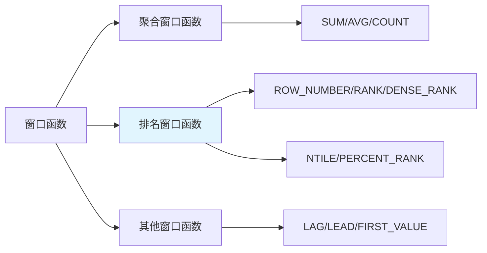

# 窗口函数实操：ROW_NUMBER / RANK / DENSE_RANK

> **一句话**：窗口函数是SQL中用于复杂计算的函数，可以在不减少行数的情况下进行聚合、排序、排名等操作。

## 1. 窗口函数基础

### 1.1 什么是窗口函数？



**窗口函数**：在满足特定条件的结果集范围内，对数据进行分组、排序、聚合等操作，同时保留原有行。

**与GROUP BY的区别**：
- GROUP BY：减少行数，每组一行
- 窗口函数：保留行数，在每行上计算

### 1.2 语法结构

```sql
函数名() OVER (
    [PARTITION BY 分组列]
    [ORDER BY 排序列 [ASC|DESC]]
    [窗口帧]
)
```

## 2. 排名窗口函数

### 2.1 ROW_NUMBER

```sql
-- 为每行分配唯一序号，无并列
SELECT 
    name,
    score,
    ROW_NUMBER() OVER (ORDER BY score DESC) AS rank_num
FROM students;
```

**特点**：
- 唯一序号，无并列
- 即使分数相同，序号也不同
- 适用于需要唯一标识的场景

### 2.2 RANK

```sql
-- 排名，有并列，跳过后续排名
SELECT 
    name,
    score,
    RANK() OVER (ORDER BY score DESC) AS rank_num
FROM students;
```

**特点**：
- 有并列排名
- 并列后跳过后续排名（如1,2,2,4）
- 适用于需要并列排名的场景

### 2.3 DENSE_RANK

```sql
-- 排名，有并列，不跳过后续排名
SELECT 
    name,
    score,
    DENSE_RANK() OVER (ORDER BY score DESC) AS rank_num
FROM students;
```

**特点**：
- 有并列排名
- 并列后不跳过后续排名（如1,2,2,3）
- 适用于需要连续排名的场景

### 2.4 三者对比

```sql
-- 示例数据
CREATE TABLE scores (
    id INT PRIMARY KEY,
    name VARCHAR(50),
    score INT
);

INSERT INTO scores VALUES
(1, 'Alice', 95),
(2, 'Bob', 90),
(3, 'Charlie', 90),
(4, 'David', 85);

-- 查询对比
SELECT 
    name,
    score,
    ROW_NUMBER() OVER (ORDER BY score DESC) AS row_num,
    RANK() OVER (ORDER BY score DESC) AS rank_num,
    DENSE_RANK() OVER (ORDER BY score DESC) AS dense_rank_num
FROM scores;
```

**结果**：

| name | score | row_num | rank_num | dense_rank_num |
|------|-------|---------|----------|----------------|
| Alice | 95 | 1 | 1 | 1 |
| Bob | 90 | 2 | 2 | 2 |
| Charlie | 90 | 3 | 2 | 2 |
| David | 85 | 4 | 4 | 3 |

## 3. 其他窗口函数

### 3.1 NTILE

```sql
-- 将数据分成N个桶
SELECT 
    name,
    score,
    NTILE(3) OVER (ORDER BY score DESC) AS bucket
FROM students;
```

**用途**：数据分桶、分组抽样

### 3.2 LAG / LEAD

```sql
-- 获取前一行/后一行的值
SELECT 
    date,
    sales,
    LAG(sales, 1) OVER (ORDER BY date) AS prev_sales,
    LEAD(sales, 1) OVER (ORDER BY date) AS next_sales
FROM daily_sales;
```

**用途**：计算环比、同比、时间序列分析

### 3.3 FIRST_VALUE / LAST_VALUE

```sql
-- 获取窗口内第一行/最后一行的值
SELECT 
    name,
    department,
    salary,
    FIRST_VALUE(salary) OVER (
        PARTITION BY department 
        ORDER BY salary DESC
    ) AS dept_max_salary
FROM employees;
```

**用途**：获取组内最大值、最小值

## 4. 窗口帧

### 4.1 什么是窗口帧？

```sql
-- 窗口帧定义
ROWS BETWEEN UNBOUNDED PRECEDING AND CURRENT ROW
RANGE BETWEEN INTERVAL 7 DAY PRECEDING AND CURRENT ROW
```

**窗口帧类型**：
- `ROWS`：物理行
- `RANGE`：逻辑范围

### 4.2 常见窗口帧

```sql
-- 累计求和
SUM(sales) OVER (
    ORDER BY date
    ROWS BETWEEN UNBOUNDED PRECEDING AND CURRENT ROW
) AS cumulative_sales

-- 滑动平均
AVG(sales) OVER (
    ORDER BY date
    ROWS BETWEEN 6 PRECEDING AND CURRENT ROW
) AS moving_avg_7d
```

## 6. 性能优化

### 6.1 索引优化

```sql
-- 窗口函数需要排序，确保排序列有索引
CREATE INDEX idx_department_salary ON employees(department, salary);
```

### 6.2 避免过度分区

```sql
-- 不要过度分区
SELECT 
    name,
    department,
    salary,
    ROW_NUMBER() OVER (ORDER BY salary DESC) AS global_rank  -- 全局排名
FROM employees;

-- 而不是
SELECT 
    name,
    department,
    salary,
    ROW_NUMBER() OVER (PARTITION BY department ORDER BY salary DESC) AS dept_rank  -- 每个部门单独排名
FROM employees;
```

## 7. 常见坑点

### 1. 窗口函数与GROUP BY顺序
```sql
-- 错误：窗口函数在GROUP BY之后执行
SELECT 
    department,
    AVG(salary),
    ROW_NUMBER() OVER (ORDER BY AVG(salary) DESC)  -- ❌ 不能直接使用聚合函数
FROM employees
GROUP BY department;

-- 正确：使用子查询
SELECT *
FROM (
    SELECT 
        department,
        AVG(salary) AS avg_salary,
        ROW_NUMBER() OVER (ORDER BY AVG(salary) DESC) AS rn
    FROM employees
    GROUP BY department
) t;
```

### 2. NULL值处理
```sql
-- NULL值会影响排序
SELECT 
    name,
    score,
    RANK() OVER (ORDER BY score DESC) AS rank_num
FROM students;
-- NULL值会排在最后

-- 解决：使用COALESCE或NULLS FIRST/LAST
SELECT 
    name,
    score,
    RANK() OVER (ORDER BY COALESCE(score, 0) DESC) AS rank_num
FROM students;
```

## 核心要点

```sql
-- 排名函数
ROW_NUMBER()  -- 唯一序号，无并列
RANK()        -- 有并列，跳过后续排名
DENSE_RANK()  -- 有并列，不跳过后续排名

-- 语法
函数名() OVER (
    PARTITION BY 分组列
    ORDER BY 排序列 [ASC|DESC]
    [ROWS/RANGE 窗口帧]
)

SELECT *
FROM (
    SELECT *, ROW_NUMBER() OVER (PARTITION BY 分组列 ORDER BY 排序列 DESC) AS rn
    FROM 表
) t
WHERE rn = 1;
```

## 速记卡（面试闪卡）

**Q1：一句话讲清「窗口函数实操：ROW_NUMBER / RANK / DENSE_RANK」到底是什么？**
A：**窗口函数**：在满足特定条件的结果集范围内，对数据进行分组、排序、聚合等操作，同时保留原有行。
**与GROUP BY的区别**：
GROUP BY：减少行数，每组一行
窗口函数：保留行数，在每行上计算

**Q2：1. 窗口函数基础 —— 怎么理解？**
A：**窗口函数**：在满足特定条件的结果集范围内，对数据进行分组、排序、聚合等操作，同时保留原有行。
**与GROUP BY的区别**：
GROUP BY：减少行数，每组一行
窗口函数：保留行数，在每行上计算

**Q3：2. 排名窗口函数 —— 怎么理解？**
A：**特点**：
唯一序号，无并列
即使分数相同，序号也不同
适用于需要唯一标识的场景
**特点**：
有并列排名
并列后跳过后续排名（如1,2,2,4）
适用于需要并列排名的场景
**特点**：
有并列排名
并列后不跳过后续排名（如1,2,2,3）
适用于需要连续排名的场景
**结果**：
| name | score | row_num | rank_num | dense_rank_num |

**Q4：3. 其他窗口函数 —— 怎么理解？**
A：**用途**：数据分桶、分组抽样
**用途**：计算环比、同比、时间序列分析
**用途**：获取组内最大值、最小值

**Q5：4. 窗口帧 —— 怎么理解？**
A：**窗口帧类型**：
：物理行
：逻辑范围

**Q6：核心速记主线有哪些？**
A：抓住这几根：1. 窗口函数基础、2. 排名窗口函数、3. 其他窗口函数、4. 窗口帧、6. 性能优化、7. 常见坑点。


## 相关链接

- 📋 目录：[[00-MySQL]]
- 📚 学习清单：[[技术学习清单#MySQL 实战]]
- 🔗 [[01-数据库基础与安装|数据库基础]]
- 🔗 [[04-子查询与多表连接JOIN|子查询与JOIN]]
- 🔗 [[05-聚合函数与分组GROUP_BY|聚合函数与分组]]
- 项目实践：[[项目实战/ai-resume笔记/01_技术研读/01_架构概览|ai-resume: 架构概览]]
