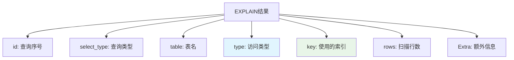

---

title: "EXPLAIN 执行计划分析：type / key / rows / Extra 解读 + 慢查询定位"

tags:

  - mysql

  - 技术学习

  - 学习笔记

created: "2026-07-21"

---

# EXPLAIN 执行计划分析：type / key / rows / Extra 解读 + 慢查询定位

> **一句话**：EXPLAIN 是 MySQL 中用于分析查询执行计划的命令，可以帮助我们理解查询是如何执行的，识别性能瓶颈，优化慢查询。

## 1. EXPLAIN 基础
### 1.1 使用方法

```sql

-- 基本语法

EXPLAIN SELECT * FROM users WHERE id = 1;

-- 查看JSON格式（更详细）

EXPLAIN FORMAT=JSON SELECT * FROM users WHERE id = 1;

-- 查看树形格式（MySQL 8.0+）

EXPLAIN FORMAT=TREE SELECT * FROM users WHERE id = 1;

```

### 1.2 执行计划解读顺序



## 2. 关键字段解读
### 2.1 type（访问类型）

**重要性**：⭐⭐⭐⭐⭐（最重要的字段之一）

| type值 | 说明 | 性能 | 示例 |

|--------|------|------|------|

| `system` | 表只有一行记录 | ⭐⭐⭐⭐⭐ | 系统表 |

| `const` | 通过主键或唯一索引查找 | ⭐⭐⭐⭐⭐ | `WHERE id = 1` |

| `eq_ref` | 关联查询中使用主键或唯一索引 | ⭐⭐⭐⭐ | `JOIN ON a.id = b.id` |

| `ref` | 使用非唯一索引查找 | ⭐⭐⭐ | `WHERE name = 'Alice'` |

| `range` | 索引范围扫描 | ⭐⭐⭐ | `WHERE id > 100` |

| `index` | 全索引扫描 | ⭐⭐ | `SELECT id FROM users` |

| `ALL` | 全表扫描 | ⭐ | `SELECT * FROM users` |

**优化目标**：至少达到 `ref` 级别，避免 `ALL`。

### 2.2 key（使用的索引）

```sql

-- 显示查询实际使用的索引

key: PRIMARY          -- 使用主键索引

key: idx_name         -- 使用普通索引

key: NULL             -- 未使用索引

```

**重要性**：⭐⭐⭐⭐

### 2.3 rows（扫描行数）

```sql

-- 预估需要扫描的行数

rows: 1000            -- 需要扫描1000行

rows: 1               -- 只需要扫描1行

```

**重要性**：⭐⭐⭐（越小越好）

### 2.4 Extra（额外信息）

**重要性**：⭐⭐⭐⭐

| Extra值 | 说明 | 性能 |

|---------|------|------|

| `Using index` | 覆盖索引，无需回表 | ⭐⭐⭐⭐⭐ |

| `Using where` | 在存储引擎层过滤后，还需在Server层过滤 | ⭐⭐⭐ |

| `Using temporary` | 使用临时表 | ⭐⭐ |

| `Using filesort` | 使用文件排序 | ⭐⭐ |

| `Select tables optimized away` | 优化器已优化 | ⭐⭐⭐⭐⭐ |

## 3. 常见执行计划分析
### 3.1 简单查询

```sql

EXPLAIN SELECT * FROM users WHERE id = 1;

```

**结果解读**：

- `type`: const（主键查找）

- `key`: PRIMARY（使用主键）

- `rows`: 1（只扫描1行）

- `Extra`: NULL（无额外信息）

### 3.2 范围查询

```sql

EXPLAIN SELECT * FROM users WHERE age > 25 AND age < 30;

```

**结果解读**：

- `type`: range（范围扫描）

- `key`: idx_age（使用age索引）

- `rows`: 100（预估扫描100行）

- `Extra`: Using where（需要额外过滤）

### 3.3 关联查询

```sql

EXPLAIN

SELECT u.name, o.order_date

FROM users u

INNER JOIN orders o ON u.id = o.user_id

WHERE u.age > 25;

```

**结果解读**：

- 两个表都有记录

- `type`: ref（使用索引关联）

- `key`: PRIMARY, idx_user_id（两个索引）

- `rows`: 100, 500（扫描行数）

- `Extra`: Using join buffer（使用连接缓冲）

## 4. 慢查询定位
### 4.1 开启慢查询日志

```sql

-- 查看慢查询配置

SHOW VARIABLES LIKE 'slow_query%';

SHOW VARIABLES LIKE 'long_query_time';

-- 开启慢查询日志

SET GLOBAL slow_query_log = 'ON';

SET GLOBAL long_query_time = 2;  -- 超过2秒记录

```

### 4.2 分析慢查询

```sql

-- 使用mysqldumpslow工具

mysqldumpslow -s t -t 10 /var/log/mysql/slow.log

-- 使用pt-query-digest工具

pt-query-digest /var/log/mysql/slow.log

```

### 4.3 优化慢查询

```sql

-- 1. 添加索引

ALTER TABLE users ADD INDEX idx_age (age);

-- 2. 重写查询

-- 原查询

SELECT * FROM users WHERE YEAR(create_time) = 2026;

-- 优化后

SELECT * FROM users WHERE create_time >= '2026-01-01' AND create_time < '2027-01-01';

-- 3. 分页优化

-- 原查询（慢）

SELECT * FROM users ORDER BY id LIMIT 100000, 10;

-- 优化后（快）

SELECT * FROM users WHERE id > 100000 ORDER BY id LIMIT 10;

```

## 5. 高级分析
### 5.1 JSON格式分析

```sql

EXPLAIN FORMAT=JSON SELECT * FROM users WHERE id = 1\G

```

**关键字段**：

- `query_block`：查询块

- `table`：表信息

- `access_type`：访问类型

- `possible_keys`：可能使用的索引

- `key`：实际使用的索引

- `rows`：扫描行数

- `filtered`：过滤百分比

### 5.2 树形格式分析（MySQL 8.0+）

```sql

EXPLAIN FORMAT=TREE SELECT * FROM users WHERE id = 1\G

```

**输出示例**：

```text

-> Index lookup on users using PRIMARY  (cost=0.35 rows=1)

```

## 7. 优化案例
### 案例1：全表扫描优化

```sql

-- 原查询（慢）

EXPLAIN SELECT * FROM users WHERE name = 'Alice';

-- type: ALL, rows: 100000

-- 优化后

ALTER TABLE users ADD INDEX idx_name (name);

EXPLAIN SELECT * FROM users WHERE name = 'Alice';

-- type: ref, rows: 1

```

### 案例2：文件排序优化

```sql

-- 原查询（慢）

EXPLAIN SELECT * FROM users ORDER BY name;

-- Extra: Using filesort

-- 优化后

ALTER TABLE users ADD INDEX idx_name (name);

EXPLAIN SELECT * FROM users ORDER BY name;

-- Extra: Using index

```

### 案例3：分页查询优化

```sql

-- 原查询（慢）

EXPLAIN SELECT * FROM users ORDER BY id LIMIT 100000, 10;

-- rows: 100010

-- 优化后

EXPLAIN SELECT * FROM users WHERE id > 100000 ORDER BY id LIMIT 10;

-- rows: 10

```

## 核心要点

```sql

-- 执行EXPLAIN

EXPLAIN SELECT * FROM users WHERE id = 1;

-- 关键字段

type: 访问类型（至少ref级别）

key: 使用的索引

rows: 扫描行数（越小越好）

Extra: 额外信息（避免Using filesort/temporary）

-- 慢查询优化

1. 添加索引

2. 重写查询

3. 分页优化

4. 避免SELECT *

```

##

> ▶ 对应原理：[[26-EXPLAIN解读|26-EXPLAIN解读]]

## 速记卡（面试闪卡）

**Q1：一句话讲清「EXPLAIN 执行计划分析：type / key / rows / Extra 解读 + 慢查询定位」到底是什么？**

A：EXPLAIN 是 MySQL 给你的查询"体检报告"：不真跑 SQL，只说优化器打算怎么执行、哪里会慢。

**Q2：四张成绩单怎么读 —— 怎么理解？**

A：像看体检单：type 是"运动能力等级"（const 满分级、ALL 全表扫最差），key 是"用了哪台仪器"（NULL 就是没用上索引），rows 是"估算要查多少人"（越小越好），Extra 是"医嘱备注"——Using index 是免回表的福报，Using filesort 是排序在拖后腿。

**Q3：怎么用它抓慢查询 —— 怎么理解？**

A：像查水管漏点：先 EXPLAIN 看 type 是不是 ALL（全表扫=漏水主因）、key 是不是 NULL（索引没生效）、rows 是不是大得离谱。再配合 slow query log（慢查询日志，记录超过阈值的 SQL）和 FORMAT=JSON 看执行细节，定位后要么加索引、要么改 SQL。

**Q4：覆盖索引与回表 —— 怎么理解？**

A：覆盖索引（Covering Index）= 你要的列全在索引里，护士直接把药递给你，不用再去药房跑一趟（回表）。回表 = 二级索引只记了主键，要拿别的列得拿主键去聚簇索引再查一次，多一次 IO。所以建联合索引尽量把要查的列包进去，Extra 里看到 Using index 就是建对了。

**Q5：type 梯度怎么记 —— 怎么理解？**

A：type 像电梯楼层：system/const（直达顶层，主键精确命中）> eq_ref（JOIN 用主键）> ref（普通索引）> range（范围扫）> index（扫全索引）> ALL（爬楼梯全表扫）。记住"能 const 不 ref，能 ref 不 ALL"，面试常问 const 和 ref 差在哪——前者唯一索引命中一行，后者普通索引可能多行。

**Q6：核心速记主线有哪些？**

- EXPLAIN 只分析计划、不真跑 SQL

- 四字段：type / key / rows / Extra

- type 梯度 const>ref>range>index>ALL

- 覆盖索引免回表（Using index），配慢查询日志定位

**口诀**

A：EXPLAIN 体检不真跑，四字段记牢 type key rows Extra

type 梯度 const 最美，ALL 全表最该逃

key 为 NULL 索引没用上，filesort 见 Extra 要优化

覆盖索引 Using index，免回表来速度快

相关链接

- 📋 目录：[[00-MySQL]]

- 📚 学习清单：[[技术学习路线图#MySQL 实战]]

- 🔗 [[01-数据库基础与安装|数据库基础]]

- 🔗 [[06-SQLAlchemy与ORM实战|SQLAlchemy ORM]]

- 🔗 [[07-窗口函数实操|窗口函数]]

## 相关链接

- [[笔记/语言与框架/MySQL/实战/07-窗口函数实操|窗口函数实操：ROW_NUMBER / RANK / DENSE_RANK]]

- [[笔记/语言与框架/MySQL/实战/09-事务实操|事务实操：begin / commit / rollback 代码 + 隔离级别设置 + 死锁排查]]

- [[笔记/语言与框架/MySQL/实战/03-条件查询与排序分页|条件查询与排序分页]]

- [[笔记/语言与框架/MySQL/实战/04-子查询与多表连接JOIN|子查询与多表连接JOIN]]

- [[笔记/语言与框架/MySQL/实战/02-CRUD操作与数据类型|CRUD操作与数据类型]]

