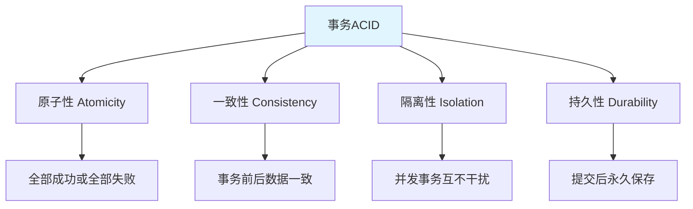
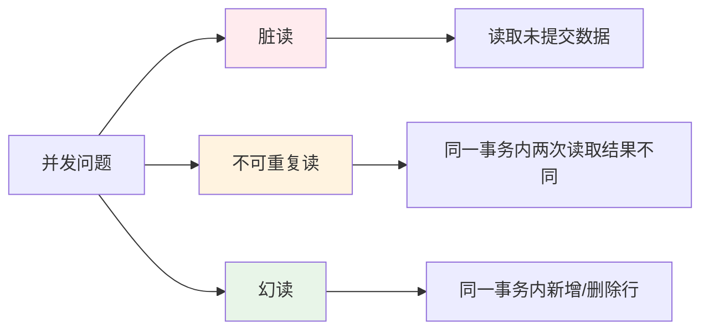
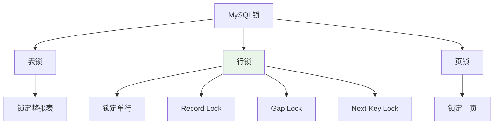
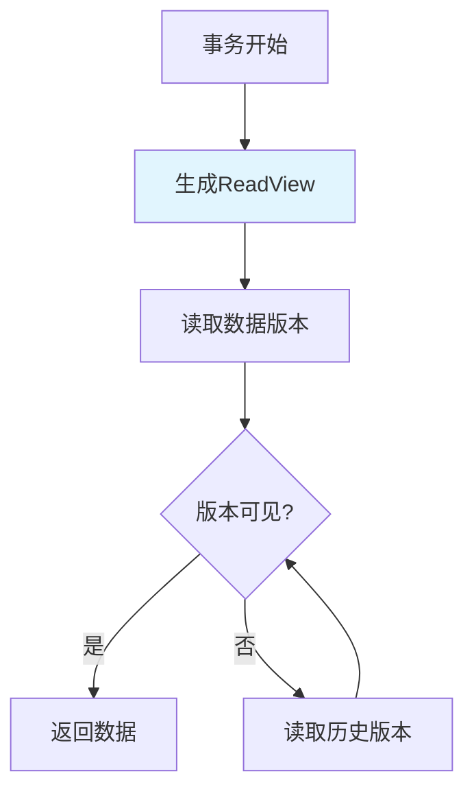

---

title: "事务实操：begin / commit / rollback 代码 + 隔离级别设置 + 死锁排查"

tags:

  - mysql

  - 技术学习

  - 学习笔记

created: "2026-07-21"

---

# 事务实操：begin / commit / rollback 代码 + 隔离级别设置 + 死锁排查

> **一句话**：事务是数据库操作的基本单位，具有ACID特性。事务实操包括事务的开始、提交、回滚，隔离级别设置，死锁排查等。

## 1. 事务基础
### 1.1 ACID特性



| 特性 | 说明 | 实现机制 |

|------|------|----------|

| 原子性 | 事务是不可分割的最小单位 | undo log |

| 一致性 | 事务前后数据保持一致 | 应用层面保证 |

| 隔离性 | 并发事务互不干扰 | 锁 + MVCC |

| 持久性 | 提交后数据永久保存 | redo log |

### 1.2 事务语法

```sql

-- 开始事务

BEGIN;

-- 或

START TRANSACTION;

-- 提交事务

COMMIT;

-- 回滚事务

ROLLBACK;

-- 设置保存点

SAVEPOINT savepoint_name;

ROLLBACK TO savepoint_name;

```

## 2. 隔离级别
### 2.1 四种隔离级别

| 隔离级别 | 脏读 | 不可重复读 | 幻读 | 性能 |

|----------|------|------------|------|------|

| READ UNCOMMITTED | ✅ | ✅ | ✅ | ⭐⭐⭐⭐⭐ |

| READ COMMITTED | ❌ | ✅ | ✅ | ⭐⭐⭐⭐ |

| REPEATABLE READ | ❌ | ❌ | ✅ | ⭐⭐⭐ |

| SERIALIZABLE | ❌ | ❌ | ❌ | ⭐⭐ |

### 2.2 并发问题



### 2.3 设置隔离级别

```sql

-- 查看当前隔离级别

SELECT @@transaction_isolation;

-- 设置全局隔离级别

SET GLOBAL TRANSACTION ISOLATION LEVEL REPEATABLE READ;

-- 设置当前会话隔离级别

SET SESSION TRANSACTION ISOLATION LEVEL READ COMMITTED;

```

## 3. 事务实操代码
### 3.1 基本事务操作

```sql

-- 示例：转账操作

BEGIN;

-- 检查余额

SELECT balance FROM accounts WHERE user_id = 1 FOR UPDATE;

-- 扣减余额

UPDATE accounts SET balance = balance - 100 WHERE user_id = 1;

-- 增加余额

UPDATE accounts SET balance = balance + 100 WHERE user_id = 2;

-- 提交事务

COMMIT;

```

### 3.2 异常回滚

```sql

BEGIN;

-- 尝试操作

UPDATE accounts SET balance = balance - 100 WHERE user_id = 1;

-- 检查余额是否足够

SELECT balance FROM accounts WHERE user_id = 1;

-- 如果余额不足，回滚

ROLLBACK;

-- 如果成功，提交

COMMIT;

```

### 3.3 保存点操作

```sql

BEGIN;

-- 第一步操作

INSERT INTO orders (user_id, product_id, quantity) VALUES (1, 101, 2);

SAVEPOINT step1;

-- 第二步操作

INSERT INTO order_items (order_id, product_id, quantity) VALUES (LAST_INSERT_ID(), 101, 2);

SAVEPOINT step2;

-- 如果第二步失败，回滚到step1

ROLLBACK TO step1;

-- 继续其他操作

COMMIT;

```

## 4. 锁机制
### 4.1 锁类型



### 4.2 行锁类型

| 锁类型 | 说明 | 适用场景 |

|--------|------|----------|

| Record Lock | 锁定单行记录 | 精确匹配 |

| Gap Lock | 锁定索引间隙 | 范围查询 |

| Next-Key Lock | Record Lock + Gap Lock | 左开右闭区间 |

### 4.3 加锁语句

```sql

-- 共享锁（S锁）

SELECT * FROM users WHERE id = 1 LOCK IN SHARE MODE;

-- 排他锁（X锁）

SELECT * FROM users WHERE id = 1 FOR UPDATE;

-- 乐观锁（应用层面）

UPDATE users SET name = 'Alice', version = version + 1

WHERE id = 1 AND version = 5;

```

## 5. 死锁排查
### 5.1 什么是死锁？


### 5.2 查看死锁信息

```sql

-- 查看最近的死锁信息

SHOW ENGINE INNODB STATUS\G

-- 查看当前锁等待

SELECT * FROM information_schema.INNODB_LOCK_WAITS;

-- 查看当前锁信息

SELECT * FROM information_schema.INNODB_LOCKS;

```

### 5.3 死锁排查步骤

```sql

-- 1. 查看死锁日志

SHOW ENGINE INNODB STATUS\G

-- 2. 找到LATEST DETECTED DEADLOCK部分

-- 3. 分析事务1和事务2的操作

-- 4. 找出死锁原因：

--    - 事务顺序不一致

--    - 索引缺失导致锁升级

--    - 事务持有锁时间过长

```

### 5.4 预防死锁

```sql

-- 1. 保持事务简短

BEGIN;

-- 快速操作

COMMIT;

-- 2. 按固定顺序访问表和行

-- 事务1：先操作表A，再操作表B

-- 事务2：先操作表A，再操作表B

-- 3. 使用合适的索引

ALTER TABLE users ADD INDEX idx_name (name);

-- 4. 避免长事务

SET innodb_lock_wait_timeout = 50;  -- 锁等待超时50秒

```

## 6. MVCC（多版本并发控制）
### 6.1 什么是MVCC？



### 6.2 实现原理

```sql

-- 每行数据包含隐藏列

-- DB_TRX_ID：最后修改的事务ID

-- DB_ROLL_PTR：回滚指针，指向undo log

-- ReadView包含：

-- m_ids：当前活跃事务ID列表

-- min_trx_id：最小活跃事务ID

-- max_trx_id：下一个要分配的事务ID

-- creator_trx_id：创建ReadView的事务ID

```

## 核心要点

```sql

-- 事务操作

BEGIN;          -- 开始

COMMIT;         -- 提交

ROLLBACK;       -- 回滚

-- 隔离级别

SET SESSION TRANSACTION ISOLATION LEVEL READ COMMITTED;

-- 加锁

SELECT * FROM users WHERE id = 1 FOR UPDATE;

-- 查看死锁

SHOW ENGINE INNODB STATUS\G

```

##

> ▶ 对应原理：[[11-事务ACID四大特性|11-事务ACID四大特性]]

## 速记卡（面试闪卡）

**Q1：一句话讲清「事务实操：begin / commit / rollback 代码 + 隔离级别设置 + 死锁排查」到底是什么？**

A：事务是把一组数据库操作打包成"全成功或全失败"的单位，靠 BEGIN/COMMIT/ROLLBACK 控制，隔离级别和锁解决并发问题。

**Q2：ACID 四特性像什么？ —— 怎么理解？**

A：像寄贵重包裹——原子性（Atomicity）要么整件寄出要么不退半件（靠 undo log 回滚）；一致性（Consistency）前后状态合法；隔离性（Isolation）并发互不干扰（锁+MVCC）；持久性（Durability）签收后永久到手（redo log）。

**Q3：四个隔离级别怎么选？ —— 怎么理解？**

A：像银行柜台开放程度——READ UNCOMMITTED 谁都能看别人没提交的（脏读）；READ COMMITTED 只信已提交；REPEATABLE READ（MySQL 默认）同事务内读一致但可能有幻读；SERIALIZABLE 全排队最安全最慢。

**Q4：事务实操代码怎么写？ —— 怎么理解？**

A：像转账先锁自己再转账——BEGIN 起事务，SELECT ... FOR UPDATE 加排他锁查余额，UPDATE 扣加，COMMIT 提交；余额不足就 ROLLBACK；中间可用 SAVEPOINT 设存档点，ROLLBACK TO 只回退到那一步。

**Q5：死锁和 MVCC 怎么理解？ —— 怎么理解？**

A：死锁像两人互相等对方松手——查 SHOW ENGINE INNODB STATUS 看现场，按固定顺序加锁、短事务预防。MVCC（Multi-Version Concurrency Control，多版本并发控制）靠隐藏列 DB_TRX_ID + 回滚指针 + ReadView，让读不阻塞写。

**Q6：核心速记主线有哪些？**

- ACID：原子性靠undo log、一致性应用保、隔离性靠锁+MVCC、持久性靠redo log

- 四个隔离级别：未提交读→提交读→可重复读(默认)→串行，安全性升、性能降

- 实操：BEGIN起、FOR UPDATE加锁、COMMIT提交、ROLLBACK回滚、SAVEPOINT存档

- 死锁查INNODB STATUS、按序加锁预防；MVCC靠版本链+ReadView实现快照读

**口诀**

A：事务打包全或空，BEGIN起COMMIT终。

ACID四性各有所，undo红olog撑。

隔离四级逐层稳，默认可重复读行。

死锁查状态按序锁，MVCC读不挡写功。

相关链接

- 📋 目录：[[00-MySQL]]

- 📚 学习清单：[[技术学习路线图#MySQL 实战]]

- 🔗 [[01-数据库基础与安装|数据库基础]]

- 🔗 [[04-子查询与多表连接JOIN|子查询与JOIN]]

- 🔗 [[06-SQLAlchemy与ORM实战|SQLAlchemy ORM]]

## 相关链接

- [[笔记/语言与框架/MySQL/实战/07-窗口函数实操|窗口函数实操：ROW_NUMBER / RANK / DENSE_RANK]]

- [[笔记/语言与框架/MySQL/实战/08-EXPLAIN执行计划分析|EXPLAIN 执行计划分析：type / key / rows / Extra 解读 + 慢查询定位]]

- [[笔记/语言与框架/MySQL/实战/01-数据库基础与安装|数据库基础与安装]]

- [[笔记/语言与框架/MySQL/实战/05-聚合函数与分组GROUP_BY|聚合函数与分组GROUP BY]]

- [[笔记/语言与框架/MySQL/实战/02-CRUD操作与数据类型|CRUD操作与数据类型]]

