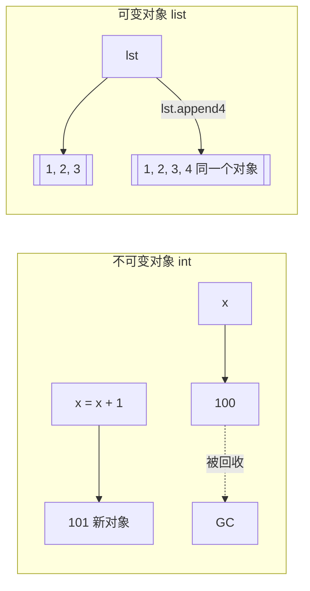

---

title: "可变与不可变"

created: "2026-07-20"

tags:

  - 八股文

  - python

---

# 可变与不可变

## 一、可变 vs 不可变——你到底能不能改
### 1.1 本质区别——内存层面

```python

# ===== 不可变对象：每次"修改"都是创建新对象 =====

x = 100

print(id(x))                       # 假设 0xAAAA

x = x + 1                          # "加 1"

print(id(x))                       # 0xBBBB——地址变了！是新对象

# ===== 可变对象：原地修改，地址不变 =====

lst = [1, 2, 3]

print(id(lst))                     # 假设 0xCCCC

lst.append(4)                      # 追加元素

print(id(lst))                     # 0xCCCC——地址没变！原地修改

# 对象还是那个对象，内容变了

```



### 1.2 Python 中的分类速查

| 可变（Mutable） | 不可变（Immutable） |
| :--- | :--- |
| `list` — `[1, 2]` | `int` — `42` |
| `dict` — `{"a": 1}` | `float` — `3.14` |
| `set` — `{1, 2}` | `str` — `"hello"` |
| `bytearray` | `tuple` — `(1, 2)` |
| 自定义类实例（默认） | `frozenset` — `frozenset({1,2})` |
| | `bytes` — `b"hello"` |
| | `bool` — `True/False` |
| | `None` |

### 1.3 不可变对象的"修改错觉"

```python

# ===== str 的 += ——看起来像"修改"，实际是新对象 =====

s = "hello"

print(id(s))                       # 0xAAAA

s += " world"                      # 这行做了什么？

print(s)                           # "hello world"

print(id(s))                       # 0xBBBB——地址变了！

# ===== tuple 不能改——但元组"加法"创建的是新元组 =====

t = (1, 2, 3)

t = t + (4,)                       # 这和 t.append(4) 不一样！这是创建新元组

print(t)                           # (1, 2, 3, 4)

# 原来的 (1, 2, 3) 还在内存里，但没变量引用它了

```

### 1.4 可变对象当默认参数——Python 第一大坑

```python

# ❌ 坑：可变对象作为默认参数——所有调用共享同一个对象！

def add_item(item, bucket=[]):     # ⚠️ 默认参数只在函数定义时求值一次！

    bucket.append(item)            #    这个 [] 是同一个对象

    return bucket

print(add_item(1))                 # [1]

print(add_item(2))                 # [1, 2]  ← 累积了！不是 [2]！

print(add_item(3))                 # [1, 2, 3]  ← 还在累积！

# ✅ 正解：默认参数用 None，函数体内创建新对象

def add_item(item, bucket=None):

    if bucket is None:

        bucket = []                # 每次调用都创建新列表

    bucket.append(item)

    return bucket

print(add_item(1))                 # [1]

print(add_item(2))                 # [2]  ← 正确！互不影响

```

### 1.5 `+=` 对可变和不可变的不同行为（⭐高频考点）

```python

# ===== 对不可变对象：+= 创建新对象 =====

a = 100

old_id = id(a)

a += 1                             # 等价于 a = a + 1 → 新对象

print(id(a) == old_id)             # False

# ===== 对可变对象：+= 原地修改（不创建新对象）=====

lst = [1, 2]

old_id = id(lst)

lst += [3]                         # 等价于 lst.extend([3])——原地修改！

print(id(lst) == old_id)           # True——还是同一个对象

# ===== ⚠️ 陷阱：元组的 += =====

t = (1, 2)

# 所以 t 最终是 (1, 2, 3)，但 id 变了

```

| 操作 | 不可变对象 | 可变对象 |
| :--- | :--- | :--- |
| `x = x + y` | 创建新对象，id 变 | 创建新对象，id 变（`__add__` 返回新对象） |
| `x += y` | 创建新对象，id 变 | **原地修改**，id 不变（调 `__iadd__`） |
| `.append()` / `.add()` | 没有这个方法 | 原地修改，id 不变 |

### 1.6 为什么 Python 要区分可变不可变？（进阶亮点）

```text

① 字典的 key 必须是不可变的

   → dict 内部靠 hash(key) 定位，如果 key 变了 hash 就变了 → 找不到原来的 value

   → 所以 list 不能当 key，tuple（不含可变元素）可以

② 集合的元素必须是不可变的

   → 同理，set 靠 hash 去重

③ 线程安全简化

   → 不可变对象天然线程安全——不会被别的线程改

④ 内存优化

   → 小整数缓存、字符串驻留——同一个不可变对象可以到处共享

```

---

## 1. 常见进制介绍
### 1.1 什么是进制

进制就是**逢几进一**的计数规则。我们日常生活中使用十进制（逢十进一），因为人类有十根手指。计算机使用二进制（逢二进一），因为电路只有两种状态：通电（1）和断电（0）。

### 1.2 四种进制详解
#### 二进制（Binary）

- **数码**：0 和 1

- **基数**：2

- **Python 前缀**：`0b` 或 `0B`

- **进位规则**：逢二进一

```python

# 0b100 = 4（十进制） ← 1×4+0×2+0 = 4

print(0b1010)   # 输出 10

print(0b1111)   # 输出 15

```

**二进制转十进制**：每位乘以 2 的幂次然后求和

`0b1101` = 1×2³ + 1×2² + 0×2¹ + 1×2⁰ = 8 + 4 + 0 + 1 = **13**

#### 八进制（Octal）

- **数码**：0-7

- **基数**：8

- **Python 前缀**：`0o` 或 `0O`

- **应用**：Linux 文件权限（如 `chmod 755`）

```python

print(0o10)   # 输出 8  （1×8+0=8）

print(0o77)   # 输出 63 （7×8+7=63）

```

#### 十进制（Decimal）

- **数码**：0-9

- **基数**：10

- 日常使用的进制，Python 中直接写数字即可

#### 十六进制（Hexadecimal）

- **数码**：0-9 和 A-F（A=10, B=11, C=12, D=13, E=14, F=15）

- **基数**：16

- **Python 前缀**：`0x` 或 `0X`

- **应用**：颜色代码（`#FF0000` = 红色）、内存地址

```python

print(0xA)     # 输出 10

print(0xFF)    # 输出 255  （15×16+15=255）

print(0x100)   # 输出 256  （1×256=256）

```

**十六进制转十进制**：`0x2AF` = 2×16² + 10×16¹ + 15×16⁰ = 512 + 160 + 15 = **687**

### 1.3 各进制对照表

| 十进制 | 二进制 | 八进制 | 十六进制 |
|:------:|:------:|:------:|:--------:|
| 0 | 0b0 | 0o0 | 0x0 |
| 1 | 0b1 | 0o1 | 0x1 |
| 2 | 0b10 | 0o2 | 0x2 |
| 7 | 0b111 | 0o7 | 0x7 |
| 8 | 0b1000 | 0o10 | 0x8 |
| 9 | 0b1001 | 0o11 | 0x9 |
| 10 | 0b1010 | 0o12 | 0xA |
| 15 | 0b1111 | 0o17 | 0xF |
| 16 | 0b10000 | 0o20 | 0x10 |
| 255 | 0b11111111 | 0o377 | 0xFF |

## 1. 进制之间的相互转换
### 1.1 Python 内置转换函数

```python

# 十进制 → 其他进制

n = 42

print(bin(n))    # '0b101010'  转二进制

print(oct(n))    # '0o52'      转八进制

print(hex(n))    # '0x2a'      转十六进制

# 其他进制 → 十进制（用 int 函数，传入基数）

print(int('101010', 2))   # 42  二进制→十进制

print(int('52', 8))       # 42  八进制→十进制

print(int('2a', 16))      # 42  十六进制→十进制

```

### 1.2 手动转换方法

**十进制 → 二进制（短除法）**：不断除以 2，取余数，从下往上排列

```text

将 42 转二进制：

42 ÷ 2 = 21 ... 余 0  ↑

21 ÷ 2 = 10 ... 余 1  ↑

10 ÷ 2 = 5  ... 余 0  ↑

5  ÷ 2 = 2  ... 余 1  ↑

2  ÷ 2 = 1  ... 余 0  ↑

1  ÷ 2 = 0  ... 余 1  ↑

结果：101010（从下往上读）

```

## 2. 原码、反码、补码
### 2.1 为什么需要补码

计算机只会做加法。如果我们想让计算机做减法，最简单的思路是：**把减法变成加一个负数**。补码就是为了让"加一个负数"等价于"做减法"而设计的。

### 2.2 三码定义

以 **8 位** 二进制为例，表示 -5：

| 类型 | 二进制表示 | 说明 |
|------|-----------|------|
| **原码** | `1000 0101` | 最高位=符号位（1 表示负），其余=数值 |
| **反码** | `1111 1010` | 符号位不变，其余位取反（0↔1） |
| **补码** | `1111 1011` | 反码 + 1 |

**正数的三码相同**。以 +5 为例：

- 原码 = `0000 0101`

- 反码 = `0000 0101`（相同）

- 补码 = `0000 0101`（相同）

### 2.3 补码验证

```text

计算 7 - 5 = 7 + (-5)

用补码计算：

  7 的补码：0000 0111

+ -5的补码：1111 1011

─────────────────────

  (1) 0000 0010  ← 进位溢出丢弃，结果是 0000 0010 = 2 ✓

```

### 2.4 补码解码（已知补码求原值）

```python

# 加上负号：-5

```

> [!important] 核心结论

> **计算机中所有整数都以补码形式存储！**

> 补码统一了加法和减法，简化了硬件电路设计。

### 2.5 Python 中的位运算（预习）

```python

# 按位取反

~5   # -6（因为补码机制）

# 左移和右移

8 << 1   # 16（左移 1 位 = ×2）

8 >> 1   # 4（右移 1 位 = ÷2）

```

## 3. 数据类型分类
### 3.1 整数（int）

Python 3 中整数**没有大小限制**（只受内存限制），不会像 C/Java 那样溢出。

```python

a = 100

b = -50

c = 0b1101       # 二进制整数 = 13

d = 0o17         # 八进制整数 = 15

e = 0xFF         # 十六进制整数 = 255

f = 10_000_000   # 下划线分隔，提高可读性（Python 3.6+）

g = 99999999999999999999999999999999999  # Python 能处理任意大整数

print(type(a))   # <class 'int'>

```

### 3.2 浮点数（float）

```python

pi = 3.14159

e = 2.71828

big = 1.5e9        # 科学计数法 = 1500000000.0

small = 1.5e-3     # = 0.0015

print(type(pi))    # <class 'float'>

# ⚠️ 浮点数精度问题

print(0.1 + 0.2)   # 0.30000000000000004 不是精确的 0.3！

# 解决方案：使用 Decimal 进行精确计算

from decimal import Decimal

print(Decimal('0.1') + Decimal('0.2'))  # 0.3 ✓

```

> [!warning] 浮点数精度陷阱

> 金融计算、科学计算中需要精确小数时，务必使用 `Decimal` 或 `fractions` 模块。

### 3.3 布尔值（bool）

```python

is_student = True

is_working = False

print(type(True))  # <class 'bool'>

# bool 是 int 的子类！

print(True == 1)    # True

print(False == 0)   # True

print(True + True)  # 2（可以参与运算！）

# 哪些值为 False

print(bool(0))       # False

print(bool(0.0))     # False

print(bool(''))      # False（空字符串）

print(bool([]))      # False（空列表）

print(bool({}))      # False（空字典）

print(bool(None))    # False

# 其余几乎都是 True

print(bool(1))       # True

print(bool(-1))      # True（非零即真）

print(bool(' '))     # True（非空字符串）

print(bool([0]))     # True（非空列表）

```

### 3.4 字符串（str）

```python

# 三种定义方式

s1 = '单引号'

s2 = "双引号"

s3 = '''三个引号

可以跨行'''

s4 = """三个双引号也可以跨行"""

# 字符串中包含引号

quote1 = "It's Python"     # 双引号内可以用单引号

quote2 = '他说："你好"'     # 单引号内可以用双引号

quote3 = 'It\'s Python'    # 转义字符 \'

# 常见转义字符

print('Hello\nWorld')   # \n 换行

print('Hello\tWorld')   # \t 制表符（Tab）

print('Hello\\World')   # \\ 反斜杠本身

print(r'Hello\nWorld')  # r'' 原始字符串，不转义

```

## 4. 自动类型转换与强制类型转换
### 4.1 自动类型转换（隐式转换）

当不同类型的数据混合运算时，Python 会**自动向更"宽"的类型转换**：

```python

# int + float → float

result = 10 + 3.14     # 13.14（int 自动转为 float）

print(type(result))    # <class 'float'>

# int + bool → int（因为 bool 是 int 的子类）

result = 10 + True     # 11（True = 1）

result = 10 + False    # 10（False = 0）

# 转换方向：bool → int → float → complex

```

> [!note] 自动转换规则

> 运算时向"更宽"的类型转换，避免精度损失。

### 4.2 强制类型转换（显式转换）

使用内置函数手动转换：

```python

# str → int

age = int("25")           # 25

# str → float

height = float("1.75")    # 1.75

float("3.14")             # 3.14

# 任意类型 → str

str(100)                  # "100"

str(3.14)                 # "3.14"

str(True)                 # "True"

str([1, 2, 3])            # "[1, 2, 3]"

# 任意类型 → bool

bool(0)                   # False

bool(1)                   # True

bool("")                  # False

bool("hello")             # True

bool([])                  # False

bool([1, 2])             # True

```

## 5. 编码和解码
### 5.1 为什么需要编码

计算机只能存储 0 和 1。要让计算机存储文字，就需要一套规则把**字符**映射到**数字**。这套规则就是编码。

### 5.2 常见编码

| 编码 | 特点 | 占空间 |
|------|------|--------|
| **ASCII** | 只支持英文（128 个字符） | 1 字节/字符 |
| **GBK** | 支持中文，中国国家标准 | 2 字节/汉字 |
| **UTF-8** | 支持全球所有语言，互联网标准 | 1-4 字节/字符 |

### 5.3 Python 中的编码操作

```python

# 编码：字符串 → 字节（人读 → 机读）

text = "Python 编程"

encoded_utf8 = text.encode("utf-8")

print(encoded_utf8)    # b'Python \xe7\xbc\x96\xe7\xa8\x8b'

print(type(encoded_utf8))  # <class 'bytes'>

encoded_gbk = text.encode("gbk")

print(encoded_gbk)     # b'Python \xb1\xe0\xb3\xcc'（和 utf-8 不同！）

# 解码：字节 → 字符串（机读 → 人读）

decoded_utf8 = encoded_utf8.decode("utf-8")

print(decoded_utf8)    # "Python 编程"

# ⚠️ 编码不一致会导致乱码！

try:

    encoded_utf8.decode("gbk")  # ❌ 用 gbk 去解 utf-8 → 乱码或报错

except UnicodeDecodeError as e:

    print(f"解码错误：{e}")

```

> [!important] 一条铁律

> **用什么编码写的，就用什么编码读！**

> 现代 Python 开发中，统一使用 **UTF-8**。

## 6. input 输入与三种输出方式
### 6.1 input 获取用户输入

```python

# input 的基本用法

name = input("请输入你的名字：")  # 括号里的字符串是提示文字

print(f"你好，{name}！")

# ⚠️ input 返回的类型始终是 str！

age_str = input("请输入你的年龄：")

print(type(age_str))   # <class 'str'> ← 不是 int！

# 需要转换类型

age = int(input("请输入你的年龄："))

print(f"明年你 {age + 1} 岁")

```

### 6.2 输出方式一：% 格式化

```python

name = "张三"

age = 20

height = 1.75

# %s 字符串  %d 整数  %f 浮点数

print("我叫%s，今年%d岁，身高%.2f米" % (name, age, height))

# 格式控制

print("占比：%.1f%%" % 85.678)  # 85.7%

# %% 表示百分号本身，%.1f 表示保留1位小数

```

> [!warning] % 格式化是老式写法，了解即可，新代码优先用 f-string。

### 6.3 输出方式二：format 方法

```python

# 位置占位

print("我叫{}，今年{}岁".format("张三", 20))

# 索引占位

print("{1} 比 {0} 大".format(10, 20))  # "20 比 10 大"

# 关键字占位

print("我叫{name}，今年{age}岁".format(name="张三", age=20))

# 格式控制

print("圆周率：{:.2f}".format(3.14159))     # "3.14"

print("{:*^20}".format("标题"))              # "*********标题*********"

# :* 表示用 * 填充，^ 表示居中对齐，20 表示总宽度

```

### 6.4 输出方式三：f-string（推荐！⭐）

```python

name = "张三"

age = 20

# 直接嵌入变量

print(f"我叫{name}，今年{age}岁，明年{age + 1}岁")

# 格式控制

pi = 3.14159

print(f"圆周率：{pi:.2f}")        # "圆周率：3.14"

print(f"占比：{85.678:.1f}%")     # "占比：85.7%"

# 表达式

print(f"10 + 20 = {10 + 20}")    # "10 + 20 = 30"

# 调用函数

print(f"大写：{'hello'.upper()}")  # "大写：HELLO"

# 对齐

print(f"{'左对齐':<10}")           # 左对齐（默认）

print(f"{'居中对齐':^10}")         # 居中

print(f"{'右对齐':>10}")           # 右对齐

```

> [!tip] 为什么 f-string 最好

> 1. 最简洁：变量直接写进花括号

> 2. 最直观：可读性远超 % 和 format

> 3. 最快：运行时性能优于 % 和 format

> 4. Python 3.6+ 支持（现在基本都满足）

## 7. 综合练习

把今天学的知识点整合起来：

```python

"""

Day 02 综合练习：个人名片生成器

"""

print("=" * 50)

print("📇 个人名片生成器")

print("=" * 50)

# 1. input 获取信息

name = input("姓名：")

age_str = input("年龄：")

phone = input("手机号：")

# 2. 类型转换

age = int(age_str)

# 3. 进制练习（年龄用不同进制表示）

age_bin = bin(age)   # 二进制

age_oct = oct(age)   # 八进制

age_hex = hex(age)   # 十六进制

# 4. f-string 格式化输出

print("\n" + "=" * 50)

print(f"📇 {name} 的名片")

print("=" * 50)

print(f"姓名：{name}")

print(f"年龄：{age} 岁")

print(f"    二进制表示：{age_bin}")

print(f"    八进制表示：{age_oct}")

print(f"    十六进制表示：{age_hex}")

print(f"手机号：{phone}")

print(f"年龄验证（bool）：{bool(age)}")

print(f"明年年龄：{age + 1} 岁")

print("=" * 50)

```

---

### 选型决策树
## 速记卡（面试闪卡）

**Q1：一句话讲清「===== 不可变对象：每次"修改"都是创建新对象 =====」到底是什么？**

A：可变对象原地改地址不变，不可变对象一改就建新对象换指向。

**Q2：内存层面本质区别（id unchanged vs changed） —— 怎么理解？**

A：类比：可变对象像可擦写的白板，lst.append(4) 原地改、id 不变；不可变对象像刻好的石碑，x=x+1 其实是另刻一块新碑、x 换指向、旧碑等回收。变的是"改不改原地的地址"。（Mutable vs immutable）

**Q3：默认参数大坑（mutable default argument） —— 怎么理解？**

A：类比：def f(bucket=[]) 的 [] 只在定义时建一次，所有调用共享同一个列表——add_item(1) 后 add_item(2) 累积成 [1,2]，像全公司共用一个收件箱。正解：默认写 None，函数体内新建。（Mutable default pitfall）

**Q4：+= 的不同脾气（__iadd__ vs __add__） —— 怎么理解？**

A：类比：对不可变，a += 1 等价 a = a+1 建新对象（id 变）；对可变，lst += [3] 调 __iadd__ 原地改（id 不变）。坑在元组：t += (3,) 看着像改，其实也是建新元组、id 变——"不可变"从不等于"不能换指向"。（In-place add）

**Q5：为什么要区分（hash / thread-safety） —— 怎么理解？**

A：类比：区分像给仓库贴"可改/封存"标签：dict 的 key 和集合元素必须不可变，否则 hash 变了找不到值（list 不能当 key）；不可变还天然线程安全（不会被别的线程改），并支持小整数缓存、字符串驻留省内存。（Hash key constraint）

**Q6：核心速记主线有哪些？**

- 可变（list/dict/set/bytearray/自定义类）：原地改，id 不变

- 不可变（int/float/str/tuple/bytes/frozenset/None）：改=建新对象，id 变

- 默认参数用可变对象会跨调用共享，正解写 None 再新建

- += 对可变原地改、对不可变建新；元组 += 也是建新

- 不可变才能当 dict key / set 元素，且天然线程安全、可驻留

**口诀**

A：可变原地改，不可变换新碑；

默认参数别用 [], None 体内堆；

+= 列表原地，数字换新回；

不可变当 key，线程也不亏。

## 相关链接

- 上一篇：[[04_循环与列表]]

- 下一篇：[[06_函数基础]]

---

→ [[技术学习路线图#语法核心]]

