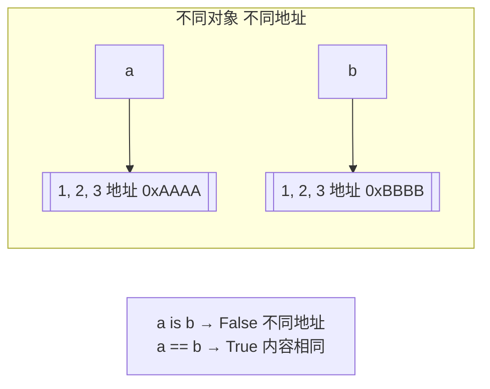
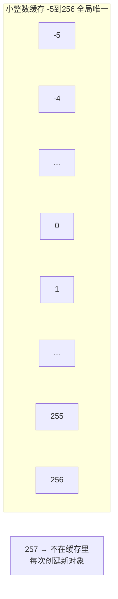

---

title: "is与==比地址还是比值"

created: "2026-07-20"

tags:

  - 八股文

  - python

---

# is与==比地址还是比值

## 三、is vs == —— 比地址还是比值
### 3.1 一句话区分

```python

# is 比"内存地址" → 是不是同一个人

a = [1, 2, 3]

b = [1, 2, 3]                     # 内容一样，但是两个独立的对象

print(a == b)                      # True——值相等

print(a is b)                      # False——不是同一个对象

print(id(a) == id(b))              # False——is 本质上就是在比 id()

```



> **口诀**：`==` 问"内容一样吗？"，`is` 问"是同一个吗？"。`==` 像确认双胞胎长得像不像，`is` 像确认身份证号是不是同一个。

### 3.2 什么时候用 is？（⭐重点）

```python

# ✅ 用 is 的场景——比较单例/None

x = None

if x is None:                      # ✅ 推荐——None 是全局单例

    pass

# ✅ 用 is 的场景——确认两个变量指向同一个对象

a = []

b = a

print(a is b)                      # True——确认 b 是 a 的别名

# ✅ 用 is 的场景——单例验证

s1 = Singleton()

s2 = Singleton()

print(s1 is s2)                    # True——确认单例生效

# ❌ 不应该用 is 的场景——比较数值、字符串等"值相等"

x = 1000

y = 500 + 500

print(x == y)                      # True——应该用 ==

print(x is y)                      # 可能 True 也可能 False——不可预测，别用！

```

### 3.3 小整数缓存——`is` 最大的陷阱（⭐⭐必考）

```python

# ⚠️ 最经典的坑：

a = 256

b = 256

print(a is b)                      # True——256 在缓存范围内

a = 257

b = 257

print(a is b)                      # False！——257 超出缓存范围，是两个独立对象！

# 任何地方用到这个范围的整数，都直接引用缓存里的那个

```



```python

# ⚠️ 更隐蔽的坑——字符串驻留（String Interning）

a = "hello"

b = "hello"

print(a is b)                      # True——短字符串自动驻留

a = "hello world!"

b = "hello world!"

print(a is b)                      # 可能 True 也可能 False——含空格/特殊字符行为不确定

# 但这不是语言规范——不同 Python 实现行为可能不同，不要依赖！

```

> **一句话讲清**："`is` 比较的是对象身份，不应该用来比较值。小整数缓存和字符串驻留是 CPython 的实现细节，不能依赖——用 `==` 比数值和字符串，用 `is` 只比 None 和单例。"

### 3.4 `==` 可以重载，`is` 不能

```python

class Person:

    def __init__(self, name):

        self.name = name

    def __eq__(self, other):       # 重载 == 的行为

        if isinstance(other, Person):

            return self.name == other.name

        return False

p1 = Person("张三")

p2 = Person("张三")

print(p1 == p2)                    # True——__eq__ 说"同名就是同一个人"

print(p1 is p2)                    # False——is 不受 __eq__ 影响，两个不同实例

# is 是 C 语言层面的指针比较，不能被重载

```

### 3.5 is vs == 决策树

```text

你要比较什么？

  ├── 和 None 比较          → ✅ is None / is not None

  ├── 和 True/False 比较     → ✅ is True / is False（或直接用 if x）

  ├── 确认两个变量指向同一对象  → ✅ is

  ├── 比较数值/字符串/内容是否相等 → ✅ ==

  └── 单例验证               → ✅ is

```

---

## 速记卡（面试闪卡）

**Q1：一句话讲清「is与==比地址还是比值」到底是什么？**

A：== 比值（内容像不像），is 比内存地址（是不是同一个对象，本质比 id()）。

**Q2：一、什么时候该用 is —— 怎么理解？ —— 怎么理解？**

A：is 用于比"单例/同一个对象"：比 None 用 `x is None`（PEP 8 推荐）、确认两个变量指向同一别名、单例验证。好比查身份证号——确认"就是那个人"而不是"长得像的那个人"。is 只比指针，又快又稳。

**Q3：二、小整数缓存是最大陷阱 —— 怎么理解？ —— 怎么理解？**

A：Python 缓存了 -5 到 256 的小整数，所以 `a=256; b=256; a is b` 为 True；但 257 超出范围是两个独立对象，`a is b` 可能 False。字符串也有驻留（intern）机制。所以绝不用 is 比数值/字符串，要用 ==。

**Q4：三、is 和 id()、与 == 重载 —— 怎么理解？ —— 怎么理解？**

A：`a is b` 等价于 `id(a) == id(b)`——id 是对象的内存"身份证号"。is 走 C 级指针比较不能被重载；== 走 `__eq__` 方法可自定义（如 Person 同名即相等）。所以 is 比身份，== 比内容，互不相干。

**Q5：四、为什么 None 要用 is —— 怎么理解？ —— 怎么理解？**

A：None 是全局唯一单例，整个程序只有一个 None 对象，用 is 比既快又语义准——确认"就是那个空值"而非"等于空值的某个东西"。即便有人恶意重写 ==，is 也不受影响。True/False 同理建议用 is。

**Q6：核心速记主线有哪些？**

- == 比值（内容），is 比地址（id）

- is 用于 None / 单例 / 确认同一对象

- 小整数缓存(-5~256)与字符串驻留是陷阱，别用 is 比值

- is 等价于 id() 比较，走指针不走路 __eq__

**口诀**

A：== 比值 is 比址，

双胞胎对身份证；

小整数缓存是陷阱，

None 单例用 is 认。

## 相关链接

- 📋 目录：[[00-Python]]

- 📚 学习清单：[[八股文学习路线图]]

- 🔗 [[语言与框架/Python/八股/基础/01-可变与不可变对象|可变与不可变对象]]

- 🔗 [[语言与框架/Python/八股/基础/03-深浅拷贝|深浅拷贝]]

- 🔗 [[计算机基础/操作系统/01-进程vs线程vs协程对比|进程vs线程vs协程]] — 操作系统视角的并发基础

- 🔗 [[语言与框架/TypeScript-React/八股/JavaScript/15-异步与事件循环|JS异步与事件循环]] — Python asyncio vs JS 事件循环

