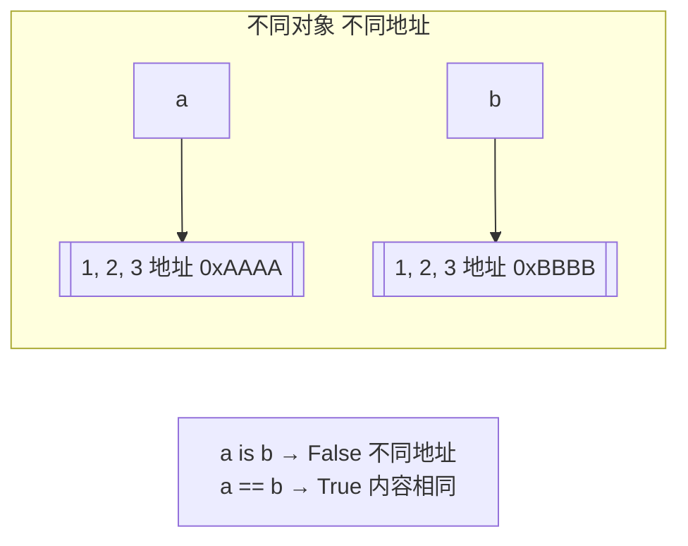
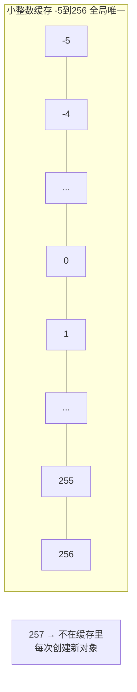

## 三、is vs == —— 比地址还是比值


### 3.1 一句话区分


```python

# == 比"值" → 长得像不像

# is 比"内存地址" → 是不是同一个人


a = [1, 2, 3]

b = [1, 2, 3]                     # 内容一样，但是两个独立的对象


print(a == b)                      # True——值相等

print(a is b)                      # False——不是同一个对象

print(id(a) == id(b))              # False——is 本质上就是在比 id()

```





> **口诀**：`==` 问"内容一样吗？"，`is` 问"是同一个吗？"。`==` 像确认双胞胎长得像不像，`is` 像确认身份证号是不是同一个。


### 3.2 什么时候用 is？（⭐重点）


```python

# ✅ 用 is 的场景——比较单例/None

x = None

if x is None:                      # ✅ 推荐——None 是全局单例

    pass

# 不写 if x == None——虽然也能用，但 PEP 8 推荐 is None


# ✅ 用 is 的场景——确认两个变量指向同一个对象

a = []

b = a

print(a is b)                      # True——确认 b 是 a 的别名


# ✅ 用 is 的场景——单例验证

s1 = Singleton()

s2 = Singleton()

print(s1 is s2)                    # True——确认单例生效


# ❌ 不应该用 is 的场景——比较数值、字符串等"值相等"

x = 1000

y = 500 + 500

print(x == y)                      # True——应该用 ==

print(x is y)                      # 可能 True 也可能 False——不可预测，别用！

```


### 3.3 小整数缓存——`is` 最大的陷阱（⭐⭐必考）


```python

# ⚠️ 最经典的坑：

a = 256

b = 256

print(a is b)                      # True——256 在缓存范围内


a = 257

b = 257

print(a is b)                      # False！——257 超出缓存范围，是两个独立对象！


# Python 启动时预先创建了 -5 到 256 的所有整数对象

# 任何地方用到这个范围的整数，都直接引用缓存里的那个

```





```python

# ⚠️ 更隐蔽的坑——字符串驻留（String Interning）

a = "hello"

b = "hello"

print(a is b)                      # True——短字符串自动驻留


a = "hello world!"

b = "hello world!"

print(a is b)                      # 可能 True 也可能 False——含空格/特殊字符行为不确定


# 规则：Python 会自动驻留"看起来像标识符"的字符串（只含字母数字下划线）

# 但这不是语言规范——不同 Python 实现行为可能不同，不要依赖！

```


> **一句话讲清**："`is` 比较的是对象身份，不应该用来比较值。小整数缓存和字符串驻留是 CPython 的实现细节，不能依赖——用 `==` 比数值和字符串，用 `is` 只比 None 和单例。"


### 3.4 `==` 可以重载，`is` 不能


```python

class Person:

    def __init__(self, name):

        self.name = name


    def __eq__(self, other):       # 重载 == 的行为

        if isinstance(other, Person):

            return self.name == other.name

        return False


p1 = Person("张三")

p2 = Person("张三")


print(p1 == p2)                    # True——__eq__ 说"同名就是同一个人"

print(p1 is p2)                    # False——is 不受 __eq__ 影响，两个不同实例

# is 是 C 语言层面的指针比较，不能被重载

```


### 3.5 is vs == 决策树


```text

你要比较什么？

  ├── 和 None 比较          → ✅ is None / is not None

  ├── 和 True/False 比较     → ✅ is True / is False（或直接用 if x）

  ├── 确认两个变量指向同一对象  → ✅ is

  ├── 比较数值/字符串/内容是否相等 → ✅ ==

  └── 单例验证               → ✅ is

```


---


## 速记卡（面试闪卡）

**Q1：一句话讲清「== 比"值" → 长得像不像」到底是什么？**
A：**口诀**： 问"内容一样吗？"， 问"是同一个吗？"。 像确认双胞胎长得像不像， 像确认身份证号是不是同一个。
**一句话讲清**：" 比较的是对象身份，不应该用来比较值。小整数缓存和字符串驻留是 CPython 的实现细节，不能依赖——用  比数值和字符串，用  只比 None 和单例。"
---

**Q2：三、is vs == —— 比地址还是比值 —— 怎么理解？**
A：**口诀**： 问"内容一样吗？"， 问"是同一个吗？"。 像确认双胞胎长得像不像， 像确认身份证号是不是同一个。
**一句话讲清**：" 比较的是对象身份，不应该用来比较值。小整数缓存和字符串驻留是 CPython 的实现细节，不能依赖——用  比数值和字符串，用  只比 None 和单例。"
---

**Q3：核心速记主线有哪些？**
A：抓住这几根：三、is vs == —— 比地址还是比值。


## 相关链接


- 📋 目录：[[00-Python]]

- 📚 学习清单：[[八股文学习清单]]

- 🔗 [[语言与框架/Python/八股/基础/01-可变与不可变对象|可变与不可变对象]]

- 🔗 [[语言与框架/Python/八股/基础/03-深浅拷贝|深浅拷贝]]

- 🔗 [[计算机基础/操作系统/01-进程vs线程vs协程对比|进程vs线程vs协程]] — 操作系统视角的并发基础

- 🔗 [[语言与框架/TypeScript-React/八股/JavaScript/15-异步与事件循环|JS异步与事件循环]] — Python asyncio vs JS 事件循环

