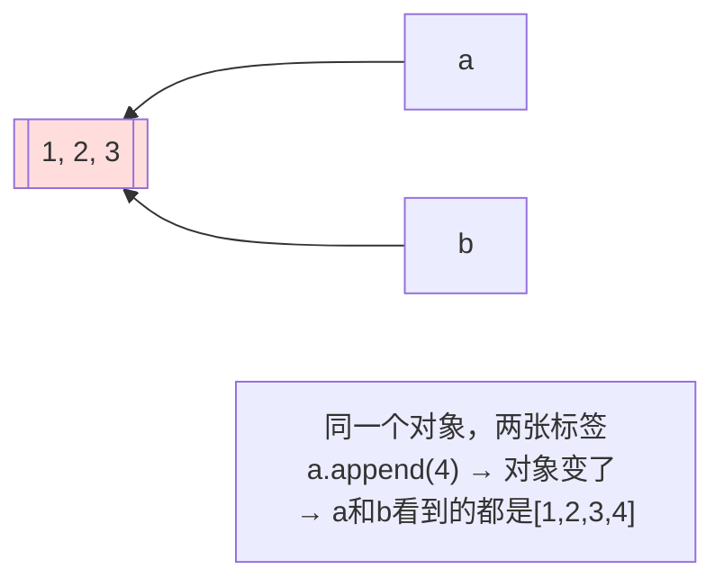
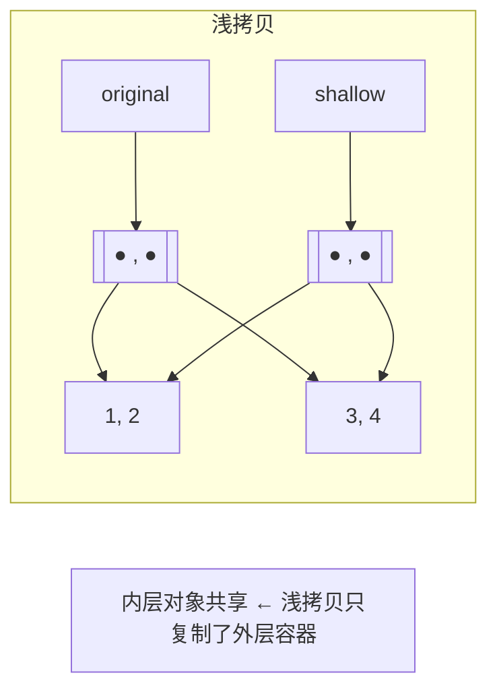
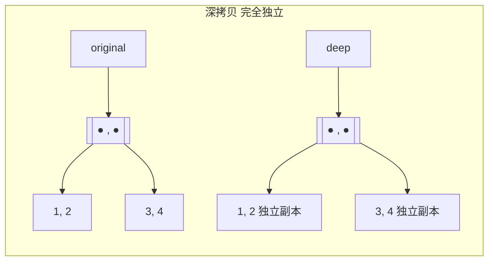
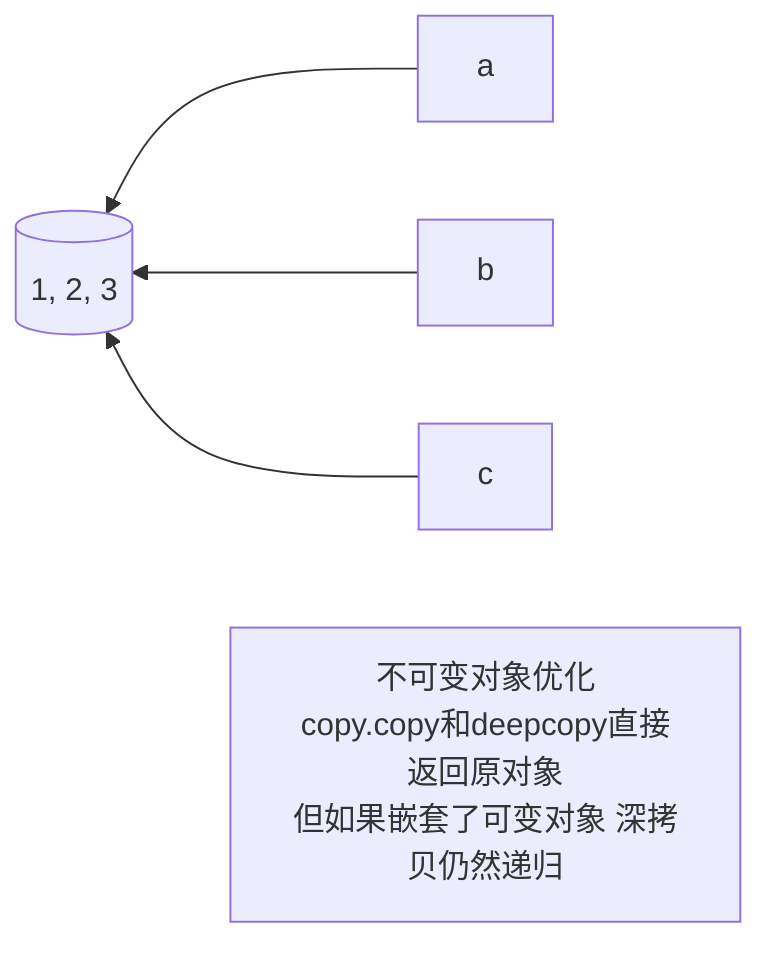

---

title: "深浅拷贝赋值不是拷贝"

created: "2026-07-20"

tags:

  - 八股文

  - python

---

# 深浅拷贝赋值不是拷贝

## 一、深浅拷贝——赋值不是拷贝
### 1.1 先看问题——赋值只是贴标签

```python

# 你以为的"拷贝"——其实只是多贴了一张标签

a = [1, 2, 3]

b = a                    # 这不是拷贝！只是给 [1,2,3] 起了个别名

b.append(4)

print(a)                 # [1, 2, 3, 4]  ← a 也跟着变了！

print(b)                 # [1, 2, 3, 4]

print(a is b)            # True——同一个对象

# Python 赋值 = 贴标签。a 和 b 都指向同一块内存，改任何一个都影响另一个。

```



> **一句话**：`b = a` 不是把 `a` 的值复制一份给 `b`——只是让 `b` 也指向 `a` 指向的那个对象。想真正"复制"一份独立的数据——用拷贝。

### 1.2 浅拷贝 `copy.copy()`——只复制一层

```python

import copy

# ===== 浅拷贝：外层新容器，内层还是原来的对象 =====

original = [[1, 2], [3, 4]]

shallow = copy.copy(original)        # 浅拷贝

print(original is shallow)           # False——外层容器不是同一个

print(original[0] is shallow[0])     # True！← 内层列表还是同一个对象！

# 改外层——互不影响

shallow.append([5, 6])

print(original)                      # [[1, 2], [3, 4]]     ← 不受影响

print(shallow)                       # [[1, 2], [3, 4], [5, 6]]

# 改内层——互相影响！

shallow[0].append(999)

print(original)                      # [[1, 2, 999], [3, 4]]  ← 跟着变了！

print(shallow)                       # [[1, 2, 999], [3, 4]]

```



> **一句话**：浅拷贝 = 建一个新容器，把原容器的每个元素**引用**复制过去。容器是新的，里面的东西还是原来那些。

### 1.3 深拷贝 `copy.deepcopy()`——递归复制到底

```python

import copy

# ===== 深拷贝：整个对象图全部复制，内外完全独立 =====

original = [[1, 2], [3, 4]]

deep = copy.deepcopy(original)

print(original is deep)              # False——外层不是同一个

print(original[0] is deep[0])        # False！← 内层也不是同一个！

# 改内层——互不影响

deep[0].append(999)

print(original)                      # [[1, 2], [3, 4]]     ← 不受影响

print(deep)                          # [[1, 2, 999], [3, 4]]

```



### 1.4 深浅拷贝行为表——不同操作对原对象的影响

```python

# 准备实验对象

import copy

original = [1, [2, 3], {"key": "val"}]

# ① 赋值——同对象，改什么都互相影响

assigned = original

# ② 浅拷贝

shallow = copy.copy(original)

# ③ 深拷贝

deep = copy.deepcopy(original)

```

| 操作 | 赋值 `=` | 浅拷贝 `copy.copy` | 深拷贝 `copy.deepcopy` |
| :--- | :--- | :--- | :--- |
| 改外层（增删列表元素） | ✅ 互相影响 | ❌ 互不影响（外层是新容器） | ❌ 互不影响 |
| 改内层可变对象（`[2,3].append(4)`） | ✅ 互相影响 | ⚠️ **互相影响**（内层共享） | ❌ 互不影响 |
| 改内层不可变对象（`original[0] = 999`） | ✅ 互相影响 | ❌ 互不影响（替换的是外层引用） | ❌ 互不影响 |
| `is` 原对象 | `True` | `False` | `False` |
| `is` 内层可变对象 | `True` | `True` | `False` |

### 1.5 列表的 `.copy()` 和 `[:]`——都是浅拷贝

```python

# 三种写法等价——全是浅拷贝

a = [1, [2, 3]]

b = a.copy()           # 方式 1：.copy() 方法

c = a[:]               # 方式 2：全切片

d = list(a)            # 方式 3：list() 构造函数

# 验证：内层还是共享的

print(a[1] is b[1])    # True

print(a[1] is c[1])    # True

print(a[1] is d[1])    # True

```

> **一句话讲清**：Python 内置的 `list.copy()`、`dict.copy()`、`set.copy()` 和切片 `[:]` 全部是浅拷贝。想要深拷贝必须显式调 `copy.deepcopy()`。

### 1.6 不可变对象的拷贝——浅拷贝 = 深拷贝？

```python

import copy

# 不可变对象（int, str, tuple）的浅拷贝：因为不可变，复制引用 = 复制值

a = (1, 2, 3)                      # 元组——不可变

b = copy.copy(a)

c = copy.deepcopy(a)

print(a is b)                       # True——浅拷贝直接返回原对象！

print(a is c)                       # True——深拷贝也直接返回原对象！

# Python 做了优化：对不可变对象的拷贝直接返回原对象本身。

```



```python

# ⚠️ 陷阱：元组里套了列表——元组不可变，但列表可变！

a = (1, [2, 3], 4)

b = copy.copy(a)                   # 浅拷贝：返回 a 本身（元组不可变）

print(a is b)                      # True

print(a[1] is b[1])                # True——内部的列表还是同一个

c = copy.deepcopy(a)               # 深拷贝：虽然元组不可变，但里面的列表必须深拷贝

print(a is c)                      # False——创建了新元组

print(a[1] is c[1])                # False——内部的列表也复制了

```

> **一句话讲清**："Python 对不可变对象的拷贝做了优化——直接返回原对象引用。但如果不可变容器内部嵌套了可变对象，`deepcopy` 仍然会递归复制。"

### 1.7 自定义类的拷贝——`__copy__` 和 `__deepcopy__`

```python

import copy

class Player:

    def __init__(self, name, items):

        self.name = name           # 不可变

        self.items = items         # 可变（列表）

p1 = Player("张三", ["剑", "盾"])

p2 = copy.copy(p1)                 # 浅拷贝：name 共享，items 共享

p3 = copy.deepcopy(p1)             # 深拷贝：name 共享（不可变优化），items 独立

print(p1.items is p2.items)        # True——浅拷贝共享内层

print(p1.items is p3.items)        # False——深拷贝复制了内层

p1.items.append("弓")

print(p2.items)                    # ['剑', '盾', '弓']  ← 浅拷贝跟着变

print(p3.items)                    # ['剑', '盾']        ← 深拷贝不受影响

```

---

## 速记卡（面试闪卡）

**Q1：一句话讲清「深浅拷贝赋值不是拷贝」到底是什么？**

A：深浅拷贝先纠一个误区：b=a 不是拷贝，只是给同一对象多贴张标签（共享）；copy.copy() 只复制外层、内层仍共享；copy.deepcopy() 递归复制到底、彻底独立。

**Q2：赋值为什么只是贴标签？ —— 怎么理解？**

A：`a=[1,2,3]; b=a`——b 不是 a 的副本，是同一个列表的别名（a is b 为 True）。b.append(4) 后 a 也变成 [1,2,3,4]，因为它们本就是同一个对象。比喻：你给同一间房又配了把钥匙，谁进门改了家具，另一个人再来看到的就是改过的。所以"以为拷贝其实共享"是数据被意外篡改的头号原因。

**Q3：浅拷贝为什么只复制一层？ —— 怎么理解？**

A：`original=[[1,2],[3,4]]; shallow=copy.copy(original)`——外层容器是新的（original is shallow 为 False），但里层的 [1,2] 还是同一个对象（original[0] is shallow[0] 为 True）。所以改外层（shallow.append([5,6])）互不影响，改内层（shallow[0].append(999)）original 也跟着变。浅拷贝省事但只"隔离了一层皮"。

**Q4：深拷贝怎么解决、代价是啥？ —— 怎么理解？**

A：copy.deepcopy(original) 会递归地把每一层都复制成新对象，改任何层级都不会影响原对象，完全独立。代价是性能：要遍历整棵对象树、新建所有节点，对大对象或含循环引用的结构开销明显（deepcopy 能处理循环引用，不会无限递归）。选型：只一层嵌套且内层不共享就浅拷贝，要彻底独立就深拷贝。

**Q5：哪些对象拷贝有特殊性？ —— 怎么理解？**

A：① 不可变对象（int/str/tuple）浅拷贝后和原对象没区别（不能改，共享无所谓），但元组里含可变元素时 deepcopy 才复制内层；② 切片 lst[:]、列表推导、工厂 list(lst) 全是浅拷贝；③ 自定义对象 copy.copy 只复制实例 __dict__（浅），deepcopy 递归复制属性。本质看"共享到哪一层为止"。

**Q6：核心速记主线有哪些？**

- 赋值=贴标签，a 和 b 指向同一对象，改一个另一个也变

- 浅拷贝只复制外层容器，内层子对象仍共享

- 深拷贝递归复制每层，完全独立但有性能代价

- 切片 [:]、.copy()、list() 都是浅拷贝

- 不可变对象拷贝无感；含可变元素的元组 deepcopy 才递归

**口诀**

A：b=a 贴签非真拷，

改一个另一个跟着跑；

浅拷贝只换层皮，

深拷贝递归全独立。

## 相关链接

- 📋 目录：[[00-Python]]

- 📚 学习清单：[[八股文学习路线图]]

- 🔗 [[语言与框架/Python/八股/基础/01-可变与不可变对象|可变与不可变对象]]

- 🔗 [[语言与框架/Python/八股/基础/15-__new__vs__init__|__new__ vs __init__]]

- 🔗 [[计算机基础/操作系统/01-进程vs线程vs协程对比|进程vs线程vs协程]] — 操作系统视角的并发基础

- 🔗 [[语言与框架/TypeScript-React/八股/JavaScript/15-异步与事件循环|JS异步与事件循环]] — Python asyncio vs JS 事件循环

