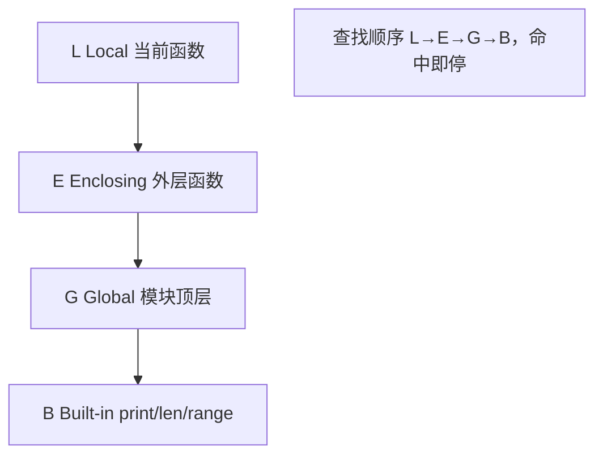

---

title: "LEGB作用域与global-nonlocal"

created: "2026-07-20"

tags:

  - 八股文

  - python

---


# LEGB作用域与global-nonlocal

## 一、为什么会有"作用域"（Scope）？


> 把你的 Python 文件想象成一栋楼。变量就是住在楼里的住户。你去喊一个人（`x`），得先确定去哪一层找——**作用域**就是"楼层规则"。


没有作用域会怎样？像早期 BASIC 那样所有变量都是全局的，谁都能改，程序一大就乱成一锅粥。Python 用 **LEGB** 四层"楼层"来约束变量能住哪、能被谁看见。


**LEGB** 是四层作用域的首字母缩写（全称 + 解释）：


- **L — Local（局部作用域）**：当前函数内部。你正站在自己房间。

- **E — Enclosing（闭包/外层作用域）**：包着你的外层函数。你在合租房，客厅是房东（外层函数）的。

- **G — Global（全局作用域）**：模块（.py 文件）顶层。整栋楼的大堂。

- **B — Built-in（内置作用域）**：Python 自带的名字，`print`、`len`、`range` 等。小区公共设施。


Python 找名字的顺序：**L → E → G → B**，找到第一个就停。都找不到 → `NameError`。





> **口诀**："里屋找不到，去客厅；客厅没有，去大堂；大堂也没有，去公共设施；都没有，报错。"


## 二、代码说话：LEGB 实战


```python

x = "全局x(G)"          # G 层


def outer():

    x = "外层x(E)"       # E 层

    def inner():

        x = "局部x(L)"    # L 层

        print(x)          # 命中 L → 打印 "局部x(L)"

    inner()

    print(x)              # 命中 E → 打印 "外层x(E)"


outer()

print(x)                  # 命中 G → 打印 "全局x(G)"

```


注意一个反直觉的点：**`if` / `for` / `while` 这些代码块不创建新作用域！** 只有函数、类、模块才创建。所以在 `for i in range(3):` 里定义的 `i`，出了循环还能用（在 Python 里这常被吐槽，但确实是这样）。


## 三、`UnboundLocalError`：最常见的坑


```python

count = 0

def increment():

    count = count + 1     # ❌ UnboundLocalError!

    return count

```


> 为什么会炸？Python 看到函数里写了 `count = ...`（赋值），就认定 `count` 是**局部变量**。但等号右边又去读 `count`——此时局部 `count` 还没赋值，于是报 `UnboundLocalError`。


**修法一：`global`**——明确说"我要用的是大堂那个"


```python

count = 0

def increment():

    global count          # 声明：下面的 count 是全局的

    count = count + 1

    return count

```


**修法二：`nonlocal`**——说"我要用的是外层函数那个"


```python

def outer():

    count = 0

    def inner():

        nonlocal count     # 声明：用外层(Enclosing)的 count

        count += 1

        return count

    return inner

```


| 关键字 | 作用范围 | 典型场景 |

| :--- | :--- | :--- |

| `global` | 模块顶层变量 | 在函数里改模块级配置 |

| `nonlocal` | 最近外层函数的变量 | 闭包里改外层状态（**不能**用于全局） |


> ⚠️ `nonlocal` 找不到外层同名变量会直接 `SyntaxError`；`global` 找不到则会**当场创建一个**全局变量，隐蔽又危险，慎用。


## 四、一句话讲清


"LEGB 是 Python 名字解析规则：Local → Enclosing → Global → Built-in，就近命中。函数内赋值会被当成局部变量，所以改全局要用 `global`，改闭包外层要用 `nonlocal`。只有函数、类、模块才引入新作用域，`if`/`for` 不引入。"


## 速记卡（面试闪卡）


**Q1：一句话讲清「LEGB 作用域 + global / nonlocal —— 变量到底去哪找」到底是什么？**

A：LEGB 是 Python 找变量名的四层规则：局部→闭包→全局→内置，就近命中、找到即停，都找不到就报错。


**Q2：LEGB 四层像一栋楼 —— 怎么理解？**

A：把 Python 文件想成一栋楼：Local 是你自己房间，Enclosing 是合租房客厅（外层函数），Global 是整栋楼大堂，Built-in 是小区公共设施（print/len）。找人先在自己屋找，没有就去客厅、大堂、公共设施，都没有就报错。


**Q3：global 与 nonlocal 怎么用 —— 怎么理解？**

A：函数里想改"大堂的变量"要喊 global 声明，想改"客厅的变量"要喊 nonlocal。好比你在自己房间要动房东（外层）的东西，得先说一声"我动的是客厅那台电视"。不声明就赋值会被当成你自己的新东西。


**Q4：UnboundLocalError 为什么是最常见坑 —— 怎么理解？**

A：只要函数里出现过"赋值"，Python 就认定那个名字是局部变量。所以 def f(): print(x); x=1 会在 print 那行炸——x 已被当局部却还没赋值。像你刚宣布"这是我的"，别人问"在哪"时你还揣兜里没掏出来。


**Q5：if/for 不引入作用域 —— 怎么理解？**

A：Python 里 if/for/while 代码块不隔离变量（和 JS 的 let 不同），循环里定义的 i 出了循环还在。好比会议室门大开，你在会里写的便利贴，散会后还贴在原地被人看见。只有函数、类、模块才关上门。


**Q6：核心速记主线有哪些？**

- LEGB 查找顺序：L→E→G→B，命中即停

- global 改全局、nonlocal 改闭包外层，都需显式声明

- 函数内赋值即局部，易踩 UnboundLocalError

- if/for 不隔离作用域，循环变量会泄露到外层


**口诀**

A：LEGB 找名字，里屋客厅大堂设施按顺序；

命中即停找不到，NameError 来报到。

函数内赋值算局部，改全局 global 改外层 nonlocal；

if for 不隔离，循环变量往外跑。


## 相关链接


- 📋 目录：[[00-Python]]

- 📚 学习清单：[[八股文学习路线图]]

- 🔗 [[语言与框架/Python/八股/基础/06-闭包原理|闭包原理]] — 闭包正是靠 Enclosing 作用域记住变量

- 🔗 [[语言与框架/Python/八股/基础/07-装饰器本质与手写|装饰器本质与手写]] — 装饰器本质是闭包的应用

- 🔗 [[语言与框架/TypeScript-React/八股/JavaScript/12-作用域链ScopeChain|JS作用域链]] — JS 作用域链与 LEGB 思想同源

- 🔗 [[语言与框架/TypeScript-React/八股/JavaScript/11-闭包Closure|JS闭包]] — Python 闭包 vs JS 闭包对比

