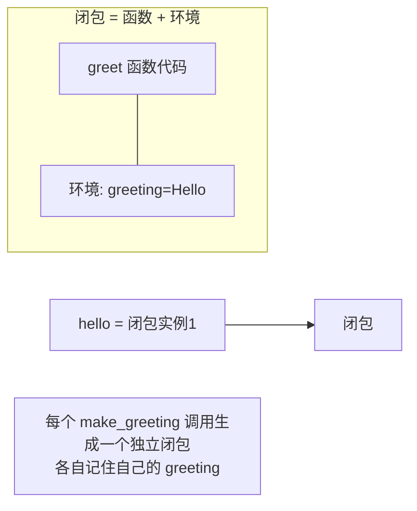
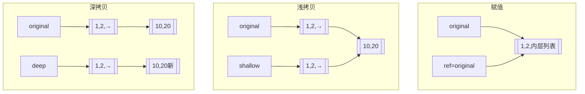

# 闭包（Closure）—— 函数"携带"的记忆

## 一、一句话定义

> **闭包（Closure）**：一个函数 + 它记住的外部环境变量，打包在一起。即使外层函数已经返回，内层函数依然能访问那些变量。

**生活类比**：你去常去的面馆，老板（`outer`）记住了你的口味（`flavor="不要香菜"`）。某天老板回老家了（外层函数返回），但你再去，新来的徒弟（`inner`）居然也知道"你不要香菜"——因为那张口味单（闭包的环境）被留下来了。

## 二、闭包的三个必要条件

1. 有一个**嵌套函数**（函数里定义函数）。
2. 内层函数**引用了外层函数的变量**。
3. 外层函数**返回内层函数**（不调用，只返回）。

```python
def make_greeting(greeting):      # 外层
    def greet(name):              # 内层
        return f"{greeting}, {name}!"   # 引用了外层的 greeting
    return greet                  # 返回内层函数对象（不调用）

hello = make_greeting("Hello")    # 外层已返回，但 greeting="Hello" 被记住
howdy = make_greeting("Howdy")
print(hello("Alice"))             # Hello, Alice!
print(howdy("Bob"))               # Howdy, Bob!
```

> 关键点：`make_greeting("Hello")` 执行完返回 `greet`，理论上 `greeting` 是局部变量该被销毁——但 `greet` 还引用它，所以 **Python 把 `greeting` 绑定进闭包一起保留**（成为自由变量 free variable）。



## 三、闭包的内存模型（加分）

- 闭包里的"被记住的变量"存在函数的 `__closure__` 属性里。
- 用 `cell_contents` 可以查看：

```python
def counter():
    n = 0
    def inc():
        nonlocal n
        n += 1
        return n
    return inc

c = counter()
print(c())   # 1
print(c())   # 2
print(c.__closure__[0].cell_contents)   # 2
```

> `n` 没被销毁，而是住在 `c.__closure__` 这个"小仓库"里。这就是闭包能**保持状态**的原因——比用全局变量优雅多了。

## 四、闭包的经典用途

| 用途 | 说明 |
| :--- | :--- |
| **工厂函数** | 批量生成带预设参数的函数（上例 `make_greeting`） |
| **装饰器** | 装饰器本质就是闭包（见 `07-装饰器本质与手写`） |
| **惰性求值 / 回调** | GUI、异步里常把上下文"封"进回调 |
| **状态保持** | 不用类也能保存状态（轻量对象） |

```python
# 用闭包实现"带幂次的幂函器"
def power_factory(p):
    def power(x):
        return x ** p
    return power

square = power_factory(2)
cube = power_factory(3)
print(square(5), cube(5))   # 25 125
```

## 五、一句话讲清

"闭包是函数加上它捕获的外部变量。条件是嵌套函数、内层引用外层变量、外层返回内层。它让函数'记住'了定义时的环境，常用于装饰器和工厂函数。内存上这些变量存在 `__closure__` 里不会被回收。"

## 1. 函数定义与抽取

### 1.1 为什么需要函数

两个场景对比——没有函数 vs 有函数：

```python
# 场景：多个地方需要计算两个数的和

# ❌ 没有函数——代码重复
a1, b1 = 3, 5
result1 = a1 + b1
print(f"{a1}+{b1}={result1}")

a2, b2 = 10, 20
result2 = a2 + b2
print(f"{a2}+{b2}={result2}")

a3, b3 = 7, 8
result3 = a3 + b3
print(f"{a3}+{b3}={result3}")
# 问题：逻辑重复三次，改一处要改三处

# ✅ 使用函数——代码复用
def add_and_print(a, b):
    """计算并打印两个数的和"""
    result = a + b
    print(f"{a}+{b}={result}")

add_and_print(3, 5)
add_and_print(10, 20)
add_and_print(7, 8)
# 优势：改一处就全部生效，代码行数更少
```

### 1.2 函数的四大好处

| 好处 | 说明 |
|------|------|
| **代码复用** | 同样的逻辑只写一次，到处调用 |
| **模块化** | 大问题拆成小函数，每个函数只做一件事 |
| **可测试** | 函数可以独立测试，更容易发现 Bug |
| **可读性** | 好的函数名本身就是注释 |

### 1.3 函数文档字符串

```python
def calculate_bmi(weight, height):
    """
    计算 BMI 指数

    参数:
        weight: 体重（千克）
        height: 身高（米）

    返回:
        BMI 值（浮点数）

    示例:
        >>> calculate_bmi(70, 1.75)
        22.86
    """
    return weight / (height ** 2)

# 查看文档
print(calculate_bmi.__doc__)
help(calculate_bmi)
```


## 2. 形参和实参

```python
def greet(name, greeting="Hello"):
    # name 和 greeting 是形参（形式参数）——函数定义时的占位符
    return f"{greeting}, {name}!"

# "World" 和 "Hi" 是实参（实际参数）——函数调用时传入的实际值
print(greet("World", "Hi"))  # "Hi, World!"
```

**关键理解**：
- **形参** = 定义时的占位变量
- **实参** = 调用时传入的真实数据
- 调用时实参的值被**赋给**形参


## 3. 函数执行内存分析

```python
def swap(a, b):
    print(f"swap 内部（交换前）：a={a}, b={b}")
    temp = a
    a = b
    b = temp
    print(f"swap 内部（交换后）：a={a}, b={b}")

x, y = 10, 20
print(f"调用前：x={x}, y={y}")
swap(x, y)
print(f"调用后：x={x}, y={y}")
# 输出：x 和 y 没有变！因为函数内的 a、b 是局部变量
```

**函数调用过程**：
1. 调用 `swap(x, y)` → 创建局部变量 `a = 10`, `b = 20`
2. 函数内部交换 a 和 b → `a = 20`, `b = 10`
3. 函数结束 → a 和 b 被销毁
4. x 和 y 从未被修改 → 仍然是 10 和 20


## 4. 传递不可变对象与可变对象 ⭐⭐

这是 Python 函数参数传递中最核心的概念：

### 4.1 不可变对象（int, str, tuple, float, bool）

```python
def modify(n, s):
    n = 100         # n 指向新对象 100，原参数不受影响
    s = "changed"   # s 指向新对象，原参数不受影响

num = 10
text = "original"
modify(num, text)
print(num)   # 10（不变！）
print(text)  # "original"（不变！）
```

### 4.2 可变对象（list, dict, set）

```python
def append_item(lst):
    lst.append(4)       # ⚠️ 修改了 lst 指向的对象本身！

nums = [1, 2, 3]
append_item(nums)
print(nums)             # [1, 2, 3, 4]（被修改了！）

def reassign(lst):
    lst = [4, 5, 6]     # 重新赋值：让局部变量 lst 指向新列表

nums2 = [1, 2, 3]
reassign(nums2)
print(nums2)            # [1, 2, 3]（不变！因为只是改了局部变量的指向）
```

> [!important] 核心区别
> - `obj.method()` 修改对象本身 → **影响外部**
> - `param = new_value` 改变变量指向 → **不影响外部**


## 5. 参数传递形式

### 5.1 位置参数

```python
def register(name, age, city):
    print(f"{name}, {age}岁, 来自{city}")

register("张三", 20, "北京")   # 按位置一一对应
# register(20, "张三", "北京")  # ❌ 顺序错了，语义全乱
```

### 5.2 关键字参数

```python
register(age=20, city="北京", name="张三")  # 指定参数名，顺序无所谓
register("张三", city="北京", age=20)       # 混合使用（位置在前）
```

### 5.3 默认参数

```python
def register(name, age, city="北京"):
    print(f"{name}, {age}岁, 来自{city}")

register("张三", 20)           # 使用默认值：city="北京"
register("李四", 25, "上海")   # 覆盖默认值

# ⚠️ 默认参数只初始化一次！可变对象是陷阱
def add_item(item, lst=[]):     # ❌ 危险！
    lst.append(item)
    return lst

print(add_item(1))  # [1]
print(add_item(2))  # [1, 2]（使用了同一个列表！）
print(add_item(3))  # [1, 2, 3]（共享同一个默认列表）

# 正确做法
def add_item(item, lst=None):
    if lst is None:
        lst = []           # 每次调用时创建新列表
    lst.append(item)
    return lst
```

### 5.4 可变参数 \*args

```python
def sum_all(*args):
    """求和任意数量的参数"""
    print(type(args))    # <class 'tuple'>
    print(args)          # (1, 2, 3, 4, 5)
    return sum(args)

print(sum_all(1, 2))           # 3
print(sum_all(1, 2, 3, 4, 5))  # 15

# *args 把多余的**位置参数**打包为元组
```

### 5.5 关键字参数 \*\*kwargs

```python
def print_info(**kwargs):
    """打印任意数量的关键字参数"""
    print(type(kwargs))   # <class 'dict'>
    for key, value in kwargs.items():
        print(f"{key}: {value}")

print_info(name="张三", age=20, city="北京")
# 输出：
# name: 张三
# age: 20
# city: 北京

# **kwargs 把多余的**关键字参数**打包为字典
```

### 5.6 组合使用

```python
# 参数顺序：位置 → *args → 关键字 → **kwargs
def func(a, b, *args, c=10, **kwargs):
    print(f"a={a}, b={b}")
    print(f"*args={args}")
    print(f"c={c}")
    print(f"**kwargs={kwargs}")

func(1, 2, 3, 4, 5, c=20, x=100, y=200)
# a=1, b=2
# *args=(3, 4, 5)
# c=20
# **kwargs={'x': 100, 'y': 200}
```

### 5.7 解包传参

```python
# * 解包列表/元组为位置参数
nums = [1, 2, 3]
print(*nums)                 # 等价于 print(1, 2, 3)

def add(a, b, c):
    return a + b + c

print(add(*[1, 2, 3]))       # 6

# ** 解包字典为关键字参数
info = {"name": "张三", "age": 20, "city": "北京"}
register(**info)             # 等价于 register(name="张三", age=20, city="北京")
```


## 6. 浅拷贝与深拷贝 ⭐⭐

```python
import copy

# 原始数据
original = [1, 2, [10, 20]]
print(f"原始：{original}")

# === 赋值（不是拷贝！）===
ref = original              # 只是两个变量指向同一个对象
ref[0] = 999
print(f"赋值后原始：{original}")  # [999, 2, [10, 20]] ← 变了！

# === 浅拷贝 ===
original = [1, 2, [10, 20]]
shallow = copy.copy(original)
shallow[0] = 100            # 修改第一层 → 不影响原始
shallow[2][0] = 999         # 修改嵌套层 → 影响原始！
print(f"浅拷贝后原始：{original}")  # [1, 2, [999, 20]]

# === 深拷贝 ===
original = [1, 2, [10, 20]]
deep = copy.deepcopy(original)
deep[0] = 100               # 不影响原始
deep[2][0] = 999            # 也不影响原始！
print(f"深拷贝后原始：{original}")  # [1, 2, [10, 20]] ← 完全不变
```



> [!important] 选择指南
> - 只有不可变数据（int, str 等） → 赋值就够了
> - 只有一层嵌套的 list/dict → 浅拷贝
> - 有多层嵌套的 list/dict → 深拷贝（或用 copy.deepcopy）


## 7. 方法的返回值

```python
# 单个返回值
def square(x):
    return x ** 2

# 多个返回值（实际返回一个元组）
def statistics(nums):
    return min(nums), max(nums), sum(nums)/len(nums)

lo, hi, avg = statistics([1, 2, 3, 4, 5])
print(f"最小:{lo}, 最大:{hi}, 平均:{avg}")

# 没有 return → 返回 None
def no_return():
    print("我什么都不返回")
    # 隐式 return None

result = no_return()
print(result)  # None
```


## 速记卡（面试闪卡）

**Q1：一句话讲清「闭包（Closure）—— 函数"携带"的记忆」到底是什么？**
A：**闭包（Closure）**：一个函数 + 它记住的外部环境变量，打包在一起。即使外层函数已经返回，内层函数依然能访问那些变量。
**生活类比**：你去常去的面馆，老板（）记住了你的口味（）。某天老板回老家了（外层函数返回），但你再去，新来的徒弟（）居然也知道"你不要香菜"——因为那张口味单（闭包的环境）被留下来了。

**Q2：一、一句话定义 —— 怎么理解？**
A：**闭包（Closure）**：一个函数 + 它记住的外部环境变量，打包在一起。即使外层函数已经返回，内层函数依然能访问那些变量。
**生活类比**：你去常去的面馆，老板（）记住了你的口味（）。某天老板回老家了（外层函数返回），但你再去，新来的徒弟（）居然也知道"你不要香菜"——因为那张口味单（闭包的环境）被留下来了。

**Q3：二、闭包的三个必要条件 —— 怎么理解？**
A：有一个**嵌套函数**（函数里定义函数）。
内层函数**引用了外层函数的变量**。
外层函数**返回内层函数**（不调用，只返回）。
关键点： 执行完返回 ，理论上  是局部变量该被销毁——但  还引用它，所以 **Python 把  绑定进闭包一起保留**（成为自由变量 free variable）。

**Q4：三、闭包的内存模型（加分） —— 怎么理解？**
A：闭包里的"被记住的变量"存在函数的  属性里。
用  可以查看：
 没被销毁，而是住在  这个"小仓库"里。这就是闭包能**保持状态**的原因——比用全局变量优雅多了。

**Q5：四、闭包的经典用途 —— 怎么理解？**
A：| 用途 | 说明 |
| :--- | :--- |
| **工厂函数** | 批量生成带预设参数的函数（上例 ） |
| **装饰器** | 装饰器本质就是闭包（见 ） |
| **惰性求值 / 回调** | GUI、异步里常把上下文"封"进回调 |
| **状态保持** | 不用类也能保存状态（轻量对象） |

**Q6：核心速记主线有哪些？**
A：抓住这几根：一、一句话定义、二、闭包的三个必要条件、三、闭包的内存模型（加分）、四、闭包的经典用途、五、一句话讲清、1. 函数定义与抽取。


## 相关链接
- 上一篇：[[05_容器类型]]
- 下一篇：[[07_函数进阶与文件]]

---
→ [[技术学习清单#函数与 OOP]]

## 相关链接

- 📋 目录：[[00-Python]]
- 📚 学习清单：[[八股文学习清单]]
- 🔗 [[语言与框架/Python/八股/基础/05-LEGB作用域与global-nonlocal|LEGB作用域]] — 闭包依赖 Enclosing 作用域
- 🔗 [[语言与框架/Python/八股/基础/07-装饰器本质与手写|装饰器本质与手写]] — 装饰器是闭包最典型的应用
- 🔗 [[语言与框架/TypeScript-React/八股/JavaScript/11-闭包Closure|JS闭包]] — Python 闭包 vs JS 闭包对比
- 🔗 [[语言与框架/TypeScript-React/八股/React/04-为什么需要Hooks|React Hooks]] — Hooks 用闭包"记住"状态，理念相通
