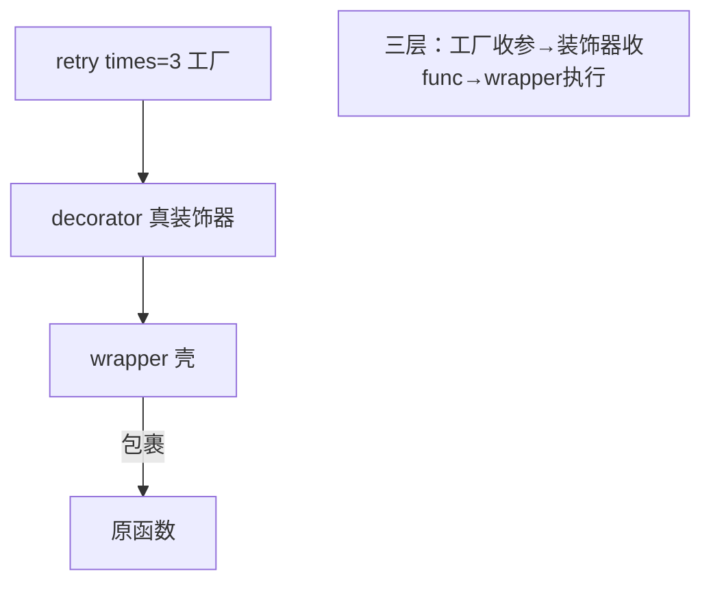

# 带参数的装饰器 —— 装饰器工厂

## 一、为什么需要"带参数"？

普通装饰器 `@deco` 等价于 `f = deco(f)`，只能收一个函数。但有时你想**给装饰器本身传参数**，比如 `@retry(times=3)`、`@route("/home")`。这就需要**三层嵌套**——一个"装饰器工厂"。

> **生活类比**：普通装饰器像"直接买件外套"；带参装饰器像"先告诉店员尺码颜色（工厂参数），店员再给你做一件合身的外套（真正的装饰器）"。多了一道"定制"工序。

## 二、三层结构拆解

```python
def retry(times=3):              # 第 1 层：收装饰器的参数，返回"真正的装饰器"
    def decorator(func):         # 第 2 层：收被装饰的函数，返回 wrapper
        def wrapper(*args, **kwargs):   # 第 3 层：替代函数
            for i in range(times):
                try:
                    return func(*args, **kwargs)
                except Exception as e:
                    print(f"第{i+1}次失败: {e}")
            return None
        return wrapper
    return decorator

@retry(times=3)                  # 等价于 f = retry(times=3)(f)
def unstable():
    import random
    if random.random() < 0.7:
        raise ValueError("网络抖了一下")
    return "成功"
```

调用链：`retry(times=3)` → 返回 `decorator` → `decorator(unstable)` → 返回 `wrapper`。所以 `@retry(times=3)` 实际是 `unstable = retry(times=3)(unstable)`。



## 三、经典手写题：`@repeat(n)` 重复执行

```python
def repeat(n):
    def decorator(func):
        def wrapper(*args, **kwargs):
            results = [func(*args, **kwargs) for _ in range(n)]
            return results
        return wrapper
    return decorator

@repeat(3)
def hello():
    print("hi")
    return "hi"

hello()     # 打印三次 hi，返回 ['hi','hi','hi']
```

## 四、类实现带参装饰器（进阶）

也可以用类 + `__call__` 实现，参数存到实例属性：

```python
class Retry:
    def __init__(self, times=3):
        self.times = times
    def __call__(self, func):
        def wrapper(*args, **kwargs):
            for _ in range(self.times):
                try:
                    return func(*args, **kwargs)
                except Exception:
                    pass
        return wrapper

@Retry(times=5)
def flaky(): ...
```

## 五、一句话讲清

"带参数装饰器就是三层函数：最外层收装饰器参数、返回真正的装饰器；中间层收被装饰函数；最内层是 wrapper。`@retry(3)` 等价于 `f = retry(3)(f)`。它本质是个'装饰器工厂'。"

## 速记卡（面试闪卡）

**Q1：一句话讲清「带参数的装饰器 —— 装饰器工厂」到底是什么？**
A：普通装饰器  等价于 ，只能收一个函数。但有时你想**给装饰器本身传参数**，比如 、。这就需要**三层嵌套**——一个"装饰器工厂"。
**生活类比**：普通装饰器像"直接买件外套"；带参装饰器像"先告诉店员尺码颜色（工厂参数），店员再给你做一件合身的外套（真正的装饰器）"。多了一道"定制"工序。

**Q2：一、为什么需要"带参数"？ —— 怎么理解？**
A：普通装饰器  等价于 ，只能收一个函数。但有时你想**给装饰器本身传参数**，比如 、。这就需要**三层嵌套**——一个"装饰器工厂"。
**生活类比**：普通装饰器像"直接买件外套"；带参装饰器像"先告诉店员尺码颜色（工厂参数），店员再给你做一件合身的外套（真正的装饰器）"。多了一道"定制"工序。

**Q3：二、三层结构拆解 —— 怎么理解？**
A：调用链： → 返回  →  → 返回 。所以  实际是 。

**Q4：四、类实现带参装饰器（进阶） —— 怎么理解？**
A：也可以用类 +  实现，参数存到实例属性：

**Q5：核心速记主线有哪些？**
A：抓住这几根：一、为什么需要"带参数"？、二、三层结构拆解、三、经典手写题：`@repeat(n)` 重复执行、四、类实现带参装饰器（进阶）、五、一句话讲清。


## 相关链接

- 📋 目录：[[00-Python]]
- 📚 学习清单：[[八股文学习清单]]
- 🔗 [[语言与框架/Python/八股/基础/07-装饰器本质与手写|装饰器本质与手写]] — 带参装饰器 = 普通装饰器外再包一层工厂
- 🔗 [[语言与框架/Python/八股/基础/09-functools-wraps的作用|functools.wraps的作用]] — 三层装饰器更别忘了 wraps
- 🔗 [[语言与框架/Python/八股/基础/06-闭包原理|闭包原理]] — 三层嵌套全是闭包
- 🔗 [[语言与框架/TypeScript-React/八股/JavaScript/11-闭包Closure|JS闭包]] — JS 装饰器提案对比
