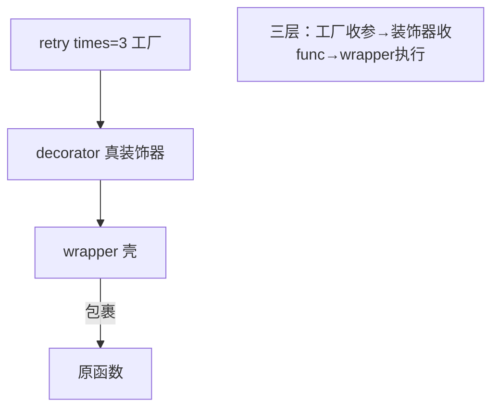

---

title: "带参数装饰器"

created: "2026-07-20"

tags:

  - 八股文

  - python

---


# 带参数装饰器

## 一、为什么需要"带参数"？


普通装饰器 `@deco` 等价于 `f = deco(f)`，只能收一个函数。但有时你想**给装饰器本身传参数**，比如 `@retry(times=3)`、`@route("/home")`。这就需要**三层嵌套**——一个"装饰器工厂"。


> **生活类比**：普通装饰器像"直接买件外套"；带参装饰器像"先告诉店员尺码颜色（工厂参数），店员再给你做一件合身的外套（真正的装饰器）"。多了一道"定制"工序。


## 二、三层结构拆解


```python

def retry(times=3):              # 第 1 层：收装饰器的参数，返回"真正的装饰器"

    def decorator(func):         # 第 2 层：收被装饰的函数，返回 wrapper

        def wrapper(*args, **kwargs):   # 第 3 层：替代函数

            for i in range(times):

                try:

                    return func(*args, **kwargs)

                except Exception as e:

                    print(f"第{i+1}次失败: {e}")

            return None

        return wrapper

    return decorator


@retry(times=3)                  # 等价于 f = retry(times=3)(f)

def unstable():

    import random

    if random.random() < 0.7:

        raise ValueError("网络抖了一下")

    return "成功"

```


调用链：`retry(times=3)` → 返回 `decorator` → `decorator(unstable)` → 返回 `wrapper`。所以 `@retry(times=3)` 实际是 `unstable = retry(times=3)(unstable)`。





## 三、经典手写题：`@repeat(n)` 重复执行


```python

def repeat(n):

    def decorator(func):

        def wrapper(*args, **kwargs):

            results = [func(*args, **kwargs) for _ in range(n)]

            return results

        return wrapper

    return decorator


@repeat(3)

def hello():

    print("hi")

    return "hi"


hello()     # 打印三次 hi，返回 ['hi','hi','hi']

```


## 四、类实现带参装饰器（进阶）


也可以用类 + `__call__` 实现，参数存到实例属性：


```python

class Retry:

    def __init__(self, times=3):

        self.times = times

    def __call__(self, func):

        def wrapper(*args, **kwargs):

            for _ in range(self.times):

                try:

                    return func(*args, **kwargs)

                except Exception:

                    pass

        return wrapper


@Retry(times=5)

def flaky(): ...

```


## 五、一句话讲清


"带参数装饰器就是三层函数：最外层收装饰器参数、返回真正的装饰器；中间层收被装饰函数；最内层是 wrapper。`@retry(3)` 等价于 `f = retry(3)(f)`。它本质是个'装饰器工厂'。"


## 速记卡（面试闪卡）


**Q1：一句话讲清「带参数的装饰器 —— 装饰器工厂」到底是什么？**

A：带参数装饰器是个"装饰器工厂"：三层嵌套，最外层收参数、返回真正装饰函数、再包一层 wrapper。


**Q2：一、为什么需要"带参数" —— 怎么理解？ —— 怎么理解？**

A：像买外套：普通装饰器是"直接拿一件"；带参装饰器是"先告诉店员尺码颜色（工厂参数），店员再给你做合身的一件"。典型需求：重试次数 @retry(times=3)、路由 @route("/home")、权限 @require_role("admin")。英文：decorator factory。


**Q3：二、三层结构怎么拆 —— 怎么理解？ —— 怎么理解？**

A：像套娃：第 1 层 retry(times=3) 收参数、返回"真装饰器"；第 2 层 decorator(func) 收函数、返回 wrapper；第 3 层 wrapper 是替代函数，用 times 控重试。@retry(3) 展开即 f = retry(3)(f)。英文：closure / higher-order function。


**Q4：三、类实现带参装饰器 —— 怎么理解？ —— 怎么理解？**

A：像用一台带设置旋钮的机器：class Retry 在 __init__ 存 times，__call__ 收函数并返回 wrapper。@Retry(times=5) 先实例化再调用包裹函数。类式能存更多状态、易扩展；函数式三层直观。本质都是"先生成针对参数的装饰器"。英文：callable class / __call__。


**Q5：四、别忘了 @wraps —— 怎么理解？ —— 怎么理解？**

A：像三层快递盒更容易贴错寄件人：wrapper 会"偷走"原函数的 __name__/__doc__，层数越多元信息越失真。所以在 wrapper 上加 @wraps(func)，让 traceback 显示真实函数名，调试栈帧才不乱。英文：functools.wraps / metadata。


**Q6：核心速记主线有哪些？**

- 本质：带参装饰器=装饰器工厂，三层嵌套收参后再装饰函数

- 三层：外层收参数、中层收 func、内层 wrapper 执行

- 等价：@retry(3) 即 f = retry(3)(f)，先造装饰器再包函数

- 类式：__init__ 存参 + __call__ 包裹，能存更多状态

- 注意：wrapper 加 @wraps(func) 保住原函数名与文档


**口诀**

A：带参装饰工厂造，三层嵌套收参数；

外层收参中层包，内层 wrapper 替原跑；

类加 __call__ 也能写，状态更多扩展好；

@wraps 别忘了，原名文档保得牢。


## 相关链接


- 📋 目录：[[00-Python]]

- 📚 学习清单：[[八股文学习路线图]]

- 🔗 [[语言与框架/Python/八股/基础/07-装饰器本质与手写|装饰器本质与手写]] — 带参装饰器 = 普通装饰器外再包一层工厂

- 🔗 [[语言与框架/Python/八股/基础/09-functools-wraps的作用|functools.wraps的作用]] — 三层装饰器更别忘了 wraps

- 🔗 [[语言与框架/Python/八股/基础/06-闭包原理|闭包原理]] — 三层嵌套全是闭包

- 🔗 [[语言与框架/TypeScript-React/八股/JavaScript/11-闭包Closure|JS闭包]] — JS 装饰器提案对比

