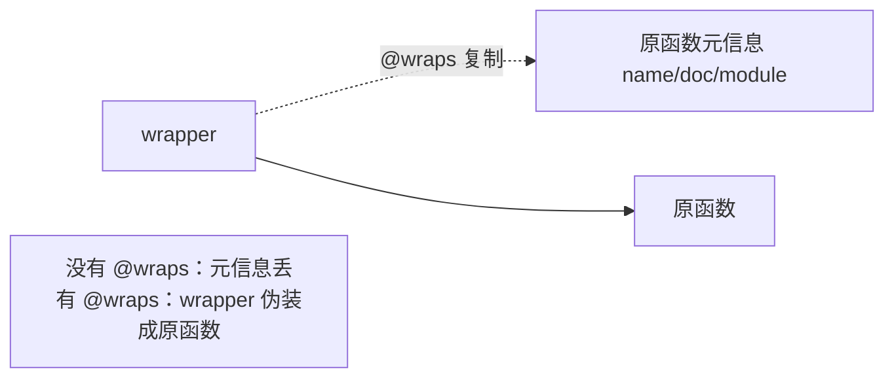

# functools.wraps —— 别让装饰器"偷走"元信息

## 一、问题：装饰器会"吃掉"原函数的身份证

回看 `07-装饰器本质与手写` 里的 `logger`：

```python
def logger(func):
    def wrapper(*args, **kwargs):
        return func(*args, **kwargs)
    return wrapper

@logger
def add(a, b):
    """求两数之和"""
    return a + b

print(add.__name__)     # wrapper  ← 原名叫 add！
print(add.__doc__)      # None     ← 原文档串没了！
```

> 因为 `add` 已经被替换成 `wrapper`，所以 `add.__name__` 是 `"wrapper"`，`__doc__` 也没了。这在调试、日志、`inspect` 反射、Flask 路由名等场景会出大乱子。

## 二、解法：`@wraps(func)` 把元信息"抄"回来

`functools.wraps` 是一个**专门给装饰器用的装饰器**，它把原函数的 `__name__`、`__doc__`、`__module__`、`__dict__` 等元信息复制到 wrapper 上。

```python
from functools import wraps

def logger(func):
    @wraps(func)                 # 关键！把 func 的元信息复制到 wrapper
    def wrapper(*args, **kwargs):
        print(f"调用 {func.__name__}")
        return func(*args, **kwargs)
    return wrapper

@logger
def add(a, b):
    """求两数之和"""
    return a + b

print(add.__name__)     # add      ← 正确了！
print(add.__doc__)      # 求两数之和 ← 正确了！
```



## 三、`wraps` 到底做了什么？

`wraps(func)` 内部近似于：

```python
wrapper.__name__ = func.__name__
wrapper.__doc__ = func.__doc__
wrapper.__module__ = func.__module__
wrapper.__dict__.update(func.__dict__)
wrapper.__wrapped__ = func     # 保留指向原函数的引用
```

它还顺手设置了 `__wrapped__`，方便你 `functools.unwrap()` 拿到最原始函数（比如绕过缓存装饰器）。

## 四、什么时候必须用？—— 几乎总是

| 场景 | 不写 `@wraps` 的后果 |
| :--- | :--- |
| 调试 / traceback | 报错显示 `wrapper`，看不出真实函数 |
| `help(add)` / 文档 | 文档串丢失 |
| 反射 / 序列化框架 | 拿不到真实函数名，路由注册错乱 |
| 多层装饰器叠加 | 元信息层层失真 |

> **铁律**：**只要你写装饰器，内层 wrapper 上就加 `@wraps(func)`。** 这是专业素养，重点掌握。

## 五、一句话讲清

"`functools.wraps` 是个装饰器，用来把被装饰函数的 `__name__`、`__doc__` 等元信息复制到 wrapper 上。不加的话，装饰后的函数会丢失原身份，导致调试、文档、反射出错。写装饰器时 wrapper 上永远加 `@wraps(func)`。"

## 速记卡（面试闪卡）

**Q1：一句话讲清「functools.wraps —— 别让装饰器"偷走"元信息」到底是什么？**
A：回看  里的 ：
因为  已经被替换成 ，所以  是 ， 也没了。这在调试、日志、 反射、Flask 路由名等场景会出大乱子。

**Q2：一、问题：装饰器会"吃掉"原函数的身份证 —— 怎么理解？**
A：回看  里的 ：
因为  已经被替换成 ，所以  是 ， 也没了。这在调试、日志、 反射、Flask 路由名等场景会出大乱子。

**Q3：二、解法：`@wraps(func)` 把元信息"抄"回来 —— 怎么理解？**
A：是一个**专门给装饰器用的装饰器**，它把原函数的 、、、 等元信息复制到 wrapper 上。

**Q4：三、`wraps` 到底做了什么？ —— 怎么理解？**
A：内部近似于：
它还顺手设置了 ，方便你  拿到最原始函数（比如绕过缓存装饰器）。

**Q5：四、什么时候必须用？—— 几乎总是 —— 怎么理解？**
A：| 场景 | 不写  的后果 |
| :--- | :--- |
| 调试 / traceback | 报错显示 ，看不出真实函数 |
|  / 文档 | 文档串丢失 |
| 反射 / 序列化框架 | 拿不到真实函数名，路由注册错乱 |
| 多层装饰器叠加 | 元信息层层失真 |
**铁律**：**只要你写装饰器，内层 wrapper 上就加 。** 这是专业素养，重点掌握。

**Q6：核心速记主线有哪些？**
A：抓住这几根：一、问题：装饰器会"吃掉"原函数的身份证、二、解法：`@wraps(func)` 把元信息"抄"回来、三、`wraps` 到底做了什么？、四、什么时候必须用？—— 几乎总是、五、一句话讲清。


## 相关链接

- 📋 目录：[[00-Python]]
- 📚 学习清单：[[八股文学习清单]]
- 🔗 [[语言与框架/Python/八股/基础/07-装饰器本质与手写|装饰器本质与手写]] — 写装饰器必加 wraps
- 🔗 [[语言与框架/Python/八股/基础/08-带参数装饰器|带参数装饰器]] — 三层装饰器更别忘了 wraps
- 🔗 [[语言与框架/Python/八股/基础/06-闭包原理|闭包原理]] — wraps 本身也是装饰器（闭包）
- 🔗 [[语言与框架/TypeScript-React/八股/JavaScript/11-闭包Closure|JS闭包]] — JS 装饰器元信息问题对比
