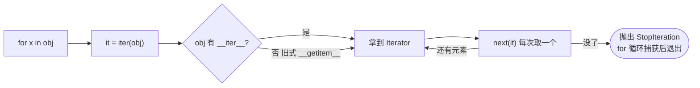

# 迭代器 vs 可迭代对象

## 一、一句话区分

- **可迭代对象 Iterable**：能被 `for` 循环“逐个拿出来”的东西（实现了 `__iter__`）。你可以反复向它要一个“发牌员”。
- **迭代器 Iterator**：真正“一个一个吐出来”的状态机（同时实现 `__iter__` 返回自身 + `__next__` 取下一个）。

> **生活化比喻**：Iterable 像“一叠牌”，Iterable 自己不会发牌；Iterator 像“发牌员”，他手上记着发到哪一张了，你每次喊 `next()` 他就发下一张，发完就摊手说没了（`StopIteration`）。

## 二、Duck Typing 判断标准

| 角色 | 必须实现的方法 | 含义 |
| :--- | :--- | :--- |
| 可迭代对象 Iterable | `__iter__()`（返回迭代器） | “我能给你一个发牌员” |
| 迭代器 Iterator | `__iter__()`（返回 `self`）+ `__next__()` | “我就是发牌员，每次发一张” |

> 迭代器一定是可迭代对象（因为也有 `__iter__`），但**可迭代对象不一定是迭代器**（list 不是迭代器）。

## 三、关系与执行流程



## 四、可运行代码示例

```python
from collections.abc import Iterable, Iterator

class CountDown:
    def __init__(self, n):
        self.n = n
    def __iter__(self):            # 可迭代对象：返回迭代器（这里返回自身）
        return self
    def __next__(self):            # 迭代器：返回下一项
        if self.n <= 0:
            raise StopIteration
        self.n -= 1
        return self.n

cd = CountDown(3)
print(isinstance(cd, Iterable))   # True
print(isinstance(cd, Iterator))   # True（因为 __iter__ 返回 self）

for x in cd:
    print(x)                      # 2 1 0

# list 是可迭代对象，但不是迭代器
lst = [1, 2, 3]
print(isinstance(lst, Iterable))  # True
print(isinstance(lst, Iterator))  # False
it = iter(lst)                    # 用内置 iter() 拿到迭代器
print(isinstance(it, Iterator))   # True
print(next(it), next(it))         # 1 2
```

## 五、核心考点

1. **迭代器是“一次性”的**：数据被“消费”后耗尽，再 `next()` 直接 `StopIteration`。想重新遍历需重新 `iter(obj)`。
2. **生成器（generator）一定是迭代器**，但迭代器不一定是生成器——生成器只是写起来更省事的一种迭代器。
3. **`for` 循环底层**：先 `it = iter(obj)`，再不断 `next(it)`，捕获 `StopIteration` 后悄悄退出。
4. **为什么 `list` 不是迭代器**：列表要保持“可重复遍历”，而迭代器会记住进度并消费数据（像网络流、大文件只能读一次，就必须用迭代器/生成器）。

## 六、对比速查表

| | 可迭代对象 Iterable | 迭代器 Iterator |
| :--- | :--- | :--- |
| 必须方法 | `__iter__` | `__iter__` + `__next__` |
| 能被 `for` 遍历 | ✅ | ✅ |
| 是否记住进度 | ❌ | ✅ |
| 能否重复遍历 | ✅ | ❌（一次性） |
| 典型例子 | `list` / `dict` / `str` / `set` | `iter(list)`、生成器 |

---

## 速记卡（面试闪卡）

**Q1：一句话讲清「迭代器 vs 可迭代对象」到底是什么？**
A：**可迭代对象 Iterable**：能被  循环“逐个拿出来”的东西（实现了 ）。你可以反复向它要一个“发牌员”。
**迭代器 Iterator**：真正“一个一个吐出来”的状态机（同时实现  返回自身 +  取下一个）。

**Q2：一、一句话区分 —— 怎么理解？**
A：**可迭代对象 Iterable**：能被  循环“逐个拿出来”的东西（实现了 ）。你可以反复向它要一个“发牌员”。
**迭代器 Iterator**：真正“一个一个吐出来”的状态机（同时实现  返回自身 +  取下一个）。
**生活化比喻**：Iterable 像“一叠牌”，Iterable 自己不会发牌；Iterator 像“发牌员”，他手上记着发到哪一张了，你每次喊  他就发下一张，发完就摊手说没了（）。

**Q3：二、Duck Typing 判断标准 —— 怎么理解？**
A：| 角色 | 必须实现的方法 | 含义 |
| :--- | :--- | :--- |
| 可迭代对象 Iterable | （返回迭代器） | “我能给你一个发牌员” |
| 迭代器 Iterator | （返回 ）+  | “我就是发牌员，每次发一张” |
迭代器一定是可迭代对象（因为也有 ），但**可迭代对象不一定是迭代器**（list 不是迭代器）。

**Q4：核心速记主线有哪些？**
A：抓住这几根：一、一句话区分、二、Duck Typing 判断标准、三、关系与执行流程、四、可运行代码示例、五、核心考点、六、对比速查表。


## 相关链接

- 📋 目录：[[00-Python]]
- 📚 学习清单：[[八股文学习清单]]
- 🔗 [[语言与框架/Python/八股/基础/11-列表推导式vs生成器表达式|列表推导式vs生成器表达式]] — 生成器表达式返回的就是迭代器
- 🔗 [[语言与框架/Python/八股/并发/10-生成器与yield原理|生成器与yield原理]] — 生成器是最常用的迭代器
- 🔗 [[语言与框架/Python/八股/并发/12-yield from委托生成器|yield from委托生成器]] — 委托给另一个迭代器
- 🔗 [[计算机基础/设计模式/00-设计模式|设计模式八股文]] — 迭代器模式在 OOP 中的定位
- 🔗 [[计算机基础/操作系统/00-操作系统|操作系统八股文]] — 迭代/遍历与底层数据结构的关联
