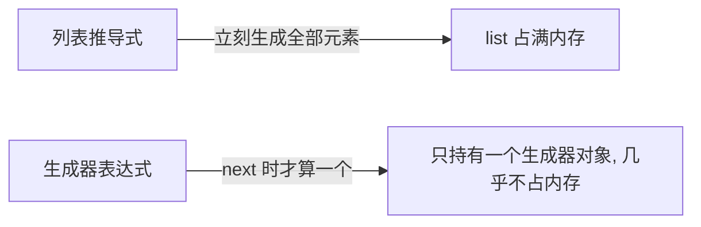

---

title: "列表推导式 vs 生成器表达式"

created: "2026-07-20"

tags:

  - 八股文

  - python

---


# 列表推导式 vs 生成器表达式

## 一、长相区别


- **列表推导式 List Comprehension**：用**方括号** `[x for x in ...]`，**立刻**把结果全部算完，返回一个 `list`。

- **生成器表达式 Generator Expression**：用**圆括号** `(x for x in ...)`，返回一个 **generator（迭代器）**，**按需惰性计算**，每次 `next()` 才算一个。


> **生活化比喻**：列表推导式像“把一整盘饺子全包好、码齐端上桌”——占满一桌子（内存）；生成器像“现包现煮”，吃一个包一个，桌上始终只摆着一碗，几乎不占地方。


## 二、内存与计算时机





```python

import sys


lc = [i * i for i in range(10_000_000)]   # 立刻占用大量内存

print(sys.getsizeof(lc))                   # 几千万字节


gen = (i * i for i in range(10_000_000))   # 立即返回的只是生成器对象

print(sys.getsizeof(gen))                  # 约几十字节


print(next(gen))                           # 0

print(next(gen))                           # 1

# 生成器只能遍历一次，耗尽后再 next 抛 StopIteration

```


## 三、对比速查表


| | 列表推导式 | 生成器表达式 |
| :--- | :--- | :--- |
| 语法 | `[...]` | `(...)` |
| 返回类型 | `list` | `generator`（Iterator） |
| 计算时机 | 立即、全部 | 惰性，按需 |
| 内存占用 | 大（存全部） | 极小（存算法） |
| 可否重复遍历 | ✅ | ❌（一次性） |
| 可否取下标 / `len` | ✅ | ❌ |
| 适合场景 | 结果要反复用、量小 | 大数据流、管道处理 |


## 四、高频考点


1. 生成器表达式在**已经处于括号中时可省略外层圆括号**：`sum(i * i for i in range(10))`、`any(x > 0 for x in data)`。

2. 处理**大文件 / 海量数据**优先生成器，避免一次性读入撑爆内存。

3. 生成器表达式本质就是一个“匿名生成器函数”，等价于带 `yield` 的函数。

4. `map()` / `filter()` 返回的是迭代器（惰性），和生成器表达式思路一致；而 `list(map(...))` 才立刻物化。


```python

# 管道风格：每个环节都是惰性迭代器，内存恒定

lines = (line.strip() for line in open("big.txt", encoding="utf-8"))

nums  = (int(line) for line in lines if line.isdigit())

total = sum(nums)        # 边读边算，从不大块占内存

```


---


## 速记卡（面试闪卡）


**Q1：一句话讲清「列表推导式 vs 生成器表达式」到底是什么？**

A：列表推导式用方括号立刻算完全部返回 list，生成器表达式用圆括号惰性计算返回 generator。


**Q2：一、长相区别 —— 怎么理解？**

A：列表推导式（List Comprehension）用方括号 `[x for x in ...]`，立刻把所有结果算完返回一个 list；生成器表达式（Generator Expression）用圆括号 `(x for x in ...)`，返回一个 generator（迭代器，英文 Iterator），按需惰性计算，每次 next() 才算一个。比喻：列表像把一整盘饺子全包好码齐端上桌（占满桌），生成器像现包现煮、吃一个包一个，桌上只摆一碗。


**Q3：二、内存与计算时机 —— 怎么理解？**

A：内存天差地别：`[i*i for i in range(10_000_000)]` 立刻占几千万字节；`(i*i for i in range(10_000_000))` 立即返回的只是几十字节的生成器对象（sys.getsizeof 一眼看出）。所以处理大数据流、大文件优先生成器，避免一次性读入撑爆内存。生成器只能遍历一次，耗尽早 next 抛 StopIteration。


**Q4：三、对比速查表 —— 怎么理解？**

A：速查表：语法 `[...]` vs `(...)`；返回 list vs generator；计算时机 立即全部 vs 惰性按需；内存 大 vs 极小；可否重复遍历 可 vs 不可；可否取下标/len 可 vs 不可；适合 结果要反复用、量小 vs 大数据流、管道处理。一句话：要反复用、量小→列表；海量、流式→生成器。


**Q5：四、高频考点 —— 怎么理解？**

A：高频考点：① 生成器表达式已处在括号中可省外层圆括号——`sum(i*i for i in range(10))`、`any(x>0 for x in data)`；② 处理大文件/海量数据优先生成器；③ 生成器表达式本质就是"匿名生成器函数"，等价于带 yield 的函数；④ map()/filter() 返回迭代器（惰性），list(map(...)) 才立刻物化。管道风格边读边算内存恒定。


**Q6：核心速记主线有哪些？**

- 方括号立刻全算 vs 圆括号惰性按需

- 内存 MB vs 几十 B；列表可重复/取下标，生成器一次性

- 已处括号中可省外层圆括号

- 生成器即迭代器；map/filter 也惰性，list() 才物化


**口诀**

A：方括号立刻全算占满内存，圆括号惰性只持生成器；

列表可取下标可重复，生成器一次性不能。

大文件大流量用生成器，括号中省外层圆括号；

生成器本是迭代器，map filter 也惰性。


## 相关链接


- 📋 目录：[[00-Python]]

- 📚 学习清单：[[八股文学习路线图]]

- 🔗 [[语言与框架/Python/八股/基础/10-迭代器vs可迭代对象|迭代器vs可迭代对象]] — 生成器表达式返回的就是迭代器

- 🔗 [[语言与框架/Python/八股/并发/10-生成器与yield原理|生成器与yield原理]] — 生成器表达式是生成器的快捷写法

- 🔗 [[语言与框架/Python/八股/基础/03-深浅拷贝|深浅拷贝]] — 列表推导式 `[x for x in lst]` 是浅拷贝的一种写法

- 🔗 [[计算机基础/操作系统/00-操作系统|操作系统八股文]] — 惰性求值与流式处理的思想

- 🔗 [[语言与框架/TypeScript-React/八股/00-React-TS-JS|React-TS-JS八股文]] — JS 生成器与 Python 生成器对比

