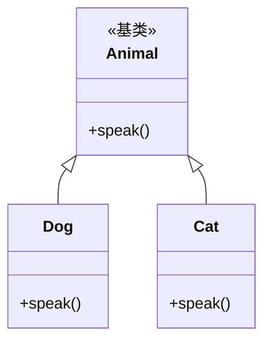
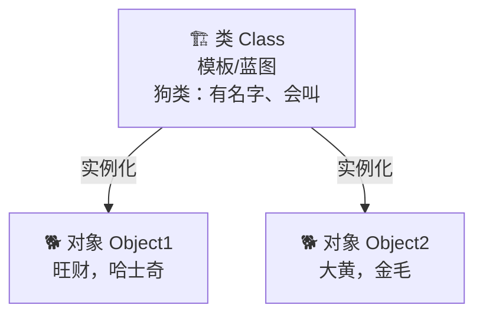

---

title: "面向对象三大特性"

created: "2026-07-20"

tags:

  - 八股文

  - python

---

# 面向对象三大特性

## 一、总览：封装 / 继承 / 多态

- **封装 Encapsulation**：把数据（属性）和行为（方法）打包进类，**隐藏内部实现细节**，只暴露必要的接口。

- **继承 Inheritance**：子类复用父类的代码，建立 “is-a” 关系，减少重复。

- **多态 Polymorphism**：同一接口，不同实现——父类引用指向子类对象时，调用表现出不同行为。

> **生活化比喻**：

> - 封装 = 智能手机把电路板和芯片全藏起来，只留屏幕和按键给你按，你不用懂内部怎么工作。

> - 继承 = 智能机和老人机都“是手机”，共享“能打电话”这个能力，但又各自加了不同功能。

> - 多态 = 同样是按“拍照键”，不同手机拍出不同效果——同一个动作，结果随对象而变。

## 二、继承 + 多态示例



```python

class Animal:

    def speak(self):

        raise NotImplementedError("子类必须实现 speak")

class Dog(Animal):

    def speak(self):

        return "汪汪"

class Cat(Animal):

    def speak(self):

        return "喵喵"

def let_it_speak(a: Animal):

    print(a.speak())        # 多态：传入谁，就表现谁的行为

let_it_speak(Dog())         # 汪汪

let_it_speak(Cat())         # 喵喵

```

## 三、封装示例（Python 的“私有”约定）

```python

class BankAccount:

    def __init__(self, balance):

        self.__balance = balance     # __ 触发名称修饰，外部不能直接改

    def deposit(self, n):

        if n > 0:

            self.__balance += n

    def get_balance(self):

        return self.__balance

acc = BankAccount(100)

acc.deposit(50)

print(acc.get_balance())    # 150

# print(acc.__balance)      # AttributeError：被名称修饰成 _BankAccount__balance

```

## 四、核心考点

1. **Python 没有真正的私有**：单下划线 `_x` 表示“受保护”（约定，仍可访问）；双下划线 `__x` 触发**名称修饰**变成 `_ClassName__x`，只是增加访问难度。

2. **鸭子类型 Duck Typing**：Python 的多态不依赖继承——“像鸭子走路、叫起来像鸭子，那就是鸭子”。只要对象有 `speak` 方法就能传进去，不强制是 `Animal` 子类。

3. **优先用组合而非继承**（Composition over Inheritance）：继承耦合强，组合更灵活、更易测试。

4. **MRO 方法解析顺序**：多继承时按 **C3 线性化** 算法决定调用顺序，可用 `ClassName.__mro__` 查看；`super()` 就是按 MRO 找下一个。

---

## 1. 图片拷贝案例（带优化）

以文件拷贝的场景引入 OOP 的优势：

```python

# 面向过程的写法

def copy_image(source_path, dest_path):

    """拷贝图片：面向过程"""

    with open(source_path, "rb") as src:

        data = src.read()

    with open(dest_path, "wb") as dst:

        dst.write(data)

# 面向对象的写法

class ImageCopier:

    """图片拷贝器"""

    def __init__(self, buffer_size=8192):

        self.buffer_size = buffer_size

    def copy(self, source, dest):

        """拷贝单个文件（带进度显示）"""

        import os

        total = os.path.getsize(source)

        copied = 0

        with open(source, "rb") as src, open(dest, "wb") as dst:

            while True:

                chunk = src.read(self.buffer_size)

                if not chunk:

                    break

                dst.write(chunk)

                copied += len(chunk)

                progress = copied / total * 100

                print(f"\r进度：{progress:.1f}%", end="")

    def batch_copy(self, file_pairs):

        """批量拷贝"""

        for src, dst in file_pairs:

            print(f"\n拷贝：{src} → {dst}")

            self.copy(src, dst)

```

## 2. 面向过程 vs 面向函数式 vs 面向对象

```python

# 方式一：面向过程（数据与操作分离）

student_scores = {"张三": 85, "李四": 92}

def get_average(scores):

    return sum(scores.values()) / len(scores)

avg = get_average(student_scores)

# 方式二：面向函数式（纯函数，无副作用）

from statistics import mean

avg = mean(student_scores.values())

# 方式三：面向对象（数据与操作绑定）

class StudentManager:

    def __init__(self):

        self.students = {}       # 数据封装在对象内部

    def add(self, name, score):

        self.students[name] = score

    def average(self):

        return sum(self.students.values()) / len(self.students)

    def top_n(self, n):

        return sorted(self.students.items(),

                     key=lambda x: x[1], reverse=True)[:n]

mgr = StudentManager()

mgr.add("张三", 85)

mgr.add("李四", 92)

print(mgr.average())   # 88.5

print(mgr.top_n(1))    # [('李四', 92)]

```

| 范式 | 核心思想 | 优点 |
|------|---------|------|
| **面向过程** | 函数 + 全局数据 | 简单直接，小脚本够用 |
| **面向函数式** | 纯函数、无副作用 | 易于测试、并发安全 |
| **面向对象** | 对象 = 数据 + 方法 | 封装、复用、扩展性强 |

## 3. 类和对象的概念



```python

# 类 = 模板（抽象概念）

class Dog:

    """狗类：定义狗有什么属性和行为"""

    species = "犬科"          # 类属性（所有狗共享）

    def __init__(self, name, breed):

        self.name = name       # 实例属性（每只狗不同）

        self.breed = breed

    def bark(self):

        return f"{self.name}：汪汪！"

# 对象 = 根据模板创建的具体实例

dog1 = Dog("旺财", "哈士奇")    # 实例化

dog2 = Dog("大黄", "金毛")

print(dog1.name)      # "旺财"

print(dog1.bark())    # "旺财：汪汪！"

print(dog1.species)   # "犬科"（类属性，所有狗共享）

```

### 3.1 内存分析

```python

# 每个对象在内存中有独立的空间

class Person:

    def __init__(self, name):

        self.name = name

p1 = Person("张三")

p2 = Person("张三")

print(p1 == p2)   # False（两个不同的对象，虽然值相同）

print(p1 is p2)   # False（不是同一个对象）

# 除非定义了 __eq__ 方法（Day 10 Magic Method 会讲）

```

## 4. `__init__` 方法与 self
### 4.1 `__init__` 初始化方法

```python

class Student:

    def __init__(self, name, age):

        """

        初始化方法：创建对象时自动调用

        self 指向新创建的对象本身

        """

        print(f"创建学生：{name}")

        self.name = name     # 把参数存到对象的属性

        self.age = age

s = Student("张三", 20)

# 3. __init__ 中的 self.name = name 等价于 s.name = name

```

### 4.2 self 的理解

```python

class Counter:

    def __init__(self):

        self.count = 0

    def increment(self):

        self.count += 1

c = Counter()

c.increment()          # 等价于 Counter.increment(c)

# self 就是 c，所以 self.count 就是 c.count

```

> [!important] self 不是关键字！

> `self` 只是一个**约定俗成的名字**，你可以用别的名字，但**绝对不要这样做**。

## 5. 类属性 vs 实例属性

```python

class Student:

    school = "尚硅谷"         # 类属性：所有实例共享

    student_count = 0         # 类属性：计数用

    def __init__(self, name):

        self.name = name      # 实例属性：每个实例独有

        Student.student_count += 1  # 修改类属性需用类名

s1 = Student("张三")

s2 = Student("李四")

print(s1.name)               # "张三"（实例属性）

print(Student.student_count) # 2（类属性）

print(s1.school)             # "尚硅谷"（继承类属性）

print(s2.school)             # "尚硅谷"（同一个类属性）

# ⚠️ 陷阱：通过实例修改类属性

s1.school = "北大"            # 这不是修改类属性！是给 s1 创建了一个同名实例属性

print(s1.school)             # "北大"（s1 的实例属性遮蔽了类属性）

print(s2.school)             # "尚硅谷"（s2 没受影响，访问的还是类属性）

print(Student.school)        # "尚硅谷"（类属性没变！）

```

## 6. 实例方法、类方法、静态方法

```python

class MyClass:

    class_var = "类变量"

    def __init__(self, name):

        self.name = name

    # 实例方法：第一个参数是 self，操作实例数据

    def instance_method(self):

        return f"我是 {self.name}"

    # 类方法：第一个参数是 cls，操作类数据

    @classmethod

    def class_method(cls):

        return f"类变量 = {cls.class_var}"

    # 静态方法：不需要 self 或 cls，独立工具函数

    @staticmethod

    def static_method(x, y):

        return x + y

# 使用

obj = MyClass("测试")

print(obj.instance_method())       # "我是 测试"

print(MyClass.class_method())      # "类变量 = 类变量"

print(MyClass.static_method(3, 5)) # 8

```

| 方法类型 | 装饰器 | 第一个参数 | 访问 | 典型用途 |
|----------|--------|-----------|------|---------|
| 实例方法 | 无 | `self` | 实例+类 | 操作实例数据（最常用） |
| 类方法 | `@classmethod` | `cls` | 类 | 工厂方法、修改类属性 |
| 静态方法 | `@staticmethod` | 无 | 无 | 与类相关的工具函数 |

## 7. 动态添加属性和方法

```python

class Person:

    def __init__(self, name):

        self.name = name

p = Person("张三")

# 动态添加实例属性（只对这个实例有效）

p.age = 20

print(p.age)  # 20

# 动态添加方法

def say_hello(self):

    return f"你好，我是 {self.name}"

# 方式一：添加到实例（需要特殊处理）

import types

p.say_hello = types.MethodType(say_hello, p)

# 方式二：添加到类（所有实例都能用）

Person.say_hello = say_hello

p2 = Person("李四")

print(p2.say_hello())  # "你好，我是 李四"

```

> [!warning] 动态添加虽然灵活，但会降低代码可读性和 IDE 提示效果，正式项目中尽量在类定义中写清楚所有属性和方法。

---

## 4. 愤怒的小鸟综合案例
## 速记卡（面试闪卡）

**Q1：一句话讲清「面向对象三大特性」到底是什么？**

A：面向对象用封装、继承、多态三大特性，把数据和操作绑成类，提升复用与可扩展性。

**Q2：一、总览：封装 / 继承 / 多态 —— 怎么理解？**

A：像开公司：封装是把机密锁进保险柜只留窗口（隐藏实现）；继承是分公司复用总部能力、建立"是一个"关系；多态是同一指令不同部门表现不同（同一接口多种实现）。OOP（Object-Oriented Programming，面向对象编程）。

**Q3：二、继承 + 多态示例 —— 怎么理解？**

A：像 Animal 基类定义 speak()，Dog/Cat 各自重写：传入谁就表现谁的行为。let_it_speak(Dog()) 汪汪、let_it_speak(Cat()) 喵喵。父类引用指向子类对象，调用时表现出不同行为——这就是多态的精髓。

**Q4：三、封装示例（Python 的"私有"约定） —— 怎么理解？**

A：像 BankAccount：余额写成 __balance 触发名称修饰，外部不能直接改，只留 deposit / get_balance 接口。Python 没真私有，双下划线只是把名字改成 _BankAccount__balance 增加访问难度，不是保险箱。

**Q5：四、核心考点 —— 怎么理解？**

A：像考试重点：①Python 无真私有，__x 变 _Class__x；②鸭子类型——像鸭子就是鸭子，不强制继承；③优先组合而非继承；④MRO 按 C3 线性化决定多继承调用顺序，super() 跟着它走。

**Q6：核心速记主线有哪些？**

- 三大特性：封装（藏实现）、继承（复用）、多态（同接口异表现）

- 封装靠 __ 名称修饰，Python 无真正私有

- 多态靠鸭子类型，不依赖继承

- MRO 用 C3 线性化，super() 按它找下一个

**口诀**

A：面向对象三件套，封装继承加多态；

私有只是改名号，双下划线藏得妙；

鸭子类型看行为，不认亲爹认叫声；

组合优于继承好，MRO 走 C3 道。

## 相关链接

- 上一篇：[[08_面向对象入门]]

- 下一篇：[[10_异常处理]]

---

→ [[技术学习路线图#函数与 OOP]]

