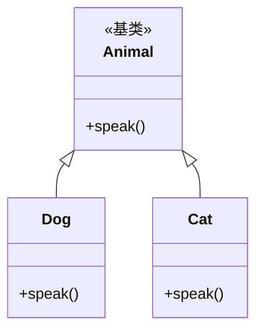
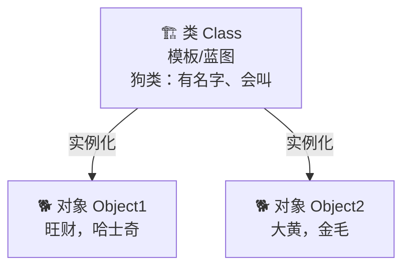

# 面向对象三大特性

## 一、总览：封装 / 继承 / 多态

- **封装 Encapsulation**：把数据（属性）和行为（方法）打包进类，**隐藏内部实现细节**，只暴露必要的接口。
- **继承 Inheritance**：子类复用父类的代码，建立 “is-a” 关系，减少重复。
- **多态 Polymorphism**：同一接口，不同实现——父类引用指向子类对象时，调用表现出不同行为。

> **生活化比喻**：
> - 封装 = 智能手机把电路板和芯片全藏起来，只留屏幕和按键给你按，你不用懂内部怎么工作。
> - 继承 = 智能机和老人机都“是手机”，共享“能打电话”这个能力，但又各自加了不同功能。
> - 多态 = 同样是按“拍照键”，不同手机拍出不同效果——同一个动作，结果随对象而变。

## 二、继承 + 多态示例



```python
class Animal:
    def speak(self):
        raise NotImplementedError("子类必须实现 speak")

class Dog(Animal):
    def speak(self):
        return "汪汪"

class Cat(Animal):
    def speak(self):
        return "喵喵"

def let_it_speak(a: Animal):
    print(a.speak())        # 多态：传入谁，就表现谁的行为

let_it_speak(Dog())         # 汪汪
let_it_speak(Cat())         # 喵喵
```

## 三、封装示例（Python 的“私有”约定）

```python
class BankAccount:
    def __init__(self, balance):
        self.__balance = balance     # __ 触发名称修饰，外部不能直接改

    def deposit(self, n):
        if n > 0:
            self.__balance += n

    def get_balance(self):
        return self.__balance

acc = BankAccount(100)
acc.deposit(50)
print(acc.get_balance())    # 150
# print(acc.__balance)      # AttributeError：被名称修饰成 _BankAccount__balance
```

## 四、核心考点

1. **Python 没有真正的私有**：单下划线 `_x` 表示“受保护”（约定，仍可访问）；双下划线 `__x` 触发**名称修饰**变成 `_ClassName__x`，只是增加访问难度。
2. **鸭子类型 Duck Typing**：Python 的多态不依赖继承——“像鸭子走路、叫起来像鸭子，那就是鸭子”。只要对象有 `speak` 方法就能传进去，不强制是 `Animal` 子类。
3. **优先用组合而非继承**（Composition over Inheritance）：继承耦合强，组合更灵活、更易测试。
4. **MRO 方法解析顺序**：多继承时按 **C3 线性化** 算法决定调用顺序，可用 `ClassName.__mro__` 查看；`super()` 就是按 MRO 找下一个。

---

## 1. 图片拷贝案例（带优化）

以文件拷贝的场景引入 OOP 的优势：

```python
# 面向过程的写法
def copy_image(source_path, dest_path):
    """拷贝图片：面向过程"""
    with open(source_path, "rb") as src:
        data = src.read()
    with open(dest_path, "wb") as dst:
        dst.write(data)

# 问题：每次拷贝都要传路径，如果要做进度条、批量拷贝，代码会越来越乱

# 面向对象的写法
class ImageCopier:
    """图片拷贝器"""
    def __init__(self, buffer_size=8192):
        self.buffer_size = buffer_size

    def copy(self, source, dest):
        """拷贝单个文件（带进度显示）"""
        import os
        total = os.path.getsize(source)
        copied = 0
        with open(source, "rb") as src, open(dest, "wb") as dst:
            while True:
                chunk = src.read(self.buffer_size)
                if not chunk:
                    break
                dst.write(chunk)
                copied += len(chunk)
                progress = copied / total * 100
                print(f"\r进度：{progress:.1f}%", end="")

    def batch_copy(self, file_pairs):
        """批量拷贝"""
        for src, dst in file_pairs:
            print(f"\n拷贝：{src} → {dst}")
            self.copy(src, dst)
```


## 2. 面向过程 vs 面向函数式 vs 面向对象

```python
# 任务：处理学生成绩

# 方式一：面向过程（数据与操作分离）
student_scores = {"张三": 85, "李四": 92}
def get_average(scores):
    return sum(scores.values()) / len(scores)
avg = get_average(student_scores)

# 方式二：面向函数式（纯函数，无副作用）
from statistics import mean
avg = mean(student_scores.values())

# 方式三：面向对象（数据与操作绑定）
class StudentManager:
    def __init__(self):
        self.students = {}       # 数据封装在对象内部

    def add(self, name, score):
        self.students[name] = score

    def average(self):
        return sum(self.students.values()) / len(self.students)

    def top_n(self, n):
        return sorted(self.students.items(),
                     key=lambda x: x[1], reverse=True)[:n]

mgr = StudentManager()
mgr.add("张三", 85)
mgr.add("李四", 92)
print(mgr.average())   # 88.5
print(mgr.top_n(1))    # [('李四', 92)]
```

| 范式 | 核心思想 | 优点 |
|------|---------|------|
| **面向过程** | 函数 + 全局数据 | 简单直接，小脚本够用 |
| **面向函数式** | 纯函数、无副作用 | 易于测试、并发安全 |
| **面向对象** | 对象 = 数据 + 方法 | 封装、复用、扩展性强 |


## 3. 类和对象的概念



```python
# 类 = 模板（抽象概念）
class Dog:
    """狗类：定义狗有什么属性和行为"""
    species = "犬科"          # 类属性（所有狗共享）

    def __init__(self, name, breed):
        self.name = name       # 实例属性（每只狗不同）
        self.breed = breed

    def bark(self):
        return f"{self.name}：汪汪！"

# 对象 = 根据模板创建的具体实例
dog1 = Dog("旺财", "哈士奇")    # 实例化
dog2 = Dog("大黄", "金毛")

print(dog1.name)      # "旺财"
print(dog1.bark())    # "旺财：汪汪！"
print(dog1.species)   # "犬科"（类属性，所有狗共享）
```

### 3.1 内存分析

```python
# 每个对象在内存中有独立的空间
class Person:
    def __init__(self, name):
        self.name = name

p1 = Person("张三")
p2 = Person("张三")

print(p1 == p2)   # False（两个不同的对象，虽然值相同）
print(p1 is p2)   # False（不是同一个对象）

# 除非定义了 __eq__ 方法（Day 10 Magic Method 会讲）
```


## 4. `__init__` 方法与 self

### 4.1 `__init__` 初始化方法

```python
class Student:
    def __init__(self, name, age):
        """
        初始化方法：创建对象时自动调用
        self 指向新创建的对象本身
        """
        print(f"创建学生：{name}")
        self.name = name     # 把参数存到对象的属性
        self.age = age

s = Student("张三", 20)
# 背后发生的事情：
# 1. Python 调用 __new__ 创建空对象（极少需要重写）
# 2. Python 自动调用 __init__，传入 self（= 刚创建的对象）
# 3. __init__ 中的 self.name = name 等价于 s.name = name
```

### 4.2 self 的理解

```python
class Counter:
    def __init__(self):
        self.count = 0

    def increment(self):
        self.count += 1

c = Counter()
c.increment()          # 等价于 Counter.increment(c)
# self 就是 c，所以 self.count 就是 c.count
```

> [!important] self 不是关键字！
> `self` 只是一个**约定俗成的名字**，你可以用别的名字，但**绝对不要这样做**。


## 5. 类属性 vs 实例属性

```python
class Student:
    school = "尚硅谷"         # 类属性：所有实例共享
    student_count = 0         # 类属性：计数用

    def __init__(self, name):
        self.name = name      # 实例属性：每个实例独有
        Student.student_count += 1  # 修改类属性需用类名

s1 = Student("张三")
s2 = Student("李四")
print(s1.name)               # "张三"（实例属性）
print(Student.student_count) # 2（类属性）
print(s1.school)             # "尚硅谷"（继承类属性）
print(s2.school)             # "尚硅谷"（同一个类属性）

# ⚠️ 陷阱：通过实例修改类属性
s1.school = "北大"            # 这不是修改类属性！是给 s1 创建了一个同名实例属性
print(s1.school)             # "北大"（s1 的实例属性遮蔽了类属性）
print(s2.school)             # "尚硅谷"（s2 没受影响，访问的还是类属性）
print(Student.school)        # "尚硅谷"（类属性没变！）
```


## 6. 实例方法、类方法、静态方法

```python
class MyClass:
    class_var = "类变量"

    def __init__(self, name):
        self.name = name

    # 实例方法：第一个参数是 self，操作实例数据
    def instance_method(self):
        return f"我是 {self.name}"

    # 类方法：第一个参数是 cls，操作类数据
    @classmethod
    def class_method(cls):
        return f"类变量 = {cls.class_var}"

    # 静态方法：不需要 self 或 cls，独立工具函数
    @staticmethod
    def static_method(x, y):
        return x + y

# 使用
obj = MyClass("测试")
print(obj.instance_method())       # "我是 测试"
print(MyClass.class_method())      # "类变量 = 类变量"
print(MyClass.static_method(3, 5)) # 8
```

| 方法类型 | 装饰器 | 第一个参数 | 访问 | 典型用途 |
|----------|--------|-----------|------|---------|
| 实例方法 | 无 | `self` | 实例+类 | 操作实例数据（最常用） |
| 类方法 | `@classmethod` | `cls` | 类 | 工厂方法、修改类属性 |
| 静态方法 | `@staticmethod` | 无 | 无 | 与类相关的工具函数 |


## 7. 动态添加属性和方法

```python
class Person:
    def __init__(self, name):
        self.name = name

p = Person("张三")

# 动态添加实例属性（只对这个实例有效）
p.age = 20
print(p.age)  # 20

# 动态添加方法
def say_hello(self):
    return f"你好，我是 {self.name}"

# 方式一：添加到实例（需要特殊处理）
import types
p.say_hello = types.MethodType(say_hello, p)

# 方式二：添加到类（所有实例都能用）
Person.say_hello = say_hello
p2 = Person("李四")
print(p2.say_hello())  # "你好，我是 李四"
```

> [!warning] 动态添加虽然灵活，但会降低代码可读性和 IDE 提示效果，正式项目中尽量在类定义中写清楚所有属性和方法。


---

---
title: "🔵 Day 09：面向对象三大特性"
tags: [Python, 学习笔记]
created: 2025-07-12
---


> 🎯 **学习目标**：深入掌握封装、继承、多态，完成《愤怒的小鸟》综合案例


## 1. 封装（Encapsulation）

### 1.1 私有化属性和方法

```python
class BankAccount:
    def __init__(self, owner, balance=0):
        self.owner = owner
        self.__balance = balance   # 双下划线 __ → 私有属性

    def deposit(self, amount):
        if amount <= 0:
            raise ValueError("存款金额必须为正数")
        self.__balance += amount
        print(f"存入 {amount}，余额 {self.__balance}")

    def withdraw(self, amount):
        if amount <= 0:
            raise ValueError("取款金额必须为正数")
        if amount > self.__balance:
            raise ValueError("余额不足")
        self.__balance -= amount
        print(f"取出 {amount}，余额 {self.__balance}")

    def get_balance(self):
        return self.__balance    # 通过方法安全访问

account = BankAccount("张三", 1000)
# print(account.__balance)    # ❌ AttributeError
print(account.get_balance())  # ✅ 1000

# 实际上 Python 只是改了名字（名称改写 Name Mangling）
# account._BankAccount__balance  # 仍然可以访问，但强烈不推荐
```

### 1.2 @property 装饰器

```python
class Student:
    def __init__(self, name, score=0):
        self.name = name
        self.__score = score

    @property
    def score(self):
        """读：像访问属性一样调用方法"""
        return self.__score

    @score.setter
    def score(self, value):
        """写：赋值时自动校验"""
        if not 0 <= value <= 100:
            raise ValueError("分数必须在 0~100 之间")
        self.__score = value

    @score.deleter
    def score(self):
        """删：del 时触发"""
        print("分数被删除")
        self.__score = 0

s = Student("张三")
s.score = 85          # 自动调用 setter（带校验）
print(s.score)         # 85（自动调用 getter）
# s.score = 150        # ❌ ValueError：分数必须在 0~100 之间
del s.score           # "分数被删除"，score 重置为 0
```

> [!tip] @property 的好处
> 1. 像属性一样使用（`obj.attr` 而不是 `obj.get_attr()`）
> 2. 自动做数据校验
> 3. 保护内部实现，后续可改实现而不影响外部调用


## 2. 继承（Inheritance）

### 2.1 单继承

```python
class Animal:
    def __init__(self, name):
        self.name = name

    def speak(self):
        return "..."

    def __str__(self):
        return f"{self.name}"

class Dog(Animal):          # Dog 继承 Animal
    def speak(self):        # 方法重写（override）
        return "汪汪！"

class Cat(Animal):
    def speak(self):
        return "喵喵！"

d = Dog("旺财")
c = Cat("咪咪")
print(f"{d}：{d.speak()}")  # "旺财：汪汪！"
print(f"{c}：{c.speak()}")  # "咪咪：喵喵！"
```

### 2.2 super 调用父类

```python
class Vehicle:
    def __init__(self, brand, speed=0):
        self.brand = brand
        self.speed = speed

    def info(self):
        return f"{self.brand}，速度 {self.speed}km/h"

class Car(Vehicle):
    def __init__(self, brand, doors=4, speed=0):
        super().__init__(brand, speed)   # 调用父类 __init__
        self.doors = doors

    def info(self):
        base = super().info()            # 调用父类方法
        return f"{base}，{self.doors}门"
```

### 2.3 多继承与 MRO

```python
class FlyMixin:
    def fly(self):
        return f"{self.name} 会飞！"

class SwimMixin:
    def swim(self):
        return f"{self.name} 会游泳！"

class Duck(Animal, FlyMixin, SwimMixin):
    def speak(self):
        return "嘎嘎！"

duck = Duck("唐老鸭")
print(duck.speak())  # "嘎嘎！"
print(duck.fly())    # "唐老鸭 会飞！"（来自 FlyMixin）
print(duck.swim())   # "唐老鸭 会游泳！"（来自 SwimMixin）

# MRO（Method Resolution Order）：方法搜索顺序
print(Duck.__mro__)
# Duck → Animal → FlyMixin → SwimMixin → object
```

### 2.4 方法重写

```python
class Parent:
    def greet(self):
        print("父类的问候")

    def work(self):
        print("父类工作")

class Child(Parent):
    def greet(self):            # 完全重写
        print("子类的问候")

    def work(self):             # 扩展父类功能
        super().work()          # 先调用父类
        print("子类额外的工作")   # 再加自己的
```


## 3. 多态（Polymorphism）

```python
# 多态：同一接口，不同实现
class Bird:
    def __init__(self, name):
        self.name = name

    def attack(self):
        return f"{self.name} 发起攻击"

class RedBird(Bird):
    def attack(self):
        return f"{self.name}（红色小鸟）冲撞攻击！💥"

class BlackBird(Bird):
    def attack(self):
        return f"{self.name}（黑色小鸟）爆炸攻击！💣💥"

class WhiteBird(Bird):
    def attack(self):
        return f"{self.name}（白色小鸟）投弹攻击！🥚"

# 多态体现：同一个 attack 函数，对不同鸟产生不同行为
def launch_bird(bird):
    print(bird.attack())

# 不管什么类型的鸟，只要它有 attack 方法就能用
birds = [RedBird("小红"), BlackBird("小黑"), WhiteBird("小白")]
for bird in birds:
    launch_bird(bird)
# 输出：
# 小红（红色小鸟）冲撞攻击！💥
# 小黑（黑色小鸟）爆炸攻击！💣💥
# 小白（白色小鸟）投弹攻击！🥚
```

> [!tip] 鸭子类型（Duck Typing）
> "如果它走路像鸭子，叫起来像鸭子，那它就是鸭子"
> Python 不检查类型，只检查**有没有对应的方法**。
> 这就是为什么 print 能接受任何对象——只要它有 `__str__` 方法。


## 4. 愤怒的小鸟综合案例

```python
import random

class Bird:
    """鸟基类"""
    def __init__(self, name, damage, speed):
        self.name = name
        self.__damage = damage        # 封装：私有属性
        self.__speed = speed

    @property
    def damage(self):
        return self.__damage

    @property
    def speed(self):
        return self.__speed

    def attack(self, target):
        """攻击目标，子类可重写"""
        print(f"{self.name} 以速度 {self.speed} 飞向 {target}！")
        return self.__damage

    def __str__(self):
        return f"{self.name}（伤害:{self.__damage}, 速度:{self.__speed}）"

class RedBird(Bird):
    """红色小鸟：无特殊技能但可靠"""
    def attack(self, target):
        print(f"🔴 {self.name} 加速冲撞！")
        return super().attack(target)     # 父类伤害

class BlackBird(Bird):
    """黑色小鸟：爆炸攻击，伤害 x2"""
    def attack(self, target):
        print(f"⚫ {self.name} 俯冲爆炸！")
        base = super().attack(target)
        return base * 2                    # 伤害翻倍

class WhiteBird(Bird):
    """白色小鸟：投弹攻击，伤害 x1.5"""
    def attack(self, target):
        print(f"⚪ {self.name} 高空投弹！")
        base = super().attack(target)
        return int(base * 1.5)

# === 游戏模拟 ===
class PigFort:
    """猪的堡垒"""
    def __init__(self, hp=100):
        self.hp = hp

    def take_damage(self, damage):
        self.hp -= damage
        return self.hp > 0    # True 表示还活着

print("🎯 愤怒的小鸟 — 攻击猪堡垒！")
print("=" * 50)

fort = PigFort(hp=120)
birds = [
    RedBird("小红", 30, 10),
    BlackBird("小黑", 25, 8),
    WhiteBird("小白", 20, 12),
]

for bird in birds:
    print(f"\n{bird} 出战！")
    damage = bird.attack("猪堡垒")
    alive = fort.take_damage(damage)
    print(f"造成 {damage} 点伤害，堡垒剩余 HP：{fort.hp}")
    if not alive:
        print("🎉 堡垒被摧毁！")
        break
else:
    print(f"\n堡垒幸存，剩余 {fort.hp} HP")
```


## 速记卡（面试闪卡）

**Q1：一句话讲清「面向对象三大特性」到底是什么？**
A：**封装 Encapsulation**：把数据（属性）和行为（方法）打包进类，**隐藏内部实现细节**，只暴露必要的接口。
**继承 Inheritance**：子类复用父类的代码，建立 “is-a” 关系，减少重复。
**多态 Polymorphism**：同一接口，不同实现——父类引用指向子类对象时，调用表现出不同行为。

**Q2：一、总览：封装 / 继承 / 多态 —— 怎么理解？**
A：**封装 Encapsulation**：把数据（属性）和行为（方法）打包进类，**隐藏内部实现细节**，只暴露必要的接口。
**继承 Inheritance**：子类复用父类的代码，建立 “is-a” 关系，减少重复。
**多态 Polymorphism**：同一接口，不同实现——父类引用指向子类对象时，调用表现出不同行为。
**生活化比喻**：
封装 = 智能手机把电路板和芯片全藏起来，只留屏幕和按键给你按，你不用懂内部怎么工作。

**Q3：四、核心考点 —— 怎么理解？**
A：**Python 没有真正的私有**：单下划线  表示“受保护”（约定，仍可访问）；双下划线  触发**名称修饰**变成 ，只是增加访问难度。
**鸭子类型 Duck Typing**：Python 的多态不依赖继承——“像鸭子走路、叫起来像鸭子，那就是鸭子”。只要对象有  方法就能传进去，不强制是  子类。
**优先用组合而非继承**（Composition over Inheritance）：继承耦合强，组合更灵活、更易测试。

**Q4：核心速记主线有哪些？**
A：抓住这几根：一、总览：封装 / 继承 / 多态、二、继承 + 多态示例、三、封装示例（Python 的“私有”约定）、四、核心考点、1. 图片拷贝案例（带优化）、2. 面向过程 vs 面向函数式 vs 面向对象。


## 相关链接
- 上一篇：[[08_面向对象入门]]
- 下一篇：[[10_异常处理]]

---
→ [[技术学习清单#函数与 OOP]]

## 相关链接
- 上一篇：[[07_函数进阶与文件]]
- 下一篇：[[09_面向对象三大特性]]

