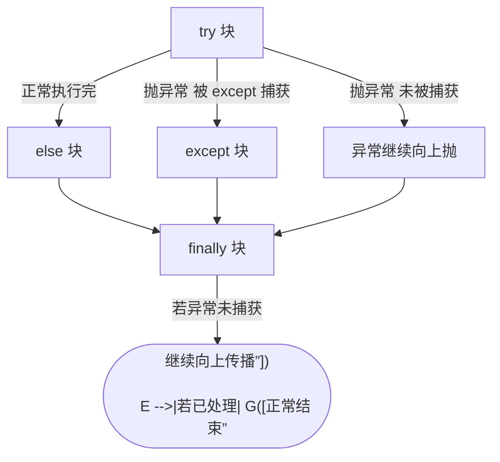

---

title: "异常处理 try-except-else-finally"

created: "2026-07-20"

tags:

  - 八股文

  - python

---


# 异常处理 try-except-else-finally

## 一、四个子句各管什么


- **`try`**：监控“可能出错”的代码块。

- **`except`**：捕获并处理指定异常（可多个、可捕获基类）。

- **`else`**：**仅当 try 没有抛异常时**才执行（正常的后续分支）。

- **`finally`**：**无论是否异常、是否 return**，都一定会执行（常用于释放资源）。


> **生活化比喻**：去 ATM 取钱——`try`=插卡取钱；`except`=钱没吐出来卡住了，处理一下（退卡/报警）；`else`=顺利取到钱，开开心心去逛街；`finally`=不管成功失败，最后把门带上、衣衫整理好再走。


## 二、执行顺序





## 三、可运行代码示例


```python

def safe_div(a, b):

    try:

        r = a / b

    except ZeroDivisionError as e:

        print("除零错误:", e)

        return None          # 注意：return 前也会先跑 finally

    else:

        print("计算成功")     # 仅当没异常

        return r

    finally:

        print("收尾：无论如何都执行")


print(safe_div(10, 2))   # 计算成功 / 收尾 / 5

print(safe_div(1, 0))    # 除零错误 / 收尾 / None

```


## 四、高频考点（全是坑）


1. **`finally` 里的 `return` 会“覆盖” try/except 的返回值**：


   ```python

   def f():

       try:

           return "try"

       finally:

           return "finally"   # 最终返回的是这个！

   print(f())                 # finally

   ```


2. **`else` 不要和 `try` 混写**：`else` 里的代码如果也可能抛异常，就不该被前面的 `except` 捕获，应放到 `try` 内或单独处理。

3. **别裸 `except:`**：`except:` 会连 `KeyboardInterrupt`、`SystemExit` 一起吞掉，导致 `Ctrl+C` 都停不了程序；应捕获具体异常或至少 `except Exception:`。

4. **自定义异常继承 `Exception`**（不要直接继承 `BaseException`）。

5. **资源用 `with` 更优雅**：`with open(...) as f` 底层就是 `try/finally` 的语法糖。


---


##

> ▶ 对应实操：[[13-dataclass|13-dataclass]]


## 速记卡（面试闪卡）


**Q1：一句话讲清「异常处理 try-except-else-finally」到底是什么？**

A：try 监控可能出错的代码，except 捕获异常，else 仅成功时执行，finally 无论与否都执行。


**Q2：一、四个子句各管什么 —— 怎么理解？**

A：像 ATM 取钱四步：try（插卡取钱）监控可能出错代码；except（卡住处理）捕获指定异常；else（顺利去逛街）仅 try 没抛异常才跑；finally（关门整理）无论成败都执行。


**Q3：二、执行顺序 —— 怎么理解？**

A：像流程分流：try 正常跑完进 else，被捕获进 except，未捕获继续上抛；但无论走 else 还是 except 还是上抛，最后都必先过 finally 再结束或传播。


**Q4：三、可运行代码示例 —— 怎么理解？**

A：像带收尾的计算器：safe_div 里 try 算除法，except 抓 ZeroDivisionError 返回 None，else 成功才 return 结果，finally 永远打印"收尾"——即使 return 前也先跑 finally。


**Q5：四、高频考点（全是坑） —— 怎么理解？**

A：像五个陷阱：finally 里的 return 会覆盖 try/except 返回值；别裸 except（会吞掉 Ctrl+C）；自定义异常继承 Exception 而非 BaseException；资源释放优先用 with（try/finally 的语法糖）。


**Q6：核心速记主线有哪些？**

- try 监控可能出错代码；except 捕获指定异常（可多个、可捕获基类）

- else 仅当 try 无异常才执行，正常后续分支放这避免被误捕获

- finally 无论异常或 return 都执行，常用于释放资源；其内 return 会覆盖返回值

- 别裸 except（吞系统信号）；自定义异常继承 Exception；资源用 with 更优雅


**口诀**

A：try 监控 except 兜，else 成功才出手

finally 必执行，关门释放不用愁

finally return 会覆盖，裸 except 吞信号最该戒

自定义异常继承 Exception，with 是 finally 的糖衣


相关链接


- 📋 目录：[[00-Python]]

- 📚 学习清单：[[八股文学习路线图]]

- 🔗 [[语言与框架/Python/八股/基础/04-引用计数与垃圾回收|引用计数与垃圾回收]] — 异常路径下的资源回收

- 🔗 [[语言与框架/Python/八股/并发/13-上下文管理器with原理|上下文管理器with原理]] — with 是 try/finally 的语法糖

- 🔗 [[计算机基础/操作系统/00-操作系统|操作系统八股文]] — 系统调用失败与异常处理

- 🔗 [[计算机基础/设计模式/00-设计模式|设计模式八股文]] — 错误处理与健壮设计

## 相关链接


- [[笔记/语言与框架/Python/八股/基础/15-__new__vs__init__|__new__ vs __init__]]

- [[笔记/语言与框架/Python/八股/基础/14-类方法实例方法静态方法|类方法 / 实例方法 / 静态方法]]

- [[笔记/语言与框架/Python/八股/基础/10-迭代器vs可迭代对象|迭代器 vs 可迭代对象]]

- [[笔记/语言与框架/Python/八股/基础/11-列表推导式vs生成器表达式|列表推导式 vs 生成器表达式]]

- [[笔记/语言与框架/Python/八股/基础/05-LEGB作用域与global-nonlocal|LEGB作用域与global-nonlocal]]

