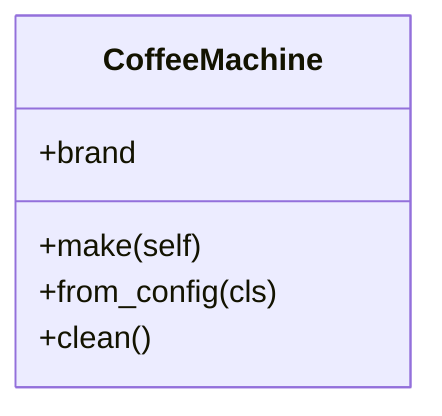

# 类方法 / 实例方法 / 静态方法

## 一、三种方法一眼分清

- **实例方法 Instance Method**：第一个参数是 `self`，操作**具体某个实例**（访问/修改实例属性）。
- **类方法 Class Method**：用 `@classmethod` 装饰，第一个参数是 `cls`，操作**类本身**（常用于工厂方法、备选构造器）。
- **静态方法 Static Method**：用 `@staticmethod` 装饰，**没有** `self` / `cls`，只是“借类这个命名空间放一个普通函数”。

> **生活化比喻**：
> - 实例方法 = 用“这台”咖啡机做一杯咖啡（`self` 就是这台具体机器）。
> - 类方法 = 工厂按配方批量造机器（`cls` 是“咖啡机类”这个模具），返回一台新机器。
> - 静态方法 = 贴在咖啡机旁的“清洗说明”，跟哪台机器都没关系，只是归类放这方便找。

## 二、关系图



## 三、可运行代码示例

```python
class CoffeeMachine:
    def __init__(self, brand):
        self.brand = brand

    def make(self):                      # 实例方法：需要 self
        return f"{self.brand} 煮了一杯咖啡"

    @classmethod
    def from_config(cls, brand):         # 类方法：工厂，用 cls 造实例
        return cls(brand)

    @staticmethod
    def clean():                         # 静态方法：无 self/cls
        return "冲水清洗即可"

m = CoffeeMachine("A")
print(m.make())                          # A 煮了一杯咖啡
print(CoffeeMachine.from_config("B").brand)   # B（用类调用工厂方法）
print(CoffeeMachine.clean())             # 冲水清洗即可（不需要实例）
```

## 四、对比速查表

| | 实例方法 | 类方法 | 静态方法 |
| :--- | :--- | :--- | :--- |
| 首个参数 | `self` | `cls` | 无 |
| 通常由谁调用 | 实例 | 类（也可实例） | 类或实例 |
| 能访问实例状态 | ✅ | ❌ | ❌ |
| 能访问类状态 | ✅（经 `self.__class__`） | ✅ | ❌ |
| 典型用途 | 行为/状态变更 | 工厂、备选构造器 | 工具函数 |

## 五、核心考点

1. **`@staticmethod` 与类方法本质区别**在于有没有 `cls`：静态方法完全不知道自己属于哪个类，类方法知道。
2. **实例方法其实也能通过类调用**，但必须手动传实例：`CoffeeMachine.make(m)` 等价于 `m.make()`。
3. **`@classmethod` 做工厂很常见**：如 `datetime.fromtimestamp()`、`dict.fromkeys()`。
4. **`@staticmethod` 不会导致性能优势**——它只是语法层面的“归属”，不要误以为能提速。

---

## 
> ▶ 对应实操：[[14-TypedDict|14-TypedDict]]

相关链接

- 📋 目录：[[00-Python]]
- 📚 学习清单：[[八股文学习清单]]
- 🔗 [[语言与框架/Python/八股/基础/12-面向对象三大特性|面向对象三大特性]] — 方法是封装的体现
- 🔗 [[语言与框架/Python/八股/基础/15-__new__vs__init__|__new__vs__init__]] — 类方法与对象创建的联系
- 🔗 [[计算机基础/设计模式/00-设计模式|设计模式八股文]] — 工厂模式常用类方法
- 🔗 [[计算机基础/操作系统/00-操作系统|操作系统八股文]] — 方法与对象的运行模型

## 速记卡（面试闪卡）

**Q1：一句话讲清「类方法 / 实例方法 / 静态方法」到底是什么？**
A：**实例方法 Instance Method**：第一个参数是 ，操作**具体某个实例**（访问/修改实例属性）。
**类方法 Class Method**：用  装饰，第一个参数是 ，操作**类本身**（常用于工厂方法、备选构造器）。
**静态方法 Static Method**：用  装饰，**没有**  / ，只是“借类这个命名空间放一个普通函数”。

**Q2：一、三种方法一眼分清 —— 怎么理解？**
A：**实例方法 Instance Method**：第一个参数是 ，操作**具体某个实例**（访问/修改实例属性）。
**类方法 Class Method**：用  装饰，第一个参数是 ，操作**类本身**（常用于工厂方法、备选构造器）。
**静态方法 Static Method**：用  装饰，**没有**  / ，只是“借类这个命名空间放一个普通函数”。

**Q3：四、对比速查表 —— 怎么理解？**
A：| | 实例方法 | 类方法 | 静态方法 |
| :--- | :--- | :--- | :--- |
| 首个参数 |  |  | 无 |
| 通常由谁调用 | 实例 | 类（也可实例） | 类或实例 |
| 能访问实例状态 | ✅ | ❌ | ❌ |
| 能访问类状态 | ✅（经 ） | ✅ | ❌ |
| 典型用途 | 行为/状态变更 | 工厂、备选构造器 | 工具函数 |

**Q4：核心速记主线有哪些？**
A：抓住这几根：一、三种方法一眼分清、二、关系图、三、可运行代码示例、四、对比速查表、五、核心考点、。

