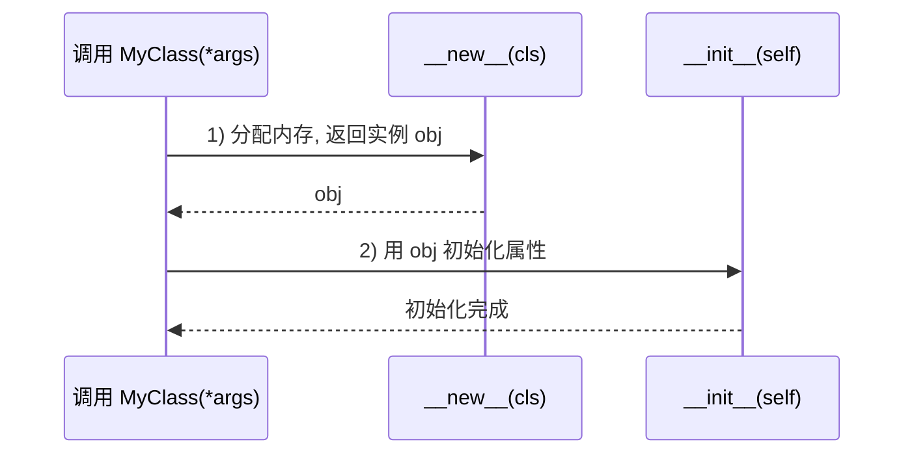

---

title: "__new__ vs __init__"

created: "2026-07-20"

tags:

  - 八股文

  - python

---


# __new__ vs __init__

## 一、分工：先建房，再装修


- **`__new__(cls, ...)`**：负责**创建**实例——分配内存、真正“造出”一个对象。它是个**静态方法**，必须 `return` 一个对象。

- **`__init__(self, ...)`**：负责**初始化**实例——给刚造好的对象设置属性。它**不返回任何值**。


> **生活化比喻**：`__new__` 是“盖房子”——打地基、搭框架，返回一个空房子；`__init__` 是“装修”——给房子配家具家电。**先有房子（__new__ 返回）才能装修（__init__）**，顺序不能反。


## 二、执行顺序（关键）





> 要点：**`__new__` 先执行并返回实例后，Python 才会调用 `__init__`**。如果 `__new__` 返回的不是一个 `cls` 的实例，`__init__` 压根不会被调用。


## 三、可运行代码示例


```python

class Foo:

    def __new__(cls, *args, **kwargs):

        print("1) __new__ 创建对象")

        obj = super().__new__(cls)     # 真正分配内存

        return obj                      # 必须返回实例


    def __init__(self, x):

        print("2) __init__ 初始化")

        self.x = x


f = Foo(10)            # 先打印 __new__，再打印 __init__

print(f.x)             # 10

```


## 四、什么时候必须碰 `__new__`


1. **继承不可变类型**（int / str / tuple）：它们的值在创建时就定死了，想“改值”只能在 `__new__` 里动手。


   ```python

   class UpperStr(str):

       def __new__(cls, s):

           return super().__new__(cls, s.upper())   # 创建时就转大写

   print(UpperStr("hello"))     # HELLO

   ```


2. **单例模式 Singleton**：控制全局只创建一个实例。


   ```python

   class Singleton:

       _inst = None

       def __new__(cls, *args, **kwargs):

           if cls._inst is None:

               cls._inst = super().__new__(cls)

           return cls._inst

   a = Singleton(); b = Singleton()

   print(a is b)        # True，永远是同一个对象

   ```


3. **对象池 / 缓存**：在 `__new__` 里拦截，复用已有实例。


## 五、核心考点


| 对比点 | `__new__` | `__init__` |

| :--- | :--- | :--- |

| 调用时机 | 创建对象时（先） | 初始化时（后） |

| 是否需 `return` | ✅ 必须返回实例 | ❌ 不返回 |

| 首个参数 | `cls` | `self` |

| 典型用途 | 不可变类型、单例、对象池 | 设置实例属性 |


1. `__new__` 是**隐式的静态方法**，定义时不用写 `@staticmethod`。

2. 绝大多数业务代码只需写 `__init__`，别滥用 `__new__`。

3. 若 `__new__` 不返回 `cls` 的实例，`__init__` 不会被调用（常见于返回其它类型时的元编程场景）。


---


## 速记卡（面试闪卡）


**Q1：一句话讲清「__new__ vs __init__」到底是什么？**

A：__new__ 负责创建实例（分配内存、必须返回对象），__init__ 负责初始化实例（设属性、不返回）。


**Q2：一、分工：先建房，再装修 —— 怎么理解？**

A：像"盖房子再装修"：__new__ 是打地基搭框架、返回一个空房子（分配内存）；__init__ 是配家具家电（设属性）。顺序不能反——先有房子才能装修。一句话：__new__ 管"生"，__init__ 管"养"。


**Q3：二、执行顺序（关键） —— 怎么理解？**

A：像"工厂流水线"：Python 先调 __new__ 拿到实例外壳，再拿这个实例去调 __init__ 装属性。关键坑：若 __new__ 返回的不是 cls 的实例（如返回别的类型），Python 认为"壳不对"，__init__ 压根不会被调用——元编程里常见隐蔽 bug。


**Q4：四、什么时候必须碰 __new__ —— 怎么理解？**

A：三种"必须动手"的场景：① 继承不可变类型（int/str/tuple），值创建时就定死，只能在 __new__ 里改（如 UpperStr 创建时转大写）；② 单例模式，__new__ 里判断复用已有实例；③ 对象池/缓存，__new__ 里拦截复用省开销。


**Q5：五、核心考点 —— 怎么理解？**

A：记住"作弊条"：调用时机 __new__ 先、__init__ 后；是否 return —— __new__ 必须返回实例、__init__ 不返回；首个参数 __new__ 是 cls（类）、__init__ 是 self（实例）；用途不可变/单例/对象池 vs 设属性。__new__ 是隐式静态方法，不用写 @staticmethod。


**Q6：核心速记主线有哪些？**

- __new__ 创建实例（分配内存），__init__ 初始化（设属性）

- 执行顺序：__new__ 先返回，__init__ 才被调用

- 返回非 cls 实例时 __init__ 不调用

- __new__ 用于不可变类型、单例、对象池


**口诀**

A：new 造壳来 init 装，先生后养不能反；

返回非类 init 歇，壳不对就不装。

单例不可变碰 new，对象池里复用忙；

cls 生 self 养记心间，绝大多写 init 安。


## 相关链接


- 📋 目录：[[00-Python]]

- 📚 学习清单：[[八股文学习路线图]]

- 🔗 [[语言与框架/Python/八股/基础/12-面向对象三大特性|面向对象三大特性]] — 封装与对象生命周期

- 🔗 [[语言与框架/Python/八股/基础/14-类方法实例方法静态方法|类方法/实例方法/静态方法]] — cls 与类方法的关系

- 🔗 [[语言与框架/Python/八股/基础/04-引用计数与垃圾回收|引用计数与垃圾回收]] — 对象创建/销毁与引用计数

- 🔗 [[计算机基础/设计模式/00-设计模式|设计模式八股文]] — 单例模式的实现

- 🔗 [[计算机基础/操作系统/00-操作系统|操作系统八股文]] — 内存分配与对象创建

