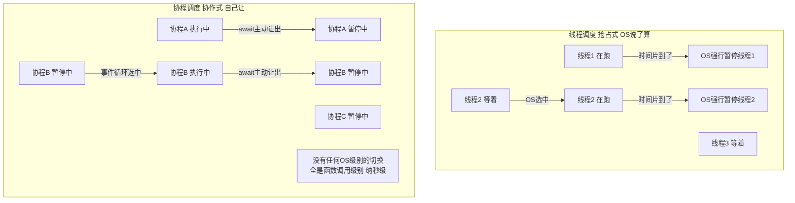
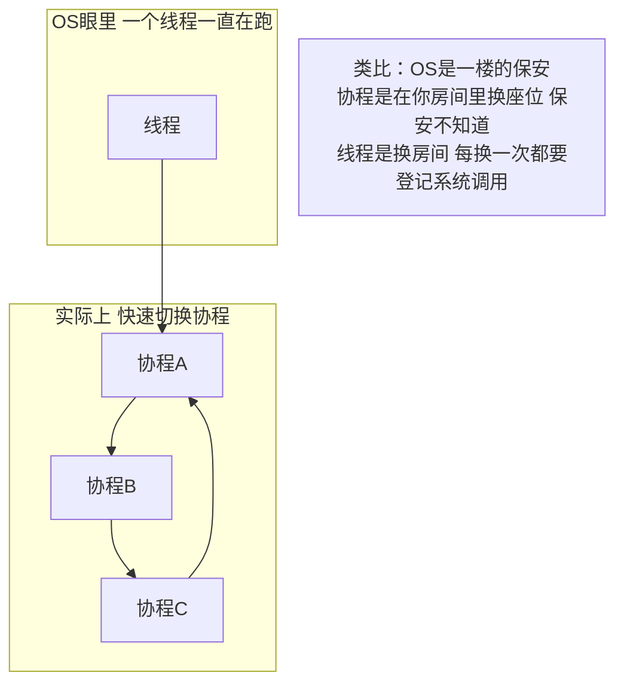

---

title: "协程用户态的线程"

created: "2026-07-20"

tags:

  - 八股文

  - python

---

# 协程用户态的线程

### 1.1 协程和线程的本质区别：谁在调度？

这是最想听到的核心区分：



### 1.2 协程切换为什么快？——技术层面

```python

# 耗时：50-100 纳秒（没有内核态切换，全是函数调用）

```



### 1.3 协程的代价——协作式调度的"暗面"

```python

# 协程的最大缺陷：一个协程不主动让，其他全等死

import asyncio

async def greedy_coroutine():

    """坏协程——一直占着 CPU 不让"""

    print("我开始算了，你们等着吧")

    total = 0

    for i in range(100_000_000):  # 纯计算，没有 await！

        total += i

    print(f"算完了: {total}")

    # 整个过程没有任何 await——其他协程全部饿死

async def polite_coroutine():

    """好协程——算一会儿就主动让"""

    print("有礼貌的协程")

    for i in range(10):

        # 每算一次就让给其他人

        await asyncio.sleep(0)  # sleep(0) = 把控制权交回事件循环，立刻重新排队

    print("礼貌的协程完成")

async def main():

    # 先启动贪婪协程——它会独占！只有 await 处才会让给 polite

    await asyncio.gather(greedy_coroutine(), polite_coroutine())

asyncio.run(main())

#             整个服务器其他请求全部卡住

```

> **一句话讲清**："协程是协作式调度——优点是没有 OS 抢占开销，缺点是一个协程不主动让就堵死全部。所以 async 函数里绝对不能放 CPU 密集计算——必须丢给线程池或进程池。"

### 1.4 三种并发模型——核心对比表

| | 协程（Coroutine） | 线程（Thread） | 进程（Process） |
| :--- | :--- | :--- | :--- |
| **调度方式** | 协作式——自己让 | 抢占式——OS 打断 | 抢占式——OS 打断 |
| **调度位置** | 用户态（代码里） | 内核态（操作系统） | 内核态（操作系统） |
| **切换耗时** | **~50-100 ns** | **~1-10 µs** | **~10-100 µs** |
| **切换要走系统调用** | ❌ 不走 | ✅ 走 | ✅ 走 |
| **内存开销（单个）** | **几 KB**（协程栈） | **~8 MB**（线程栈） | **几十 MB+**（独立的 Python 解释器 + 内存空间） |
| **能创建多少** | 成千上万 | 几十到几百（多了 OOM） | 几个到几十（冷启动慢） |
| **Python 多核并行** | ❌ 不能（单线程） | ❌ 不能（GIL） | ✅ 能（各有 GIL） |
| **通信方式** | 直接 return / 共享变量（单线程无锁） | Queue / Lock / 共享变量（需加锁） | Queue / Pipe / 共享内存 |
| **通信开销** | 几乎零（函数调用） | 低（共享地址空间） | 中（序列化 + IPC） |
| **崩溃隔离** | ❌ 一个崩了事件循环可能挂 | ❌ 一个崩了进程可能挂 | ✅ 一个崩了其他不影响 |
| **适合场景** | IO 密集、高并发、全异步生态 | IO 密集、调用不支持 asyncio 的库 | CPU 密集、需要隔离 |

---

## 速记卡（面试闪卡）

**Q1：一句话讲清「协程用户态的线程」到底是什么？**

A：协程是用户态线程：靠 await 主动让出 CPU，切换几十纳秒不进内核，但一个协程不让就堵死全部。

**Q2：协程 vs 线程：谁在调度？ —— 怎么理解？**

A：线程是"抢占式"——OS 像保安，时间片到了强行换人；协程是"协作式"——像你自己在房间里换座位，保安根本不知道。线程切换要走系统调用、1–10 微秒，协程纯函数调用、50–100 纳秒（preemptive vs cooperative scheduling）。

**Q3：协程切换为什么这么快？ —— 怎么理解？**

A：线程切换要进内核、保存几十个寄存器、调度算法选下一个，来回几百纳秒起；协程只在函数栈上记个位置，让事件循环挑下一个，没有内核态往返。好比换房间要登记系统调用，换座位不用（context switch overhead）。

**Q4：协作式的暗面：一个不让全饿死 —— 怎么理解？**

A：协程最大坑：一个协程死循环不 await，其余全饿死。FastAPI 里 async 路由做 CPU 密集计算，整个服务器卡住。所以重活必须丢给线程池/进程池（event loop blocking / starvation）。好比一人占话筒不放，全场干等。

**Q5：三种并发模型怎么选？ —— 怎么理解？**

A：协程（协作式、几十 ns、几 KB、单线程无多核）、线程（抢占式、微秒、~8MB、GIL 挡多核）、进程（抢占式、几十 µs、几十 MB、真并行）。选型看 IO 还是 CPU 密集（concurrency trade-offs）。

**Q6：核心速记主线有哪些？**

- 调度本质：协程协作式（自己让），线程/进程抢占式（OS 打断）

- 切换代价：协程 50–100ns 函数级，线程 1–10µs 要进内核

- 致命缺陷：协程一个不让，其余全饿死——CPU 重活丢线程池

- 选型：IO 密集上协程，CPU 密集上进程；内存协程几 KB vs 线程 8MB

**口诀**

A：协程是用户态线程，

主动让出才伴行；

纳秒级切换最灵，

独算不让众人停。

## 相关链接

- 📋 目录：[[00-Python]]

- 📚 学习清单：[[八股文学习路线图]]

- 🔗 [[语言与框架/Python/八股/并发/02-多线程多进程协程三者对比|三者对比]]

- 🔗 [[语言与框架/Python/八股/并发/15-async-await本质|async/await本质]]

- 🔗 [[计算机基础/操作系统/01-进程vs线程vs协程对比|进程vs线程vs协程]] — 操作系统视角的并发基础

- 🔗 [[语言与框架/TypeScript-React/八股/JavaScript/15-异步与事件循环|JS异步与事件循环]] — Python asyncio vs JS 事件循环

- 🔗 [[计算机基础/操作系统/01-进程vs线程vs协程对比|进程vs线程vs协程]] — 协程是用户态调度，对标线程

