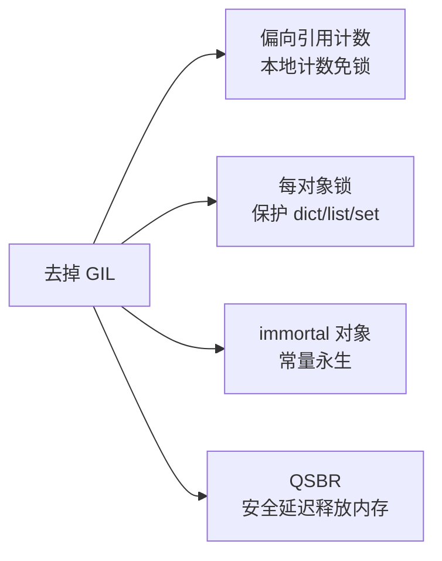

# Python 3.13 自由线程与 PEP 703

## 一、这是什么

- **PEP 703 — Making the Global Interpreter Lock Optional in CPython**：由 Sam Gross 提出，目标是让 CPython 能在**编译时可选地去掉 GIL（Global Interpreter Lock，全局解释器锁）**。
- **free-threaded build（自由线程构建）**：从 **Python 3.13（2024-10 发布）** 起，官方开始提供这种“无 GIL”构建，多线程可以**真正并行**跑在多个 CPU 核上。

> **生活化比喻**：以前厨房只有 1 个灶台（GIL），4 个厨师只能轮流用，灶台利用率上不去；自由线程 build 把这面墙打通变成 4 个灶台，4 个厨师能**同时炒菜**（真并行），出菜速度线性提升。

## 二、怎么开启 / 怎么判断

```python
import sys
print(sys._is_gil_enabled())        # 当前进程是否“真正禁用”了 GIL

# 启动时（Python 3.13+）：
#   python3.13 -X gil=0       命令行选项
#   或 设置环境变量 PYTHON_GIL=0
# 从源码构建：./configure --disable-gil
```

## 三、底层原理：偏向引用计数（Biased Reference Counting）

GIL 存在的一大理由，是保护**全局引用计数**不被多线程同时改写。去掉 GIL 后，CPython 改用：



| 机制 | 作用 |
| :--- | :--- |
| **偏向引用计数 Biased Reference Counting** | 引用计数拆成“本地（local）+ 全局（shared）”，单线程只改本地、不加锁；跨线程才合并到全局 |
| **每对象锁 per-object lock** | 保护内置容器（dict/list/set）的并发修改 |
| **immortal 对象** | 数字/字符串字面量等常量永生，避免引用计数竞争 |
| **QSBR（Quiescent State-Based Reclamation）** | 无锁数据结构的安全内存回收，延迟释放 |

## 四、代价与现状

| 维度 | 说明 |
| :--- | :--- |
| 单线程开销 | pyperformance 平均约 **1%~8%**（依平台而定） |
| 多线程收益 | CPU 密集任务可**线性加速**，真正利用多核 |
| 生态适配 | C 扩展需标记支持自由线程；未适配的扩展导入时会**自动重新启用 GIL** 并打印警告 |
| 路线 | PEP 703 规划三阶段：实验性（3.13）→ 受支持但非默认 → 未来成为默认 |

## 五、一句话讲清

> “PEP 703 让 CPython 可以编译成无 GIL 的自由线程版本，Python 3.13 起官方提供实验性支持。其核心是把全局引用计数改成偏向引用计数，并给内置类型加锁。短期生产环境仍建议用多进程或 asyncio，因为 C 扩展生态还在适配；长期来看，GIL 大概率会被移除。”

---

## 速记卡（面试闪卡）

**Q1：一句话讲清「Python 3.13 自由线程与 PEP 703」到底是什么？**
A：**PEP 703 — Making the Global Interpreter Lock Optional in CPython**：由 Sam Gross 提出，目标是让 CPython 能在**编译时可选地去掉 GIL（Global Interpreter Lock，全局解释器锁）**。

**Q2：一、这是什么 —— 怎么理解？**
A：**PEP 703 — Making the Global Interpreter Lock Optional in CPython**：由 Sam Gross 提出，目标是让 CPython 能在**编译时可选地去掉 GIL（Global Interpreter Lock，全局解释器锁）**。

**Q3：三、底层原理：偏向引用计数（Biased Reference Counting） —— 怎么理解？**
A：GIL 存在的一大理由，是保护**全局引用计数**不被多线程同时改写。去掉 GIL 后，CPython 改用：
| 机制 | 作用 |
| :--- | :--- |
| **偏向引用计数 Biased Reference Counting** | 引用计数拆成“本地（local）+ 全局（shared）”，单线程只改本地、不加锁；

**Q4：四、代价与现状 —— 怎么理解？**
A：| 维度 | 说明 |
| :--- | :--- |
| 单线程开销 | pyperformance 平均约 **1%~8%**（依平台而定） |
| 多线程收益 | CPU 密集任务可**线性加速**，真正利用多核 |
| 生态适配 | C 扩展需标记支持自由线程；未适配的扩展导入时会**自动重新启用 GIL** 并打印警告 |
| 路线 | PEP 703 规划三阶段：实验性（3.13）→ 受支持但非默认 → 未来成为默认 |

**Q5：核心速记主线有哪些？**
A：抓住这几根：一、这是什么、二、怎么开启 / 怎么判断、三、底层原理：偏向引用计数（Biased Reference Counting）、四、代价与现状、五、一句话讲清。


## 相关链接

- 📋 目录：[[00-Python]]
- 📚 学习清单：[[八股文学习清单]]
- 🔗 [[语言与框架/Python/八股/并发/05-GIL是什么|GIL是什么]] — 理解 GIL 才能理解为什么要去掉它
- 🔗 [[语言与框架/Python/八股/并发/06-GIL为什么存在|GIL为什么存在]] — GIL 的历史与存在理由
- 🔗 [[语言与框架/Python/八股/并发/07-GIL对多线程的影响|GIL对多线程的影响]] — 自由线程解决了什么
- 🔗 [[语言与框架/Python/八股/基础/04-引用计数与垃圾回收|引用计数与垃圾回收]] — 偏向引用计数的前身
- 🔗 [[计算机基础/操作系统/00-操作系统|操作系统八股文]] — 多核并行与锁的底层视角
