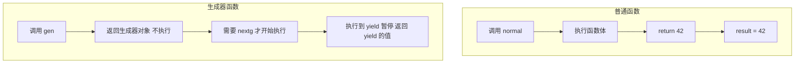
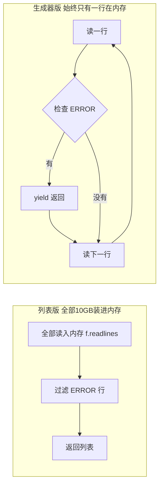

---

title: "生成器yield的本质"

created: "2026-07-20"

tags:

  - 八股文

  - python

---

# 生成器yield的本质

## 二、生成器 — yield 的本质
### 2.1 生成器函数 vs 普通函数

```python

# ===== 普通函数：调用 → 执行 → 返回一个值 =====

def normal():

    return 42

result = normal()        # result = 42（一个数字）

# ===== 生成器函数：调用 → 返回生成器对象 → 不执行！=====

def gen():

    yield 1

    yield 2

g = gen()                # g = <generator object>——函数体还没执行！

print(type(g))           # <class 'generator'>

```



### 2.2 yield 做了三件事

```python

def count_up():

    print("开始")

    yield 1                    # 第一次暂停点

    print("继续")

    yield 2                    # 第二次暂停点

    print("结束")

g = count_up()

# next(g) 做了什么：

val = next(g)

# val = 1

val = next(g)

# val = 2

next(g)

# StopIteration!

```

> **通俗比喻**：生成器像**书签**——看到某一页夹个书签（`yield`），下次翻开从书签处继续。普通函数像**看完就扔**——每次从头来。

### 2.3 yield vs return —— 一张表

| 维度 | `yield` | `return` |
| :--- | :--- | :--- |
| 函数类型 | 生成器函数 | 普通函数 |
| 调用后返回 | 生成器对象（不执行） | 具体值（立即执行） |
| 执行方式 | 暂停，保留全部局部状态 | 终止，销毁局部状态 |
| 可调用次数 | 多次 `next()` | 只能调一次 |
| 适用场景 | 惰性求值、大数据流、协程 | 一次性返回结果 |

### 2.4 生成器只能遍历一次

```python

g = (x * 2 for x in range(3))     # 生成器表达式

list(g)    # [0, 2, 4]

list(g)    # []  ← 已经耗尽了！再遍历返回空

# 对比列表：可以无限遍历

lst = [x * 2 for x in range(3)]

list(lst)  # [0, 2, 4]

list(lst)  # [0, 2, 4]  ← 还在

```

> **延伸追问**："为什么生成器只能遍历一次？"——因为生成器不存数据，它只记"执行到哪了"。遍历完就执行完了，没有东西可以重来。

### 2.5 生成器表达式（惰性求值）

```python

# 列表推导式：立即计算所有值，存到内存

squares_list = [x**2 for x in range(1_000_000)]   # 立刻占用大量内存

# 生成器表达式：不计算，要用的时候才一个一个算

squares_gen = (x**2 for x in range(1_000_000))    # 几乎不占内存

# 内存对比

import sys

sys.getsizeof([x**2 for x in range(1000)])   # ~8856 字节

sys.getsizeof((x**2 for x in range(1000)))   # ~120 字节  ← 差 70 倍！

```

> **一句话**：列表推导式 = 一次性把所有结果装进内存；生成器表达式 = 用一个算一个，用完就扔。数据量大时，生成器省内存。

### 2.6 生成器的好处——为什么要用它？

```python

# ❌ 列表版：全部读进内存 → 内存爆炸

def find_errors_list(filename):

    with open(filename) as f:

        lines = f.readlines()       # 10GB 全部读进内存！

    return [line for line in lines if "ERROR" in line]

# ✅ 生成器版：一行一行读，找到一个 yield 一个

def find_errors_gen(filename):

    with open(filename) as f:

        for line in f:              # 文件对象本身就是迭代器

            if "ERROR" in line:

                yield line.strip()  # 找到一个就返回一个，不存全部

```



---

## 速记卡（面试闪卡）

**Q1：一句话讲清「生成器yield的本质」到底是什么？**

A：用 yield 实现可暂停可恢复的惰性函数。

**Q2：生成器 vs 普通函数：调用不执行 —— 怎么理解？**

A：像书签 vs 一次性读完：普通函数 return 当场执行拿到值；生成器 yield 调用只拿到 `<generator object>`，函数体根本没跑。本质是 Generator（生成器）——一个「记住执行到哪」的函数，下次从书签处继续。

**Q3：yield 三件事：继续/暂停/返回值 —— 怎么理解？**

A：像自动贩卖机出货：每次 `next(g)`，yield ①从暂停处继续 ②跑到 yield 值处暂停 ③把值吐出来。函数跑完没 yield 了就抛 StopIteration（停止迭代）。它既是产出点又是暂停点，状态全留着。

**Q4：yield vs return：暂停保留 vs 终止 —— 怎么理解？**

A：像暂停存档 vs 关机走人：return 终止并销毁局部状态、只能调一次；yield 暂停并保留全部局部状态、能多次 next。本质是 Generator 的「惰性求值」——要一个算一个，适合大数据流和协程。

**Q5：生成器表达式：省内存流式读 —— 怎么理解？**

A：像自助餐现取现吃：(x**2 for x in range(1_000_000)) 几乎不占内存（约120字节），列表推导却一口气全算占 8856 字节，差 70 倍。读 10GB 日志找 ERROR，列表版爆内存、生成器版一行行 yield，内存里永远只有一行。

**Q6：核心速记主线有哪些？**

- 生成器调用不执行等 next

- yield 暂停并保留状态

- 只能遍历一次（不存数据）

- 表达式惰性求值省内存

**口诀**

A：生成器像书签夹，yield 暂停再出发

return 关机走人去，yield 存档继续耍

惰性求值省内存，遍历一次就出家

大文件里逐行读，内存永远只有它

## 相关链接

- 📋 目录：[[00-Python]]

- 📚 学习清单：[[八股文学习路线图]]

- 🔗 [[语言与框架/Python/八股/并发/11-send双向通信|send双向通信]]

- 🔗 [[语言与框架/Python/八股/并发/12-yieldfrom委托生成器|yield from委托生成器]]

- 🔗 [[计算机基础/操作系统/01-进程vs线程vs协程对比|进程vs线程vs协程]] — 操作系统视角的并发基础

- 🔗 [[语言与框架/TypeScript-React/八股/JavaScript/15-异步与事件循环|JS异步与事件循环]] — Python asyncio vs JS 事件循环

- 🔗 [[语言与框架/TypeScript-React/八股/React/04-为什么需要Hooks|React Hooks]] — 生成器/协程与 Hooks 的设计理念对比

