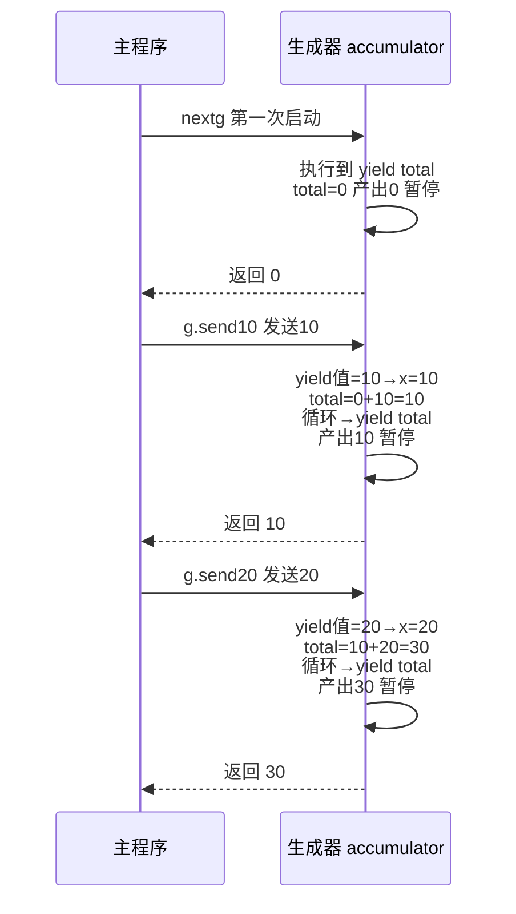
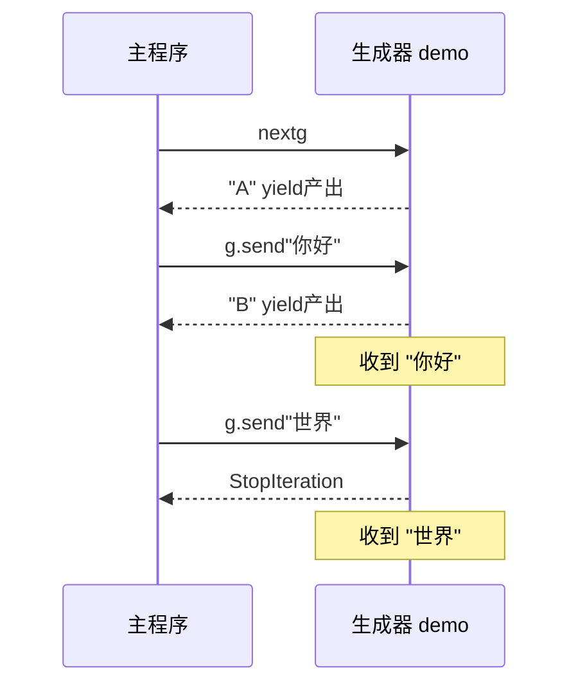

---

title: "send双向通信"

created: "2026-07-20"

tags:

  - 八股文

  - python

---

# send双向通信

## 一、send —— 双向通信（⭐⭐重点）
### 1.1 基本用法

```python

def echo():

    """收到什么就返回什么"""

    while True:

        received = yield           # yield 既产出值，又能接收值

        print(f"收到: {received}")

g = echo()

next(g)                            # 必须先 next() 启动！

g.send("hello")                    # 发送 "hello" → yield 表达式的值 = "hello"

# 输出：收到: hello

g.send("world")

# 输出：收到: world

```

### 1.2 send 执行流程（逐行拆解）

```python

def accumulator():

    total = 0

    while True:

        x = yield total            # ① 产出 total ② 接收 x

        total += x

g = accumulator()

```



### 1.3 第一次必须 next 或 send(None)

```python

g = accumulator()

g.send(10)                 # ❌ TypeError: can't send non-None value to a just-started generator

# 正确启动方式（三选一）：

next(g)                    # 方式 1

g.send(None)               # 方式 2

g.__next__()               # 方式 3（和 next(g) 等价）

```

> **通俗比喻**：你还没开始打电话，就想说话——对方根本没在听。先 `next()` 让对方"接起电话"（执行到第一个 `yield`），然后才能 `send()` 说话。

### 1.4 send 与 yield 的值传递全景

```python

def demo():

    val = yield "A"                # ① 产出 "A"，暂停

    print(f"收到: {val}")

    val2 = yield "B"               # ② 产出 "B"，暂停

    print(f"收到: {val2}")

g = demo()

print(next(g))          # "A"      ← 启动，产出 "A"

print(g.send("你好"))   # "收到: 你好" → 产出 "B" → 返回 "B"

print(g.send("世界"))   # "收到: 世界" → 函数结束 → StopIteration

```



---

## 速记卡（面试闪卡）

**Q1：一句话讲清「send双向通信」到底是什么？**

A：send() 是生成器方法，让 yield 既能产出值又能接收值，实现生成器与主程序的双向通信（Two-way Communication）。

**Q2：三、send —— 双向通信（⭐⭐重点） —— 怎么理解？**

A：received = yield 这行同时干两件事：左边收到的值就是 send 传进来的，右边产出值给调用方。像打电话——你还没接起（next）就想说话，对方根本没在听；先 next() 让生成器"接起电话"停在第一个 yield，才能 send() 说话（协程，Coroutine）。

**Q3：1.1 基本用法 —— 怎么理解？**

A：echo() 里 while True: received = yield 配 g.send('hello')，yield 表达式值就变 'hello'。先 next(g) 启动，再 send 才生效——像先拨号接通再开口。这是生成器双向通信的最小可用模型（Generator Two-way Communication）。

**Q4：1.2 send 执行流程 —— 怎么理解？**

A：accumulator 中 x = yield total 暂停时先"产出 total"，下次 send(10) 进来，yield 值=10 赋给 x，累加后循环回 yield total 再产出。一轮 = 收尾上次产出 + 接收新值 + 跑一段 + 再产出（状态机，State Machine）。

**Q5：1.3 第一次必须 next 或 send(None) —— 怎么理解？**

A：刚创建的生成器直接 g.send(10) 报 TypeError: can't send non-None value。因为还没启动、没停在 yield 处，值没地方放。三种启动：next(g) / g.send(None) / g.__next__()——本质都是先跑到第一个 yield 停住（生成器启动，Generator Priming）。

**Q6：核心速记主线有哪些？**

- send 让 yield 收发一体：received = yield 既能产出又能接收

- 第一次必须 next()/send(None) 启动，否则 TypeError

- 一轮 send = 收尾上次产出 + 接收新值 + 再产出

- send 传入的值变成当时 yield 表达式的返回值

**口诀**

A：send 能收又能发，先 next 接电话；

没启动就说话，TypeError 找你家；

一轮收尾再接收，yield 值变回答；

双向通信协程法，生成器里打电话。

## 相关链接

- 📋 目录：[[00-Python]]

- 📚 学习清单：[[八股文学习路线图]]

- 🔗 [[语言与框架/Python/八股/并发/10-生成器与yield原理|生成器与yield原理]]

- 🔗 [[语言与框架/Python/八股/并发/12-yieldfrom委托生成器|yield from委托生成器]]

- 🔗 [[计算机基础/操作系统/01-进程vs线程vs协程对比|进程vs线程vs协程]] — 操作系统视角的并发基础

- 🔗 [[语言与框架/TypeScript-React/八股/JavaScript/15-异步与事件循环|JS异步与事件循环]] — Python asyncio vs JS 事件循环

- 🔗 [[语言与框架/TypeScript-React/八股/React/04-为什么需要Hooks|React Hooks]] — 生成器/协程与 Hooks 的设计理念对比

