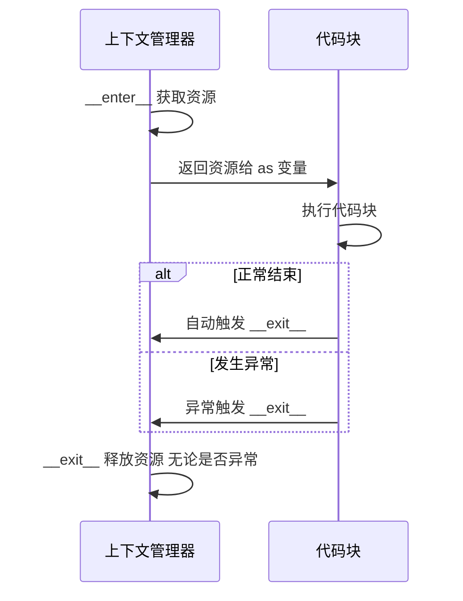

---

title: "上下文管理器with语句底层"

created: "2026-07-20"

tags:

  - 八股文

  - python

---

# 上下文管理器with语句底层

## 一、上下文管理器 — with 语句的底层
### 1.1 先看问题：不用 with 会怎样？

```python

# 手动管理资源——容易忘关

f = open("data.txt", "r")

data = f.read()

# 如果这里出异常了，下面的 close() 永远执行不到 → 文件句柄泄漏！

f.close()

# ❌ 用 try/finally 兜底——能用但啰嗦

f = open("data.txt", "r")

try:

    data = f.read()

finally:

    f.close()       # 无论是否异常都关闭——但每次都要写这套模板

# ✅ with 语句——自动管理

with open("data.txt", "r") as f:

    data = f.read()

# 离开 with 块时，f.close() 自动调用——即使中间出了异常

```

> **一句话**：`with` 语句 = 自动的 `try/finally`——保证资源一定被释放。你不用记着写 `.close()`。

### 1.2 with 语句的执行流程

```python

with open("data.txt") as f:

    data = f.read()

```

```text

with 表达式 as 变量:

    代码块

执行顺序：

① 求值"表达式" → 得到上下文管理器对象（有 __enter__ 和 __exit__ 的对象）

② 调用 __enter__() → 返回值赋给"变量"

③ 执行"代码块"

④ 无论代码块是否异常，调用 __exit__() → 在这里做清理工作

```



### 1.3 手写一个上下文管理器

```python

class FileManager:

    """文件上下文管理器——手写版"""

    def __init__(self, filename, mode):

        self.filename = filename       # 记住参数

        self.mode = mode

    def __enter__(self):

        """进入 with 块时调用"""

        print("__enter__ 被调用")

        self.file = open(self.filename, self.mode)   # ① 获取资源

        return self.file              # ② 返回值 → 赋给 as 变量

    def __exit__(self, exc_type, exc_val, exc_tb):

        """离开 with 块时调用——无论是否异常"""

        print("__exit__ 被调用")

        if self.file:

            self.file.close()         # ③ 释放资源

        return False                  # ④ 不抑制异常（后面详解）

# 使用：

with FileManager("data.txt", "r") as f:

    data = f.read()

    print(data)

# __exit__ 被调用

```

### 1.4 `__exit__` 的三个参数（⭐高频考点）

```python

def __exit__(self, exc_type, exc_val, exc_tb):

    #                      ↑          ↑          ↑

    #                   异常类型     异常值     异常追踪栈

    #

    # 没有异常时：三个参数全是 None

    # 有异常时：  三个参数分别告诉你"出了什么错"

```

| 参数 | 无异常时 | 有异常时 | 举例（除以零） |

| :--- | :--- | :--- | :--- |

| `exc_type` | `None` | `<class 'ZeroDivisionError'>` | 异常的类 |

| `exc_val` | `None` | `ZeroDivisionError('division by zero')` | 异常实例 |

| `exc_tb` | `None` | `<traceback object>` | 调用栈信息 |

### 1.5 `__exit__` 的返回值：抑制 vs 传播（⭐⭐必考）

```python

def __exit__(self, exc_type, exc_val, exc_tb):

    return False   # 默认——异常继续向外抛出

    # return True  # 异常被吞掉，with 语句外面看不到异常

```

```python

# 演示：return True 抑制异常

class Swallower:

    def __enter__(self):

        return self

    def __exit__(self, exc_type, exc_val, exc_tb):

        print(f"吞掉了: {exc_type}")

        return True          # ← 抑制异常！

with Swallower():

    raise ValueError("出错了")    # 异常被 __exit__ 吞掉

print("继续执行")                 # ✅ 这行能跑到！

# 继续执行

```

```python

# 演示：return False（默认）传播异常

class Propagator:

    def __enter__(self):

        return self

    def __exit__(self, exc_type, exc_val, exc_tb):

        print("不吞，继续抛")

        return False         # ← 不抑制

with Propagator():

    raise ValueError("出错了")    # 异常继续向外抛

print("继续执行")                 # ❌ 这行执行不到！

# Traceback: ValueError: 出错了

```

> **一句话讲清**：`__exit__` 返回 `True` = "我处理了，别往外抛"；返回 `False` = "我做了清理，但异常还是要让外面知道"。**绝大多数场景用 `False`**——你只想做清理，不想吞异常。

### 1.6 `__enter__` 返回值的用法

```python

# 大多数时候 __enter__ 返回 self，as 变量拿到的是管理器本身

class DB:

    def __enter__(self):

        self.conn = connect()

        return self          # as db 拿到的是 DB 实例

    def __exit__(self, ...):

        self.conn.close()

with DB() as db:

    db.conn.execute("SELECT ...")   # 通过 db 访问 conn

# 也可以返回别的东西——as 变量拿到的就是那个东西

class File:

    def __enter__(self):

        self.f = open("data.txt")

        return self.f        # as f 拿到的是文件对象，不是 File 实例

    def __exit__(self, ...):

        self.f.close()

with File() as f:

    f.read()                 # f 是文件对象，直接用

```

> **关键认知**：`as` 后面的变量 = `__enter__()` 的**返回值**。可以是 `self`，可以是内部资源，可以是任意对象。

---

##

> ▶ 对应实操：[[13-dataclass|13-dataclass]]

## 速记卡（面试闪卡）

**Q1：一句话讲清「上下文管理器with语句底层」到底是什么？**

A：with 语句是自动的 try/finally，进出代码块自动调用 __enter__ 和 __exit__ 管理资源。

**Q2：一、上下文管理器 — with 语句的底层 —— 怎么理解？**

A：像借书：手动开关容易忘还（忘关文件→句柄泄漏），try/finally 能兜底但啰嗦。with 把"借"和"还"打包：进块自动 __enter__ 拿到资源，出块自动 __exit__ 释放，即使报错也还。Context Manager（上下文管理器）。

**Q3：二、with 的执行流程（__enter__ / __exit__） —— 怎么理解？**

A：像进门四步：① 求值表达式拿到管理器对象（有 __enter__ / __exit__）；② 调 __enter__，返回值赋给 as 变量；③ 执行代码块；④ 无论正常还是异常都调 __exit__ 做清理。顺序固定，像餐厅入座→点单→用餐→离座收台。

**Q4：三、__exit__ 如何决定异常是否传播 —— 怎么理解？**

A：像保安：__exit__ 返回 True 就"吞掉"异常（当没发生），返回 False（默认）异常继续往外抛。所以处理完想压下错误就 return True，否则别拦。这决定了 with 块里出错会不会冒泡到上层。

**Q5：四、自定义上下文管理器（实战） —— 怎么理解？**

A：像自己写个自动还书机：类里实现 __enter__ 取资源、__exit__ 做清理即可；或用 @contextmanager 装饰器 + yield 分隔前后。实际项目里管数据库连接、文件、锁最常用，省去手写 finally。

**Q6：核心速记主线有哪些？**

- with = 自动 try/finally，保证资源一定释放

- 流程：__enter__ 取资源 → 执行块 → __exit__ 清理

- __exit__ 返回 True 吞异常，False 传播

- 自定义：实现两方法或用 @contextmanager

**口诀**

A：with 就是自动还，enter 取来 exit 收；

忘了关也不怕，异常照退资源留；

exit 回 True 吞错，False 放行往上走；

自定义两方法，资源管理不用愁。

相关链接

- 📋 目录：[[00-Python]]

- 📚 学习清单：[[八股文学习路线图]]

- 🔗 [[语言与框架/Python/八股/并发/14-asyncio事件循环原理|asyncio事件循环原理]]

- 🔗 [[语言与框架/Python/八股/并发/15-async-await本质|async/await本质]]

- 🔗 [[计算机基础/操作系统/01-进程vs线程vs协程对比|进程vs线程vs协程]] — 操作系统视角的并发基础

- 🔗 [[语言与框架/TypeScript-React/八股/JavaScript/15-异步与事件循环|JS异步与事件循环]] — Python asyncio vs JS 事件循环

- 🔗 [[语言与框架/TypeScript-React/八股/JavaScript/15-异步与事件循环|JS异步与事件循环]] — with 与资源清理的类比

## 相关链接

- [[笔记/语言与框架/Python/八股/并发/12-yieldfrom委托生成器|yield from委托生成器]]

- [[笔记/语言与框架/Python/八股/并发/03-为什么需要异步|为什么需要异步]]

- [[笔记/语言与框架/Python/八股/并发/11-send双向通信|send双向通信]]

- [[笔记/语言与框架/Python/八股/并发/07-GIL对多线程的影响|GIL对多线程的影响]]

- [[笔记/语言与框架/Python/八股/并发/21-生产者消费者模型|生产者-消费者模型]]

