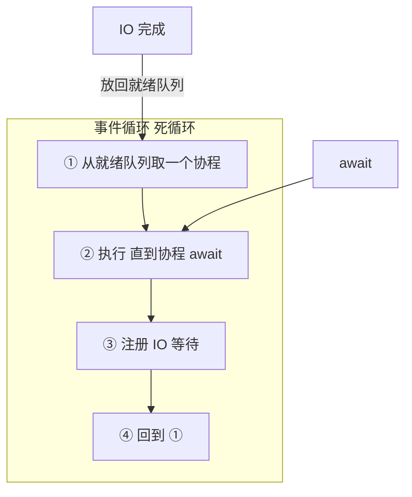
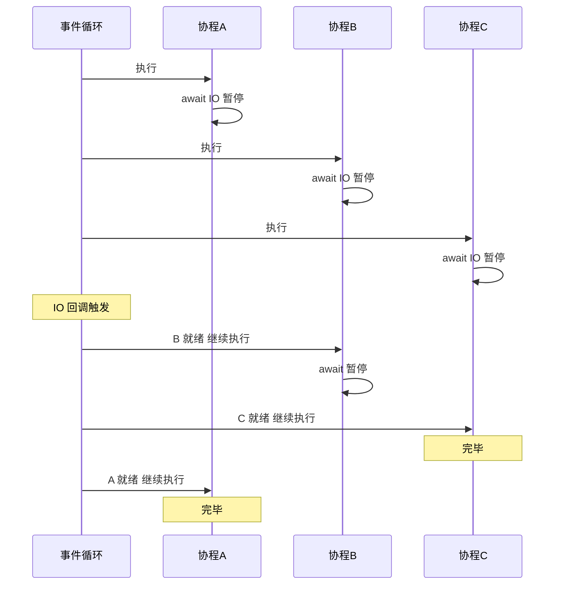

---

title: "事件循环asyncio的心脏"

created: "2026-07-20"

tags:

  - 八股文

  - python

---

# 事件循环asyncio的心脏

## 二、事件循环 —— asyncio 的心脏
### 2.1 事件循环是什么？

```text

事件循环 = 一个死循环 + 任务队列 + 就绪检查

while True:

    ① 检查哪些协程就绪了（之前 await 的 I/O 完成了）

    ② 挑一个就绪的协程 → 执行它

    ③ 协程运行中遇到 await → 暂停 → 把控制权交还给事件循环

    ④ 回到 ①

```

```python

# 事件循环的核心逻辑（极度简化——帮你理解，不是源码）

class SimpleEventLoop:

    def __init__(self):

        self.ready = []     # 就绪的协程

    def run_until_complete(self, coro):

        self.ready.append(coro)

        while self.ready:                    # ① 死循环——直到没有就绪任务

            task = self.ready.pop(0)         # ② 取出一个就绪协程

            try:

                task.send(None)              # ③ 恢复执行——底层就是生成器的 send()

            except StopIteration:

                continue                     # ④ 协程执行完毕——跳过

            # ⑤ 如果协程内部 await 了 → send() 返回（暂停）→ 回到循环顶部

            #    真实的事件循环会把 await 的东西注册到 I/O 多路复用（epoll/select）

            #    等 I/O 就绪后再把协程放回 ready 队列

```

### 2.2 事件循环的三个核心操作



| 操作 | 谁触发 | 做了什么 |

| :--- | :--- | :--- |

| **挂起（suspend）** | 协程执行到 `await` | 协程暂停 → 控制权还给事件循环 → 事件循环去执行其他协程 |

| **注册（register）** | 事件循环 | 把 await 的 I/O 操作注册到操作系统（epoll/select）——"这个 socket 有数据了通知我" |

| **唤醒（resume）** | OS 通知 → 事件循环 | I/O 就绪 → 事件循环把协程放回就绪队列 → 下次轮到它就继续执行 |

### 2.3 一张图看懂 3 个协程的调度



> **核心认知**：事件循环**不会同时执行两个协程**。它只是在就绪的协程之间快速切换。谁就绪了谁跑——这叫"协作式多任务"。

### 2.4 事件循环和 JS 事件循环的区别

> 你学过 JS 事件循环——两个"事件循环"名字一样，但物理结构完全不同。

| | Python asyncio 事件循环 | JS 浏览器事件循环 |

| :--- | :--- | :--- |

| 调度对象 | 协程（coroutine） | 宏任务/微任务 |

| 触发机制 | await 主动交出控制权 | 函数执行到结束才交 |

| 抢占性 | 协作式——协程自己决定何时暂停 | 非抢占式——函数必须跑完 |

| 多线程 | 可在多线程中运行多个事件循环 | 单线程（Web Worker 除外） |

| 底层 I/O | epoll/select（操作系统级） | 浏览器提供的 Web API |

> **一句话**：Python 的协程在 `await` 处主动暂停——像接力赛自己交棒；JS 的函数必须跑完才能交——像每个人必须跑完自己那段。

---

##

> ▶ 对应实操：[[14-TypedDict|14-TypedDict]]

## 速记卡（面试闪卡）

**Q1：一句话讲清「事件循环asyncio的心脏」到底是什么？**

A：事件循环是 asyncio 的调度核心，本质是死循环加任务队列，在就绪协程间快速切换实现协作式多任务。

**Q2：二、事件循环 —— asyncio 的心脏 —— 怎么理解？**

A：像餐厅领班：事件循环（Event Loop）本质是"死循环加任务队列加就绪检查"，不停在就绪协程间切换，谁 await 的 IO 完成谁就跑，从不同时跑两个协程。

**Q3：2.1 事件循环是什么 —— 怎么理解？**

A：像不停巡逻的领班：简化版就是 while True——检查哪些协程就绪、挑一个执行、遇 await 暂停交还控制权、再回到检查，底层靠生成器 send(None) 恢复协程。

**Q4：2.2 三个核心操作（挂起/注册/唤醒） —— 怎么理解？**

A：像三步接力：挂起（Suspend）协程 await 时暂停交权；注册（Register）把 IO 交给操作系统 epoll/select"好了通知我"；唤醒（Resume）IO 就绪后放回就绪队列继续跑。

**Q5：2.4 事件循环和 JS 事件循环的区别 —— 怎么理解？**

A：像接力赛 vs 跑完全程：Python 协程在 await 主动交棒（协作式）；JS 函数必须跑完才交权（非抢占式）。Python 调度协程、可多线程多循环；JS 调度宏微任务、通常单线程。

**Q6：核心速记主线有哪些？**

- 事件循环本质：死循环加任务队列加就绪检查，在就绪协程间快速切换（协作式多任务）

- 三操作：suspend（await 暂停交权）、register（IO 注册到 epoll/select）、resume（IO 就绪唤醒）

- 事件循环永不并行执行两个协程，故擅长 IO 密集、不擅长 CPU 密集

- 与 JS 事件循环不同：Python 协程 await 主动交棒，JS 函数跑完才交权

**口诀**

A：事件循环一颗心，死循环里排任务

await 暂停交棒去，就绪再来接着轮

挂起注册再唤醒，epoll 通知才回魂

协程不并行，IO 密集它最神

相关链接

- 📋 目录：[[00-Python]]

- 📚 学习清单：[[八股文学习路线图]]

- 🔗 [[语言与框架/Python/八股/并发/15-async-await本质|async/await本质]]

- 🔗 [[语言与框架/Python/八股/并发/16-gather与create_task|gather与create_task]]

- 🔗 [[计算机基础/操作系统/01-进程vs线程vs协程对比|进程vs线程vs协程]] — 操作系统视角的并发基础

- 🔗 [[语言与框架/TypeScript-React/八股/JavaScript/15-异步与事件循环|JS异步与事件循环]] — Python asyncio vs JS 事件循环

- 🔗 [[计算机基础/操作系统/13-IO模型四种|IO模型四种]] — 事件循环底层是 IO 多路复用

## 相关链接

- [[笔记/语言与框架/Python/八股/并发/16-gather与create_task|asyncio核心API]]

- [[笔记/语言与框架/Python/八股/并发/02-多线程多进程协程三者对比|协程与线程与进程选型决策树]]

- [[笔记/语言与框架/Python/八股/并发/21-生产者消费者模型|生产者-消费者模型]]

- [[笔记/语言与框架/Python/八股/并发/04-协程vs线程的调度本质区别|协程用户态的线程]]

- [[笔记/语言与框架/Python/八股/并发/19-multiprocessing模块|进程OS级别的独立包间]]

