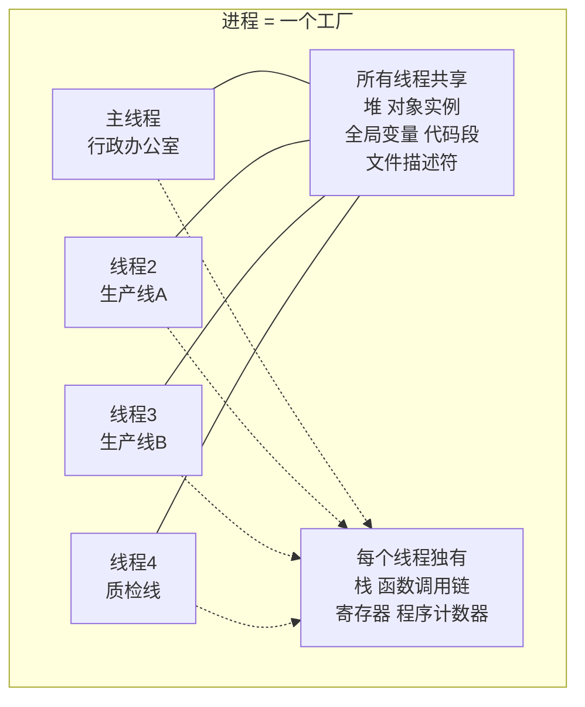
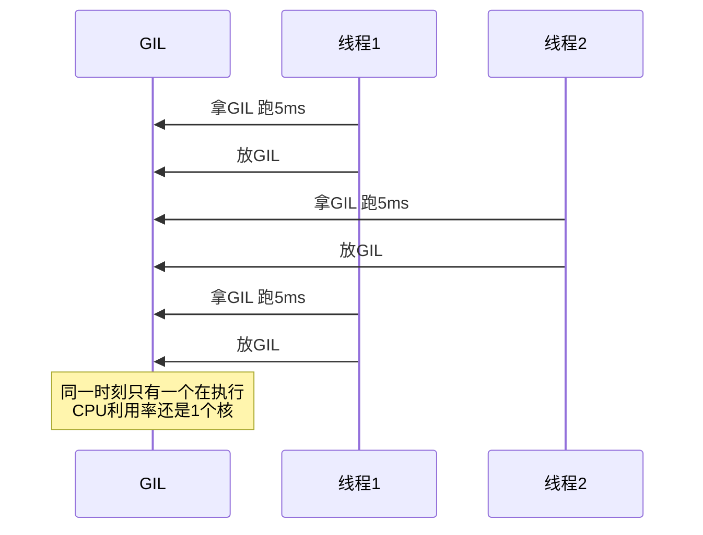
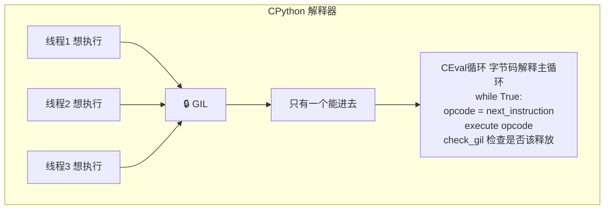

---

title: "线程共享内存的双刃剑"

created: "2026-07-20"

tags:

  - 八股文

  - python

---

# 线程共享内存的双刃剑

### 1.1 线程和进程的关系——一张图



### 1.2 线程切换——比进程轻，但还是要走 OS

```text

线程 A → 线程 B 切换：

① 保存线程 A 的寄存器 + 程序计数器 → TCB

② 加载线程 B 的寄存器 + 程序计数器 ← 从 TCB 恢复

③ CPU 开始执行线程 B

注意：不需要切换页表！（同一个进程的线程共享地址空间）

     不需要刷新 TLB！

     但还是要走系统调用——从用户态切到内核态再切回来。

```

| 对比 | 线程切换 | 进程切换 |
| :--- | :---: | :---: |
| 寄存器保存/恢复 | 需要 | 需要 |
| 页表切换 | ❌ 不需要 | ✅ 需要（最贵） |
| TLB 刷新 | ❌ 不需要 | ✅ 需要 |
| 内核态往返 | ✅ 需要 | ✅ 需要 |
| 典型耗时 | **1-10 微秒** | **几十到几百微秒** |

### 1.3 GIL——为什么 Python 的线程不能真并行

这是 Day 5 学过的，但今天从"调度"角度重新理解：

```python

import threading, time, sys

# Python 3.2+ 的 GIL 释放机制：不是等线程跑完，而是"每 5ms 强制换人"

print(f"GIL switch interval: {sys.getswitchinterval()} 秒")  # 0.005 = 5ms

def cpu_worker(name: str):

    """纯计算任务——全程需要 GIL"""

    count = 0

    for _ in range(50_000_000):

        count += 1

    print(f"{name} 完成")

# 开 2 个线程跑纯计算

start = time.time()

t1 = threading.Thread(target=cpu_worker, args=("线程1",))

t2 = threading.Thread(target=cpu_worker, args=("线程2",))

t1.start(); t2.start()

t1.join(); t2.join()

print(f"双线程耗时: {time.time() - start:.1f}s")  # 和单线程几乎一样！

# 甚至更慢——多了线程切换的开销，但计算能力没增加

```



> **一句话讲清**："GIL 把多线程变成了"快速轮流坐庄"——看起来并发，但不是并行。对于 IO 密集任务，线程在 `socket.recv()` 等系统调用时会主动释放 GIL，所以有效；对于 CPU 密集任务，全程需要 GIL，多线程没有任何性能增益。"

### 1.4 GIL 什么时候释放？——关键细节

```python

# 时机 ① 主动释放：调用 I/O 系统调用时

import socket

sock = socket.socket()

sock.connect(('example.com', 80))

data = sock.recv(4096)  # ← 底层 C 代码在等网络数据前，主动释放 GIL

# 如果有 → 释放 GIL → 让给等待的线程

```



### 1.5 GIL 的历史版本差异

| 版本 | GIL 机制 | 问题 |
| :--- | :--- | :--- |
| **Python < 3.2** | 每执行 100 条字节码指令释放一次 | 多核 CPU 上，发信号让另一个线程抢 GIL 要时间——经常信号到了但线程没准备好，导致某些线程**饿死**（一直抢不到 GIL） |
| **Python 3.2+** | 改用**时间片**（默认 5ms）+ 改进的唤醒机制 | 修复了线程饿死问题。`sys.getswitchinterval()` 查看，`sys.setswitchinterval()` 修改 |
| **Python 3.13** | 新增实验性 `-X nogil` 选项 | 基于 Sam Gross 的 nogil 分支，用偏向引用计数代替传统引用计数，去掉 GIL。目前还是实验性 |

> **加分点**："旧版 GIL 的问题不是'不能并行'——从来都不能——而是'有的线程可能永远抢不到 CPU'。3.2 用时间片代替指令计数，配合改进的信号机制，解决了公平调度。但并行问题还在——只有 3.13 的 nogil 模式在解决。"

---

## 速记卡（面试闪卡）

**Q1：一句话讲清「线程共享内存的双刃剑」到底是什么？**

A：Python 线程是被 GIL 锁住的"轮流坐庄"：多线程能并发却不能真并行，IO 等待时可释放 GIL 才有效。

**Q2：线程和进程到底差在哪 —— 怎么理解？**

A：进程像各自独立的工厂（有自己的地皮和仓库），线程像同一工厂里的多条生产线（共享仓库和原料，但各有自己的工具箱）。所以线程切换不用换地皮（不切页表、不刷 TLB），比进程切换轻 10-100 倍；但正因共享内存，一条线改了数据可能误伤另一条——这就是"双刃剑"。

**Q3：GIL 为什么让线程不能真并行 —— 怎么理解？**

A：GIL（Global Interpreter Lock，全局解释器锁）像会议室只有一把钥匙：同一时刻只允许一个线程进去做事。CPU 密集任务全程要这把钥匙，开两个线程只是"你 5ms 我 5ms 轮流"，总算力还是一核，所以没加速。只有 IO 任务（等网络/磁盘）会主动松手让给别人，多线程才划算。

**Q4：GIL 什么时候会松手 —— 怎么理解？**

A：两种时机：① 主动释放——线程调 IO 系统调用（如 socket.recv）等数据时，先把锁还回去，别人就能跑；② 被动释放——Python 3.2+ 每 5ms（switch interval）强制换人，用时间片解决旧版"有的线程永远抢不到"的饿死问题。Python 3.13 的 -X nogil 实验模式才真正去掉这把锁。

**Q5：面试怎么一句话讲清 —— 怎么理解？**

A：记住三句：GIL 让多线程"看起来并发、实际不并行"；IO 密集有效（等待时释放）、CPU 密集无效（全程占锁）；3.2+ 用时间片代替指令计数解决公平调度，真正并行要等 3.13 的 nogil。别把"不能并行"说成 GIL 的 bug——它从一开始就不是为并行设计的。

**Q6：核心速记主线有哪些？**

- 线程共享内存、独有栈，切换比进程轻

- GIL 锁住解释器，多线程不真并行

- IO 密集有效（释放 GIL）、CPU 密集无效

- 3.2+ 每 5ms 换人；3.13 实验 nogil

**口诀**

A：线程共享内存是双刃，切换轻快不换地

GIL 一把锁锁解释器，轮流坐庄不并行

IO 等待松手才有效，CPU 占锁白折腾

3.2 时间片防饿死，3.13 nogil 才去锁

## 相关链接

- 📋 目录：[[00-Python]]

- 📚 学习清单：[[八股文学习路线图]]

- 🔗 [[语言与框架/Python/八股/并发/19-multiprocessing模块|multiprocessing模块]]

- 🔗 [[语言与框架/Python/八股/并发/20-concurrent-futures线程池进程池|concurrent.futures线程池]]

- 🔗 [[计算机基础/操作系统/01-进程vs线程vs协程对比|进程vs线程vs协程]] — 操作系统视角的并发基础

- 🔗 [[语言与框架/TypeScript-React/八股/JavaScript/15-异步与事件循环|JS异步与事件循环]] — Python asyncio vs JS 事件循环

- 🔗 [[计算机基础/操作系统/03-线程同步锁机制|线程同步锁机制]] — 线程同步 Lock/RLock 的底层

