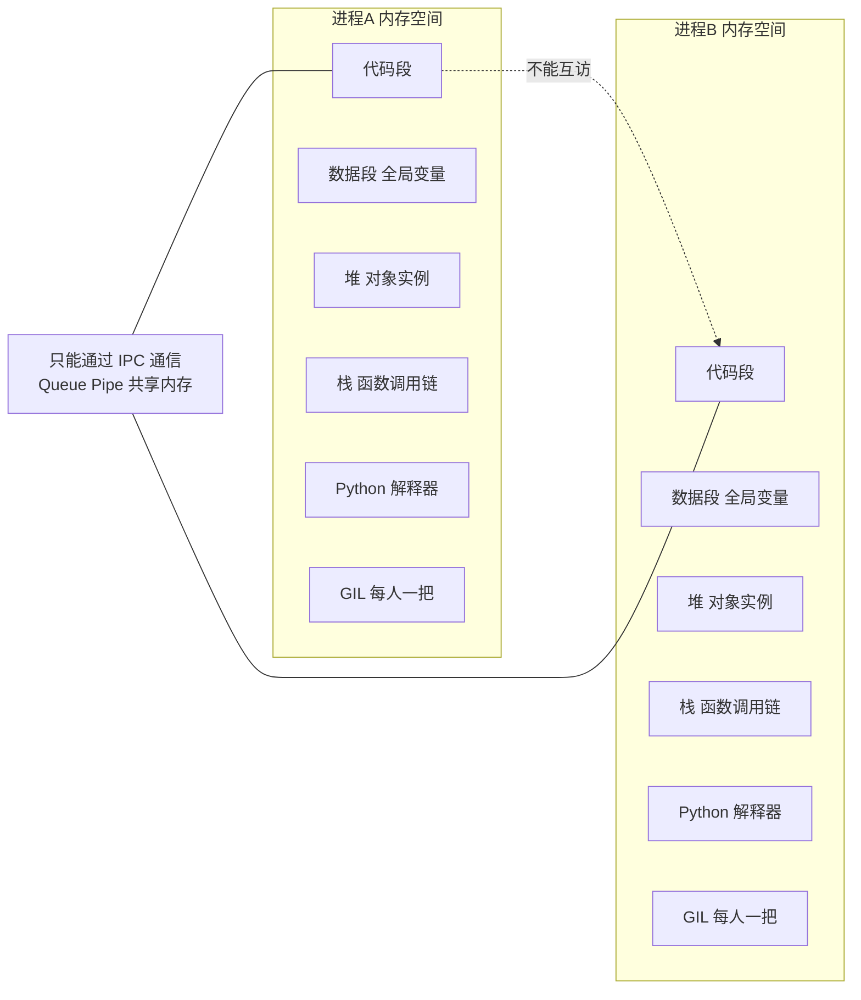
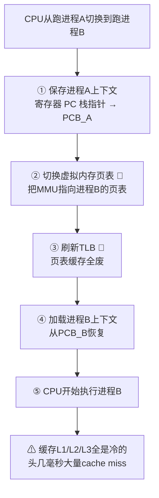

---

title: "进程OS级别的独立包间"

created: "2026-07-20"

tags:

  - 八股文

  - python

---

# 进程OS级别的独立包间

## 第一章：进程——OS 级别的"独立包间"
### 1.1 进程到底是什么？（30 秒版）

```text

你的 Python 程序启动的时候：

① 操作系统在磁盘上找到 python.exe

② 分配一块独立的内存空间（代码 + 数据 + 堆 + 栈）

③ 创建一个"进程控制块"（PCB）——OS 内部记录这个进程的档案

④ 把进程加入调度队列——等待 CPU 来执行

⑤ CPU 拿到这个进程 → 开始执行你的代码

```

**一句话**：进程 = 一个正在运行的程序实例。每次你 `python main.py`，OS 就创建一个进程。

### 1.2 进程的核心特征——内存隔离



```python

# 进程间内存隔离——最直观的例子

from multiprocessing import Process

data = [0]  # 全局变量

def worker():

    data[0] = 999  # 子进程里改了

    print(f"子进程: {data}")  # [999]

if __name__ == "__main__":

    p = Process(target=worker)

    p.start()

    p.join()

    print(f"父进程: {data}")  # [0] —— 还是 0！因为各有一份 data

    # 子进程改的是自己那份副本，父进程看不到

```

> **关键认知**：进程 = 隔离。隔离的代价是内存大（每个进程独立的 Python 解释器 ~几十MB）、通信贵（IPC 涉及序列化 + 系统调用）。好处是一人一把 GIL——多进程是 Python 里**唯一能做真正多核并行的方案**。

### 1.3 进程的切换——为什么进程"重"



| 开销项 | 进程切换 | 为什么贵 |

| :--- | :---: | :--- |

| 寄存器保存/恢复 | ~几十个寄存器 | 每次都要全保存 |

| 页表切换 | 必须 | 不同进程 = 不同虚拟地址空间 = 必须换页表 |

| TLB 刷新 | 必须 | TLB 存的旧页表映射全部作废 |

| CPU 缓存 | 大概率全 Miss | 新进程的数据不在缓存里 |

| 总耗时 | **~1-10 微秒 × 以上因素 = 实际几十微秒到几毫秒** | |

> **一句话讲清**："进程切换涉及页表切换和 TLB 刷新，比线程切换贵一个数量级。所以 IO 密集型不推荐多进程——每次 IO 完成都要切回进程，开销占比太高。"

### 1.4 什么时候必须用进程

**只有一种情况：CPU 密集型计算。**

```python

# 演示：斐波那契数列（纯计算），对比单进程 vs 多进程

import time

from multiprocessing import Pool

def fib(n: int) -> int:

    """递归算斐波那契——纯 CPU 计算，无 IO"""

    if n <= 1:

        return n

    return fib(n - 1) + fib(n - 2)

def benchmark():

    tasks = [35, 35, 35, 35]  # 4 个同样的计算任务（每个约 2-3 秒）

    # 单进程串行：一个一个算，总时间 = 4 × 单个时间

    start = time.time()

    for n in tasks:

        fib(n)

    print(f"单进程串行: {time.time() - start:.1f}s")  # ~10s

    # 多进程并行（4 核 CPU）：四个一起算，总时间 ≈ 单个时间

    start = time.time()

    with Pool(processes=4) as pool:

        pool.map(fib, tasks)

    print(f"多进程并行: {time.time() - start:.1f}s")  # ~3s（真并行！）

if __name__ == "__main__":

    benchmark()

```

> 用多线程跑这段代码——四个线程抢一把 GIL，实际上还是串行，和单线程一样慢甚至更慢（多了切换开销）。

---

## 速记卡（面试闪卡）

**Q1：一句话讲清「进程OS级别的独立包间」到底是什么？**

A：进程是 OS 给程序分配的独立内存包间，互相隔离、各有一把 GIL，是 Python 里唯一能真并行的方案。

**Q2：进程的核心特征是什么？ —— 怎么理解？**

A：像两户独立公寓——每进程有自己代码/数据/堆/栈和独立 Python 解释器，父进程改全局变量子进程看不到（各有一份副本）。代价是内存大、通信贵（IPC 要序列化+系统调用），好处是各拿一把 GIL 真并行。

**Q3：进程切换为什么"重"？ —— 怎么理解？**

A：像换工位要搬全套家当——切换要保存寄存器、换页表、刷 TLB、CPU 缓存全冷（cache miss），耗时几十微秒到几毫秒，比线程切换贵一个数量级，所以 IO 密集别用多进程。

**Q4：什么时候必须用多进程？ —— 怎么理解？**

A：像搬砖必须多人同时搬——只有 CPU 密集计算才用。斐波那契 4 个任务单进程串行约 10s，多进程 Pool 4 核并行约 3s 真并行；多线程抢同一把 GIL 实际还是串行，甚至更慢。

**Q5：进程间怎么通信？ —— 怎么理解？**

A：像两户不能直接翻对方抽屉——因内存隔离，进程间只能走 IPC（Inter-Process Communication，进程间通信）：Queue 队列、Pipe 管道、或共享内存，数据要序列化跨进程传，比线程共享变量麻烦且慢。

**Q6：核心速记主线有哪些？**

- 进程 = 运行中的程序实例，OS 分配独立内存空间，各有一把 GIL

- 内存隔离：父/子改全局变量互不可见，通信只能走 IPC（Queue/Pipe/共享内存）

- 切换重：换页表 + 刷 TLB + 缓存冷，比线程贵一个数量级

- 唯一真并行：只有 CPU 密集型才用多进程绕开 GIL；IO 密集不推荐

**口诀**

A：进程独立包一间，内存隔离各自管。

切换要换页表盘，TLB缓存全凉完。

通信只能走IPC，队列管道串一串。

CPU密集才上它，真并行破GIL关。

## 相关链接

- 📋 目录：[[00-Python]]

- 📚 学习清单：[[八股文学习路线图]]

- 🔗 [[语言与框架/Python/八股/并发/18-threading模块|threading模块]]

- 🔗 [[语言与框架/Python/八股/并发/20-concurrent-futures线程池进程池|concurrent.futures线程池]]

- 🔗 [[计算机基础/操作系统/01-进程vs线程vs协程对比|进程vs线程vs协程]] — 操作系统视角的并发基础

- 🔗 [[语言与框架/TypeScript-React/八股/JavaScript/15-异步与事件循环|JS异步与事件循环]] — Python asyncio vs JS 事件循环

- 🔗 [[计算机基础/操作系统/01-进程vs线程vs协程对比|进程vs线程vs协程]] — 多进程 = 真并行，绕过 GIL

