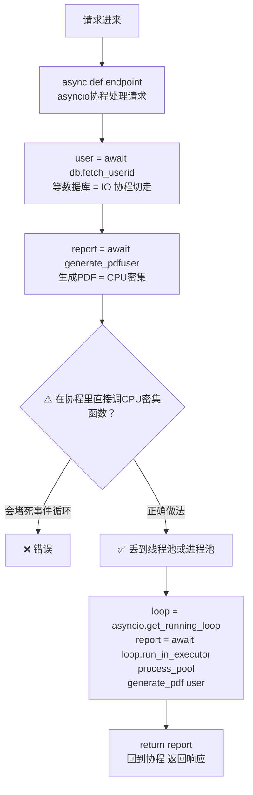
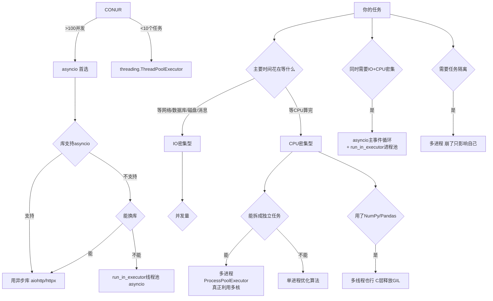

---

title: "混合并发实际项目怎么组合"

created: "2026-07-20"

tags:

  - 八股文

  - python

---

# 混合并发实际项目怎么组合

### 1.1 真实场景：Web API 服务器



### 1.2 三种 run_in_executor 模式

```python

import asyncio, time

from concurrent.futures import ThreadPoolExecutor, ProcessPoolExecutor

# 准备两个专用执行器（全局复用，不要每次创建！）

thread_pool = ThreadPoolExecutor(max_workers=10)    # IO 密集任务

process_pool = ProcessPoolExecutor(max_workers=4)   # CPU 密集任务

def cpu_intensive_task(n: int) -> int:

    """纯计算——应该在进程池跑"""

    total = 0

    for i in range(n * 10_000_000):

        total += i

    return total

def blocking_io_task(url: str) -> str:

    """阻塞 IO（用了同步库 requests）——应该在线程池跑"""

    import requests

    return requests.get(url).text[:100]

async def mixed_workload():

    """同时有 IO 密集和 CPU 密集任务"""

    # ① IO 密集：丢线程池（线程在等网络时释放 GIL）

    io_results = await asyncio.gather(

        asyncio.get_running_loop().run_in_executor(thread_pool, blocking_io_task, "https://httpbin.org/get"),

        asyncio.get_running_loop().run_in_executor(thread_pool, blocking_io_task, "https://httpbin.org/headers"),

    )

    # ② CPU 密集：丢进程池（真正并行计算）

    cpu_results = await asyncio.gather(

        asyncio.get_running_loop().run_in_executor(process_pool, cpu_intensive_task, 5),

        asyncio.get_running_loop().run_in_executor(process_pool, cpu_intensive_task, 8),

    )

    # ③ 在协程里等结果——事件循环不会堵塞

    return {"io": io_results, "cpu": cpu_results}

# asyncio.run(mixed_workload())

```

### 1.3 选型决策树——终极版



---

## 速记卡（面试闪卡）

**Q1：一句话讲清「混合并发实际项目怎么组合」到底是什么？**

A：实际项目用 asyncio 主循环，CPU 或阻塞 I/O 丢进线程池/进程池，避免卡死又能真并行。

**Q2：Web API 的真实场景 —— 怎么理解？**

A：Web 服务像餐厅前台：async 协程接待请求（等数据库 I/O 时切走），但生成 PDF 这种 CPU 重活直接做会堵死前台。正确做法：把重活丢进线程池/进程池（run_in_executor），前台继续接客不卡。

**Q3：三种 run_in_executor —— 怎么理解？**

A：Executor 像两个外包队：ThreadPoolExecutor 接 I/O 阻塞活（线程等网络时释放 GIL），ProcessPoolExecutor 接 CPU 计算活（真并行绕开 GIL）。全局建好复用，别每次新建——像养两支常备外包别临时招。

**Q4：选型决策树终极版 —— 怎么理解？**

A：分诊更细：I/O 且>100并发→asyncio；<10任务→线程池；库不支持 asyncio→run_in_executor 线程池；CPU 密集能拆→多进程；用了 NumPy/Pandas（C层放 GIL）→多线程也行；要隔离→多进程崩了只影响自己。

**Q5：为何不让协程直接算 —— 怎么理解？**

A：在协程里直接调 CPU 密集函数，像让前台亲自下厨——事件循环（event loop）被霸占，所有其他请求全卡住。必须 offload 到进程池，等结果期间协程照常切换，整个服务才不被一颗老鼠屎坏一锅汤。

**Q6：核心速记主线有哪些？**

- asyncio 主事件循环处理请求，CPU/阻塞 I/O 用 run_in_executor 卸载

- ThreadPoolExecutor 跑 I/O 阻塞（释放 GIL）；ProcessPoolExecutor 跑 CPU 计算（真并行）

- Executor 全局复用，不要每次创建

- 选型：高并发 I/O→asyncio；不支持异步的库→线程池；CPU 密集→进程池；需隔离→进程

- 协程里直接做 CPU 重活会堵死事件循环

**口诀**

A：主循环跑协程，重活丢进池；

线程池接 IO，进程池算 CPU；

Executor 全局建，别每次新建；

协程莫亲下厨，事件循环不堵。

## 相关链接

- 📋 目录：[[00-Python]]

- 📚 学习清单：[[八股文学习路线图]]

- 🔗 [[语言与框架/Python/八股/并发/18-threading模块|threading模块]]

- 🔗 [[语言与框架/Python/八股/并发/19-multiprocessing模块|multiprocessing模块]]

- 🔗 [[计算机基础/操作系统/01-进程vs线程vs协程对比|进程vs线程vs协程]] — 操作系统视角的并发基础

- 🔗 [[语言与框架/TypeScript-React/八股/JavaScript/15-异步与事件循环|JS异步与事件循环]] — Python asyncio vs JS 事件循环

- 🔗 [[计算机基础/操作系统/01-进程vs线程vs协程对比|进程vs线程vs协程]] — Executor 封装了线程/进程池

