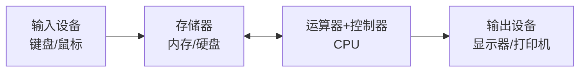
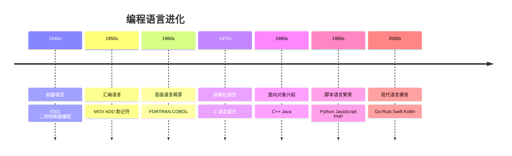
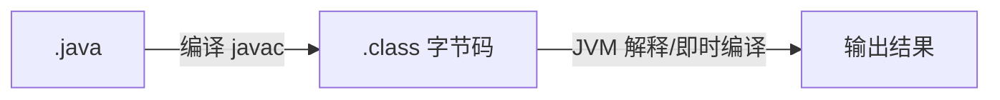

---

title: "Day 01：入门与环境搭建"

tags:

  - python

  - 技术学习

  - 学习笔记

created: "2025-07-12"

---

# Day 01：入门与环境搭建

> 🎯 **学习目标**：理解计算机基础、编程语言发展史，搭建完整 Python 开发环境，写出第一行代码

## 1. 课程介绍

本课程是尚硅谷 AI 大模型系列课程的第 01 模块——Python 基础（V3.0 版），面向**零基础**学员，目标是为后续的 AI/ML/大模型学习打下扎实的 Python 编程功底。整个系列共 25 大模块，涵盖从 Python 基础到企业级大模型部署的全链路技术栈。

> [!important] V3.0 版本升级点

> - 新增 match-case、类型注解、dataclass 等 Python 3.10+ 新特性

> - 强化面向 AI 方向的内容（如 NumPy 风格的数据处理思维）

> - 引入现代工程工具链（ruff、pytest、pyproject.toml）

## 2. 计算机组成
### 2.1 冯·诺依曼体系结构

现代计算机都遵循**冯·诺依曼体系**，由五大部件组成：



| 部件 | 作用 | 举例 |

|------|------|------|

| **运算器** | 算术运算 + 逻辑运算 | ALU（算术逻辑单元） |

| **控制器** | 指挥各部件协调工作 | 取指令 → 译码 → 执行 |

| **存储器** | 存储程序和数据 | 内存（RAM）、硬盘（SSD/HDD） |

| **输入设备** | 接收外部数据 | 键盘、鼠标、麦克风 |

| **输出设备** | 向外部输出结果 | 显示器、打印机、音箱 |

### 2.2 内存 vs 硬盘

这是初学者最容易混淆的概念：

| 对比维度 | 内存（RAM） | 硬盘（SSD/HDD） |

|----------|-----------|----------------|

| 速度 | 极快（纳秒级） | 较慢（毫秒级） |

| 容量 | 较小（8-32GB） | 较大（256GB-2TB） |

| 持久性 | **断电数据丢失** | **断电数据保留** |

| 价格 | 贵 | 便宜 |

| 比喻 | 办公桌面（临时放） | 文件柜（永久存） |

> [!tip] 理解关键

> 程序运行时从硬盘**加载到内存**，CPU 从内存读取指令执行。这就是为什么内存越大，能同时运行的程序越多。

### 2.3 CPU 核心指标

- **主频**：每秒执行多少周期，单位 GHz（如 3.5GHz = 每秒 35 亿次）

- **核心数**：能同时并行处理的任务数（多核 = 真正并行）

- **缓存**：CPU 内部的高速存储，L1 > L2 > L3 三级缓存

## 3. 计算机语言发展史



### 3.1 第一代：机器语言

```binary

# 机器语言示例（x86 二进制）

10110000 01100001  # 将 0x61（即 'a'）移入 AL 寄存器

```

- **优点**：CPU 直接执行，速度最快

- **缺点**：完全不可读、不可维护、不可移植

- **现状**：基本没有程序员直接写了

### 3.2 第二代：汇编语言

```assembly

# 汇编语言示例（x86）

MOV AL, 61h     ; 将 0x61 移入 AL 寄存器

ADD AL, 01h     ; AL = AL + 1

```

- **改进**：用助记符代替二进制，可读性提升

- **缺点**：依然与硬件紧密绑定，不同 CPU 指令集不同

- **现状**：嵌入式、驱动开发、逆向工程中仍然使用

### 3.3 第三代：高级语言

```python

# Python 示例

result = ord('a') + 1  # 完全不需要关心底层寄存器

```

- **核心进步**：一条语句对应多条机器指令，屏蔽硬件细节

- **分类**：编译型 vs 解释型（详见下节）

## 4. 编译型语言 vs 解释型语言
### 4.1 编译型语言


**代表语言**：C、C++、Go、Rust

- **工作流程**：一次性将全部源代码翻译为机器码

- **优点**：运行效率高（直接执行机器码）、可脱离编译环境

- **缺点**：开发效率低（改代码 → 重新编译 → 重新链接 → 才能运行）

- **跨平台**：需要为不同平台分别编译（Windows .exe ≠ Linux 可执行文件）

### 4.2 解释型语言


**代表语言**：Python、JavaScript、Ruby、PHP

- **工作流程**：解释器逐行读取源代码 → 翻译 → 执行

- **优点**：开发效率高（改代码直接运行）、跨平台性好

- **缺点**：运行效率相对较低（每次都要翻译）

- **跨平台**：只要平台上有解释器，同一份代码到处能跑

### 4.3 半编译半解释（Java/C#）



Java 先编译成**字节码**（中间语言），再由 JVM 解释执行（或 JIT 即时编译为机器码），兼顾了跨平台性和运行效率。

> [!important] Python 其实也是"半编译"

> Python 运行时会把源码编译为 `.pyc` 字节码（`__pycache__` 目录下），再由 PVM（Python 虚拟机）执行。但这个过程对用户透明，习惯上仍称 Python 为解释型语言。

## 5. Python 语言的运行方式与特点
### 5.1 Python 的设计哲学

```python

import this  # Python 之禅（在 Python 交互环境中运行）

```

核心原则：

- **优美胜于丑陋**（Beautiful is better than ugly）

- **明了胜于晦涩**（Explicit is better than implicit）

- **简单胜于复杂**（Simple is better than complex）

- **可读性很重要**（Readability counts）

### 5.2 Python 的核心优势

| 优势 | 说明 |

|------|------|

| 🐍 **语法简洁** | 用缩进代替花括号，代码量通常只有 Java 的 1/3 ~ 1/5 |

| 📦 **生态丰富** | PyPI 上有 40 万+ 第三方包，AI/ML 领域是事实标准 |

| 🔄 **跨平台** | Windows / macOS / Linux 一套代码通用 |

| 🚀 **开发高效** | 快速原型验证，特别适合 AI 研究和实验 |

| 🤖 **AI 首选** | PyTorch、TensorFlow、HuggingFace 等核心框架均基于 Python |

| 👥 **社区活跃** | Stack Overflow 问题最多、GitHub 项目最多的语言之一 |

### 5.3 Python 的应用领域

- **人工智能/机器学习**：PyTorch、TensorFlow、scikit-learn

- **数据科学**：Pandas、NumPy、Matplotlib

- **Web 开发**：Django、Flask、FastAPI

- **自动化运维**：Ansible、SaltStack

- **网络爬虫**：Scrapy、BeautifulSoup

- **量化金融**：backtrader、zipline

## 6. Python 解释器介绍与安装
### 6.1 什么是 Python 解释器

Python 解释器是一个**能读懂并执行 Python 代码的程序**。就像你需要翻译才能看懂英文，计算机需要解释器才能"看懂"并执行 Python 代码。

### 6.2 主流 Python 解释器

| 解释器 | 语言实现 | 特点 |

|--------|---------|------|

| **CPython** | C 语言 | 官方标准，使用最广泛（我们学的就是这个） |

| Jython | Java | 运行在 JVM 上，可调用 Java 类库 |

| IronPython | C# | 运行在 .NET 上，可调用 C# 类库 |

| PyPy | Python | JIT 编译，某些场景运行速度比 CPython 快数倍 |

| MicroPython | C | 精简版，用于嵌入式设备（ESP32 等） |

### 6.3 安装 Python（Windows）

**步骤一：下载**

访问 [python.org/downloads](https://www.python.org/downloads/)，选择 Python 3.11 或 3.12 版本（推荐 3.11，生态兼容性最好）。

**步骤二：安装**

1. 双击下载的 `.exe` 安装包

2. ⚠️ **务必勾选"Add Python to PATH"**（把 Python 加入系统环境变量）

3. 选择"Install Now"（默认安装）或"Customize installation"（自定义路径）

**步骤三：验证安装**

打开命令提示符（Win+R → 输入 cmd → 回车），输入：

```bash

python --version

# 输出：Python 3.11.x

```

如果显示版本号，说明安装成功！

> [!warning] 常见问题

> - 如果提示"python 不是内部或外部命令"，说明没勾选"Add Python to PATH"

> - 解决方案：重新安装并勾选，或手动将 Python 安装目录添加到系统 PATH

> - 不要安装到中文路径！推荐路径 `C:\Python311` 或保持默认

## 7. PyCharm 的安装与配置
### 7.1 为什么需要 IDE

你可以用记事本写 Python，但会非常痛苦。IDE（集成开发环境）提供：

| 功能 | 说明 |

|------|------|

| 代码补全 | 输入前几个字母，自动提示候选 |

| 语法高亮 | 不同元素用不同颜色显示 |

| 调试器 | 逐行执行、查看变量值 |

| 错误提示 | 语法错误实时标红 |

| 版本控制 | 集成 Git |

| 虚拟环境 | 管理项目依赖 |

### 7.2 PyCharm 版本选择

| 版本 | 价格 | 适用场景 |

|------|------|----------|

| **Community（社区版）** | 免费 | Python 基础开发，足够本课程使用 |

| Professional（专业版） | 付费 | Web 开发、数据库工具、科学工具 |

> [!tip] 推荐

> 初学者用 Community 版完全足够。学生可申请 Professional 免费教育许可。

### 7.3 安装步骤

1. 访问 [jetbrains.com/pycharm/download](https://www.jetbrains.com/pycharm/download/)

2. 下载 Community 版

3. 安装时建议勾选：

   - Create Desktop Shortcut（桌面快捷方式）

   - Add "Open Folder as Project"（右键菜单）

   - Add launchers dir to PATH

### 7.4 基本配置

**首次启动**

- 选择 UI 主题（Darcula 深色 / IntelliJ Light 浅色）

- 跳过插件安装（以后可以再加）

**创建第一个项目**

1. New Project → 选择项目路径

2. 选择 Python 解释器（会自动检测已安装的 Python）

3. 点击 Create

**推荐安装的插件**

- `Chinese (Simplified) Language Pack` — 汉化界面（可选）

- `Rainbow Brackets` — 彩色括号配对

- `Indent Rainbow` — 彩色缩进线

### 7.5 常用快捷键

| 快捷键 | 功能 |

|--------|------|

| `Ctrl + D` | 复制当前行 |

| `Ctrl + Y` | 删除当前行 |

| `Ctrl + /` | 注释/取消注释 |

| `Ctrl + Alt + L` | 格式化代码 |

| `Shift + Enter` | 在下方新建一行 |

| `Ctrl + Shift + F10` | 运行当前文件 |

| `Shift + F10` | 运行（同上） |

| `Ctrl + Shift + ↑/↓` | 上下移动当前行 |

| `Alt + 鼠标点击` | 多光标编辑 |

> [!tip] 从零到熟练

> 不要试图一次记住所有快捷键。第一天只记住 `Ctrl + D` 和 `Ctrl + /` 就够了。

## 8. 交互式命令行 vs 脚本方式运行
### 8.1 交互式命令行（REPL）

打开终端，输入 `python` 回车，出现 `>>>` 提示符：

```python

>>> 1 + 2

3

>>> print("Hello Python!")

Hello Python!

>>> name = "张三"

>>> f"你好，{name}"

'你好，张三'

>>> exit()  # 退出（或按 Ctrl+Z 回车）

```

- **REPL** = Read（读取）→ Evaluate（求值）→ Print（打印）→ Loop（循环）

- **优点**：即时反馈，适合测试小段代码、验证想法

- **缺点**：代码无法保存，不适合写正式程序

### 8.2 脚本方式

创建一个 `.py` 文件，一次性运行全部代码：

```python

# hello.py

print("Hello World!")

print("这是第一个 Python 脚本")

name = input("你叫什么名字？")

print(f"你好，{name}！")

```

```bash

python hello.py

```

- **优点**：代码可保存、可复用、可版本管理

- **缺点**：需要先写代码再运行

- **最佳实践**：日常开发用脚本方式，快速验证用 REPL

### 8.3 PyCharm 中的运行方式

在 PyCharm 中，右键代码区域 → Run '文件名'，或点击右上角绿色三角形 ▶ 按钮。PyCharm 会自动调用 Python 解释器执行你的脚本，并在下方控制台显示输出结果。

## 9. 注释
### 9.1 注释的作用

注释是写给人看的，不是写给计算机看的。计算机执行代码时会**完全忽略**注释。

> [!important] 好代码 > 多注释

> 最好的注释是**不需要注释**——代码本身就足够清晰。注释应该解释"为什么这样做"，而不是"做了什么"。

### 9.2 单行注释

```python

# 这是单行注释，从 # 开始到行尾都是注释

print("Hello")  # 也可以写在代码后面

# print("这行不会执行")

```

### 9.3 多行注释

Python 没有专门的多行注释语法，但可以用三个引号"欺骗"解释器：

```python

'''

这是多行注释

使用三个单引号

可以跨越多行

'''

"""

这也是多行注释

使用三个双引号

效果相同

"""

```

> [!note] 技术细节

> 三引号本质上是**字符串字面量**（一个没有赋值给变量的字符串），Python 会创建这个字符串对象然后立即丢弃它。因为它没有被使用，所以实际效果等同于注释。

### 9.4 文档字符串（docstring）

放在函数/类/模块的开头，用三引号包裹，Python 会把它作为对象的 `__doc__` 属性存储：

```python

def add(a, b):

    """

    计算两个数的和

    参数:

        a: 第一个数

        b: 第二个数

    返回:

        两数之和

    """

    return a + b

print(add.__doc__)  # 可以访问文档字符串

help(add)           # 会显示文档字符串

```

### 9.5 注释原则

```python

# ❌ 糟糕的注释：重复代码内容

x = x + 1  # 将 x 加 1

# ✅ 好的注释：解释为什么

x = x + 1  # 补偿 off-by-one 误差

# ✅ 好：删掉无用的注释代码，用 Git 管理历史版本

```

## 10. 变量的声明和赋值
### 10.1 什么是变量

变量就是**给数据起个名字**。想象你有一个储物柜，变量就是柜子上的标签——贴什么标签，就通过这个标签存取柜子里的东西。

```python

name = "张三"       # 创建变量 name，存储字符串 "张三"

age = 20            # 创建变量 age，存储整数 20

height = 1.75       # 创建变量 height，存储浮点数 1.75

```

### 10.2 Python 变量的特殊之处

与 C/Java 不同，Python 变量**不需要声明类型**：

```python

# Python 不需要！

age = 20          # age 现在是整数

age = "二十岁"    # age 现在是字符串！合法但强烈不推荐

```

这是因为 Python 是**动态类型语言**——变量的类型在运行时确定，且可以随时改变。

> [!warning] 动态类型 ≠ 可以随便改类型

> 技术上可行，但实际开发中不要这样做。一个变量最好始终存储同一类型的数据。

### 10.3 标识符命名规则

**必须遵守（否则报错）**：

| 规则 | 正确 | 错误 |

|------|------|------|

| 由字母、数字、下划线组成 | `user_name` | — |

| 不能以数字开头 | `name1` | `1name` |

| 不能是 Python 关键字 | — | `if`、`for`、`class` |

| 区分大小写 | `Name` ≠ `name` | — |

**Python 关键字列表**（不能用作变量名）：

```python

import keyword

print(keyword.kwlist)

#  'raise', 'return', 'try', 'while', 'with', 'yield']

```

### 10.4 命名建议（强烈推荐）

| 命名风格 | 适用场景 | 示例 |

|----------|---------|------|

| `snake_case`（蛇形） | 变量、函数、方法 | `user_name`、`get_student_count` |

| `CamelCase`（驼峰） | 类名 | `StudentInfo`、`BankAccount` |

| `UPPER_CASE`（大写蛇形） | 常量 | `MAX_SIZE`、`PI` |

```python

# ✅ 推荐的命名

student_count = 30           # 蛇形命名，见名知意

max_retry_times = 3          # 清晰明确

PI = 3.14159                 # 常量全大写

# ❌ 不推荐的命名

sc = 30                      # 太短，不知道什么意思

aaa = 3                      # 完全无意义

MAXRETRYTIMES = 3            # 全大写没有下划线，难读

```

### 10.5 变量的修改和常量

```python

# 变量可以反复赋值（甚至可以换类型）

x = 10

x = 20          # 覆盖为 20

x = "hello"     # 覆盖为字符串（不推荐！）

# Python 没有真正的常量机制，靠命名约定

MAX_CONNECTIONS = 100  # 全大写表示"请勿修改"

# 但这只是约定，技术上仍然可以修改（不建议）

```

> [!important] 理解变量的本质

> Python 中的变量不是"盒子"（存储数据），而是**标签**（引用对象）。

> `x = 10` 的意思是：创建一个整数对象 `10`，然后让标签 `x` 指向它。

> `x = 20` 的意思是：让标签 `x` 指向另一个对象 `20`（原来的 `10` 如果没其他引用会被回收）。

## 11. 第一个综合练习

把今天学的所有知识点串起来：

```python

# -*- coding: utf-8 -*-

"""

第一个 Python 程序

作者：你的名字

日期：2026-06-08

"""

# 1. 输出欢迎信息

print("=" * 40)

print("欢迎来到 Python 世界！")

print("=" * 40)

# 2. 使用变量存储信息

course_name = "尚硅谷大模型技术之 Python 基础"

version = "V3.0"

total_days = 15

# 3. 获取用户输入

student_name = input("请输入你的名字：")

# 4. 输出个性化信息

print(f"\n{student_name} 同学，你好！")

print(f"你正在学习的是：{course_name}")

print(f"版本：{version}")

print(f"课程天数：{total_days} 天")

print(f"今天是第 1 天，加油！💪")

# 5. 简单的计算

hours_per_day = int(input("\n你计划每天学习几小时？"))

total_hours = hours_per_day * total_days

print(f"按这个进度，完成课程需要约 {total_hours} 小时")

```

## 📝 本节要点回顾

```mermaid

mindmap

  Day01 入门与环境搭建

    计算机基础

      冯·诺依曼五部件

      内存 vs 硬盘

      CPU 主频与核心

    语言发展

      机器语言 → 汇编

      高级语言 → Python

      编译 vs 解释

    Python 环境

      CPython 解释器

      安装 Python 3.11+

      PyCharm IDE

      REPL vs 脚本

    编程基础

      注释：为什么 vs 做什么

      变量：标签不是盒子

      命名：见名知意

```

## 速记卡（面试闪卡）

**Q1：一句话讲清「Day 01：入门与环境搭建」到底是什么？**

A：本文是 Python 零基础第一课：搞懂计算机组成、语言发展史、编译与解释的区别，并装好 CPython 与 PyCharm 写出第一行代码。

**Q2：计算机组成：冯·诺依曼 + 内存 vs 硬盘 —— 怎么理解？**

A：计算机五大件（运算/控制/存储/输入输出）按冯·诺依曼排布；内存像办公桌（快、断电丢），硬盘像文件柜（慢、永久存）。程序从硬盘加载进内存 CPU 才执行（Von Neumann architecture, RAM vs disk）。

**Q3：语言发展史：机器 → 汇编 → 高级 —— 怎么理解？**

A：机器语言是 0101（CPU 直跑但人看不懂），汇编用助记符（仍绑硬件），高级语言一条语句顶多条指令、屏蔽硬件。好比从手摇缝纫机进化到智能裁剪机（machine/assembly/high-level language）。

**Q4：编译型 vs 解释型 —— 怎么理解？**

A：编译型（C/Go）一次性翻成机器码，跑得快但改了要重编译，各平台分别编译；解释型（Python/JS）逐行翻译，改完直接跑、跨平台好，但每次都要翻。半编译如 Java 先成字节码再 JVM 执行（compiled vs interpreted）。

**Q5：Python 环境：解释器 + PyCharm —— 怎么理解？**

A：CPython 是官方标准解释器，把源码编译成 .pyc 再让 PVM 执行；装 Python 务必勾 Add to PATH，PyCharm 社区版够用。REPL 即时试、脚本可保存，日常用脚本（CPython interpreter, REPL）。

**Q6：核心速记主线有哪些？**

- 计算机：冯·诺依曼五部件；内存=桌(快易失)、硬盘=柜(慢持久)

- 语言史：机器→汇编→高级，一条高级语句顶多条机器指令

- 编译 vs 解释：编译快但重编译跨平台差；解释慢但改完即跑

- 环境：CPython 标准、勾 PATH、PyCharm 社区版、REPL 试脚本存

**口诀**

A：零基入门第一天，

冯氏五件记心间；

编译解释各分线，

CPython 写首篇。

## 相关链接

- 下一篇：[[02_进制与数据类型]]

---

→ [[技术学习路线图#语法核心]]

