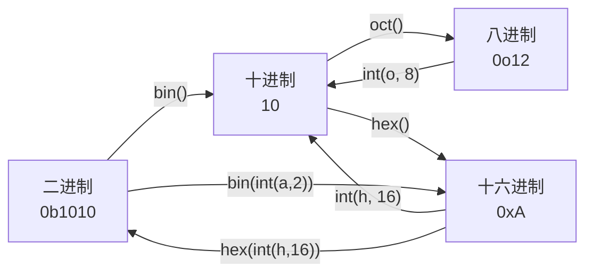

# Day 02：进制与数据类型

> 🎯 **学习目标**：理解计算机中的数字表示（进制与补码），掌握 Python 四种基本数据类型和类型转换，学会使用 input 和三种输出方式


## 1. 常见进制介绍

### 1.1 什么是进制

进制就是**逢几进一**的计数规则。我们日常生活中使用十进制（逢十进一），因为人类有十根手指。计算机使用二进制（逢二进一），因为电路只有两种状态：通电（1）和断电（0）。

### 1.2 四种进制详解

#### 二进制（Binary）

- **数码**：0 和 1
- **基数**：2
- **Python 前缀**：`0b` 或 `0B`
- **进位规则**：逢二进一

```python
# 二进制数值示例
# 0b0   = 0（十进制）
# 0b1   = 1（十进制）
# 0b10  = 2（十进制） ← 1×2+0 = 2
# 0b11  = 3（十进制） ← 1×2+1 = 3
# 0b100 = 4（十进制） ← 1×4+0×2+0 = 4

print(0b1010)   # 输出 10
print(0b1111)   # 输出 15
```

**二进制转十进制**：每位乘以 2 的幂次然后求和

`0b1101` = 1×2³ + 1×2² + 0×2¹ + 1×2⁰ = 8 + 4 + 0 + 1 = **13**

#### 八进制（Octal）

- **数码**：0-7
- **基数**：8
- **Python 前缀**：`0o` 或 `0O`
- **应用**：Linux 文件权限（如 `chmod 755`）

```python
print(0o10)   # 输出 8  （1×8+0=8）
print(0o77)   # 输出 63 （7×8+7=63）
```

#### 十进制（Decimal）

- **数码**：0-9
- **基数**：10
- 日常使用的进制，Python 中直接写数字即可

#### 十六进制（Hexadecimal）

- **数码**：0-9 和 A-F（A=10, B=11, C=12, D=13, E=14, F=15）
- **基数**：16
- **Python 前缀**：`0x` 或 `0X`
- **应用**：颜色代码（`#FF0000` = 红色）、内存地址

```python
print(0xA)     # 输出 10
print(0xFF)    # 输出 255  （15×16+15=255）
print(0x100)   # 输出 256  （1×256=256）
```

**十六进制转十进制**：`0x2AF` = 2×16² + 10×16¹ + 15×16⁰ = 512 + 160 + 15 = **687**

### 1.3 各进制对照表

| 十进制 | 二进制 | 八进制 | 十六进制 |
|:------:|:------:|:------:|:--------:|
| 0 | 0b0 | 0o0 | 0x0 |
| 1 | 0b1 | 0o1 | 0x1 |
| 2 | 0b10 | 0o2 | 0x2 |
| 7 | 0b111 | 0o7 | 0x7 |
| 8 | 0b1000 | 0o10 | 0x8 |
| 9 | 0b1001 | 0o11 | 0x9 |
| 10 | 0b1010 | 0o12 | 0xA |
| 15 | 0b1111 | 0o17 | 0xF |
| 16 | 0b10000 | 0o20 | 0x10 |
| 255 | 0b11111111 | 0o377 | 0xFF |


## 2. 进制之间的相互转换

### 2.1 Python 内置转换函数

```python
# 十进制 → 其他进制
n = 42
print(bin(n))    # '0b101010'  转二进制
print(oct(n))    # '0o52'      转八进制
print(hex(n))    # '0x2a'      转十六进制

# 其他进制 → 十进制（用 int 函数，传入基数）
print(int('101010', 2))   # 42  二进制→十进制
print(int('52', 8))       # 42  八进制→十进制
print(int('2a', 16))      # 42  十六进制→十进制
```

### 2.2 手动转换方法

**十进制 → 二进制（短除法）**：不断除以 2，取余数，从下往上排列

```text
将 42 转二进制：
42 ÷ 2 = 21 ... 余 0  ↑
21 ÷ 2 = 10 ... 余 1  ↑
10 ÷ 2 = 5  ... 余 0  ↑
5  ÷ 2 = 2  ... 余 1  ↑
2  ÷ 2 = 1  ... 余 0  ↑
1  ÷ 2 = 0  ... 余 1  ↑
结果：101010（从下往上读）
```


## 3. 原码、反码、补码

### 3.1 为什么需要补码

计算机只会做加法。如果我们想让计算机做减法，最简单的思路是：**把减法变成加一个负数**。补码就是为了让"加一个负数"等价于"做减法"而设计的。

### 3.2 三码定义

以 **8 位** 二进制为例，表示 -5：

| 类型 | 二进制表示 | 说明 |
|------|-----------|------|
| **原码** | `1000 0101` | 最高位=符号位（1 表示负），其余=数值 |
| **反码** | `1111 1010` | 符号位不变，其余位取反（0↔1） |
| **补码** | `1111 1011` | 反码 + 1 |

**正数的三码相同**。以 +5 为例：
- 原码 = `0000 0101`
- 反码 = `0000 0101`（相同）
- 补码 = `0000 0101`（相同）

### 3.3 补码验证

```text
计算 7 - 5 = 7 + (-5)
用补码计算：
  7 的补码：0000 0111
+ -5的补码：1111 1011
─────────────────────
  (1) 0000 0010  ← 进位溢出丢弃，结果是 0000 0010 = 2 ✓
```

### 3.4 补码解码（已知补码求原值）

```python
# 已知 8 位补码 1111 1011，求原值
# 补码最高位 = 1 → 负数
# 补码取反：0000 0100
# 加 1：    0000 0101 = 5
# 加上负号：-5
```

> [!important] 核心结论
> **计算机中所有整数都以补码形式存储！**
> 补码统一了加法和减法，简化了硬件电路设计。

### 3.5 Python 中的位运算（预习）

```python
# 按位取反
~5   # -6（因为补码机制）

# 左移和右移
8 << 1   # 16（左移 1 位 = ×2）
8 >> 1   # 4（右移 1 位 = ÷2）
```


## 4. 数据类型分类

### 4.1 整数（int）

Python 3 中整数**没有大小限制**（只受内存限制），不会像 C/Java 那样溢出。

```python
a = 100
b = -50
c = 0b1101       # 二进制整数 = 13
d = 0o17         # 八进制整数 = 15
e = 0xFF         # 十六进制整数 = 255
f = 10_000_000   # 下划线分隔，提高可读性（Python 3.6+）
g = 99999999999999999999999999999999999  # Python 能处理任意大整数

print(type(a))   # <class 'int'>
```

### 4.2 浮点数（float）

```python
pi = 3.14159
e = 2.71828
big = 1.5e9        # 科学计数法 = 1500000000.0
small = 1.5e-3     # = 0.0015

print(type(pi))    # <class 'float'>

# ⚠️ 浮点数精度问题
print(0.1 + 0.2)   # 0.30000000000000004 不是精确的 0.3！
# 原因：0.1 和 0.2 在二进制中是无限循环小数
# 解决方案：使用 Decimal 进行精确计算
from decimal import Decimal
print(Decimal('0.1') + Decimal('0.2'))  # 0.3 ✓
```

> [!warning] 浮点数精度陷阱
> 金融计算、科学计算中需要精确小数时，务必使用 `Decimal` 或 `fractions` 模块。

### 4.3 布尔值（bool）

```python
is_student = True
is_working = False

print(type(True))  # <class 'bool'>

# bool 是 int 的子类！
print(True == 1)    # True
print(False == 0)   # True
print(True + True)  # 2（可以参与运算！）

# 哪些值为 False
print(bool(0))       # False
print(bool(0.0))     # False
print(bool(''))      # False（空字符串）
print(bool([]))      # False（空列表）
print(bool({}))      # False（空字典）
print(bool(None))    # False

# 其余几乎都是 True
print(bool(1))       # True
print(bool(-1))      # True（非零即真）
print(bool(' '))     # True（非空字符串）
print(bool([0]))     # True（非空列表）
```

### 4.4 字符串（str）

```python
# 三种定义方式
s1 = '单引号'
s2 = "双引号"
s3 = '''三个引号
可以跨行'''
s4 = """三个双引号也可以跨行"""

# 字符串中包含引号
quote1 = "It's Python"     # 双引号内可以用单引号
quote2 = '他说："你好"'     # 单引号内可以用双引号
quote3 = 'It\'s Python'    # 转义字符 \'

# 常见转义字符
print('Hello\nWorld')   # \n 换行
print('Hello\tWorld')   # \t 制表符（Tab）
print('Hello\\World')   # \\ 反斜杠本身
print(r'Hello\nWorld')  # r'' 原始字符串，不转义
```


## 5. 自动类型转换与强制类型转换

### 5.1 自动类型转换（隐式转换）

当不同类型的数据混合运算时，Python 会**自动向更"宽"的类型转换**：

```python
# int + float → float
result = 10 + 3.14     # 13.14（int 自动转为 float）
print(type(result))    # <class 'float'>

# int + bool → int（因为 bool 是 int 的子类）
result = 10 + True     # 11（True = 1）
result = 10 + False    # 10（False = 0）

# 转换方向：bool → int → float → complex
```

> [!note] 自动转换规则
> 运算时向"更宽"的类型转换，避免精度损失。

### 5.2 强制类型转换（显式转换）

使用内置函数手动转换：

```python
# str → int
age = int("25")           # 25
# int("25.5")  ❌ 报错！字符串必须看起来像整数
# int("abc")   ❌ 报错！完全不是数字

# str → float
height = float("1.75")    # 1.75
float("3.14")             # 3.14

# 任意类型 → str
str(100)                  # "100"
str(3.14)                 # "3.14"
str(True)                 # "True"
str([1, 2, 3])            # "[1, 2, 3]"

# 任意类型 → bool
bool(0)                   # False
bool(1)                   # True
bool("")                  # False
bool("hello")             # True
bool([])                  # False
bool([1, 2])             # True
```

## 6. 编码和解码

### 6.1 为什么需要编码

计算机只能存储 0 和 1。要让计算机存储文字，就需要一套规则把**字符**映射到**数字**。这套规则就是编码。

### 6.2 常见编码

| 编码 | 特点 | 占空间 |
|------|------|--------|
| **ASCII** | 只支持英文（128 个字符） | 1 字节/字符 |
| **GBK** | 支持中文，中国国家标准 | 2 字节/汉字 |
| **UTF-8** | 支持全球所有语言，互联网标准 | 1-4 字节/字符 |

### 6.3 Python 中的编码操作

```python
# 编码：字符串 → 字节（人读 → 机读）
text = "Python 编程"
encoded_utf8 = text.encode("utf-8")
print(encoded_utf8)    # b'Python \xe7\xbc\x96\xe7\xa8\x8b'
print(type(encoded_utf8))  # <class 'bytes'>

encoded_gbk = text.encode("gbk")
print(encoded_gbk)     # b'Python \xb1\xe0\xb3\xcc'（和 utf-8 不同！）

# 解码：字节 → 字符串（机读 → 人读）
decoded_utf8 = encoded_utf8.decode("utf-8")
print(decoded_utf8)    # "Python 编程"

# ⚠️ 编码不一致会导致乱码！
try:
    encoded_utf8.decode("gbk")  # ❌ 用 gbk 去解 utf-8 → 乱码或报错
except UnicodeDecodeError as e:
    print(f"解码错误：{e}")
```

> [!important] 一条铁律
> **用什么编码写的，就用什么编码读！**
> 现代 Python 开发中，统一使用 **UTF-8**。

## 7. input 输入与三种输出方式

### 7.1 input 获取用户输入

```python
# input 的基本用法
name = input("请输入你的名字：")  # 括号里的字符串是提示文字
print(f"你好，{name}！")

# ⚠️ input 返回的类型始终是 str！
age_str = input("请输入你的年龄：")
print(type(age_str))   # <class 'str'> ← 不是 int！

# 需要转换类型
age = int(input("请输入你的年龄："))
print(f"明年你 {age + 1} 岁")
```

### 7.2 输出方式一：% 格式化

```python
name = "张三"
age = 20
height = 1.75

# %s 字符串  %d 整数  %f 浮点数
print("我叫%s，今年%d岁，身高%.2f米" % (name, age, height))
# 输出：我叫张三，今年20岁，身高1.75米

# 格式控制
print("占比：%.1f%%" % 85.678)  # 85.7%
# %% 表示百分号本身，%.1f 表示保留1位小数
```

> [!warning] % 格式化是老式写法，了解即可，新代码优先用 f-string。

### 7.3 输出方式二：format 方法

```python
# 位置占位
print("我叫{}，今年{}岁".format("张三", 20))

# 索引占位
print("{1} 比 {0} 大".format(10, 20))  # "20 比 10 大"

# 关键字占位
print("我叫{name}，今年{age}岁".format(name="张三", age=20))

# 格式控制
print("圆周率：{:.2f}".format(3.14159))     # "3.14"
print("{:*^20}".format("标题"))              # "*********标题*********"
# :* 表示用 * 填充，^ 表示居中对齐，20 表示总宽度
```

### 7.4 输出方式三：f-string（推荐！⭐）

```python
name = "张三"
age = 20

# 直接嵌入变量
print(f"我叫{name}，今年{age}岁，明年{age + 1}岁")

# 格式控制
pi = 3.14159
print(f"圆周率：{pi:.2f}")        # "圆周率：3.14"
print(f"占比：{85.678:.1f}%")     # "占比：85.7%"

# 表达式
print(f"10 + 20 = {10 + 20}")    # "10 + 20 = 30"

# 调用函数
print(f"大写：{'hello'.upper()}")  # "大写：HELLO"

# 对齐
print(f"{'左对齐':<10}")           # 左对齐（默认）
print(f"{'居中对齐':^10}")         # 居中
print(f"{'右对齐':>10}")           # 右对齐
```

> [!tip] 为什么 f-string 最好
> 1. 最简洁：变量直接写进花括号
> 2. 最直观：可读性远超 % 和 format
> 3. 最快：运行时性能优于 % 和 format
> 4. Python 3.6+ 支持（现在基本都满足）


## 8. 综合练习

把今天学的知识点整合起来：

```python
"""
Day 02 综合练习：个人名片生成器
"""
print("=" * 50)
print("📇 个人名片生成器")
print("=" * 50)

# 1. input 获取信息
name = input("姓名：")
age_str = input("年龄：")
phone = input("手机号：")

# 2. 类型转换
age = int(age_str)

# 3. 进制练习（年龄用不同进制表示）
age_bin = bin(age)   # 二进制
age_oct = oct(age)   # 八进制
age_hex = hex(age)   # 十六进制

# 4. f-string 格式化输出
print("\n" + "=" * 50)
print(f"📇 {name} 的名片")
print("=" * 50)
print(f"姓名：{name}")
print(f"年龄：{age} 岁")
print(f"    二进制表示：{age_bin}")
print(f"    八进制表示：{age_oct}")
print(f"    十六进制表示：{age_hex}")
print(f"手机号：{phone}")
print(f"年龄验证（bool）：{bool(age)}")
print(f"明年年龄：{age + 1} 岁")
print("=" * 50)
```


## 速记卡（面试闪卡）

**Q1：一句话讲清「Day 02：进制与数据类型」到底是什么？**
A：进制就是**逢几进一**的计数规则。我们日常生活中使用十进制（逢十进一），因为人类有十根手指。计算机使用二进制（逢二进一），因为电路只有两种状态：通电（1）和断电（0）。
**数码**：0 和 1
**基数**：2
**Python 前缀**： 或 
**进位规则**：逢二进一
**二进制转十进制**：每位乘以 2 的幂次然后求和

**Q2：1. 常见进制介绍 —— 怎么理解？**
A：进制就是**逢几进一**的计数规则。我们日常生活中使用十进制（逢十进一），因为人类有十根手指。计算机使用二进制（逢二进一），因为电路只有两种状态：通电（1）和断电（0）。
**数码**：0 和 1
**基数**：2
**Python 前缀**： 或 
**进位规则**：逢二进一
**二进制转十进制**：每位乘以 2 的幂次然后求和

**Q3：2. 进制之间的相互转换 —— 怎么理解？**
A：**十进制 → 二进制（短除法）**：不断除以 2，取余数，从下往上排列

**Q4：3. 原码、反码、补码 —— 怎么理解？**
A：计算机只会做加法。如果我们想让计算机做减法，最简单的思路是：**把减法变成加一个负数**。补码就是为了让"加一个负数"等价于"做减法"而设计的。
以 **8 位** 二进制为例，表示 -5：
| 类型 | 二进制表示 | 说明 |
|------|-----------|------|
| **原码** |  | 最高位=符号位（1 表示负），其余=数值 |
| **反码** |  | 符号位不变，其余位取反（0↔1） |

**Q5：4. 数据类型分类 —— 怎么理解？**
A：Python 3 中整数**没有大小限制**（只受内存限制），不会像 C/Java 那样溢出。
[!warning] 浮点数精度陷阱
金融计算、科学计算中需要精确小数时，务必使用  或  模块。

**Q6：核心速记主线有哪些？**
A：抓住这几根：1. 常见进制介绍、2. 进制之间的相互转换、3. 原码、反码、补码、4. 数据类型分类、5. 自动类型转换与强制类型转换、6. 编码和解码。


## 相关链接
- 上一篇：[[01_环境搭建]]
- 下一篇：[[03_运算符与流程控制]]
- 项目实践：[[项目实战/ai-resume笔记/01_技术研读/01_架构概览|ai-resume: 架构概览]]

---
## 进制转换流程图



## 常见坑点

### 1. 进制前缀混淆
- **错误**：`0b10` 写成 `0B10`（大小写混淆）→ Python 接受 `0b` 和 `0B`，但建议统一用小写
- **错误**：`0o10` 写成 `0010`（缺少字母o）→ 被解释为十进制10
- **正确**：二进制 `0b`、八进制 `0o`、十六进制 `0x`

### 2. 转换函数返回字符串
```python
bin(10)    # 返回 '0b1010'（字符串）
oct(10)    # 返回 '0o12'（字符串）
hex(10)    # 返回 '0xa'（字符串）
```
- **坑点**：`bin(10)[2:]` 切片去前缀后仍是字符串，不能直接做数值运算
- **解决**：`int(bin(10)[2:], 2)` 转回整数

### 3. 负数的二进制表示
```python
bin(-5)    # '-0b101'（补码形式，但Python显示符号+绝对值）
```
- **原理**：计算机用补码存储负数，但Python的 `bin()` 显示的是 `-0b101` 而非补码
- **深入**：`-5` 的补码 = `~5 + 1` = `...11111011`

### 4. 数据类型转换陷阱
```python
int('0b1010')      # 报错！不能直接转换带前缀的字符串
int('0b1010', 2)   # 正确：指定基数2
int('1010', 2)     # 正确：10
```
- **规则**：`int()` 转换字符串时，如果带前缀必须指定基数

### 5. 浮点数与进制
```python
0.1 + 0.2 == 0.3   # False！浮点数精度问题
```
- **原因**：0.1 在二进制中是无限循环小数，存储时有精度损失
- **解决**：使用 `decimal` 模块或整数运算

→ [[技术学习清单#语法核心]]
